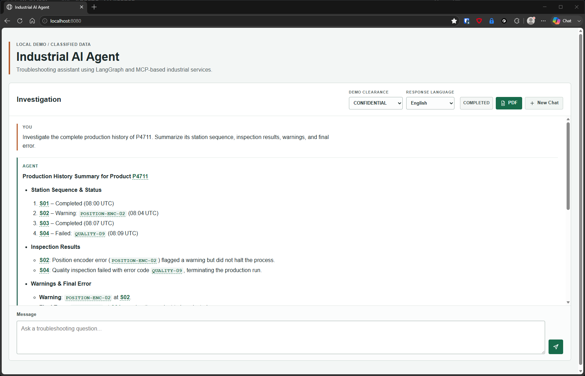
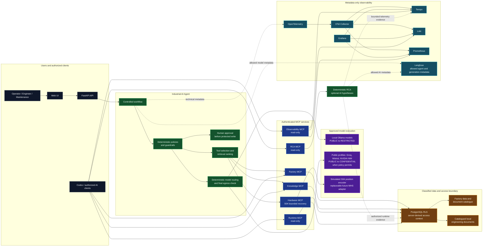
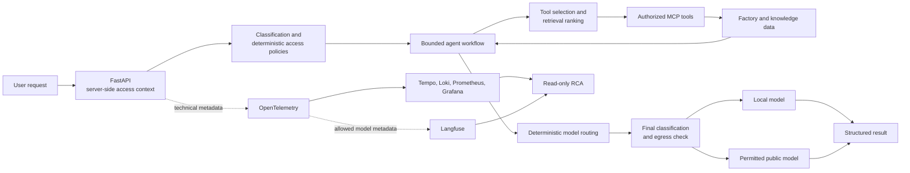
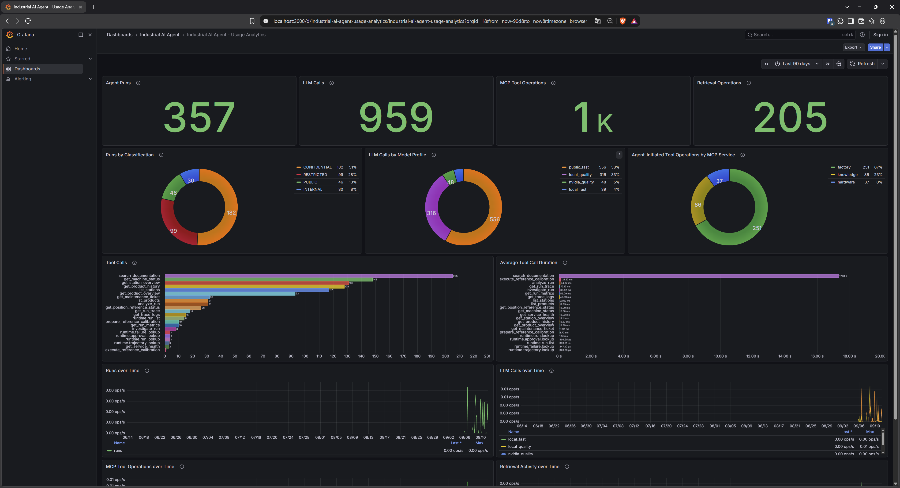
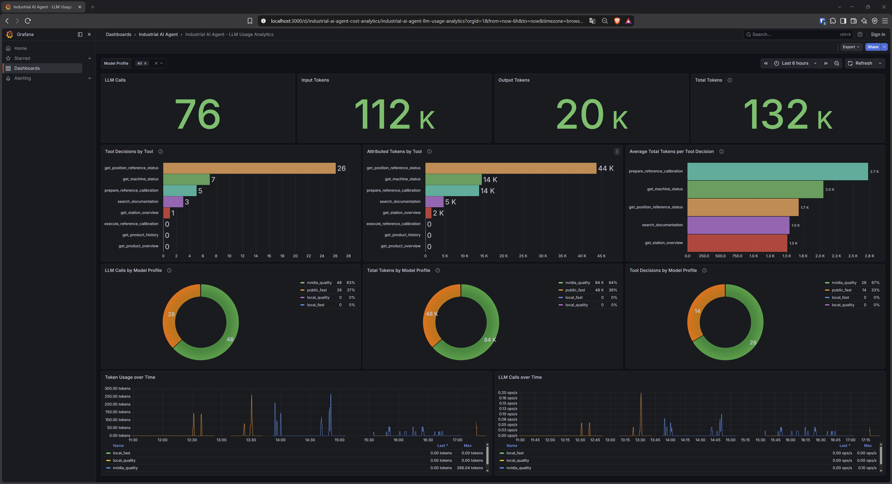

# Industrial AI Agent

> A secure, observable, and model-aware AI architecture for industrial production, engineering, and troubleshooting.

Industrial AI Agent is a production-oriented demonstrator and reference architecture for investigating product failures, machine status, and technical documentation in a controlled industrial environment. It demonstrates how generative AI can support engineering and maintenance without becoming an uncontrolled path to production data or operational actions.

This is not a chatbot demo. The model is a replaceable component inside deterministic boundaries for access control, data classification, model routing, tool use, human approval, testing, and operational traceability. The repository uses only synthetic factory data.



*The local browser demo shows a simulated user access level, the resulting classified run, a structured investigation, evidence-based findings, a clearly non-confirmed likely-cause hypothesis, and recommended investigation actions.*

## Why Industrial AI Needs More Than an LLM

| Challenge | How this project addresses it |
|---|---|
| **Reliability** | Deterministic code owns validation, authorization, tool limits, and protected actions; versioned evaluations test defined model behavior. |
| **Data and IP protection** | Data is classified as `PUBLIC`, `INTERNAL`, `CONFIDENTIAL`, or `RESTRICTED`; model egress is checked before every provider call. |
| **Cost and efficiency** | Explicit task requirements select eligible model profiles by capability, quality, protection level, and cost preference. The router is deterministic, not self-learning. |
| **Access control** | Server-derived identity and permissions, MCP authorization, and PostgreSQL Row-Level Security (RLS) prevent the AI path from bypassing source-data access rules. |
| **Operability and traceability** | Metadata-only telemetry, dashboards, and bounded root-cause analysis make runs, failures, and model/tool activity inspectable without exposing sensitive content. |

For the full industrial-value and scope statement, see [Capabilities and Industrial Value](docs/architecture/capabilities-and-industrial-value.md).

## Highlights

- **Classification-aware model routing:** Semantic model profiles are selected deterministically from task requirements; `RESTRICTED` data is eligible only for approved local execution.
- **Final egress enforcement:** An independent, deny-by-default check runs immediately before every model-provider call; model selection alone cannot authorize data transfer.
- **Bounded industrial tools:** Factory, Knowledge, Hardware, Runtime, Observability, and RCA capabilities are exposed through six authenticated MCP (Model Context Protocol) services with strict schemas and bounded operations.
- **MHS-ready physical integration:** The implemented S04 reference-calibration demonstrator uses an internal `PhysicalDevicePort`, a simulated position-encoder adapter, Hardware MCP, and closed-loop verification. A future `MHSDeviceAdapter` remains replaceable below that port; MHS conformance is not claimed.
- **Deterministic security boundaries:** Authorization, RLS, validation, tool allowlists, execution limits, and approval policy remain outside the LLM.
- **Hybrid deterministic and AI processing:** Code owns guarantees; the model is used for bounded semantic decisions such as selecting the next approved tool or formulating an explanation.
- **Human-in-the-loop write protection:** The implemented `create_maintenance_ticket` action pauses and executes only after explicit approval.
- **Controlled knowledge access:** Classified factory records and engineering documents are filtered by server-side authorization and PostgreSQL RLS before they reach tools or retrieval.
- **Repeatable model evaluation:** Versioned datasets measure initial tool selection, bounded tool trajectories, retrieval behavior, and evidence-before-action expectations.
- **Trust & quality assurance:** Versioned Golden Regression scenarios, deterministic security boundaries, and observability make critical Agent behavior reproducible, testable, and inspectable.
- **Metadata-only observability:** OpenTelemetry, Tempo, Loki, Prometheus, Grafana, and Langfuse trace operational metadata while excluding prompts, responses, tool content, documents, and secrets.
- **Evidence-based RCA:** Recorded facts, deterministic derivations, and optional AI hypotheses are explicitly separated; an LLM cannot claim a confirmed root cause.
- **Modern, testable architecture:** Python, FastAPI, LangGraph, Pydantic, MCP, PostgreSQL, Docker Compose, pytest, Ruff, focused integration tests, and documented ADRs support incremental evolution.

Trust is not delegated to the LLM. It is built around the model through deterministic security boundaries, structured contracts, versioned Golden Regression scenarios, automated regression tests, and inspectable execution.

## System Context



The Industrial AI Agent is the controlled center of the system. It does not freely query PostgreSQL: Factory, Knowledge, and Runtime services apply their server-derived access context and PostgreSQL RLS before returning bounded results. Codex and other authorized AI clients use only the MCP interfaces that their server-side identity permits.

## How a Request Is Processed



The loop is intentionally sequential and bounded: one validated tool call per model decision and at most four successfully executed calls per run. Deterministic policy controls the classification, access, selected tools, and permitted model execution; the LLM does not decide those boundaries. Observability and optional RCA are separate from troubleshooting execution, so their failure cannot weaken authorization, model-egress, or approval boundaries.

## Why This Matters in Industrial Production

| Perspective | Practical value |
|---|---|
| **Engineering and development** | Model providers and profiles remain replaceable behind explicit ports and configuration. Versioned evaluations, automated tests, and Architecture Decision Records make changes reviewable and repeatable. |
| **24/7 operations** | Metadata-only telemetry shows run outcomes, bounded model/tool activity, timing, and failure locations. Optional observability and reasoning components are isolated from normal troubleshooting execution. |
| **Maintenance and troubleshooting** | Authorized users can combine product history, station status, and relevant documents. RCA keeps observed facts, deterministic derivations, and AI hypotheses distinct; Codex and other AI clients can use approved read-only MCP analysis capabilities. |

The project does not guarantee the semantic correctness of an LLM response, replace industrial safety systems, or claim high availability, failover, or an SLA.

## Trust & Quality Assurance

Plausible-looking LLM output is not treated as evidence of correctness. Important Agent behavior is verified through conventional deterministic tests and versioned Golden Regression scenarios that reuse the authoritative synthetic `FACTORY-DEMO-01` fixtures.

The provider-independent Golden CI path evaluates sanitized run artifacts rather than comparing complete natural-language answers with fixed strings. Natural wording may vary while the following deterministic contracts remain testable:

- admitted tool selection and bounded tool trajectories;
- structured investigation output, authorized identifiers, and authorized document references;
- selected deterministic factual consistency checks and response-language behavior;
- provider and timeout outcome classification; and
- anti-enumeration and neutral non-disclosure behavior.

This is regression evidence for defined contracts, not proof of semantic correctness, complete faithfulness, causal correctness, hallucination absence, finding or next-step usefulness, or semantic reference relevance. Those dimensions are reserved for a future provider-neutral semantic evaluation layer calibrated against reviewed human examples. Details: [Golden Regression and Semantic Evaluation Strategy](docs/architecture/golden-regression-and-semantic-evaluation.md).

## Security Boundaries

Security decisions are enforced outside the LLM. A server-derived `SecurityContext`, explicit clearance and data classification, authorization, PostgreSQL Row-Level Security (RLS), deterministic model-egress policy, and bounded Agent-facing MCP capabilities determine what information may be retrieved and which actions may be proposed. The model may reason only over information it has already been authorized to receive; it does not decide disclosure.

Insufficient authorization produces a neutral unavailable/not-found result. It intentionally does not reveal whether a protected entity exists, its classification, the clearance needed to see it, or protected metadata; the same result can represent an absent entity or an existing but unauthorized one. Read capabilities remain bounded, while the implemented `create_maintenance_ticket` action requires deterministic policy checks and explicit human approval before execution. External errors and telemetry are sanitized, and factory data, documents, and images are mounted read-only in the local Compose demo.

This demonstrator does not replace PLC, robot, machine, or functional-safety systems. An LLM decision is not an independent industrial-safety guarantee.

## Try the Demo

Example request:

> Investigate why product P4711 failed at station S04. Use the available documentation if needed.

This synthetic `CONFIDENTIAL` scenario demonstrates server-side access decisions, Factory and Knowledge MCP tools, constrained tool selection, source-aware documentation retrieval, traceable execution, and final model-egress enforcement. A public model can receive `CONFIDENTIAL` data only when both the configured model profile and the deterministic policy permit it; the standard troubleshooting route is configured independently. Raw database or observability backends are never exposed as unrestricted AI tools.

For a `RESTRICTED` example, investigate `P9001` at `S07`: the classification policy permits only approved local models. More reproducible acceptance scenarios are in [Use Cases and Scenarios](docs/demo/use-cases-and-scenarios.md).

## Observability

Agent behavior should be inspectable rather than opaque. OpenTelemetry is the common, vendor-neutral instrumentation boundary; Prometheus stores bounded operational metrics, Grafana presents dashboards, Loki stores sanitized events, Tempo provides traces, and Langfuse provides LLM- and Agent-oriented observability.

The local Grafana instance provisions four focused dashboards:

- **Industrial AI Agent - System Overview:** scrape availability, run outcomes, latency, bounded activity, and metadata-only failure events.
- **Industrial AI Agent - LLM Usage Analytics:** provider-reported input, output, and total-token counters, admitted tool decisions, and token attribution by semantic model profile.
- **Industrial AI Agent - Usage Analytics:** shows bounded usage trends by classification, model profile, MCP tool, service, and retrieval strategy.
- **Industrial AI Agent - Failure Analytics:** separates failed runs from recorded LLM, MCP, and retrieval failure boundaries to avoid double-counting.

Token usage is captured at the LLM/model boundary. Tool-attributed tokens are the tokens from the LLM response that selected the admitted tool; because the sequential loop admits one tool per decision, that response usage is attributed once. Tool execution itself consumes no LLM tokens. Direct answers and later finalization or other non-tool calls remain only in model-level totals and are not retrospectively assigned to a prior tool. Prometheus uses bounded labels such as `model_profile`, `mcp_tool`, `data_classification`, `execution_zone`, and `operation_status`, never arbitrary IDs, user text, prompts, documents, or tool arguments. Prometheus records token counters but not pricing or cost estimates; Langfuse retains allowed detailed model metadata without becoming a Grafana datasource.

Observability does not prove answer correctness. Its role is to make execution, failures, and model/tool behavior measurable and reviewable. See [Observability](docs/architecture/observability.md) for data allowlists, dashboards, retention bounds, and investigation workflow.



*Usage Analytics makes agent runs, data-classification distribution, model-profile activity, MCP-tool use, and retrieval activity inspectable. The current dashboard set also includes LLM Usage Analytics for Prometheus token totals and tool-attributed tokens.*



*LLM Usage Analytics presents provider-reported token usage and the bounded tool decisions that caused attributed token consumption.*

## Root-Cause Analysis

The read-only RCA service analyzes an authorized completed run from safe runtime and observability projections. It is exposed through `rca_mcp` and can be used by Codex or another authorized AI client without granting unrestricted backend-query access.

| Finding kind | Meaning |
|---|---|
| `OBSERVED` | Directly supported by the bounded evidence. |
| `DERIVED` | Deterministically computed from observed evidence. |
| `HYPOTHESIS` | A plausible, clearly labelled AI interpretation, not proof. |
| `CONFIRMED_RUN_CAUSE` | Reserved for an explicit deterministic cause-signature rule or a future recorded human confirmation. The current analyzer emits none. |

The deterministic analyzer remains authoritative. Optional AI reasoning receives only a safe report projection, cannot alter evidence or confidence, and cannot produce a confirmed cause. Details: [ADR-017](docs/decisions/ADR-017-automated-root-cause-analysis.md).

## Technology Stack

| Area | Technologies in use |
|---|---|
| Application and AI workflow | Python 3.12+, FastAPI, Pydantic, LangGraph, LangChain Core |
| Models | Local Ollama profiles; OpenAI-compatible public profiles for Groq, Mistral, and NVIDIA NIM, selected deterministically when configured and egress-eligible |
| Integration | MCP SDK v2 and authenticated Streamable HTTP MCP services |
| Data and security | PostgreSQL, Alembic, Row-Level Security, server-derived security context |
| Observability | OpenTelemetry, OTel Collector, Tempo, Loki, Prometheus, Grafana, Langfuse |
| Deployment and quality | Docker Compose, pytest, Ruff, frontend Node test stack |

## Quick Start

**Required**

- Docker Desktop with Docker Compose
- Python 3.12+ for local development
- [Ollama](https://ollama.com/) running on the host, with the local models used by the Compose profiles
- A local `.env` created from `.env.example`; provide the required local Compose values, including a 64-character hexadecimal `LANGFUSE_ENCRYPTION_KEY`, and keep the file unversioned

### Local Ollama GPU Runtime

GPU acceleration is not required for correctness or for the local execution-zone
boundary: CPU fallback remains local and is supported. For interactive complex
`local_quality` workloads, however, an NVIDIA GPU is required to meet the 60-second
Agent deadline reliably. When Ollama runs in Docker Desktop on Windows, use the WSL 2
backend and verify GPU-PV before running the demo:

```powershell
docker run --rm --gpus all nvidia/cuda:12.8.1-base-ubuntu22.04 nvidia-smi
```

The command must show the NVIDIA GPU. A container start failure or `size_vram=0` in
Ollama means the local runtime is CPU-degraded; it does not permit RESTRICTED data to
fall back to a public provider. Verify Docker Desktop's WSL 2 GPU support and the
Windows NVIDIA driver before tuning Agent timeouts or model routing.

### Full Demo

Set a valid `GROQ_API_KEY` in `.env` and leave `LOCAL_ONLY_MODE=false`. This permits the
configured `public_fast` profile for `PUBLIC`, `INTERNAL`, and `CONFIDENTIAL` runs;
`RESTRICTED` runs remain local by deterministic egress policy.

### Local-only Demo

Set `LOCAL_ONLY_MODE=true` and leave `GROQ_API_KEY` unset. The composition root excludes
all public-cloud model profiles before routing, so the local profiles handle every
classification. An invalid or placeholder Groq key is not a Local-only configuration.

```powershell
Copy-Item .env.example .env
ollama pull qwen3.5:4b
ollama pull qwen3.5:9b
ollama pull qwen3-embedding:0.6b
docker compose up --build -d
```

Docker Desktop must be running. For normal subsequent starts, use `docker compose up -d`;
after source or image changes, use `docker compose up --build -d`. Stop the demo with
`docker compose down`.

### Document Storage

Runtime factory data and document content are infrastructure storage, not application-image
content. The local demo bind-mounts `${FACTORY_DATA_HOST_PATH:-./demo_factory}/metadata`
read-only at `/app/data/factory/metadata` and
`${DOCUMENT_HOST_PATH:-./demo_factory/documents}` plus
`${FACTORY_IMAGE_HOST_PATH:-./demo_factory/images}` read-only below
`/app/data/document-content`.
`${KNOWLEDGE_HOST_PATH:-./knowledge_base}` is mounted read-only at `/app/data/knowledge`.
The Factory MCP consumes `FACTORY_DATA_ROOT`; the Agent API and document retrieval consume
`DOCUMENT_ROOT`; the knowledge fallback consumes `KNOWLEDGE_ROOT`. For production, an
organization-managed SMB/NFS share or platform volume is mounted by the host or deployment
platform at the same container roots. The application does not mount shares or handle their
credentials. Catalog metadata maps a document ID to a safe relative path server-side after
authorization; browsers receive no storage path or URL.

Compose serves the local browser demo at `http://localhost:8080`, the FastAPI contract is
at `http://localhost:8000/docs`, Grafana is at `http://localhost:3000`, and Langfuse is at
`http://localhost:3001`.

All persistent demo services use `restart: unless-stopped`. If Docker Desktop is configured
to start with Windows, services that were running recover when the Docker engine becomes
available. Containers explicitly stopped by the user are intentionally not restarted.

All Compose host ports bind to `127.0.0.1`; the OTel Collector is Compose-internal.
Grafana keeps anonymous local dashboard access as a Viewer, not an Admin. Do not add real
credentials to the repository. The frontend is a separate static client and communicates
only with the FastAPI JSON API.

The UI clearance selector simulates the clearance of an already authenticated user for
this local demo. It is not a production authentication or authorization interface. A
production integration must derive clearance from a trusted server-side identity; run
classification, MCP permissions, PostgreSQL RLS, and model egress remain deterministic
server-side boundaries. Unknown free text is conservatively `RESTRICTED`: unknown
sensitivity never authorizes external model processing.

For service ports, MCP access, smoke checks, and detailed local setup, use the existing [Architecture Overview](docs/architecture/overview.md), [Observability guide](docs/architecture/observability.md), and the linked evaluation and implementation guides rather than treating this README as an operations manual.

## Documentation

- [Architecture Overview](docs/architecture/overview.md): implemented boundaries, orchestration, persistence, MCP, retrieval, and evolution.
- [Capabilities and Industrial Value](docs/architecture/capabilities-and-industrial-value.md): industrial benefit, limits, and security posture.
- [Observability](docs/architecture/observability.md): dashboards, telemetry security, bounded observability MCP, and RCA evidence sources.
- [Use Cases and Scenarios](docs/demo/use-cases-and-scenarios.md): reproducible synthetic demo and acceptance cases.
- [Architecture Decision Records](docs/decisions/): long-lived architecture decisions, including [model routing](docs/decisions/ADR-008-task-level-model-routing.md), [model egress](docs/decisions/ADR-009-data-classification-and-model-egress-policy.md), [MCP](docs/decisions/ADR-012-mcp-integration-architecture.md), and [RCA](docs/decisions/ADR-017-automated-root-cause-analysis.md).
- [Tool Selection Evaluation](docs/learning/tool-selection-evaluation.md), [Trajectory Evaluation](docs/learning/trajectory-evaluation.md), and [Evidence Before Action](docs/learning/evidence-before-action-trajectory-evaluation.md): versioned model-quality baselines.

## Scope

Industrial AI Agent is a public demonstrator and reference architecture. It is not a production industrial-control system. Machine and PLC safety controls remain independent, the implemented maintenance-ticket action is approval-gated and idempotent, and production identity, TLS, rate limiting, retention, high availability, and deployment hardening require their own operational design.
