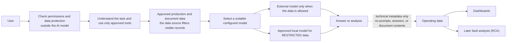
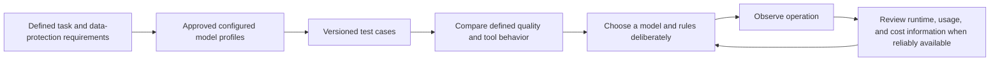

# Industrial AI Agent - Capabilities and Industrial Value

## Executive summary

Industrial AI Agent is a demonstrator and reference architecture for using generative AI
in production, engineering, and maintenance without giving an AI model uncontrolled
access to industrial data or operational actions.

It helps investigate product history, machine state, and technical documents while fixed
rules still control data access, data transfer, and human approval. It makes model
behavior testable and operating conditions traceable. It does not claim that an LLM is
generally correct or can make safety-critical decisions.

The implemented design is described in the [architecture overview](overview.md), the
[observability architecture](observability.md), and the accepted ADRs.

## Why this matters in industrial production

### Reliability and correctness

In a running factory, a plausible answer is not enough. A wrong conclusion about a
product, station, or fault can send people in the wrong direction.

Rules that can be checked exactly stay outside the AI model: input validation, data
permissions, limits on permitted tools and steps, and approval before the implemented write action. Versioned
cases test defined model behavior. For fault analysis, the system separates recorded
facts, statements derived from them, and optional AI assumptions. This makes an
investigation easier to review; it does not guarantee every natural-language answer is
correct.

### Data and IP protection

Production data, machine states, documents, and process knowledge can contain sensitive
company know-how. The system assigns four protection levels: `PUBLIC`, `INTERNAL`,
`CONFIDENTIAL`, and `RESTRICTED`.

Before data is read, the system checks what the user may see. Before a model is called,
it checks whether current data may be transferred to that model. `RESTRICTED` data stays
within an approved local model environment. The other levels may go to an external model
only when that configured model is explicitly approved for the relevant protection level.

### Cost and efficiency

Not every task needs the same model. Configured model profiles describe a model's
capabilities, expected quality, cost category, and whether processing is local or
external. Defined tasks can be tested with suitable profiles and compared deliberately.

This lets a team select a suitable model without rebuilding data-protection rules for
each model vendor. The current troubleshooting route deliberately requires `HIGH`
quality and prefers quality. Selection is rule-based, not a self-learning cost optimizer.

### Access control

An AI assistant must not become a way to obtain information that a user could not access
directly. The server determines the user's permission level. The database itself filters
which records are visible for that access (PostgreSQL Row Level Security, RLS).

A higher permission level can authorize work on a lower-classified case, but cannot
enlarge the data visible in that case. The AI model cannot grant permissions, increase a
user's permission level, or bypass database filtering.

### Operability and traceability

A 24/7 production environment needs faults to remain understandable, even when a
supporting component is unavailable. The project records technical operating metadata
about runs, tool use, model use, timing, and failures. It provides dashboards and a
separate analysis service that can only read completed runs.

Optional monitoring and optional AI-supported interpretation are isolated from normal
troubleshooting. If unavailable, this is reported as missing or partial information; it
must not weaken permissions, data-transfer rules, or human approval. This demonstrates
traceability and limited failure impact, not high availability, failover, or an SLA.

## Core capabilities

| Capability | How it works | Value for production |
|---|---|---|
| Choosing a model for the task | Fixed requirements select a configured model profile by needed capability, quality, data protection, and cost preference. | Models and model vendors can change without rewriting data-protection rules. |
| Data protection before model use | Before every model call, the system checks whether the selected local or external model may receive the data. Unknown or incomplete security information is refused. | Restricted production information is not sent to public-cloud models because of a fallback or configuration error. |
| Fixed protection rules outside the AI | Strict inputs, a fixed set of allowed tools, limits on permitted tools and steps, validation, and approval rules are enforced by code. | The AI cannot turn an unsupported or unsafe proposal into an action. |
| Secure access to data and tools | User permissions are checked on the server. Production and document data are limited at their source by RLS. Approved tools and data sources are provided through a standardized AI interface (MCP). | An employee cannot use the assistant to obtain information they are not allowed to see. |
| Technical-document search with traceable sources | The system searches permitted documents with lexical, semantic, hybrid, and reranking methods, retaining source and document section. | Engineering and maintenance can check which document passages support an answer. |
| Human approval before the write action | The implemented maintenance-ticket action pauses before execution and continues only after explicit approval or rejection. | A person remains responsible for the implemented operational action. |
| Repeatable quality checks | Repeatable test cases check whether the model selects the right tools, follows the expected steps, searches documents appropriately, and gathers the necessary information before an action. A scenario catalog supports manual acceptance checks. | New models, prompts, and AI functions can be introduced with repeatable checks, not only chat demonstrations. |
| Operational visibility | Monitoring receives technical metadata only, not prompts, answers, or the contents of tool calls and results. Dashboards show system, usage, failure, and cost-data gaps. | Teams can investigate a run while protecting production and IP data. |
| Evidence-based RCA | Root-Cause Analysis (RCA) creates a limited report from authorized run and monitoring information. Optional AI interpretation may add clearly labelled hypotheses only. | A plausible AI explanation is not presented as a confirmed cause. |
| Testable and replaceable architecture | Model interfaces, configured models, MCP adapters, persistence, and domain functions are separated by documented decisions. Focused tests cover data-transfer checks, RLS, MCP, approval, and RCA protection boundaries. | Teams can extend the demonstrator incrementally while keeping important safety and security rules testable. |

MCP stands for Model Context Protocol: a standardized interface through which AI
applications can use approved tools and data sources in a controlled way.

## How a request is handled

Permission and data-protection checks are outside the AI model. The model does not decide
what data it may see or where protected data may be processed.

RCA is a later analysis of a completed run. It neither authorizes data access nor changes
the normal troubleshooting decision.

## Industrial value across the lifecycle

| Area | Typical benefit |
|---|---|
| Engineering and development | Test defined model behavior against versioned cases, change configured models in a controlled way, keep MCP interfaces stable, and investigate integration problems through traces and RCA reports. |
| 24/7 production operations | Use only permitted production and document data; keep permission, data-transfer, and approval rules effective even when optional monitoring is unavailable. |
| Maintenance and troubleshooting | Combine visible product history, machine state, and documents; distinguish facts from assumptions; and require approval before the implemented write action. |

These are demonstrated design and operational benefits. The repository does not measure
lower MTTR, less downtime, or lower operating cost.

## Safety and trust boundaries

- User permission, MCP permission, and database filtering are determined outside the AI model.
- Before every model call, the system checks whether data may be sent to the selected local or external model. In doubt, processing is refused.
- Only a fixed set of tools is available; validation, execution limits, and approval are fixed rules.
- Monitoring receives technical metadata only. It excludes prompts, answers, the contents of tool calls and results, document contents, credentials, SQL, and arbitrary error text.
- RCA distinguishes a recorded fact (`OBSERVED`), a statement derived from recorded information (`DERIVED`), and an optional AI hypothesis (`HYPOTHESIS`). The current deterministic analysis creates no confirmed cause for a run (`CONFIRMED_RUN_CAUSE`), and optional AI interpretation cannot create one.
- If monitoring, a monitoring backend, or optional AI interpretation fails, the result is explicitly unavailable, partial, or insufficient where applicable. These failures do not change permissions or normal processing rules.

Details: [ADR-009](../decisions/ADR-009-data-classification-and-model-egress-policy.md),
[ADR-014](../decisions/ADR-014-persistent-factory-data-and-classification-enforcement.md),
[ADR-015](../decisions/ADR-015-mcp-client-identity-clearance-and-tool-authorization.md),
and [ADR-017](../decisions/ADR-017-automated-root-cause-analysis.md).

## Model selection and improvement loop

The project supports a controlled selection process, not automatic optimization:

The intended principle is to choose the lowest-cost *approved* model that has
demonstrated acceptable quality for the defined task and meets latency and data-protection
requirements. The repository supports deterministic selection and repeatable evaluations
of tools and step sequences. It records operating time, token values reported by the
model vendor when available, and costs only when their origin is reliably known.

It does not create an automatic benchmark ranking, calculate total cost of ownership, or
change the selection rules by itself.

## Example production scenarios

- **Public factory overview:** A `PUBLIC` user sees only permitted public stations or
  products. The answer does not disclose hidden entities, counts, or the permission level
  needed to see them.
- **P4711/S04 troubleshooting:** An authorized case can combine visible product history,
  machine state, and technical documents. An earlier warning may be relevant to a later
  fault, but remains an interpretation rather than proof of cause.
- **P9001/S07 restricted investigation:** The especially protected case can access only
  approved production and document data and is processed only with a local model. A user
  without sufficient permission receives a neutral unavailable response.
- **Run analysis:** RCA can show recorded technical facts, derived relationships, and
  limitations after a fault or unusual run. Its `analyze_run` MCP tool can only read and
  makes controlled analysis available to Codex development access; optional AI text adds
  hypotheses, not a confirmed cause.
- **Model evaluation:** Versioned cases make first tool choice, complete tool sequences,
  document search, and evidence before action comparable before a profile or prompt is adopted.

The complete synthetic-demo acceptance catalog is
[use cases and scenarios](../demo/use-cases-and-scenarios.md).

## Technology foundation

- **Application and AI workflow:** Python 3.12, FastAPI, and Pydantic provide typed
  interfaces. LangGraph and LangChain Core run the bounded AI workflow; the official MCP
  SDK v2 provides the standardized tool interface.
- **Data and models:** PostgreSQL, Alembic, and RLS store and filter classified data and
  durable run state. Docker Compose runs the local demo. Local Ollama profiles and an
  OpenAI-compatible adapter sit behind the provider-neutral `LLMClient` interface.
- **Document search:** local document ingestion supports lexical, semantic, hybrid, and
  reranking search strategies.
- **Operating visibility and RCA:** OpenTelemetry and the OTel Collector provide
  telemetry. Tempo, Prometheus, and Loki store traces, metrics, and logs; Grafana
  presents dashboards; Langfuse stores permitted LLM metadata.

## Scope and limitations

This repository is a learning project, public demonstrator, and reference architecture.
It is not a production-ready industrial control system.

- It does not guarantee the semantic correctness, completeness, or safety of an LLM answer.
- It does not replace Safety PLCs, functional machine safety, or independent industrial safety controls.
- The local maintenance-ticket action is approval-gated and idempotent. It does not control equipment or integrate an external maintenance system.
- RCA reports recorded information and bounded derivations. No current deterministic signature confirms a root cause, and optional AI interpretation cannot create one.
- Costs are shown only as configured model API cost or observed run cost with reliable origin information. They exclude electricity, hardware, infrastructure, and total cost of ownership.
- The current API and MCP bearer-token identity are local-demo mechanisms. Production identity, TLS, rate limiting, retention, high availability, and deployment hardening require their own design.
- Optional monitoring and RCA components demonstrate limited failure impact, not failover, availability guarantees, or a service-level agreement.

## Key takeaway

Industrial AI Agent demonstrates a controlled way to embed generative AI in industrial
production, engineering, and maintenance. The AI model is a replaceable component inside
clear rules for data access, data protection, human approval, operating visibility, and
quality checks. It is not an autonomous decision-maker with unrestricted production data
or operational authority.
