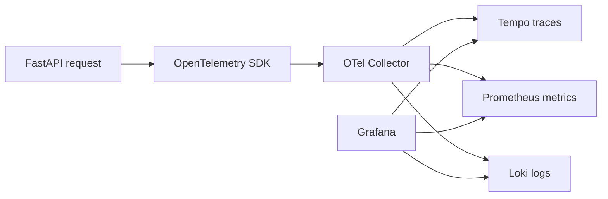
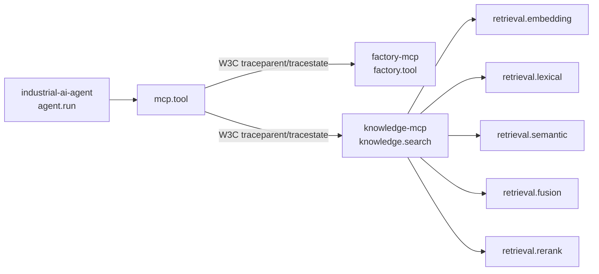
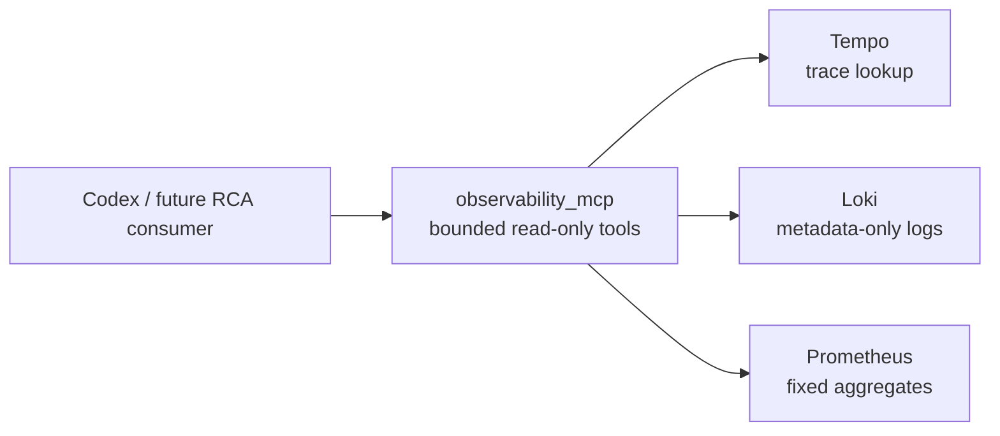

# Observability

## Local Stack

The local self-hosted observability baseline is versioned under `observability/` and
starts with the normal Compose stack:

```powershell
docker compose up --build -d
```

Grafana is available at `http://localhost:3000`, Prometheus at
`http://localhost:9090`, Loki at `http://localhost:3100`, and Tempo at
`http://localhost:3200`. The OpenTelemetry Collector accepts OTLP/gRPC on `4317` and
OTLP/HTTP on `4318`.

The Compose API service uses `config/model_profiles.docker.toml`. Its local Ollama
profiles deliberately address `host.docker.internal`, which resolves the developer's
host from Docker Desktop; it is not a telemetry endpoint and contains no credentials.



Grafana provisions Prometheus, Tempo, and Loki datasources and the `Industrial AI Agent
Overview` dashboard from repository files. No dashboard setup through the UI is required.
The dashboard contains run/error, MCP, LLM, execution-zone, retrieval, approval,
run-rate, HTTP-latency, recent-error, and service-health panels. Its cost panel
deliberately states that cost is not yet emitted.

## MCP Distributed Traces

The Streamable HTTP boundary propagates standard W3C `traceparent` and `tracestate`.
The MCP client uses the global OTel propagator from a public `httpx2` request hook, so
every HTTP POST, GET, or DELETE receives context from its active operation span. The
public MCP Starlette app uses OTel ASGI middleware to extract that context before the SDK
dispatches the request. No custom correlation header exists, and `run_id` remains a
separate business identifier.



Each span in either process has the originating trace ID. Missing or malformed W3C
headers start a valid independent server trace. Bearer authentication, subject,
clearance, and permissions are resolved solely by ADR-015; trace headers do not affect
them. Stable resources are `industrial-ai-agent`, `factory-mcp`, and `knowledge-mcp`.

## Correlation and Trace Search

`run_id` is the persisted application UUID. It remains separate from OpenTelemetry
`trace_id` and `span_id`. The API root trace has an `agent.run` child span with `run.id`;
MCP discovery, MCP tool calls, model calls, and API-side retrieval appear beneath it. In
Grafana Explore, choose Tempo and search TraceQL for:

```text
{ span.run.id = "<run-id>" }
```

For a failure, locate the trace by `run_id`, then inspect the first ERROR span and its
sanitized `error.type`/`error.code`. Parent/child timing distinguishes request handling,
model execution, MCP discovery, and MCP tool failure. Trace-to-metrics and trace-to-logs
links are provisioned when matching data exists.

The named `industrial_ai_agent.telemetry` logger emits fixed, metadata-only OTLP events.
They inherit the active `trace_id` and `span_id`, carry `service.name` from the OTel
resource, and may carry `run.id` and a sanitized error code. The Collector deletes SDK
source-location, exception-stacktrace, raw/dynamic HTTP-request, and dynamic
service-instance metadata. The RCA workflow is: find a run by `run_id`; inspect the span
hierarchy and first ERROR span in Tempo; open the correlated Loki event through its
trace/span IDs; inspect Prometheus error-rate and latency history for the same time
window; then compare MCP, model, and retrieval boundaries to identify the likely cause.
Factory and Knowledge emit only `mcp.server.completed` or `mcp.server.failed`; the Loki
resource `service.name`, `trace_id`, and `span_id` identify the source without payload
logging. Tempo service filters can select `industrial-ai-agent`, `factory-mcp`, or
`knowledge-mcp` to inspect the cross-service hierarchy.

## Metrics

The Collector exposes `agent_runs_total`, `agent_errors_total`,
`agent_run_duration_seconds`, `mcp_discovery_total`, `mcp_tool_calls_total`,
`mcp_tool_duration_seconds`, `llm_calls_total`, `llm_call_duration_seconds`,
`retrieval_calls_total`, `approval_total`, `persistence_operations_total`, and
`persistence_operation_duration_seconds` to Prometheus. Labels are bounded operational
categories only. They never include run/trace/span IDs, product or station IDs, request
text, user text, or tool arguments.

The API-side `retrieval.search` span and metric describe the MCP-backed retrieval call.
Knowledge MCP adds `knowledge.search`, embedding, lexical, semantic, fusion, and rerank
timings to that same trace. MCP-process metrics use only bounded service-resource and
tool/operation/status/classification dimensions. Checkpoint load/save remain
uninstrumented: the current LangGraph saver exposes no stable public operation boundary
without framework intrusion.

## Telemetry Security

Only safe metadata is emitted: run/status/classification, model profile and name,
execution zone, MCP server/tool/read-write operation, bounded retrieval counts, duration,
provider-supplied token counts, and sanitized error codes. `RESTRICTED` runs remain
metadata-only.

Prompts, response text, tool-result content, document chunks, authorization headers,
bearer tokens, database URLs, SQL parameters, secret paths, source-code paths, raw
dynamic HTTP request attributes, and arbitrary exception messages are excluded by the
Python allowlist and deleted defensively by the Collector. SDK exception events are
disabled for application spans; error spans retain only sanitized type/code.
`run_id`, OTel identifiers, product identifiers, and free text are never metric labels.
The current SQLAlchemy instrumentation package writes SQL statement attributes by
default, so it is intentionally not installed on the engine in this slice. Explicit
run-store and service spans provide persistence timing without that leak risk.

Telemetry is optional: `OTEL_ENABLED=false` leaves business execution usable if a
Collector is unavailable. All three Compose application services set it to `true` and
send OTLP to the Collector. OTel does not replace model-egress enforcement, MCP
authorization, RLS, or human approval.

## Scope and Next Slice

The local/self-hosted demonstration retains ADR-015 bearer authentication for MCP HTTP.
The Collector can later add OTLP exporters for Honeycomb, Grafana Cloud, or another
OTel-compatible backend; no cloud credentials are configured here.

Langfuse is intentionally absent. A possible next slice is classification-governed
LLM/agent observability for provider token usage, costs, prompts/responses, sessions,
generations, and evaluations.

## Read-only Observability MCP

`observability_mcp` is a separately deployed, authenticated Streamable HTTP MCP service
at `http://localhost:8003/mcp`. It reads the existing Tempo, Loki, and Prometheus stores;
the Industrial Agent API neither calls nor depends on it.



All five tools are `read_only_hint=true` and require the server-owned ADR-015
`READ_OBSERVABILITY` permission: `get_run_trace(run_id)`,
`get_trace_logs(trace_id, service_name?)`, `get_run_metrics(run_or_trace_id)`,
`get_service_health(service_name, time_window?)`, and `investigate_run(run_id)`.
Known services are fixed to `industrial-ai-agent`, `factory-mcp`, `knowledge-mcp`, and
`observability-mcp`; health windows are `5m`, `15m`, or `1h`.

The service uses Tempo `GET /api/search` with a server-built `run.id` filter followed by
`GET /api/v2/traces/{trace_id}`, Loki `GET /loki/api/v1/query_range` with a fixed trace
selector, and Prometheus `GET /api/v1/query_range` with fixed aggregate query templates.
It never accepts query text. A trace search has a 48-hour retention/lookback bound;
trace spans, logs, and metric points are capped at 200, 100, and 60 respectively. Metric
context is a trace-derived window with five-minute padding, capped at 30 minutes. It is
not exact per-run Prometheus data because ADR-016 forbids run/trace identifiers as metric
labels.

The MCP response projection returns only safe operation metadata, run/trace/span IDs,
timestamps, durations, status, known service names, sanitized error type/code, and the
fixed log fields. It discards raw log lines, prompts, model responses, tool payloads,
documents, headers, tokens, SQL, source paths, stack traces, URLs, environment values,
and unknown attributes even if a backend contains them. `investigate_run` deterministically
combines trace, logs, and metric context, identifies the first recorded error location,
and explicitly states that this does not prove the underlying cause.

## Runtime and Observability RCA Split

The bounded read-only Runtime MCP is implemented alongside Observability MCP. Runtime
MCP reads only the RLS-filtered `agent_runtime.agent_runs` projection and exposes
`get_agent_run`, `get_run_tool_trajectory`, `get_run_approval`, `get_run_failure`, and
`list_recent_agent_runs`. It never exposes prompts, answers, arguments, results,
approval free text, exception details, or LangGraph checkpoint data, and it has no
resume, approval, rejection, retry, cancellation, mutation, or deletion operation.

Runtime MCP answers persisted application-runtime questions. Observability MCP answers
distributed telemetry questions from Tempo, Loki, and Prometheus. Both are independent
read adapters; Codex/another consumer correlates evidence by `run_id` and must separate
observed facts from conclusions.

## Future MCP Roadmap

Factory MCP, Knowledge MCP, Observability MCP, and Runtime MCP are implemented. Vision
MCP and Cost / Usage MCP remain planned only. Cost / Usage MCP may offer
`get_model_usage`, `get_model_costs`, `get_token_usage`, and `get_cost_by_model_profile`.
