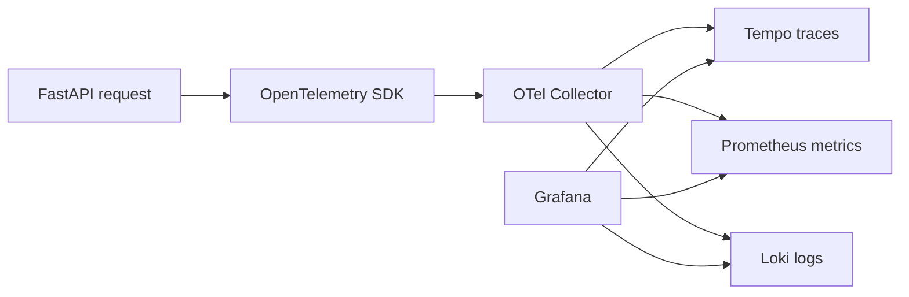

# Observability

## Local Stack

The local self-hosted observability baseline is versioned under `observability/` and
starts with the normal Compose stack:

```powershell
docker compose up --build -d
```

Grafana is available at `http://localhost:3000`, Prometheus at
`http://localhost:9090`, Loki at `http://localhost:3100`, and Tempo at
`http://localhost:3200`. The OpenTelemetry Collector accepts OTLP/gRPC on `4317` and
OTLP/HTTP on `4318`.

The Compose API service uses `config/model_profiles.docker.toml`. Its local Ollama
profiles deliberately address `host.docker.internal`, which resolves the developer's
host from Docker Desktop; it is not a telemetry endpoint and contains no credentials.



Grafana provisions Prometheus, Tempo, and Loki datasources and the `Industrial AI Agent
Overview` dashboard from repository files. No dashboard setup through the UI is required.
The dashboard contains run/error, MCP, LLM, execution-zone, retrieval, approval,
run-rate, HTTP-latency, recent-error, and service-health panels. Its cost panel
deliberately states that cost is not yet emitted.

## Correlation and Trace Search

`run_id` is the persisted application UUID. It remains separate from OpenTelemetry
`trace_id` and `span_id`. The API root trace has an `agent.run` child span with `run.id`;
MCP discovery, MCP tool calls, model calls, and API-side retrieval appear beneath it. In
Grafana Explore, choose Tempo and search TraceQL for:

```text
{ span.run.id = "<run-id>" }
```

For a failure, locate the trace by `run_id`, then inspect the first ERROR span and its
sanitized `error.type`/`error.code`. Parent/child timing distinguishes request handling,
model execution, MCP discovery, and MCP tool failure. Trace-to-metrics and trace-to-logs
links are provisioned when matching data exists.

The named `industrial_ai_agent.telemetry` logger emits fixed, metadata-only OTLP events.
They inherit the active `trace_id` and `span_id`, carry `service.name` from the OTel
resource, and may carry `run.id` and a sanitized error code. The Collector deletes SDK
source-location, exception-stacktrace, raw/dynamic HTTP-request, and dynamic
service-instance metadata. The RCA workflow is: find a run by `run_id`; inspect the span
hierarchy and first ERROR span in Tempo; open the correlated Loki event through its
trace/span IDs; inspect Prometheus error-rate and latency history for the same time
window; then compare MCP, model, and retrieval boundaries to identify the likely cause.

## Metrics

The Collector exposes `agent_runs_total`, `agent_errors_total`,
`agent_run_duration_seconds`, `mcp_discovery_total`, `mcp_tool_calls_total`,
`mcp_tool_duration_seconds`, `llm_calls_total`, `llm_call_duration_seconds`,
`retrieval_calls_total`, `approval_total`, `persistence_operations_total`, and
`persistence_operation_duration_seconds` to Prometheus. Labels are bounded operational
categories only. They never include run/trace/span IDs, product or station IDs, request
text, user text, or tool arguments.

The API-side `retrieval.search` span and metric describe the MCP-backed retrieval call.
Embedding, lexical, fusion, and rerank timings remain in Knowledge MCP until trace-context
propagation is deliberately added. Checkpoint load/save also remain uninstrumented: the
current LangGraph saver exposes no stable public operation boundary without framework
intrusion.

## Telemetry Security

Only safe metadata is emitted: run/status/classification, model profile and name,
execution zone, MCP server/tool/read-write operation, bounded retrieval counts, duration,
provider-supplied token counts, and sanitized error codes. `RESTRICTED` runs remain
metadata-only.

Prompts, response text, tool-result content, document chunks, authorization headers,
bearer tokens, database URLs, SQL parameters, secret paths, source-code paths, raw
dynamic HTTP request attributes, and arbitrary exception messages are excluded by the
Python allowlist and deleted defensively by the Collector. SDK exception events are
disabled for application spans; error spans retain only sanitized type/code.
`run_id`, OTel identifiers, product identifiers, and free text are never metric labels.
The current SQLAlchemy instrumentation package writes SQL statement attributes by
default, so it is intentionally not installed on the engine in this slice. Explicit
run-store and service spans provide persistence timing without that leak risk.

Telemetry is optional: `OTEL_ENABLED=false` leaves business execution usable if a
Collector is unavailable. The local Compose API sets it to `true` and sends OTLP to the
Collector. OTel does not replace model-egress enforcement, MCP authorization, RLS, or
human approval.

## Scope and Next Slice

This local/self-hosted demonstration has no authentication. The Collector can later add
OTLP exporters for Honeycomb, Grafana Cloud, or another OTel-compatible backend; no
cloud credentials are configured here.

Langfuse is intentionally absent. A possible next slice is classification-governed
LLM/agent observability for provider token usage, costs, prompts/responses, sessions,
generations, and evaluations.

## Future MCP Roadmap

Factory MCP and Knowledge MCP are implemented. Vision MCP, Observability MCP, Runtime /
Agent Operations MCP, and Cost / Usage MCP are planned only. Observability MCP may offer
`get_run_trace`, `get_recent_errors`, `get_latency_breakdown`, `get_tool_usage`,
`get_service_health`, `search_logs`, and `get_error_rate`. Runtime / Agent Operations MCP
may offer `get_agent_run`, `get_run_tool_calls`, `get_run_model_calls`,
`get_run_approval_history`, and `get_run_failure`. Cost / Usage MCP may offer
`get_model_usage`, `get_model_costs`, `get_token_usage`, and `get_cost_by_model_profile`.
`analyze_run_failure(run_id)` may later orchestrate these boundaries; this does not decide
that an RCA MCP server is required.
