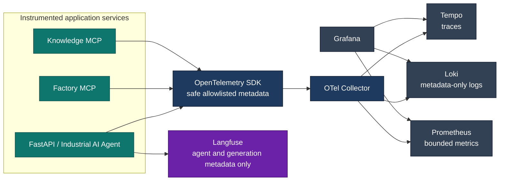
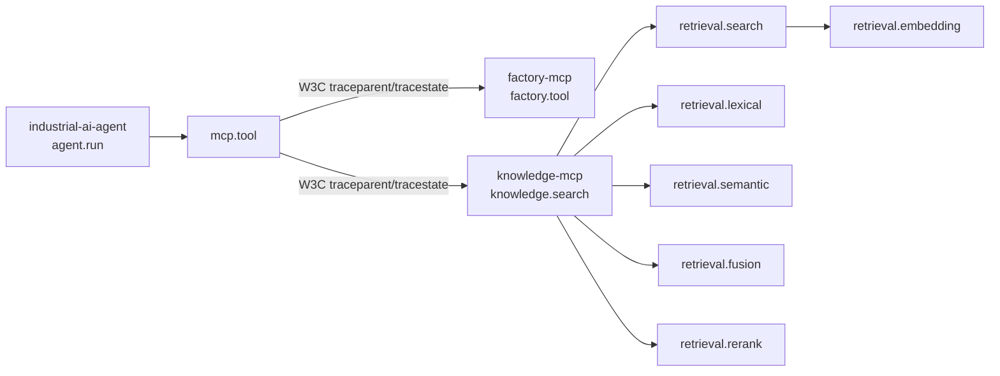
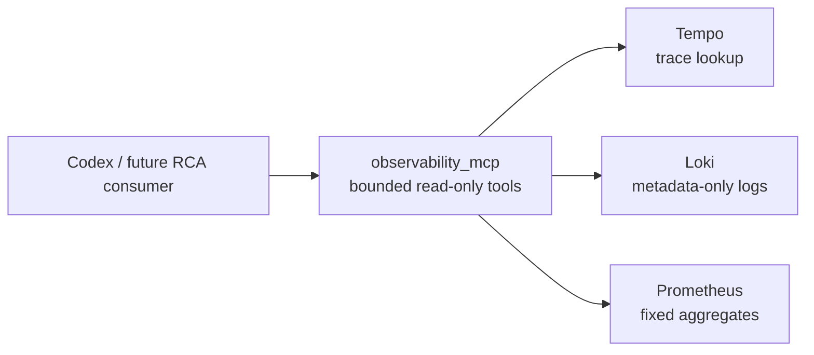
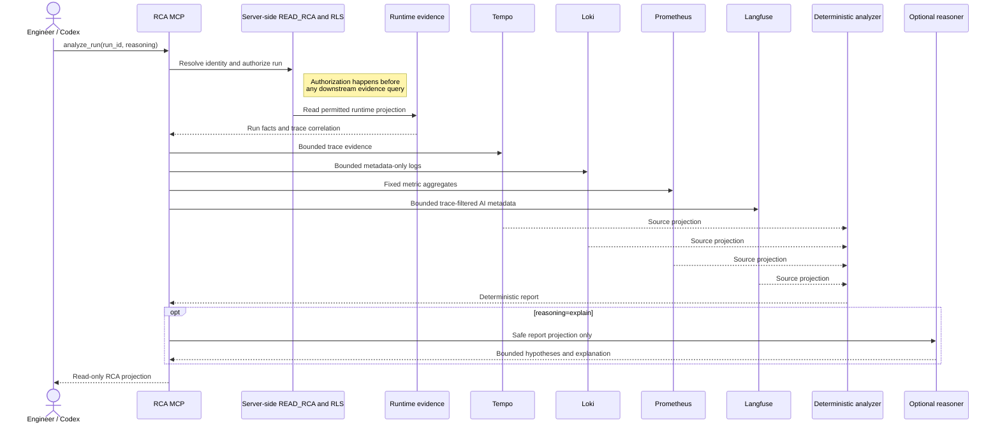

# Observability

## Local Stack

The local self-hosted observability baseline is versioned under `observability/` and
starts with the normal Compose stack:

```powershell
docker compose up --build -d
```

Grafana is available at `http://localhost:3000`, Prometheus at
`http://localhost:9090`, Loki at `http://localhost:3100`, and Tempo at
`http://localhost:3200`. The OpenTelemetry Collector accepts OTLP/gRPC on `4317` and
OTLP/HTTP on `4318`. Langfuse v4 is available at `http://localhost:3001`.

The Compose API service uses `config/model_profiles.docker.toml`. Its local Ollama
profiles deliberately address `host.docker.internal`, which resolves the developer's
host from Docker Desktop; it is not a telemetry endpoint and contains no credentials.



Grafana provisions Prometheus, Tempo, and Loki datasources and the dashboard set from
repository files. No dashboard setup through the UI is required.

Grafana does not read Langfuse directly. Langfuse is a separate, metadata-only
observation path: normal export excludes prompts, responses, tool payloads, documents,
and arbitrary production data.

## Grafana Dashboard Set

The provisioned dashboards keep operational questions separate and use the selected
Grafana time range for every historical total, rate, and distribution. Pie/donut panels
use that selected range as their complete 100% population and show both absolute values
and percentages in their legend where Grafana supports it.

* `Industrial AI Agent - System Overview` answers whether the Prometheus scrape target is
  available and what happened recently: run outcomes, run rate and latency, LLM/MCP/
  retrieval activity, and metadata-only Loki failure events. The `AVAILABLE` state applies
  only to Prometheus scraping the OTel Collector metrics endpoint; it is not a claim that
  every application service or backend is healthy. Current active runs are deliberately
  not inferred because no active-run gauge exists.
* `Industrial AI Agent - LLM Usage Analytics` compares provider-reported input, output,
  and total-token usage, LLM calls, and admitted tool decisions by semantic model profile.
  Its model filter, tool-decision table, and per-tool averages use bounded model-profile
  and MCP-tool labels. Tool-attributed tokens are the usage of the same LLM response that
  selected the admitted tool; direct-answer and finalization calls remain model-only.
  It does not calculate monetary cost. Prometheus does not carry provider or concrete
  model labels; those remain Langfuse-only metadata. Configured local Ollama API cost of
  USD 0 remains `CONFIGURED/MODEL_CONFIGURATION`, not observed run cost or total-compute
  cost.
* `Industrial AI Agent - Usage Analytics` shows bounded Prometheus usage by run
  classification, model profile, MCP tool, agent-side MCP service, and retrieval strategy,
  plus their trends. Its adjacent tool panels use the selected dashboard range for both
  tool-call counts and the weighted average tool duration from the MCP histogram sum and
  count; tools without calls in that range are omitted from the duration panel.
  Provider/model distributions remain Langfuse-only metadata. Provider-reported token
  totals and tool-decision attribution are available in the separate `LLM Usage Analytics`
  dashboard without adding
  either value as a Prometheus label.
* `Industrial AI Agent - Failure Analytics` shows the non-overlapping failed-agent-run
  total/rate and observed LLM, MCP, and retrieval failure boundaries. Component panels
  identify where a failure was recorded, not its root cause. Nested operational boundaries
  are not summed into a platform-wide failure total because that would double-count a
  failed run.

The former broad overview dashboard has been removed after its useful operational views
were migrated to the four focused dashboards.

Prometheus serves bounded counters, histograms, rates, distributions, and scrape state;
Loki serves metadata-only recent failure events; Tempo remains the trace-exploration
source through Explore and the provisioned trace-to-logs/metrics links. Langfuse remains
the local evidence source for detailed allowed LLM usage and cost metadata. Prometheus
adds only provider-reported aggregate token and tool-decision counters, never pricing or
cost estimates.

## Langfuse LLM Observability

Langfuse complements, rather than consumes or replaces, the technical stack. It runs
locally as the official v4 Compose deployment (`langfuse-web`, `langfuse-worker`,
PostgreSQL, ClickHouse, Redis, and MinIO), each with persistent named storage. The Agent
API has no Compose dependency on it. `LANGFUSE_ENABLED`, project keys, deployment
secrets, and headless-initialization values are local `.env` values; `.env.example`
contains placeholders only.

The existing `TracerProvider` exports all bounded technical spans to the Collector and
also hosts the Langfuse SDK's strictly filtered processor. Langfuse receives only
`agent.run` as an `agent` observation and `llm.call` as a nested `generation`; arbitrary
HTTP, SQL, persistence, framework, MCP, and retrieval spans are rejected. The OTel
`trace_id` is shared and `run_id` is allowlisted metadata on both observations, enabling
cross-navigation without adding identifiers to Prometheus labels.

`ObservedLLMClient` records provider/model/profile/classification, status, latency, and
only actual OpenAI-compatible response counts (`prompt_tokens`, `completion_tokens`,
`total_tokens`). Missing response usage is tagged as unavailable and is not estimated.
The local Ollama `qwen3.5:4b` and `qwen3.5:9b` profiles explicitly declare a USD `0`
model API cost. This excludes electricity, hardware, and total cost of ownership.
External-provider cost is available only when Langfuse reliably matches its model pricing
or a profile explicitly declares an API cost. Versioned eval datasets/results remain in
the repository; a later classified curation step can link selected cases to Langfuse
datasets/experiments without replacing deterministic scoring.

## MCP Distributed Traces

The Streamable HTTP boundary propagates standard W3C `traceparent` and `tracestate`.
The MCP client uses an explicit W3C Trace Context propagator from a public `httpx2`
request hook, so every HTTP POST, GET, or DELETE receives context from its active
operation span. The hook removes caller-supplied trace and baggage headers first; no
baggage is injected. The public MCP Starlette app uses OTel ASGI middleware configured
with the same trace-context-only propagator before the SDK dispatches the request. No
custom correlation header exists, and `run_id` remains a separate business identifier.



Each span in either process has the originating trace ID. Missing or malformed W3C
headers start a valid independent server trace. Bearer authentication, subject,
clearance, and permissions are resolved solely by ADR-015; trace headers do not affect
them. Stable resources are `industrial-ai-agent`, `factory-mcp`, and `knowledge-mcp`.

## Correlation and Trace Search

`run_id` is the persisted application UUID. It remains separate from OpenTelemetry
`trace_id` and `span_id`. The API root trace has an `agent.run` child span with `run.id`;
MCP discovery, MCP tool calls, model calls, and API-side retrieval appear beneath it. In
Grafana Explore, choose Tempo and search TraceQL for:

```text
{ span.run.id = "<run-id>" }
```

For a failure, locate the trace by `run_id`, then inspect the first ERROR span and its
sanitized `error.type`/`error.code`. Parent/child timing distinguishes request handling,
model execution, MCP discovery, and MCP tool failure. Trace-to-metrics and trace-to-logs
links are provisioned when matching data exists.

The named `industrial_ai_agent.telemetry` logger emits fixed, metadata-only OTLP events.
They inherit the active `trace_id` and `span_id`, carry `service.name` from the OTel
resource, and may carry `run.id` and a sanitized error code. The Collector deletes SDK
source-location, exception-stacktrace, raw/dynamic HTTP-request, and dynamic
service-instance metadata. The RCA workflow is: find a run by `run_id`; inspect the span
hierarchy and first ERROR span in Tempo; open the correlated Loki event through its
trace/span IDs; inspect Prometheus error-rate and latency history for the same time
window; then compare MCP, model, and retrieval boundaries to identify the likely cause.
Factory and Knowledge emit only `mcp.server.completed` or `mcp.server.failed`; the Loki
resource `service.name`, `trace_id`, and `span_id` identify the source without payload
logging. Tempo service filters can select `industrial-ai-agent`, `factory-mcp`, or
`knowledge-mcp` to inspect the cross-service hierarchy.

## Metrics

The Collector exposes `agent_runs_total`, `agent_errors_total`,
`agent_run_duration_seconds`, `mcp_discovery_total`, `mcp_tool_calls_total`,
`mcp_tool_duration_seconds`, `llm_calls_total`, `llm_call_duration_seconds`,
`llm_input_tokens_total`, `llm_output_tokens_total`, `llm_total_tokens_total`,
`llm_tool_calls_total`, `llm_tool_input_tokens_total`,
`llm_tool_output_tokens_total`, `llm_tool_tokens_total`,
`retrieval_calls_total`, `approval_total`, `persistence_operations_total`, and
`persistence_operation_duration_seconds` to Prometheus. Labels are bounded operational
categories only. LLM token counters use only model profile, data classification,
execution zone, and operation status. They never include run/trace/span IDs, provider or
concrete model names, product or station IDs, request text, user text, or tool arguments.
Tool-decision counters add only the MCP tool name after checking it against the bounded
tool definitions supplied to that LLM call. The sequential graph admits one tool call per
turn; when a non-compliant provider returns several, only the first admitted call receives
the response usage once. Model totals may therefore be greater than tool-attributed totals.
The LLM Usage Analytics dashboard prefers the provider-reported total-token counter;
when a provider does not expose that series, its total panels transparently fall back to
the corresponding input-plus-output counters.

The API-side `retrieval.search` span and metric describe the MCP-backed retrieval call.
Knowledge MCP adds `knowledge.search`, `retrieval.search`, embedding, lexical, semantic,
fusion, and rerank timings to that same trace. MCP-process metrics use only bounded service-resource and
tool/operation/status/classification dimensions. Checkpoint load/save remain
uninstrumented: the current LangGraph saver exposes no stable public operation boundary
without framework intrusion.

## Telemetry Security

Only safe metadata is emitted: run/status/classification, model profile and name,
execution zone, MCP server/tool/read-write operation, bounded retrieval counts, duration,
provider-supplied token counts, and sanitized error codes. `RESTRICTED` runs remain
metadata-only.

Prompts, response text, tool-result content, document chunks, authorization headers,
bearer tokens, database URLs, SQL parameters, secret paths, source-code paths, raw
dynamic HTTP request attributes, and arbitrary exception messages are excluded by the
Python allowlist and deleted defensively by the Collector. SDK exception events are
disabled for application spans; error spans retain only sanitized type/code.
`run_id`, OTel identifiers, product identifiers, and free text are never metric labels.
The current SQLAlchemy instrumentation package writes SQL statement attributes by
default, so it is intentionally not installed on the engine in this slice. Explicit
run-store and service spans provide persistence timing without that leak risk.

Telemetry is optional: `OTEL_ENABLED=false` leaves business execution usable if a
Collector is unavailable. All three Compose application services set it to `true` and
send OTLP to the Collector. OTel does not replace model-egress enforcement, MCP
authorization, RLS, or human approval.

## Scope and Next Slice

The local/self-hosted demonstration retains ADR-015 bearer authentication for MCP HTTP.
The Collector can later add OTLP exporters for Honeycomb, Grafana Cloud, or another
OTel-compatible backend; no cloud credentials are configured here.

This slice adds metadata-only Langfuse agent/generation observations. A later slice may
consider classification-governed prompt/response capture, curated Langfuse datasets or
evaluations, and a Cost / Usage MCP only after confirming that Langfuse cannot provide
the required model-usage and API-cost view.

## Read-only Observability MCP

`observability_mcp` is a separately deployed, authenticated Streamable HTTP MCP service
at `http://localhost:8003/mcp`. It reads the existing Tempo, Loki, and Prometheus stores;
the Industrial Agent API neither calls nor depends on it.



All five tools are `read_only_hint=true` and require the server-owned ADR-015
`READ_OBSERVABILITY` permission: `get_run_trace(run_id)`,
`get_trace_logs(trace_id, service_name?)`, `get_run_metrics(run_or_trace_id)`,
`get_service_health(service_name, time_window?)`, and `investigate_run(run_id)`.
Known services are fixed to `industrial-ai-agent`, `factory-mcp`, `knowledge-mcp`, and
`observability-mcp`; health windows are `5m`, `15m`, or `1h`.

The service uses Tempo `GET /api/search` with a server-built `run.id` filter followed by
`GET /api/v2/traces/{trace_id}`, Loki `GET /loki/api/v1/query_range` with a fixed trace
selector, and Prometheus `GET /api/v1/query_range` with fixed aggregate query templates.
It never accepts query text. A trace search has a 48-hour retention/lookback bound;
trace spans, logs, and metric points are capped at 200, 100, and 60 respectively. Metric
context is a trace-derived window with five-minute padding, capped at 30 minutes. It is
not exact per-run Prometheus data because ADR-016 forbids run/trace identifiers as metric
labels.

The MCP response projection returns only safe operation metadata, run/trace/span IDs,
timestamps, durations, status, known service names, sanitized error type/code, and the
fixed log fields. It discards raw log lines, prompts, model responses, tool payloads,
documents, headers, tokens, SQL, source paths, stack traces, URLs, environment values,
and unknown attributes even if a backend contains them. `investigate_run` deterministically
combines trace, logs, and metric context, identifies the first recorded error location,
and explicitly states that this does not prove the underlying cause.

## Read-only RCA MCP

`rca_mcp` is an independent service at `http://localhost:8005/mcp`. It uses the same
ADR-015 bearer-token context resolution as the other MCP services, but its sole
`analyze_run` tool requires dedicated `READ_RCA` and is available in the local demo only
to `codex-development`. It composes the existing `RcaAnalysisService` directly with
RLS-authorized runtime evidence and bounded Tempo, Loki, Prometheus, and Langfuse
adapters; it does not proxy Runtime MCP or Observability MCP.

The stable projection exposes only report status/completeness, source states,
deterministic findings including their exact epistemic kind, provenance-aware
measurements, and limitations. `overview`, `failure`, and `performance` filter that one
report after collection. `reasoning="none"` preserves deterministic operation;
`reasoning="explain"` appends a bounded optional explanation status, assessment,
explicit hypotheses with existing evidence references, next checks, and limitations. It
never changes deterministic fields or creates `CONFIRMED_RUN_CAUSE`.

The Reasoner receives only a separate safe projection of the authorized report and derives
classification, routing requirements, and egress zone server-side. Unknown
classification, no eligible route, or final egress denial prevents the provider call.
Malformed or unavailable reasoning is an explicit status and never fails the deterministic
report. Neither the MCP response nor the model input contains raw evidence, query text,
backend URLs, trace IDs, prompts, model output, tool/document payloads, SQL, credentials,
or arbitrary Langfuse metadata. Its telemetry uses `rca.mcp.tool`, `rca.analysis`, and
`rca.reasoning` with safe trace correlation only; report text and identifiers are never
metric labels.



## Runtime and Observability RCA Split

The bounded read-only Runtime MCP is implemented alongside Observability MCP. Runtime
MCP reads only the RLS-filtered `agent_runtime.agent_runs` projection and exposes
`get_agent_run`, `get_run_tool_trajectory`, `get_run_approval`, `get_run_failure`, and
`list_recent_agent_runs`. It never exposes prompts, answers, arguments, results,
approval free text, exception details, or LangGraph checkpoint data, and it has no
resume, approval, rejection, retry, cancellation, mutation, or deletion operation.

Runtime MCP answers persisted application-runtime questions. Observability MCP answers
distributed telemetry questions from Tempo, Loki, and Prometheus. Both are independent
read adapters; Codex/another consumer correlates evidence by `run_id` and must separate
observed facts from conclusions.

## Future MCP Roadmap

Factory MCP, Knowledge MCP, Observability MCP, and Runtime MCP are implemented. Vision
MCP and Cost / Usage MCP remain planned only. Cost / Usage MCP may offer
`get_model_usage`, `get_model_costs`, `get_token_usage`, and `get_cost_by_model_profile`.

## Automated RCA Foundation

ADR-017's Application-layer RCA contracts, evidence ports, collector, deterministic
analyzer, and analysis service are implemented. The Infrastructure RCA adapter directly
reuses the RLS-filtered run store and bounded `ObservabilityEvidenceService`; it does not
call Runtime MCP or Observability MCP over HTTP. Runtime authorization is established
before trace correlation. An inaccessible run therefore fails closed without querying
telemetry, while a runtime-store outage is surfaced as a safe service failure.

Tempo, Loki, and Prometheus are independently mapped to explicit source states. An
unavailable, missing, or malformed source yields a partial or insufficient RCA report
with explicit limitations and leaves other evidence usable. The report contains only
safe provider-independent projections, report-local evidence references, provenance-aware
measurements, and deterministic `OBSERVED`/`DERIVED` findings. Timing contributions use
non-overlapping category-owned intervals, so nested MCP and retrieval spans are not
double-counted. No finding currently has `HYPOTHESIS` or `CONFIRMED_RUN_CAUSE` status.

## Langfuse RCA Evidence

RCA can optionally use Langfuse Observations API v2 as a bounded, metadata-only LLM
evidence source. It does not query Langfuse databases or expose a Langfuse transport
through Application contracts. The request path is strictly ordered:

```text
SecurityContext -> RLS-authorized runtime run -> Tempo trace_id -> Langfuse v2 lookup
```

The adapter requests one trace-filtered page with a fixed time window, maximum 50
observations, a two-second timeout, and no retries. It accepts only `agent.run`/`AGENT`
and `llm.call`/`GENERATION`. Its response projection retains model/provider/profile,
safe status, generation timestamps/duration, individual provider-reported token fields,
and provenance-aware cost fields. It does not include prompts, outputs, tool data,
documents, raw metadata, user/session IDs, tags, URLs, headers, credentials, or raw
Langfuse JSON in `RcaAnalysisReport`.

Tokens are observed only when Langfuse reports the respective field. A configured model
price, including local Ollama's configured API price of USD 0, is kept only as
`CONFIGURED/MODEL_CONFIGURATION`; it is not observed run cost. `OBSERVED/RUN` cost is
accepted only when Langfuse explicitly marks it as observed run/generation cost. Derived
cost is out of scope. Langfuse failure, missing data, malformed data, backend denial, or
bounded-page truncation produces explicit partial evidence and cannot fail the rest of
RCA.

The deterministic analyzer compares Tempo and Langfuse when both exist. It reports trace
correlation, generation-count, timing-overlap, and known model/provider mismatches as
telemetry limitations rather than selecting a backend as truth. The resulting LLM facts
remain `OBSERVED` or `DERIVED`; no Langfuse record can create a root-cause finding.

RCA MCP and optional bounded LLM reasoning are implemented. Codex/UI integration, run
comparison, and performance policies remain planned. Runtime MCP and Observability MCP
remain the independent read-only evidence interfaces described above.
