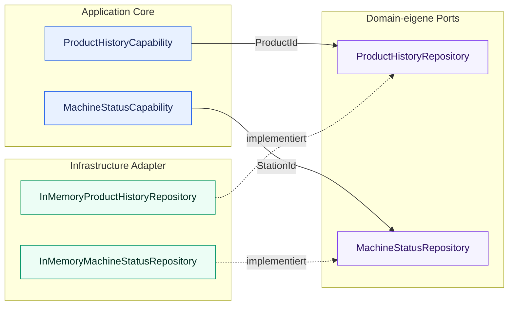
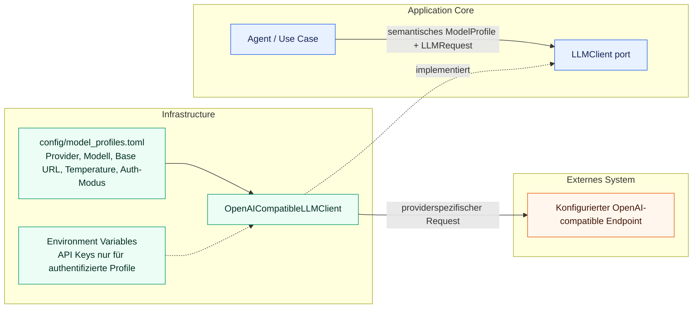
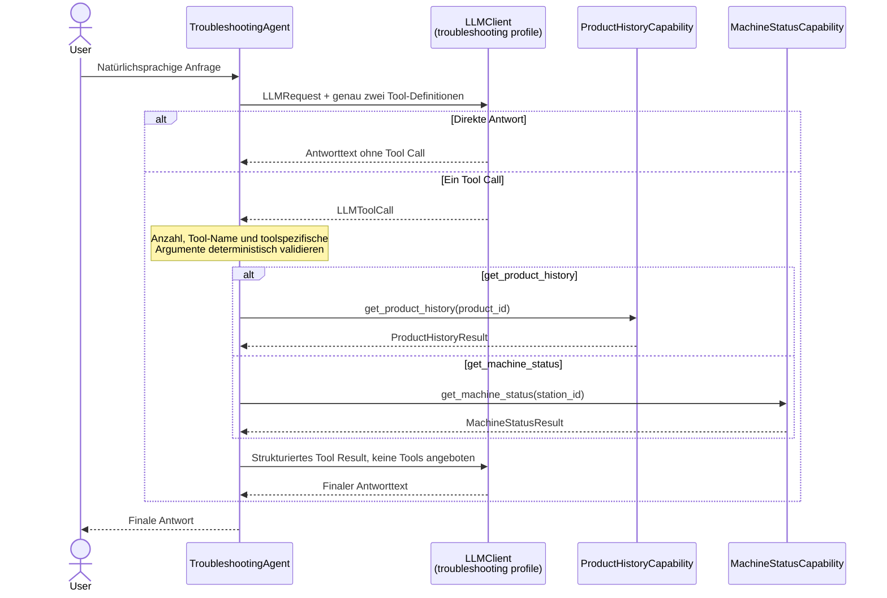
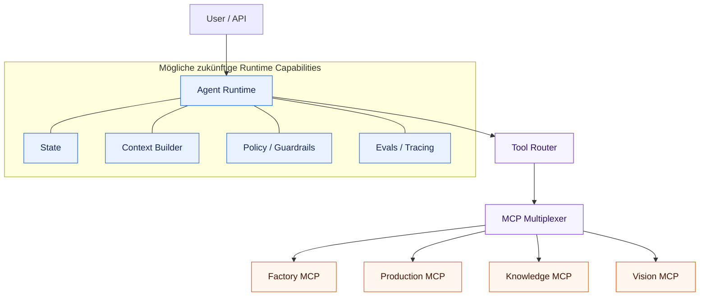

# Architekturübersicht

## Aktuelle Architektur

Das Projekt implementiert derzeit das Abrufen der Produktionshistorie und des aktuellen
Maschinenstatus, eine provider-unabhängige LLM-Integrationsgrenze und einen begrenzten
Slice zur Auswahl zwischen zwei Tools. Ein allgemeiner Agent- oder ReAct-Loop existiert
nicht.

Der implementierte Request Flow ist:

Jede Capability wandelt ihren String-Identifier in das passende Domain Value Object um,
lädt über eine domäneneigene Repository-Abstraktion und gibt ein strukturiertes Ergebnis
zurück. Die deterministischen Demo-Daten enthalten das Produkt `P4711` und die Stationen
`S04` und `S12`.

Verteilte Services und AI frameworks sind bewusst nicht Teil dieses Slice.

Die implementierte LLM-Grenze ist:

`config/model_profiles.toml` ordnet `troubleshooting` derzeit Ollama,
`qwen3.5:9b`, `http://localhost:11434/v1` und Temperature `0` zu. Dies ist die erste
lokale Konfiguration und keine Festlegung auf diesen Provider oder dieses Modell. Die
Profilzuordnung kann geändert werden, ohne Agent- oder Use-Case-Code anzupassen.

Der implementierte Tool-Calling-Ablauf ist:

Das LLM entscheidet, ob es `get_product_history` oder `get_machine_status` anfordert
oder direkt antwortet, und formuliert die finale Antwort. Deterministischer Python-Code
validiert den ausgewählten Namen gegen diese zwei bekannten Tools, validiert die
toolspezifische `product_id` oder `station_id`, lehnt mehr als einen Tool Call ab,
dispatcht fest an die entsprechende Capability und serialisiert deren strukturiertes
Ergebnis. Nach einem Tool Call werden dem finalen LLM Request keine Tools angeboten;
ein weiterer zurückgegebener Tool Call wird abgelehnt, statt einen Loop zu starten.

## Verantwortlichkeiten der Packages

### `domain`

Enthält industrielle Domänenmodelle und Regeln.

Die aktuellen Slices definieren `ProductId`, die gemeinsam verwendete `StationId`,
`ProductionStep`, `ProductionStepStatus`, `ProductHistory`, `MachineState` und
`MachineStatus`. Die domäneneigenen Ports sind `ProductHistoryRepository` und
`MachineStatusRepository`.

Muss unabhängig bleiben von:

* LLM SDKs
* MCP
* Datenbanken
* HTTP frameworks
* anbieterspezifischer Infrastruktur

### `tools`

Enthält agent-facing capabilities.

Tools sollten aussagekräftige Domänenoperationen statt kleinteiliger Implementierungsdetails bereitstellen.

Die aktuellen Capabilities sind
`ProductHistoryCapability.get_product_history(product_id)` und
`MachineStatusCapability.get_machine_status(station_id)`. Sie geben die
Pydantic-Modelle `ProductHistoryResult` und `MachineStatusResult` zurück, jeweils
einschließlich strukturierter Not-found-Ergebnisse.

### `agent`

Enthält provider-unabhängige LLM-Verträge und später Agenten-Orchestrierungslogik.

Die aktuelle Implementierung definiert `LLMClient`, die Auswahl über semantische
`ModelProfile`, kleine Request- und Response-Modelle sowie `TroubleshootingAgent`. Der
Agent enthält die begrenzte Orchestrierung und den festen Zwei-Tool-Dispatch. Er
importiert weder das OpenAI-SDK noch benennt er einen konkreten Provider oder ein
konkretes Modell.

Spätere Verantwortlichkeiten können Folgendes umfassen:

* tool selection
* agent loop
* state
* context construction
* routing
* execution limits

### `infrastructure`

Enthält technische Integrationen und externe Implementierungen.

Die aktuellen Implementierungen sind `InMemoryProductHistoryRepository` und
`InMemoryMachineStatusRepository`, die kleine deterministische Demo-Datensätze
bereitstellen, sowie `OpenAICompatibleLLMClient`, das den provider-unabhängigen
LLM-Vertrag in eine OpenAI-compatible Chat Completions API übersetzt.

Normale Modelleinstellungen und Secret-Werte sind getrennt. Die Konfiguration markiert
ein Profil explizit als nicht authentifiziert oder API-Key-authentifiziert. Ein
authentifiziertes Profil speichert nur den Namen der erforderlichen Environment
Variable; sein Credential-Wert verbleibt in der Umgebung. Das initiale lokale
Ollama-Profil ist nicht authentifiziert und benötigt keinen vom Benutzer konfigurierten
API Key. Der Adapter kapselt den vom OpenAI-SDK benötigten, nicht geheimen technischen
Platzhalter.

Spätere Beispiele können sein:

* zusätzliche LLM Provider Adapter, sobald konkrete Anforderungen sie rechtfertigen
* repositories
* databases
* MCP clients
* observability
* external APIs

## Weiterentwicklung

Die Architektur sollte nur dann weiterentwickelt werden, wenn implementierte Fähigkeiten dies erfordern.

Mögliche spätere Stufen sind:

Dies ist eine Zielrichtung und nicht die aktuelle Implementierung.

Model Profiles wie `vision`, `planning` oder `evaluation` können über Konfiguration
ergänzt werden, sobald ihre Capabilities implementiert werden. Ein nicht
OpenAI-kompatibler Provider benötigt einen weiteren Infrastructure Adapter hinter
demselben `LLMClient`-Port; ein spekulativer Multi-Provider Router existiert heute
nicht. Die Entscheidung und ihre Trade-offs beschreibt
[ADR-002](../decisions/ADR-002-provider-and-model-independent-llm-architecture.de.md).
