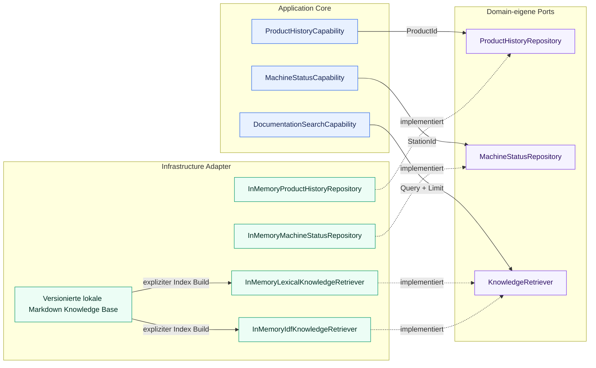
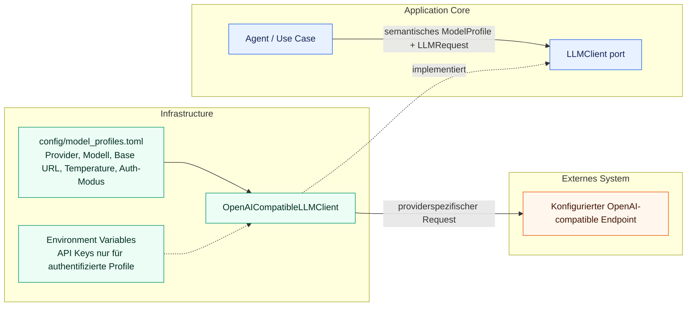
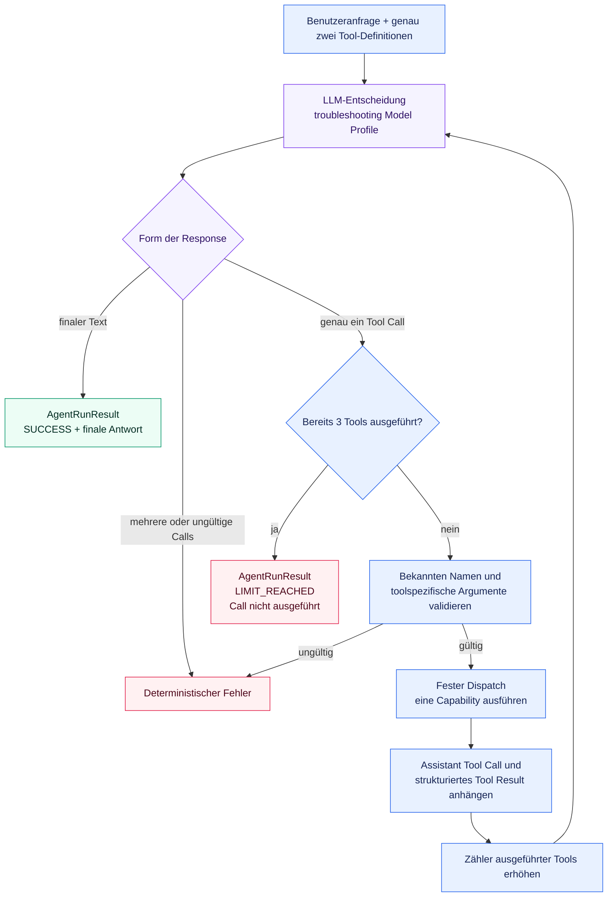
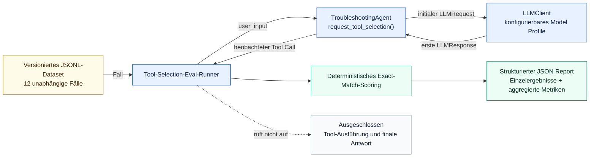
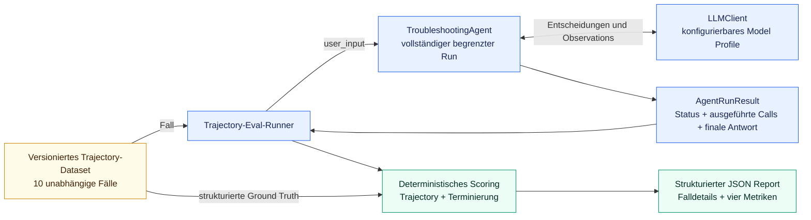
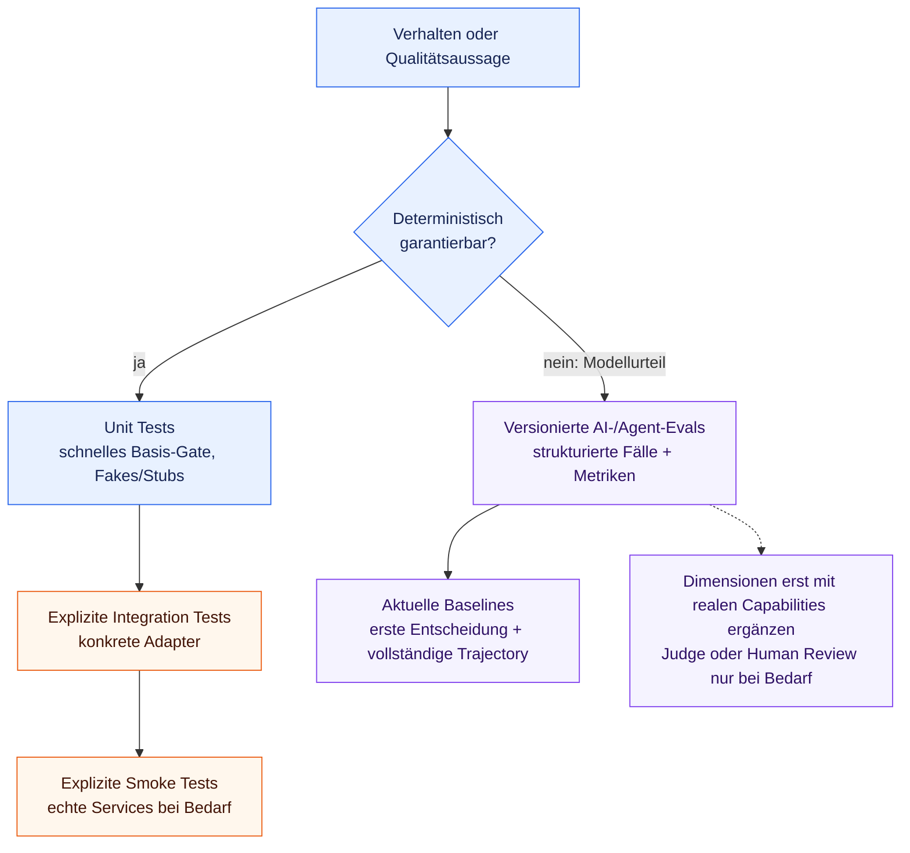
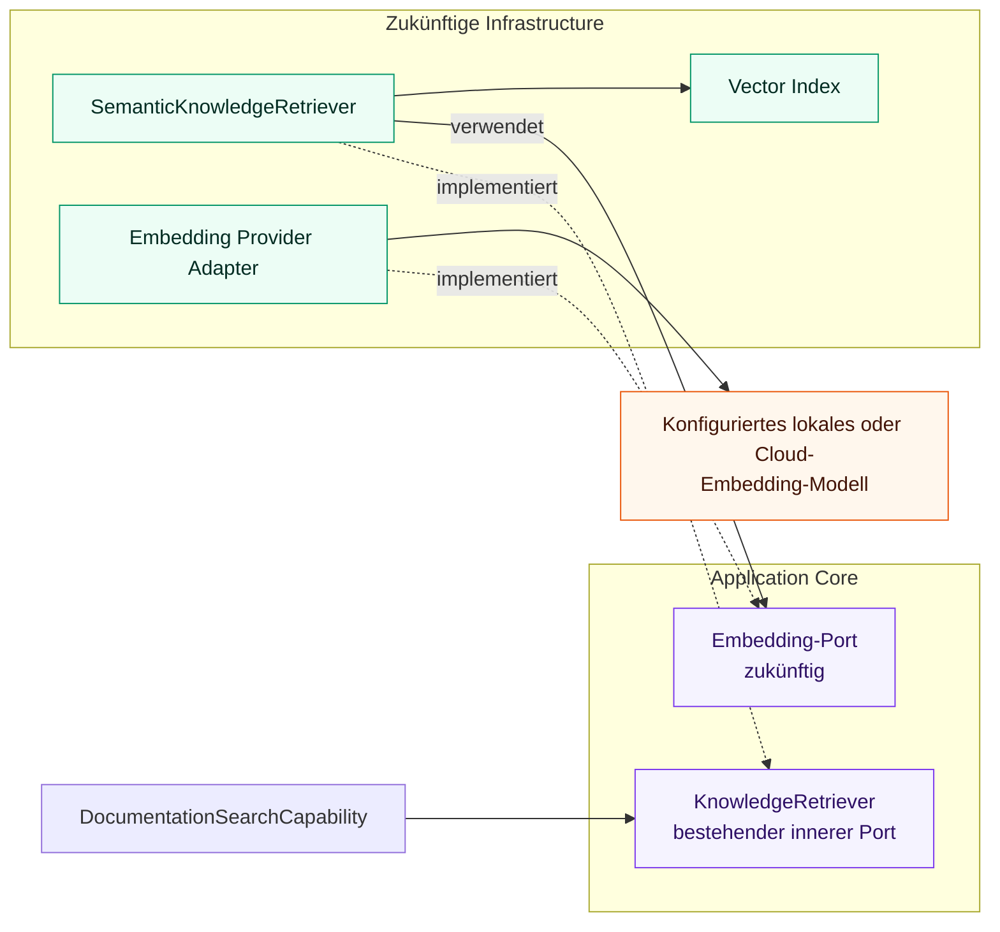
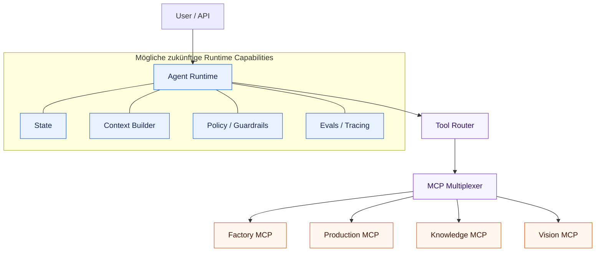

# Architekturübersicht

## Aktuelle Architektur

Das Projekt implementiert derzeit das Abrufen der Produktionshistorie und des aktuellen
Maschinenstatus, eine provider-unabhängige LLM-Integrationsgrenze und einen expliziten
begrenzten Single-Agent Tool Loop über zwei Tools. Fokussierte deterministische
Baselines evaluieren die erste LLM-Tool-Entscheidung und vollständige begrenzte
Trajectories. Zwei isolierte lokale lexical Knowledge-Retrieval-Strategien sind hinter
einem inneren Port implementiert, aber noch nicht in den Agenten integriert. Es
existieren weder Agent-Framework, dynamische Tool Registry, persistentes Agent Memory
noch allgemeines Eval-Framework.

Der implementierte Request Flow ist:

Jede Capability wandelt ihren String-Identifier in das passende Domain Value Object um,
lädt über eine domäneneigene Repository-Abstraktion und gibt ein strukturiertes Ergebnis
zurück. Die deterministischen Demo-Daten enthalten das Produkt `P4711` und die Stationen
`S04` und `S12`.

`DocumentationSearchCapability` erhält `KnowledgeRetriever` per Dependency Injection
und gibt strukturierte Passagen zurück. Der aktuelle Adapter lädt die lokale Markdown
Knowledge Base einmalig bei der expliziten Erstellung; Suchen zur Request-Zeit verwenden
seinen vorbereiteten In-Memory-Index.

Verteilte Services und AI frameworks sind bewusst nicht Teil dieses Slice.

## Knowledge-Retrieval-Baseline

Die versionierte Knowledge Base enthält `station_s04.md`, `error_codes.md` und
`maintenance.md`. Der explizite Ingestion-Schritt normalisiert jede Datei und erzeugt
einen Chunk pro Markdown-Überschriftsabschnitt. Unveränderte Dokumentnamen und
Überschriftenreihenfolgen liefern stabile IDs wie `error_codes::chunk-002`.

```mermaid
flowchart LR
    Docs["3 versionierte Markdown-Dokumente"] --> Load["Explizites Laden und Normalisieren"]
    Load --> Chunk["Überschriftsabschnitt-Chunks<br/>stabile Positions-IDs"]
    Chunk --> Index["In-Memory-Token-Indizes"]
    Query["search_documentation(query)"] --> Port["KnowledgeRetriever-Port"]
    Port --> Simple["Einfaches Term-Overlap-Ranking<br/>Top 3"]
    Port --> IDFSearch["Rarity-aware IDF-Ranking<br/>Top 3"]
    Index --> Simple
    Index --> IDFSearch
    Simple --> Results["Strukturierte Results<br/>Content + Provenance + Score"]
    IDFSearch --> Results
    Results --> Query

    classDef data fill:#fefce8,stroke:#ca8a04,color:#422006
    classDef core fill:#e8f1ff,stroke:#2563eb,color:#172554
    classDef adapter fill:#ecfdf5,stroke:#059669,color:#022c22
    class Docs,Load,Chunk data
    class Query,Port,Results core
    class Index,Simple,IDFSearch adapter
```

Der Tokenizer führt Case Folding für alphanumerische Terme und Identifier mit
Bindestrichen durch, sodass exakte industrielle Identifier erhalten bleiben. Der
einfache Adapter bewertet den Anteil unterschiedlicher Query-Terme im Chunk. Der zweite
Adapter gewichtet übereinstimmende Terme mit geglätteter inverser Chunk Frequency und
normalisiert anschließend mit dem gesamten Query-Gewicht. Beide lassen Chunks mit Score
null aus und lösen Ties durch `chunk_id`; keiner ist BM25. Source Path, Document ID,
Chunk ID, Abschnitts-Metadata und Score bleiben an jedem Result erhalten.

Der fokussierte Retrieval-Eval ist von den Agent-Evals getrennt. Seine zehn
versionierten Fälle messen Hit@1, Hit@3 und Mean Recall@3 mit strukturierter
Relevant-Chunk-Ground-Truth. Dasselbe unveränderte Dataset vergleicht beide Strategien.
Agent-Query-Formulierung und Grounding der finalen Antwort liegen außerhalb dieses
Slice.

Die implementierte LLM-Grenze ist:

`config/model_profiles.toml` ordnet `troubleshooting` derzeit Ollama,
`qwen3.5:9b`, `http://localhost:11434/v1` und Temperature `0` zu. Dies ist die erste
lokale Konfiguration und keine Festlegung auf diesen Provider oder dieses Modell. Die
Profilzuordnung kann geändert werden, ohne Agent- oder Use-Case-Code anzupassen.

Der implementierte Tool-Calling-Ablauf ist:

Das LLM entscheidet, ob es `get_product_history` oder `get_machine_status` anfordert
oder direkt antwortet, und formuliert die finale Antwort. Deterministischer Python-Code
validiert einen ausgewählten Call pro Response, validiert die toolspezifische
`product_id` oder `station_id`, verwendet einen festen Dispatch, serialisiert jedes
strukturierte Result und erhält den vollständigen Message Context des aktuellen Runs.
Beide Tools bleiben bei jedem Entscheidungsschritt verfügbar.

`MAX_TOOL_CALLS = 3` zählt erfolgreich ausgeführte Tools statt LLM Requests. Nach der
dritten Observation ist genau eine finale LLM-Entscheidung erlaubt. Finaler Text ergibt
`SUCCESS`; ein weiterer angeforderter Call ergibt `LIMIT_REACHED`, wird nicht ausgeführt
und führt zu keinem weiteren LLM Request. Unbekannte Tools, ungültige Argumente und
mehrere Calls in einer Response bleiben deterministische Fehler.

## Baseline für die Tool-Selection-Evaluation

Der Repository-lokale Eval misst ausschließlich die von
`TroubleshootingAgent.request_tool_selection()` exponierte erste Entscheidung. Jeder
versionierte JSONL-Fall startet mit einem frischen Message Context. Der Runner verwendet
ein konfigurierbares semantisches Model Profile und übergibt die provider-unabhängige
`LLMResponse` an ein deterministisches Exact-Match-Scoring.

Tool Selection Accuracy verlangt genau einen Call mit dem erwarteten Namen. Argument
Accuracy verlangt zusätzlich die exakte Übereinstimmung der Argumente und vergibt daher
keinen Argument-Punkt für ein falsches Tool. Die Baseline bewertet weder Tool Results,
Qualität der finalen Antwort, Latenz, Kosten noch LLM-as-a-Judge-Qualität.

## Baseline für die Trajectory-Evaluation

Der ergänzende Trajectory-Eval führt für jeden unabhängigen versionierten Fall den
vollständigen Agenten aus. `AgentRunResult` stellt normalisierte ausgeführte Calls ohne
Provider-Typen oder Call-IDs bereit. Deterministisches Scoring vergleicht diese
tatsächliche Trajectory und den finalen Run Status mit strukturierter Ground Truth. Die
natürlichsprachliche finale Antwort wird aufgezeichnet, aber nicht bewertet.

Task Success erfordert sowohl exakte Trajectory-Gleichheit als auch den erwarteten
Termination Status. Exact Trajectory Accuracy misst die Gleichheit der gesamten
Sequenz, Tool Call Accuracy bewertet exakte positionsbezogene Call-Slots und bestraft
fehlende sowie zusätzliche Calls, und Termination Accuracy misst die Statusgleichheit.
Erwartete und tatsächliche Call-Anzahlen pro Fall machen Over- und Under-Calling
sichtbar.

## Quality Strategy

[ADR-005](../decisions/ADR-005-testing-and-evaluation-strategy.de.md) trennt
Qualitätsmechanismen nach der Art der Aussage, die sie stützen. Deterministische
Garantien gehören in automatisierte Tests. Modellabhängige Urteile werden mit
versionierten Datasets, strukturierter Ground Truth und expliziten Metriken gemessen.
Smoke Tests prüfen grundlegende Live-Integration, während Traces und operative Metriken
der Observability dienen und weder Tests noch Evals ersetzen.

Das aktuelle Repository implementiert deterministische Unit-Test-Abdeckung, explizit
dokumentierte lokale Ollama-Smoke-Pfade, den fokussierten Tool-Selection-Eval für die
erste Entscheidung und den Eval der vollständigen begrenzten Trajectory. Es
implementiert weder ein externes Eval-Framework noch LLM-as-a-Judge, eine
Observability-Plattform oder neue CI/CD-Infrastruktur. Generierte Eval-Reports bleiben
standardmäßig unversioniert.

## Verantwortlichkeiten der Packages

### `domain`

Enthält industrielle Domänenmodelle und Regeln.

Die aktuellen Slices definieren `ProductId`, die gemeinsam verwendete `StationId`,
`ProductionStep`, `ProductionStepStatus`, `ProductHistory`, `MachineState`,
`MachineStatus` und `KnowledgeRetrievalResult`. Die inneren Ports sind
`ProductHistoryRepository`, `MachineStatusRepository` und `KnowledgeRetriever`.

Muss unabhängig bleiben von:

* LLM SDKs
* MCP
* Datenbanken
* HTTP frameworks
* anbieterspezifischer Infrastruktur

### `tools`

Enthält agent-facing capabilities.

Tools sollten aussagekräftige Domänenoperationen statt kleinteiliger Implementierungsdetails bereitstellen.

Die aktuellen Capabilities sind
`ProductHistoryCapability.get_product_history(product_id)` und
`MachineStatusCapability.get_machine_status(station_id)`. Sie geben die
Pydantic-Modelle `ProductHistoryResult` und `MachineStatusResult` zurück, jeweils
einschließlich strukturierter Not-found-Ergebnisse. Die isolierte
`DocumentationSearchCapability.search_documentation(query)` gibt strukturierte
`DocumentationSearchResult`-Daten zurück und wird noch nicht als Agent Tool angeboten.

### `agent`

Enthält provider-unabhängige LLM-Verträge und Agenten-Orchestrierungslogik.

Die aktuelle Implementierung definiert `LLMClient`, die Auswahl über semantische
`ModelProfile`, kleine Request- und Response-Modelle sowie `TroubleshootingAgent`. Der
Agent enthält den expliziten begrenzten sequenziellen Loop und den festen
Zwei-Tool-Dispatch. `AgentRunResult` unterscheidet `SUCCESS` von `LIMIT_REACHED` und gibt
die Anzahl ausgeführter Tools sowie die normalisierte ausgeführte Trajectory an. Der
Agent importiert weder das OpenAI-SDK noch benennt er einen konkreten Provider oder ein
konkretes Modell.

Mögliche spätere Verantwortlichkeiten sind:

* persistenter Agent State
* Context Compression
* umfangreicheres Routing
* Integration von Policies und Guardrails

### `infrastructure`

Enthält technische Integrationen und externe Implementierungen.

Die aktuellen Implementierungen sind `InMemoryProductHistoryRepository` und
`InMemoryMachineStatusRepository`, die kleine deterministische Demo-Datensätze
bereitstellen, `InMemoryLexicalKnowledgeRetriever` und
`InMemoryIdfKnowledgeRetriever`, die vorbereitete lokale Token-Indizes mit
unterschiedlichen Scoring-Formeln durchsuchen, sowie `OpenAICompatibleLLMClient`, das den
provider-unabhängigen LLM-Vertrag in eine OpenAI-compatible Chat Completions API
übersetzt.

Normale Modelleinstellungen und Secret-Werte sind getrennt. Die Konfiguration markiert
ein Profil explizit als nicht authentifiziert oder API-Key-authentifiziert. Ein
authentifiziertes Profil speichert nur den Namen der erforderlichen Environment
Variable; sein Credential-Wert verbleibt in der Umgebung. Das initiale lokale
Ollama-Profil ist nicht authentifiziert und benötigt keinen vom Benutzer konfigurierten
API Key. Der Adapter kapselt den vom OpenAI-SDK benötigten, nicht geheimen technischen
Platzhalter.

Spätere Beispiele können sein:

* zusätzliche LLM Provider Adapter, sobald konkrete Anforderungen sie rechtfertigen
* repositories
* databases
* MCP clients
* observability
* external APIs

### `evals`

Enthält separate versionierte Datasets und fokussierte manuelle Runner für die
First-Decision-Tool-Selection, vollständige begrenzte Trajectories und isolierte
Retrieval-Qualität. Parsing, Scoring pro Fall und Aggregation sind deterministisch und
durch Unit Tests ohne live LLM abgedeckt. Generierte JSON Reports gehören in das von
Git ignorierte Verzeichnis `evals/results/`, sofern sie nicht bewusst kuratiert werden.

## Weiterentwicklung

Die Architektur sollte nur dann weiterentwickelt werden, wenn implementierte Fähigkeiten dies erfordern.

### Retrieval-Weiterentwicklung

Die lexical Baselines können später mit BM25-artigem, Embedding-, Hybrid- oder reranktem
Retrieval verglichen werden. Neue Ports, Storage Adapter, Modellrollen und Dependencies
werden nur eingeführt, wenn Retrieval-Evals einen konkreten Bedarf zeigen. Der
Retrieval Core bleibt gemäß
[ADR-006](../decisions/ADR-006-knowledge-retrieval-and-rag-architecture.de.md)
unabhängig von einer späteren Knowledge-MCP-Transportgrenze.

Die nächste Semantic-Retrieval-Implementierung führt einen fokussierten inneren
Embedding-Port erst bei ihrer tatsächlichen Implementierung ein. Embeddings bleiben
eine von `LLMClient` getrennte Modellrolle; Provider Adapter und Modellkonfiguration
verbleiben in Infrastructure. Die folgende geplante Grenze ist nicht Teil der aktuellen
Implementierung:

Modell, Dimension, Similarity-Metrik, Index-Technologie und Persistenz bleiben offen.
Siehe [ADR-007](../decisions/ADR-007-embedding-model-abstraction.de.md).

### Breitere Zielrichtung

Mögliche spätere Stufen sind:

Dies ist eine Zielrichtung und nicht die aktuelle Implementierung.

Model Profiles wie `vision`, `planning` oder `evaluation` können über Konfiguration
ergänzt werden, sobald ihre Capabilities implementiert werden. Ein nicht
OpenAI-kompatibler Provider benötigt einen weiteren Infrastructure Adapter hinter
demselben `LLMClient`-Port; ein spekulativer Multi-Provider Router existiert heute
nicht. Die Entscheidung und ihre Trade-offs beschreibt
[ADR-002](../decisions/ADR-002-provider-and-model-independent-llm-architecture.de.md).
