# Architekturübersicht

## Aktuelle Architektur

Das Projekt implementiert derzeit das Abrufen der Produktionshistorie und des aktuellen
Maschinenstatus, eine provider-unabhängige LLM-Integrationsgrenze und zwei parallele
begrenzte Single-Agent-Pfade über dieselben zwei Read-Only-Tools: den handgeschriebenen
`TroubleshootingAgent` als Referenz und `LangGraphTroubleshootingAgent`. Der Graph-Pfad
kann zusätzlich eine explizit injizierte Demonstrations-Action-Capability erhalten, die
für Human Approval pausiert. Fokussierte
deterministische Baselines evaluieren die erste LLM-Tool-Entscheidung und vollständige
begrenzte Trajectories für beide Pfade. Lokale lexical und semantische
Knowledge-Retrieval-Strategien
sind hinter einem inneren Port implementiert, aber noch nicht in den Agenten integriert. Ein
deterministischer Model-Egress-Decorator mit Deny-by-default prüft die explizite
Request-Klassifikation gegen die validierte Execution Zone jedes Model Profiles, bevor
der Provider Adapter aufgerufen wird. LangGraph und LangChain Core werden nun gezielt
für den parallelen Orchestrierungspfad verwendet. Ein explizit injizierter
`InMemorySaver` unterstützt lokale/Test-Checkpoint- und HITL-Demonstrationen, ist aber
keine dauerhafte Persistenz. Es existieren weder dynamische Tool Registry, produktives
Persistenz-Backend, LangSmith-Integration noch allgemeines Eval-Framework.

Der implementierte Request Flow ist:

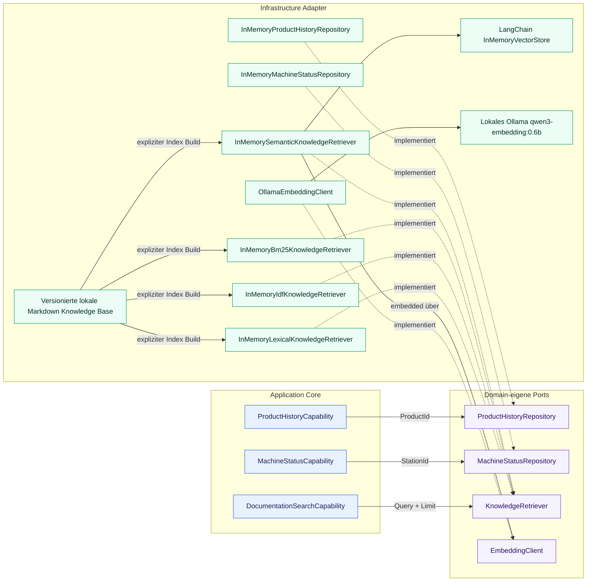

Jede Capability wandelt ihren String-Identifier in das passende Domain Value Object um,
lädt über eine domäneneigene Repository-Abstraktion und gibt ein strukturiertes Ergebnis
zurück. Die deterministischen Demo-Daten enthalten das Produkt `P4711` und die Stationen
`S04` und `S12`.

`DocumentationSearchCapability` erhält `KnowledgeRetriever` per Dependency Injection
und gibt strukturierte Passagen zurück. Lexical und semantische Adapter laden die lokale
Markdown Knowledge Base einmalig bei der expliziten Erstellung; Suchen zur Request-Zeit
verwenden ihre vorbereiteten In-Memory-Indizes. Der semantische Adapter erhält den
separaten inneren `EmbeddingClient`-Port, baut Dokumentvektoren in LangChains
`InMemoryVectorStore` und embedded zur Runtime nur die Query über lokales Ollama.

Verteilte Services sind bewusst nicht Teil dieses Slice.

## Knowledge-Retrieval-Baseline

Die versionierte Knowledge Base enthält sieben kompakte Markdown-Dokumente. Der
explizite Ingestion-Schritt normalisiert jede Datei und erzeugt einen Chunk pro
Markdown-Überschriftsabschnitt, derzeit 25 Chunks. Unveränderte Dokumentnamen und
Überschriftenreihenfolgen liefern stabile IDs wie `error_codes::chunk-002`.

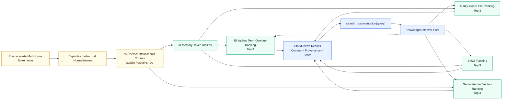

Der Tokenizer führt Case Folding für alphanumerische Terme und Identifier mit
Bindestrichen durch, sodass exakte industrielle Identifier erhalten bleiben. Der
einfache Adapter bewertet den Anteil unterschiedlicher Query-Terme im Chunk. Der zweite
Adapter gewichtet übereinstimmende Terme mit geglätteter inverser Chunk Frequency und
normalisiert anschließend mit dem gesamten Query-Gewicht. BM25 ergänzt gesättigte Term
Frequency und Chunk-Length-Normalisierung. Der semantische Adapter baut lokale Vektoren
über `EmbeddingClient` und LangChains `InMemoryVectorStore`. Alle lexikalischen
Strategien lassen Chunks mit Score null aus und lösen Ties durch `chunk_id`. Source Path,
Document ID, Chunk ID, Abschnitts-Metadata und Score bleiben an jedem Result erhalten.

Der fokussierte Retrieval-Eval ist von den Agent-Evals getrennt. Seine 28 eingefrorenen
v2-Fälle messen Hit@1, Hit@3 und Mean Recall@3 mit strukturierter
Relevant-Chunk-Ground-Truth. Dasselbe unveränderte Dataset vergleicht alle vier Strategien.
Agent-Query-Formulierung und Grounding der finalen Antwort liegen außerhalb dieses
Slice.

Die implementierte LLM-Grenze umfasst die deterministische Task-Level-Profile-Auswahl
und einen separaten abschließenden Egress Check:

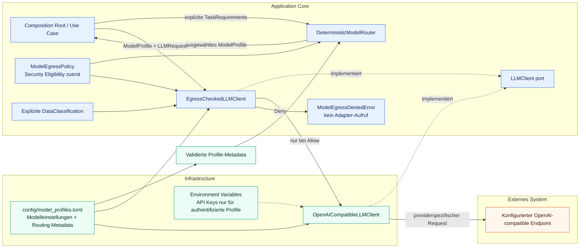

`config/model_profiles.toml` weist jedem Profile explizite, validierte Capabilities,
Quality- und relative Cost Classes sowie eine vom Provider unabhängige Execution Zone
zu. `troubleshooting`, `local_fast` und `local_quality` verwenden `LOCAL`; `public_fast`
verwendet `PUBLIC_CLOUD`. Ein Aufrufer erstellt `TaskRequirements`; der Router wendet die
bestehende Egress Policy vor Capability-, Minimum-Quality- und Cost/Quality-Sortierung
an. Für den unabhängigen finalen Check geben Aufrufer dem kontrollierten Client außerdem
die Request-Klassifikation mit. Die aktuelle Policy erlaubt alle vier Klassifikationen
lokal und nur `PUBLIC`-Daten in `PUBLIC_CLOUD`. Fehlende oder unbekannte Klassifikationen,
Zonen oder Routing-Metadata schlagen geschlossen fehl, ohne den Adapter aufzurufen.

Der implementierte Tool-Calling-Ablauf ist:

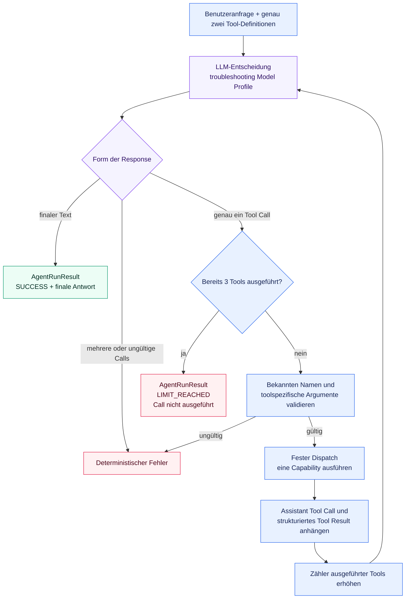

Das LLM entscheidet, ob es `get_product_history` oder `get_machine_status` anfordert
oder direkt antwortet, und formuliert die finale Antwort. Deterministischer Python-Code
validiert einen ausgewählten Call pro Response, validiert die toolspezifische
`product_id` oder `station_id`, verwendet einen festen Dispatch, serialisiert jedes
strukturierte Result und erhält den vollständigen Message Context des aktuellen Runs.
Beide Tools bleiben bei jedem Entscheidungsschritt verfügbar.

`MAX_TOOL_CALLS = 3` zählt erfolgreich ausgeführte Tools statt LLM Requests. Nach der
dritten Observation ist genau eine finale LLM-Entscheidung erlaubt. Finaler Text ergibt
`SUCCESS`; ein weiterer angeforderter Call ergibt `LIMIT_REACHED`, wird nicht ausgeführt
und führt zu keinem weiteren LLM Request. Unbekannte Tools, ungültige Argumente und
mehrere Calls in einer Response bleiben deterministische Fehler.

Der parallele LangGraph-Pfad erhält dieses Verhalten, verschiebt aber die
Orchestrierungsmechanik in einen expliziten Graphen:

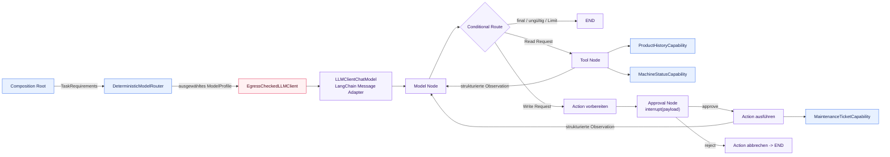

`TroubleshootingGraphState` enthält LangChain Messages, die Anzahl ausgeführter Tools,
normalisierte ausgeführte Calls, Run Status, finale Antwort, eine Pending Action,
Approval Result und minimalen gebundenen Run Context. Ein eigener Tool Node adaptiert die
bestehenden Capabilities über LangChain-`StructuredTool`-Verträge. Dadurch bleiben
Argumentvalidierung und sequenzieller One-Call-Dispatch explizit, statt einen Framework-
Default zu übernehmen, der das ADR-004-Verhalten verändern könnte. Der Graph wählt kein
Modell: Der Composition Root injiziert ein bereits geroutetes Profile und einen Client,
dessen finaler ADR-009-Egress-Check aktiv bleibt.

Für einen fortsetzbaren Run wird der Graph mit einem nativen `InMemorySaver` kompiliert
und mit `configurable.thread_id` aufgerufen. Der Approval Node erzeugt einen
JSON-serialisierbaren `action_approval`-Interrupt und wird über
`Command(resume="approve" | "reject")` mit derselben Thread-ID fortgesetzt. Read Tools
unterbrechen nie. `create_maintenance_ticket` ist eine In-Memory-Demonstrations-Action:
Sie wird vor dem Interrupt nur vorbereitet, erst nach Approval ausgeführt und verwendet
ihre Tool-Call-ID als In-Memory-Idempotenzschlüssel. Nodes vor einem Interrupt bleiben
side-effect-free, weil LangGraph den Node beim Resume von Anfang an erneut startet.
`InMemorySaver` verliert State beim Prozessende; dauerhafter Storage bleibt gemäß
[ADR-011](../decisions/ADR-011-agent-persistence-and-human-in-the-loop.de.md)
zurückgestellt.

## Baseline für die Tool-Selection-Evaluation

Der Repository-lokale Eval misst ausschließlich die von einem der beiden
Troubleshooting-Pfade exponierte erste Entscheidung. Jeder
versionierte JSONL-Fall startet mit einem frischen Message Context. Der Runner verwendet
ein konfigurierbares semantisches Model Profile und übergibt die provider-unabhängige
`LLMResponse` an ein deterministisches Exact-Match-Scoring.

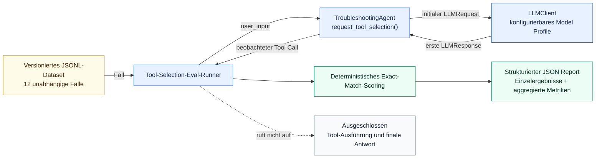

Tool Selection Accuracy verlangt genau einen Call mit dem erwarteten Namen. Argument
Accuracy verlangt zusätzlich die exakte Übereinstimmung der Argumente und vergibt daher
keinen Argument-Punkt für ein falsches Tool. Die Baseline bewertet weder Tool Results,
Qualität der finalen Antwort, Latenz, Kosten noch LLM-as-a-Judge-Qualität.

## Baseline für die Trajectory-Evaluation

Der ergänzende Trajectory-Eval führt für jeden unabhängigen versionierten Fall den
vollständigen Agenten aus. `AgentRunResult` stellt normalisierte ausgeführte Calls ohne
Provider-Typen oder Call-IDs bereit. Deterministisches Scoring vergleicht diese
tatsächliche Trajectory und den finalen Run Status mit strukturierter Ground Truth. Die
natürlichsprachliche finale Antwort wird aufgezeichnet, aber nicht bewertet.

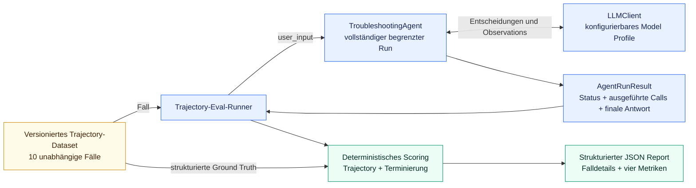

Task Success erfordert sowohl exakte Trajectory-Gleichheit als auch den erwarteten
Termination Status. Exact Trajectory Accuracy misst die Gleichheit der gesamten
Sequenz, Tool Call Accuracy bewertet exakte positionsbezogene Call-Slots und bestraft
fehlende sowie zusätzliche Calls, und Termination Accuracy misst die Statusgleichheit.
Erwartete und tatsächliche Call-Anzahlen pro Fall machen Over- und Under-Calling
sichtbar.

## Quality Strategy

[ADR-005](../decisions/ADR-005-testing-and-evaluation-strategy.de.md) trennt
Qualitätsmechanismen nach der Art der Aussage, die sie stützen. Deterministische
Garantien gehören in automatisierte Tests. Modellabhängige Urteile werden mit
versionierten Datasets, strukturierter Ground Truth und expliziten Metriken gemessen.
Smoke Tests prüfen grundlegende Live-Integration, während Traces und operative Metriken
der Observability dienen und weder Tests noch Evals ersetzen.

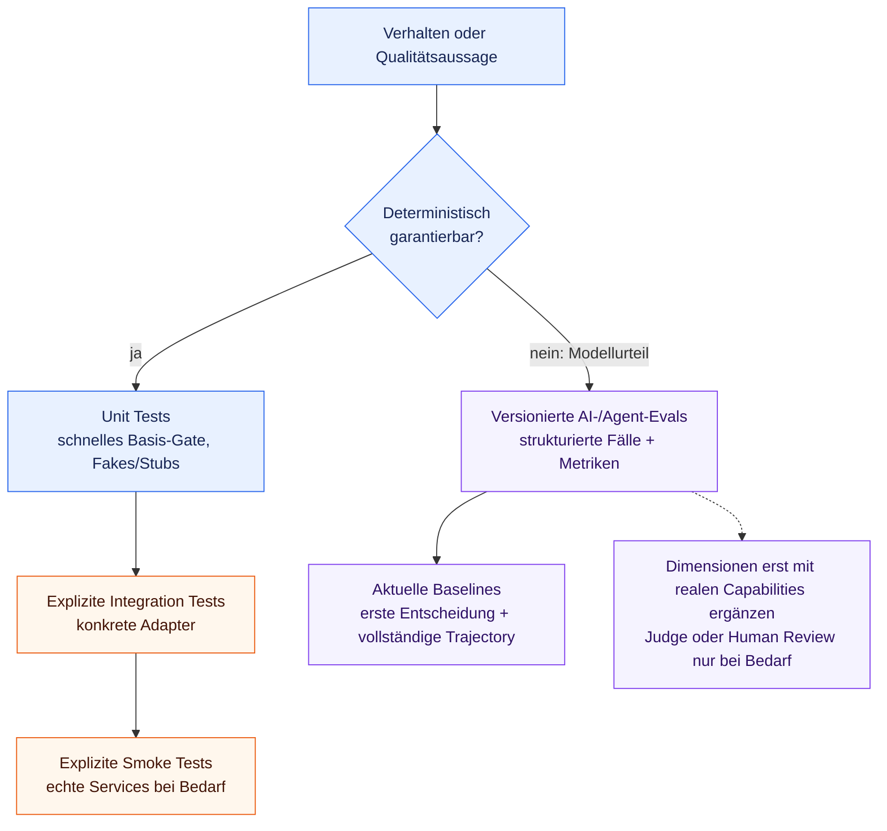

Das aktuelle Repository implementiert deterministische Unit-Test-Abdeckung, explizit
dokumentierte lokale Ollama-Smoke-Pfade, den fokussierten Tool-Selection-Eval für die
erste Entscheidung und den Eval der vollständigen begrenzten Trajectory. Es
implementiert weder ein externes Eval-Framework noch LLM-as-a-Judge, eine
Observability-Plattform oder neue CI/CD-Infrastruktur. Generierte Eval-Reports bleiben
standardmäßig unversioniert.

## Verantwortlichkeiten der Packages

### `domain`

Enthält industrielle Domänenmodelle und Regeln.

Die aktuellen Slices definieren `ProductId`, die gemeinsam verwendete `StationId`,
`ProductionStep`, `ProductionStepStatus`, `ProductHistory`, `MachineState`,
`MachineStatus` und `KnowledgeRetrievalResult`. Die inneren Ports sind
`ProductHistoryRepository`, `MachineStatusRepository`, `KnowledgeRetriever` und
`EmbeddingClient`. Die
HITL-Demonstration definiert zusätzlich `MaintenanceTicketRequestId` und
`MaintenanceTicket` sowie den inneren Port `MaintenanceTicketRepository`.

Muss unabhängig bleiben von:

* LLM SDKs
* MCP
* Datenbanken
* HTTP frameworks
* anbieterspezifischer Infrastruktur

### `tools`

Enthält agent-facing capabilities.

Tools sollten aussagekräftige Domänenoperationen statt kleinteiliger Implementierungsdetails bereitstellen.

Die aktuellen Capabilities sind
`ProductHistoryCapability.get_product_history(product_id)` und
`MachineStatusCapability.get_machine_status(station_id)`. Sie geben die
Pydantic-Modelle `ProductHistoryResult` und `MachineStatusResult` zurück, jeweils
einschließlich strukturierter Not-found-Ergebnisse. Die isolierte
`DocumentationSearchCapability.search_documentation(query)` gibt strukturierte
`DocumentationSearchResult`-Daten zurück und wird noch nicht als Agent Tool angeboten.
`MaintenanceTicketCapability.create_maintenance_ticket(...)` ist eine optionale
LangGraph-only Demonstrations-Action. Ihre deterministische Approval-Grenze führt sie
erst nach expliziter Genehmigung aus; der handgeschriebene Referenzpfad exponiert sie
nicht.

### `agent`

Enthält provider-unabhängige LLM-Verträge und Agenten-Orchestrierungslogik.

Die aktuelle Implementierung definiert `LLMClient`, die Auswahl über semantische
`ModelProfile`, kleine Request- und Response-Modelle, den handgeschriebenen
`TroubleshootingAgent` und den parallelen `LangGraphTroubleshootingAgent`. Sie
stellt außerdem explizite `TaskRequirements`, validierte Routing-Metadata und
`DeterministicModelRouter` bereit. Der Router verwendet `ModelEgressPolicy`, filtert nach
erforderlichen Capabilities und Minimum Quality und wendet anschließend eine stabile
Cost/Quality-Sortierung an. Beide Agent-Pfade erhalten den begrenzten sequenziellen
Loop und den festen Zwei-Tool-Dispatch. `AgentRunResult` unterscheidet `SUCCESS` von
`LIMIT_REACHED` und gibt die Anzahl ausgeführter Tools sowie die normalisierte
ausgeführte Trajectory an. Der Agent konstruiert den Router nicht, importiert weder das
OpenAI-SDK noch benennt er einen konkreten Provider oder ein konkretes Modell. Seine
optionale HITL-Komposition speichert bereits ausgewähltes Profile und explizite Run
Classification im Checkpoint-State; ein Resume mit abweichendem Profile oder abweichender
Classification wird abgelehnt, statt erneut zu routen.

Mögliche spätere Verantwortlichkeiten sind:

* dauerhafte produktive Agent-Persistenz
* Context Compression
* Classification Propagation im Application State
* Integration von Policies und Guardrails

### `infrastructure`

Enthält technische Integrationen und externe Implementierungen.

Die aktuellen Implementierungen sind `InMemoryProductHistoryRepository` und
`InMemoryMachineStatusRepository`, die kleine deterministische Demo-Datensätze
bereitstellen, `InMemoryLexicalKnowledgeRetriever`, `InMemoryIdfKnowledgeRetriever` und
`InMemoryBm25KnowledgeRetriever`, die vorbereitete lokale Token-Indizes mit
unterschiedlichen Scoring-Formeln durchsuchen, `InMemorySemanticKnowledgeRetriever`, das
LangChains `InMemoryVectorStore`-Matches über `EmbeddingClient` auf originale
Chunk-Provenance zurückmappt, sowie `OllamaEmbeddingClient`, das das Baseline-Embedding-
Modell auf lokales Ollama beschränkt, sowie `OpenAICompatibleLLMClient`, das den
provider-unabhängigen LLM-Vertrag in eine OpenAI-compatible Chat Completions API
übersetzt. `LLMClientChatModel` ist der schmale Infrastructure Adapter zwischen
LangChain Messages/Tools und dem bestehenden `LLMClient`; er konstruiert weder Provider
noch dupliziert er Profile- oder Security-Konfiguration.

Normale Modelleinstellungen und Secret-Werte sind getrennt. Die Konfiguration markiert
ein Profil explizit als nicht authentifiziert oder API-Key-authentifiziert. Ein
authentifiziertes Profil speichert nur den Namen der erforderlichen Environment
Variable; sein Credential-Wert verbleibt in der Umgebung. Das initiale lokale
Ollama-Profil ist nicht authentifiziert und benötigt keinen vom Benutzer konfigurierten
API Key. Der Adapter kapselt den vom OpenAI-SDK benötigten, nicht geheimen technischen
Platzhalter.

Spätere Beispiele können sein:

* zusätzliche LLM Provider Adapter, sobald konkrete Anforderungen sie rechtfertigen
* repositories
* databases
* MCP clients
* observability
* external APIs

### `evals`

Enthält separate versionierte Datasets und fokussierte Runner für die
First-Decision-Tool-Selection, vollständige begrenzte Trajectories und isolierte
Retrieval-Qualität. Agent-Eval-Runner wählen explizit `manual` oder `langgraph`, während
Datasets und Scoring unverändert bleiben. Parsing, Scoring pro Fall und Aggregation sind
deterministisch und durch Unit Tests ohne live LLM abgedeckt. Generierte JSON Reports gehören in das von
Git ignorierte Verzeichnis `evals/results/`, sofern sie nicht bewusst kuratiert werden.

## Weiterentwicklung

Die Architektur sollte nur dann weiterentwickelt werden, wenn implementierte Fähigkeiten dies erfordern.

### Task-Level Model Routing und Model Egress

Task-Level Routing und abschließendes Data-Egress-Enforcement sind als getrennte innere
Verantwortlichkeiten implementiert. Explizite `TaskRequirements` tragen Task Role,
erforderliche Capabilities, Minimum Quality, Cost Preference und Data Classification.
Der Router wendet zuerst die ADR-009-Policy als Security Eligibility Filter an, danach
Capability- und Quality-Filter und erst dann seine deterministische Cost/Quality-
Präferenz mit Profile-ID-Tie-Breaker. Der unabhängige `EgressCheckedLLMClient` wiederholt
den ADR-009-Check unmittelbar vor dem Provider Adapter. Classification Propagation im
Application State bleibt geplant.

```mermaid
flowchart LR
    Task["Task / Capability"] --> Requirements["Explizite Task Requirements"]
    Context["Request- + Tool- + Retrieval-Kontext"] -.-> Classification["Effektive Data Classification<br/>geplanter Application State"]
    Requirements --> Eligibility["Security Eligibility Filter<br/>implementiert, Deny-by-default"]
    Requirements --> ExplicitClass["Explizite Request-Klassifikation"]
    ExplicitClass --> Eligibility
    Profiles["Konfigurierte Model Profiles<br/>validierte Capabilities, Quality,<br/>Cost und Execution Zone"] --> Eligibility
    Eligibility --> Eligible["Nur zulässige Profiles"]
    Eligible --> Router["Deterministischer Task Router"]
    Requirements --> Router
    Router --> Selected["Ausgewähltes semantisches Profile"]
    Selected --> FinalCheck["EgressCheckedLLMClient<br/>unabhängiger finaler Check"]
    Profiles --> FinalCheck
    ExplicitClass --> FinalCheck
    FinalCheck -->|"erlaubt"| Client["Provider-LLMClient-Adapter"]
    FinalCheck -->|"abgelehnt"| Failure["Deterministischer Fehler<br/>kein Adapter-Aufruf"]
    Client --> Endpoint["Konfigurierter Model Endpoint"]

    classDef core fill:#e8f1ff,stroke:#2563eb,color:#172554
    classDef security fill:#fff1f2,stroke:#e11d48,color:#4c0519
    classDef routing fill:#f5f3ff,stroke:#7c3aed,color:#2e1065
    classDef adapter fill:#ecfdf5,stroke:#059669,color:#022c22
    class Task,Requirements,Context,Classification,ExplicitClass core
    class Eligibility,FinalCheck,Failure security
    class Profiles,Eligible,Router,Selected routing
    class Client,Endpoint adapter
```

`MINIMIZE_COST` sortiert nach niedrigeren relativen Kosten und dann nach der kleinsten
ausreichenden Quality; `BALANCED` sortiert nach niedrigeren Kosten und dann höherer
Quality; `PREFER_QUALITY` sortiert nach höherer Quality und dann niedrigeren Kosten. Jeder
Tie endet mit der lexikalischen Profile ID, sodass die Eingabereihenfolge die Auswahl
nicht beeinflusst. Fallbacks und adaptive Auswahl sind nicht implementiert. Ist kein
erlaubtes und geeignetes Profile verfügbar, löst der Router `NoEligibleModelError` aus.
Cost- und Quality-Präferenzen können den Security-Filter nicht überstimmen. Siehe
[ADR-008](../decisions/ADR-008-task-level-model-routing.de.md) und
[ADR-009](../decisions/ADR-009-data-classification-and-model-egress-policy.de.md).

### Retrieval-Weiterentwicklung

Die lexical Baselines werden nun mit einer ersten semantischen Baseline verglichen. Der
Retrieval Core bleibt gemäß
[ADR-006](../decisions/ADR-006-knowledge-retrieval-and-rag-architecture.de.md)
unabhängig von einer späteren Knowledge-MCP-Transportgrenze. Embeddings bleiben eine von
`LLMClient` getrennte Modellrolle; der fokussierte `EmbeddingClient`-Port liegt im Core,
während Provider Adapter und Modellkonfiguration in Infrastructure verbleiben.

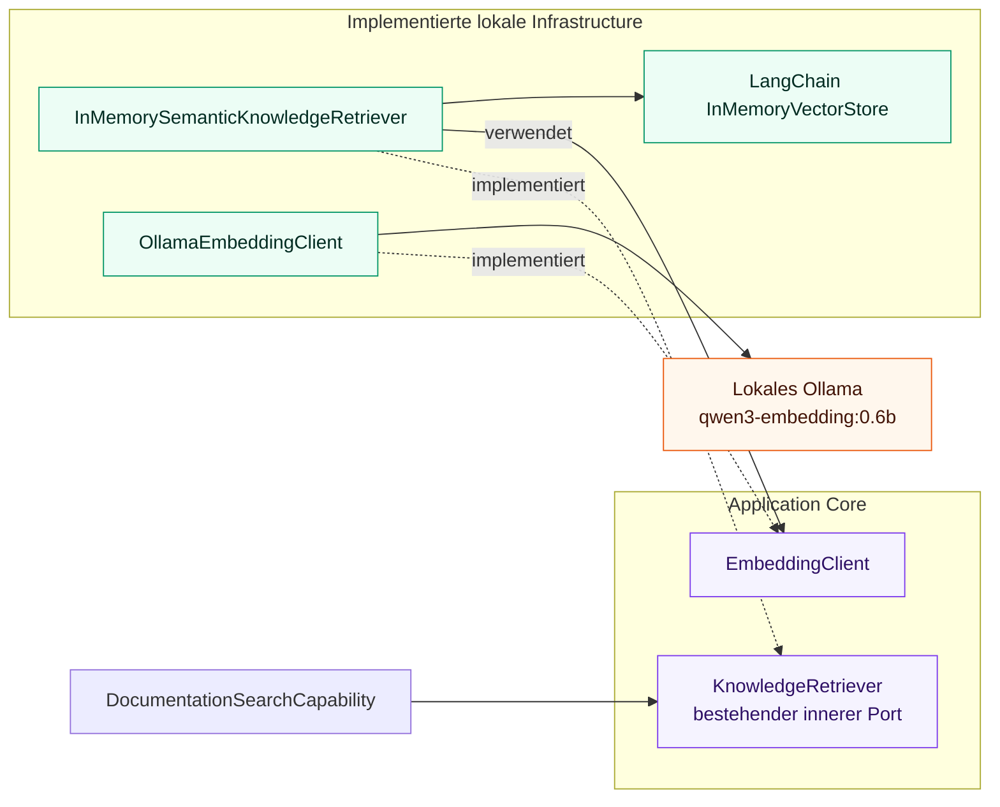

Das erste Modell und der In-Memory-Index sind Implementierungsbaselines, keine
langlebigen Provider- oder Vector-Store-Festlegungen. Dimension, persistenter Storage,
Hybrid Fusion, Reranking und Embedding Routing bleiben offen. Siehe
[ADR-007](../decisions/ADR-007-embedding-model-abstraction.de.md).

### Breitere Zielrichtung

Mögliche spätere Stufen sind:

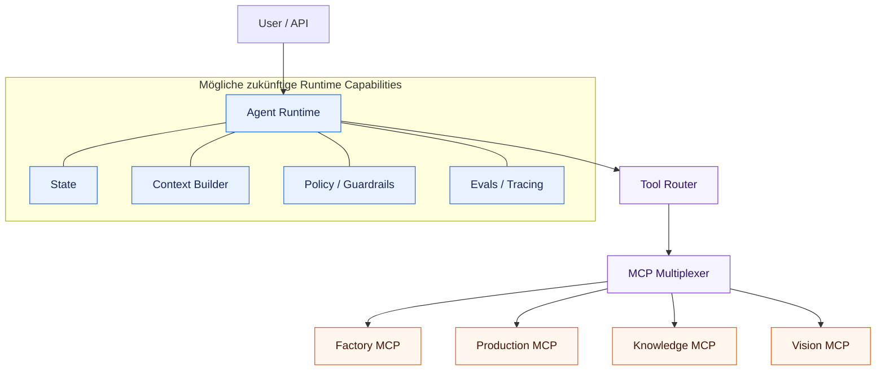

Dies ist eine Zielrichtung und nicht die aktuelle Implementierung.

Model Profiles wie `vision`, `planning` oder `evaluation` können über Konfiguration
ergänzt werden, sobald ihre Capabilities implementiert werden. Ein nicht
OpenAI-kompatibler Provider benötigt einen weiteren Infrastructure Adapter hinter
demselben `LLMClient`-Port; die Providerwahl bleibt ein Ergebnis semantischer
Profile-Metadata und des deterministischen Task Routings statt providerspezifischer
Agentenlogik. Die Entscheidung und ihre Trade-offs beschreibt
[ADR-002](../decisions/ADR-002-provider-and-model-independent-llm-architecture.de.md).
