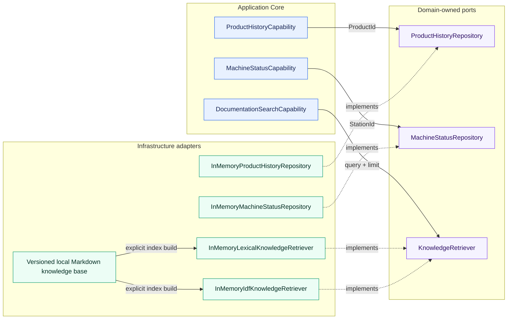
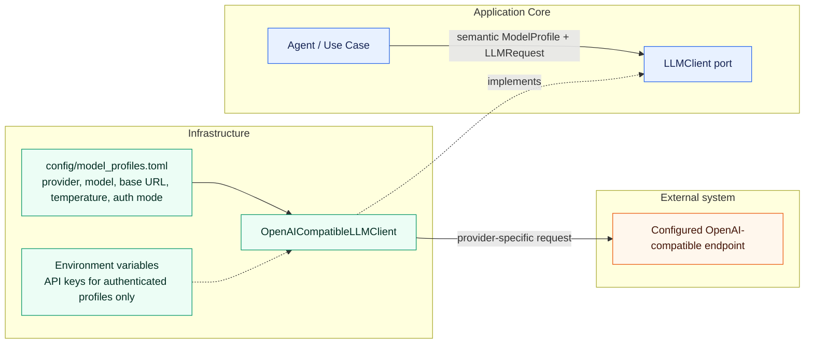
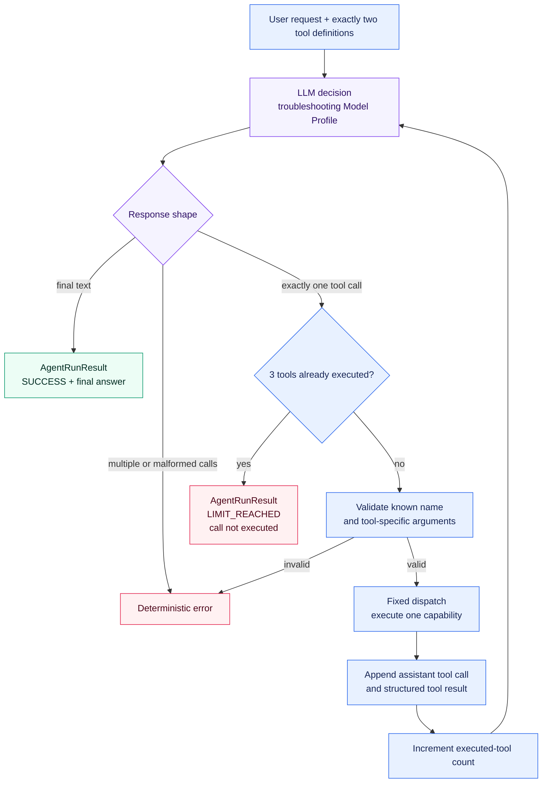
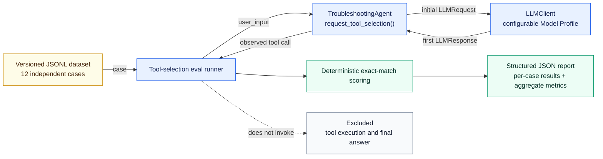
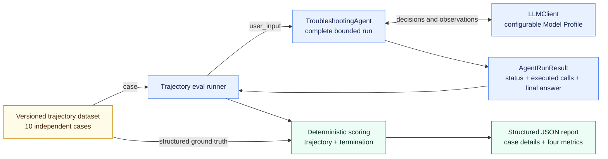
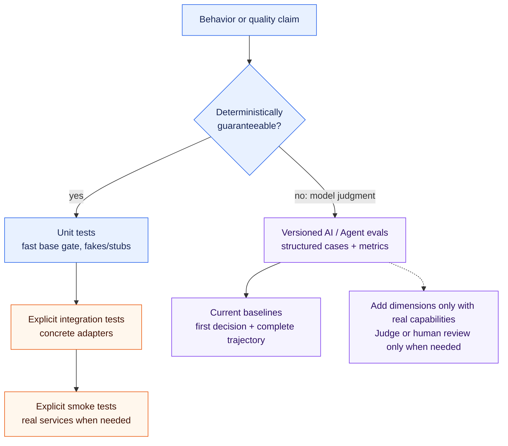
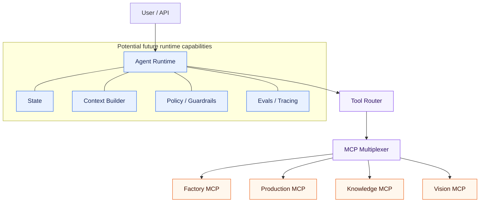

# Architecture Overview

## Current Architecture

The project currently implements product-history retrieval, current machine-status
retrieval, a provider-independent LLM integration boundary, and an explicit bounded
single-agent loop over two tools. Focused deterministic baselines evaluate the first
LLM tool decision and complete bounded trajectories. Two isolated local lexical
knowledge-retrieval strategies are implemented behind one inner port but are not yet
integrated into the agent.
There is no agent framework, dynamic tool registry, persistent agent memory, or general
evaluation framework.

The implemented request flow is:

Each capability converts its string identifier into the appropriate Domain Value
Object, loads through a domain-owned repository abstraction, and returns a structured
result. The deterministic demo data includes product `P4711` and stations `S04` and
`S12`.

`DocumentationSearchCapability` receives `KnowledgeRetriever` through dependency
injection and returns structured passages. The current adapter loads the local Markdown
knowledge base once during explicit construction; request-time searches use its
prepared in-memory index.

Distributed services and AI frameworks are deliberately not part of this slice.

## Knowledge Retrieval Baseline

The versioned knowledge base contains `station_s04.md`, `error_codes.md`, and
`maintenance.md`. The explicit ingestion step normalizes each file and creates one
chunk per Markdown heading section. Unchanged document names and heading order produce
stable IDs such as `error_codes::chunk-002`.

```mermaid
flowchart LR
    Docs["3 versioned Markdown documents"] --> Load["Explicit load and normalization"]
    Load --> Chunk["Heading-section chunks<br/>stable positional IDs"]
    Chunk --> Index["In-memory token indexes"]
    Query["search_documentation(query)"] --> Port["KnowledgeRetriever port"]
    Port --> Simple["Simple term-overlap ranking<br/>top 3"]
    Port --> IDFSearch["Rarity-aware IDF ranking<br/>top 3"]
    Index --> Simple
    Index --> IDFSearch
    Simple --> Results["Structured results<br/>content + provenance + score"]
    IDFSearch --> Results
    Results --> Query

    classDef data fill:#fefce8,stroke:#ca8a04,color:#422006
    classDef core fill:#e8f1ff,stroke:#2563eb,color:#172554
    classDef adapter fill:#ecfdf5,stroke:#059669,color:#022c22
    class Docs,Load,Chunk data
    class Query,Port,Results core
    class Index,Simple,IDFSearch adapter
```

The tokenizer case-folds alphanumeric and hyphenated terms so exact industrial
identifiers remain intact. The simple adapter scores the fraction of distinct query
terms found in each chunk. The second adapter weights matching terms with a smoothed
inverse chunk frequency before normalizing by total query weight. Both omit zero-score
chunks and resolve ties by `chunk_id`; neither is BM25. Source path, document ID, chunk
ID, section metadata, and score remain attached to every result.

The focused retrieval eval is separate from the agent evals. Its ten versioned cases
measure Hit@1, Hit@3, and Mean Recall@3 using structured relevant-chunk ground truth.
The same unchanged dataset compares both strategies. Agent query formulation and
final-answer grounding are outside this slice.

The implemented LLM boundary is:

`config/model_profiles.toml` currently maps `troubleshooting` to Ollama,
`qwen3.5:9b`, `http://localhost:11434/v1`, and temperature `0`. This is the first local
configuration, not a commitment to that provider or model. The profile mapping can be
changed without changing agent or use-case code.

The implemented tool-calling flow is:

The LLM chooses whether to request `get_product_history`, request
`get_machine_status`, or answer directly, and it formulates the final answer.
Deterministic Python code validates one selected call per response, validates the
tool-specific `product_id` or `station_id`, uses a fixed dispatch, serializes each
structured result, and keeps the complete current-run message context. Both tools remain
available at every decision step.

`MAX_TOOL_CALLS = 3` counts successfully executed tools rather than LLM requests. After
the third observation, exactly one final LLM decision is allowed. Final text returns
`SUCCESS`; another requested call returns `LIMIT_REACHED`, is not executed, and causes
no further LLM request. Unknown tools, invalid arguments, and multiple calls in one
response remain deterministic failures.

## Tool Selection Evaluation Baseline

The repository-local eval measures only the first decision exposed by
`TroubleshootingAgent.request_tool_selection()`. Each versioned JSONL case starts with a
fresh message context. The runner uses a configurable semantic Model Profile and passes
the provider-independent `LLMResponse` to deterministic exact-match scoring.

Tool Selection Accuracy requires exactly one call with the expected name. Argument
Accuracy additionally requires exact argument equality and therefore gives no argument
credit to a wrong tool. The baseline does not evaluate tool results, final-answer
quality, latency, cost, or LLM-as-a-Judge quality.

## Trajectory Evaluation Baseline

The complementary trajectory eval executes the complete agent for every independent
versioned case. `AgentRunResult` exposes normalized executed calls without provider
types or call IDs. Deterministic scoring compares this actual trajectory and the final
run status with structured ground truth. The natural-language final answer is recorded
but excluded from scoring.

Task Success requires both exact trajectory equality and the expected termination
status. Exact Trajectory Accuracy measures full-sequence equality, Tool Call Accuracy
scores exact positional call slots while penalizing missing and additional calls, and
Termination Accuracy measures status equality. Per-case expected and actual call counts
make over-calling and under-calling visible.

## Quality Strategy

[ADR-005](../decisions/ADR-005-testing-and-evaluation-strategy.md) separates quality
mechanisms by the kind of claim they support. Deterministic guarantees belong in
automated tests. Model-dependent judgment is measured with versioned datasets,
structured ground truth, and explicit metrics. Smoke tests verify basic live
integration, while traces and operational metrics serve observability rather than
replacing tests or evals.

The current repository implements deterministic unit coverage, explicitly documented
local Ollama smoke paths, the focused first-decision tool-selection eval, and the
complete bounded-trajectory eval. It does not implement an external eval framework,
LLM-as-a-Judge, an observability platform, or new CI/CD infrastructure. Generated eval
reports remain unversioned by default.

## Package Responsibilities

### `domain`

Contains industrial domain models and rules.

The current slices define `ProductId`, the shared `StationId`, `ProductionStep`,
`ProductionStepStatus`, `ProductHistory`, `MachineState`, `MachineStatus`, and
`KnowledgeRetrievalResult`. The inner ports are `ProductHistoryRepository`,
`MachineStatusRepository`, and `KnowledgeRetriever`.

Must remain independent from:

* LLM SDKs
* MCP
* databases
* HTTP frameworks
* vendor-specific infrastructure

### `tools`

Contains agent-facing capabilities.

Tools should expose meaningful domain operations rather than low-level implementation details.

The current capabilities are
`ProductHistoryCapability.get_product_history(product_id)` and
`MachineStatusCapability.get_machine_status(station_id)`. They return Pydantic
`ProductHistoryResult` and `MachineStatusResult` models, including structured not-found
results. The isolated
`DocumentationSearchCapability.search_documentation(query)` returns structured
`DocumentationSearchResult` data and is not yet offered as an agent tool.

### `agent`

Contains provider-independent LLM contracts and agent orchestration logic.

The current implementation defines `LLMClient`, semantic `ModelProfile` selection,
small request and response models, and `TroubleshootingAgent`. The agent contains the
explicit bounded sequential loop and fixed two-tool dispatch. `AgentRunResult`
distinguishes `SUCCESS` from `LIMIT_REACHED` and reports both the executed-tool count
and the normalized executed trajectory. The agent does not import the OpenAI SDK or
name a concrete provider or model.

Possible later responsibilities include:

* persistent agent state
* context compression
* richer routing
* policy and guardrail integration

### `infrastructure`

Contains technical integrations and external implementations.

The current implementations are `InMemoryProductHistoryRepository` and
`InMemoryMachineStatusRepository`, which provide small deterministic demo data sets,
`InMemoryLexicalKnowledgeRetriever` and `InMemoryIdfKnowledgeRetriever`, which search
prebuilt local token indexes with different scoring formulas, and
`OpenAICompatibleLLMClient`, which translates the provider-independent LLM contract to
an OpenAI-compatible Chat Completions API.

Normal model settings and secret values are separate. Configuration explicitly marks a
profile as unauthenticated or API-key authenticated. An authenticated profile stores
only the name of the required environment variable; its credential value remains in
the environment. The initial local Ollama profile is unauthenticated and requires no
user-configured API key. The adapter encapsulates the non-secret technical placeholder
required by the OpenAI SDK.

Examples may later include:

* additional LLM provider adapters when concrete requirements justify them
* repositories
* databases
* MCP clients
* observability
* external APIs

### `evals`

Contains separate versioned datasets and focused manual runners for first-decision tool
selection, complete bounded trajectories, and isolated retrieval quality. Parsing,
per-case scoring, and aggregation are deterministic and covered by unit tests without a
live LLM. Generated JSON reports belong under the Git-ignored `evals/results/`
directory unless deliberately curated.

## Evolution

The architecture should evolve only when required by implemented capabilities.

### Retrieval Evolution

The lexical baselines may later be compared with BM25-like, embedding, hybrid, or
reranked retrieval. New ports, storage adapters, model roles, and dependencies are
introduced only when retrieval evaluations demonstrate a concrete need. The retrieval
core remains independent from a later Knowledge MCP transport boundary as specified by
[ADR-006](../decisions/ADR-006-knowledge-retrieval-and-rag-architecture.md).

### Broader Target Direction

Possible later stages include:

This is a target direction, not the current implementation.

Model profiles such as `vision`, `planning`, or `evaluation` can be added through
configuration when their capabilities are implemented. A non-OpenAI-compatible
provider will require another infrastructure adapter behind the same `LLMClient` port;
no speculative multi-provider router exists today. See
[ADR-002](../decisions/ADR-002-provider-and-model-independent-llm-architecture.md) for
the decision and its tradeoffs.
