# Architecture Overview

## System Components and Control Boundaries

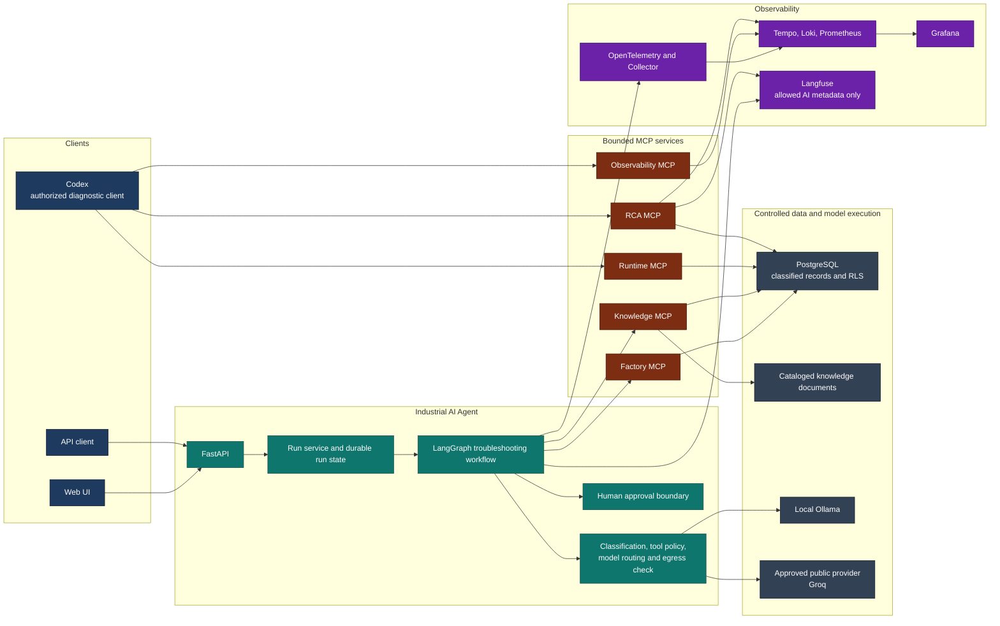

The Industrial AI Agent is the controlled application boundary: only it orchestrates
the troubleshooting workflow and selects the bounded Factory and Knowledge tools. The
other MCP services are independent, read-only diagnostic interfaces for authorized
clients; they are not agent tools. Server-side authorization and PostgreSQL RLS remain
between every MCP capability and classified data. The policy component, not the model,
decides eligible profiles and enforces the final data-to-model check. `RESTRICTED` data
can only use approved local profiles; a configured public profile can be eligible only
up to its approved maximum classification.

## Current Architecture

The local Compose deployment names its PostgreSQL service `factory-db`. In this
single-instance demo, `factory-mcp` waits for its health check, completes idempotent
Alembic migration and seed bootstrap before opening its MCP port, and `knowledge-mcp`
waits for the healthy Factory service. This avoids a partial document catalog without a
visible one-shot migration container; a production multi-replica deployment should use a
dedicated migration Job instead.

The project currently implements product-history retrieval, current machine-status
retrieval, a provider-independent LLM integration boundary, and one bounded
`LangGraphTroubleshootingAgent` path over runtime-discovered, allowlisted MCP tools. Its
sole write tool is `create_maintenance_ticket`; the graph exposes only a strict proposal
schema to the model, then pauses for human approval before the separate execution step.
Focused deterministic baselines evaluate the
first LLM tool decision and complete bounded trajectories through the LangGraph MCP path.
Local BM25, semantic, hybrid, and reranked knowledge-retrieval strategies are
implemented behind one inner port and are exposed to LangGraph only through
`knowledge_mcp`. A deterministic, deny-by-default model-egress decorator checks explicit
request classification against each Model Profile's validated Execution Zone before
invoking the provider adapter. LangGraph and LangChain Core are used narrowly for
orchestration. The runtime uses LangGraph's official PostgreSQL async checkpointer for
durable HITL checkpoints; `InMemorySaver` remains a focused unit-test fake. There is no
dynamic tool registry, LangSmith integration, or general evaluation framework.
Five MCP services expose bounded capabilities through the official MCP SDK v2.
`factory_mcp` provides product history, machine status, and the approval-gated
maintenance-ticket action; `knowledge_mcp` provides documentation search; and the
read-only `observability_mcp` provides safe RCA evidence over Tempo, Loki, and
Prometheus. The read-only `runtime_mcp` reports RLS-filtered persisted run facts only:
safe lifecycle metadata, tool trajectory, approval state, failure metadata, and bounded
recent runs. Runtime MCP never reads LangGraph checkpoint tables and has no write or
resume operation. The Industrial Agent discovers only Factory and Knowledge tools; it has no
runtime dependency on Runtime MCP or Observability MCP. All retain stdio for process-coupled development
and deterministic tests, and run as separate Streamable HTTP `/mcp` Docker services.
`LangGraphTroubleshootingAgent` opens one session per explicitly configured server,
discovers and authorizes tools through the temporary LangChain bridge, executes the
bounded sequential loop, then closes all sessions. Transport selection is made by an
outer Composition Root.

Runtime and Observability MCP are intentionally separate evidence sources:

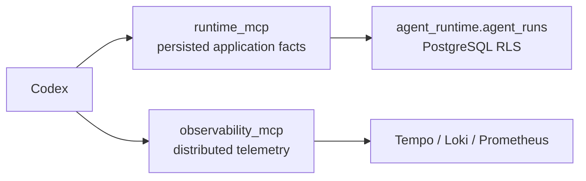

Codex or another consumer may correlate returned evidence by `run_id`; neither MCP
performs LLM reasoning, RCA orchestration, or cross-MCP calls.

`rca_mcp` is a separate read-only consumer-facing RCA composition, not a new agent
path. It directly wires `RcaAnalysisService` to the request-scoped RLS runtime adapter
and the existing bounded Tempo, Loki, Prometheus, and Langfuse adapters. The service
does not call Runtime MCP or Observability MCP and `agent-api` does not depend on it.
Its only tool, `analyze_run`, is guarded by the dedicated `READ_RCA` permission and
returns a stable bounded projection of one deterministic report. Codex should use it
first for general run analysis, reserving low-level Runtime or Observability tools for
focused follow-up.

## Automated RCA Foundation

Slices A and B implement provider-independent RCA contracts, evidence ports, a bounded
collector, deterministic analysis, and `RcaAnalysisService` in the Application layer.
The collector first obtains RLS-filtered runtime evidence through a request-scoped
`SecurityContext`; only then does it correlate Tempo evidence. It directly reuses
underlying Infrastructure services and does not call either MCP transport. An
inaccessible run fails closed; a runtime-store outage is a safe service failure. Tempo,
Loki, and Prometheus failures are independent, explicit source states and produce a
partial or insufficient report while retaining usable evidence.

`RcaEvidenceBundle`, `RcaFinding`, and `RcaAnalysisReport` contain only safe bounded
projections and report-local evidence references. The analyzer emits `OBSERVED` and
`DERIVED` findings only: terminal run failure, error spans, bounded MCP/retrieval
failures, repeated tool names, telemetry limitations, and non-overlapping timing shares.
There are no cause signatures, deterministic hypotheses, performance classifications, or
run comparison in the current implementation. Optional LLM explanation is a separate
post-analysis branch; it cannot create deterministic findings or confirmed causes.

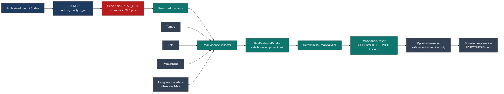

The reusable `RcaAnalysisService` remains independent of MCP transport. It serves RCA
MCP/Codex and may later serve an authenticated FastAPI/UI path. Runtime MCP and
Observability MCP remain evidence interfaces, not RCA reasoning services. The optional
Reasoner receives an explicit safe projection of an already authorized report, routes a
text-only task server-side, and uses the final ADR-009 egress guard before its existing
provider-independent `LLMClient` call. It returns a bounded explanation only; its
`HYPOTHESIS` entries are distinct from immutable deterministic findings. Routing,
provider, timeout, or parsing failure leaves the deterministic report usable. The
contracts expose no raw telemetry or application payloads; `run_id` and `trace_id` remain
correlation identifiers only.

ADR-014 adds persistent classified factory data. PostgreSQL is the source of truth for
structured factory records and document-catalog metadata. Local PDF, DOCX, PPTX, XLSX,
and image assets remain files and are normalized by local Docling ingestion only after
their catalog row passes clearance. Each classified row is protected by PostgreSQL RLS;
the non-superuser application role receives a parameterized transaction-local
`app.clearance` from the server-injected `SecurityContext`. The same `PUBLIC < INTERNAL
< CONFIDENTIAL < RESTRICTED` value propagates unchanged to parsed documents, chunks,
MCP results, and the LangGraph run's effective classification. It is separate from
subject authorization and from ADR-009 model egress eligibility.

ADR-015 adds an authenticated HTTP MCP client boundary. The transport adapter verifies a
local-demo opaque bearer token, resolves a server-owned identity to a request-specific
`SecurityContext` and immutable MCP permissions, and does not accept client-selected
identity, clearance, or permission headers. `industrial-agent` resolves to
`CONFIDENTIAL` with Factory/Knowledge/Observability/Runtime read and maintenance-ticket
permission;
`industrial-agent-internal` resolves to `INTERNAL` with Factory and Knowledge read-only
permissions; and
`codex-development` resolves to `INTERNAL` with Factory, Knowledge, Observability,
Runtime, and RCA read permissions. Tool filtering runs for both `tools/list` and
`tools/call`; it supplements, but
does not replace, LangGraph `ToolPolicy`, PostgreSQL RLS, ADR-009 egress checks, or the
approval interrupt. Knowledge performs catalog RLS filtering before parsing, indexing,
embedding, reranking, and result construction, and caches each retrieval pipeline by the
complete `SecurityContext` so a higher-clearance index cannot be reused for an INTERNAL
request.

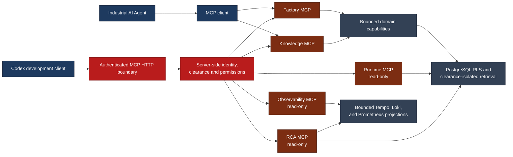

FastAPI now provides the local/demo external Application Boundary. Its versioned
`POST /api/v1/runs` free-form endpoint creates a UUID, records lifecycle state in the PostgreSQL
`agent_runtime` schema, and awaits an injected troubleshooting run service. That service creates
server-owned `CONFIDENTIAL_TROUBLESHOOTING` requirements, routes a semantic profile, and invokes
the existing LangGraph MCP path. Public Pydantic API contracts contain only the run ID,
status, final answer, and normalized tool calls; they do not expose LangGraph state,
LangChain messages, MCP types, prompts, or raw tool payloads. `GET /health` is
process-local liveness only, and `GET /api/v1/runs/{run_id}` reads the durable application
record. The separate static `frontend/` browser client communicates only with this public
HTTP/JSON API. The local API entry point permits only `http://localhost:8080` through
explicit CORS configuration; it does not serve frontend assets. The API has no CORS
wildcard, authentication, TLS, rate limiting, or streaming endpoint. Its explicit
`POST /api/v1/runs/{run_id}/resume` endpoint only accepts the strict `approve` or
`reject` decision contract for a persisted pending action.
Swagger UI at `/docs` remains the generated API contract explorer.

The browser clearance selector is deliberately a local-demo simulation of an already
authenticated user's clearance, not an authentication or authorization mechanism. A
production adapter must derive `SecurityContext` from a trusted server-side identity.
The selector never sets run classification, MCP identity or permissions, RLS clearance,
or model-egress eligibility. Unknown free text without a documented demo identifier is
conservatively resolved as `RESTRICTED_TROUBLESHOOTING`: unknown sensitivity never
authorizes public-cloud model processing.

Compose publishes host-facing demo and diagnostic ports only on `127.0.0.1`; services
communicating only within Compose, including the OTel Collector, have no host port.
Grafana anonymous local access is restricted to Viewer. `LOCAL_ONLY_MODE=true` removes
public-cloud profiles from routing; otherwise the Full Demo requires a valid public
provider credential for the configured `public_fast` profile.

`POST /api/v1/diagnostics` is the only INTERNAL run entry point. It accepts only
bounded product and station identifiers, verifies the required projections through an
INTERNAL RLS context, constructs its prompt server-side, and resolves
`INTERNAL_DIAGNOSTIC`. That profile uses the separate `industrial-agent-internal` MCP
identity and the three read-only Factory/Knowledge tools; it can neither discover nor
execute the maintenance-ticket action. Unavailable targets remain neutral and never
trigger a higher-clearance retry.

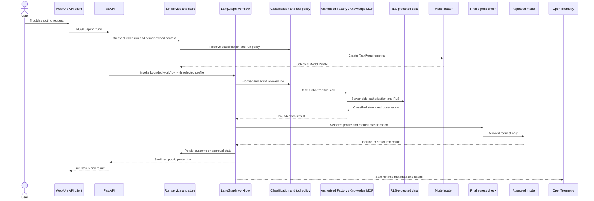

The sequence shows the normal read-oriented path. The implementation remains a bounded
loop: each model response can admit at most one tool call, and each run can execute at
most four tools. The final egress check is independent of selection, and observability
does not include prompts, responses, tool payloads, or production documents.

## Ports and Adapters View

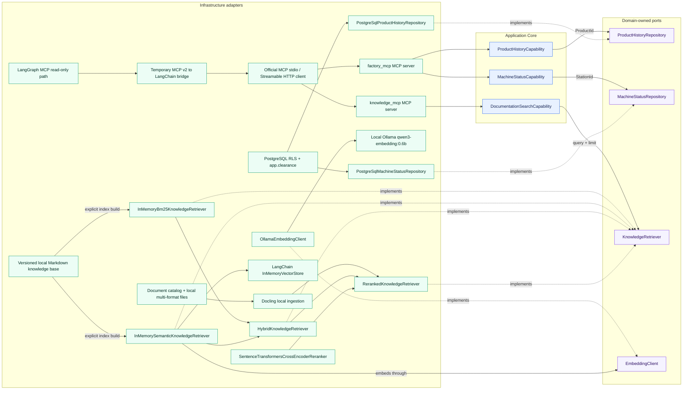

Each capability converts its string identifier into the appropriate Domain Value
Object, loads through a domain-owned repository abstraction, and returns a structured
result. The deterministic demo data includes product `P4711` and stations `S04` and
`S12`.

`DocumentationSearchCapability` receives `KnowledgeRetriever` through dependency
injection and returns structured passages. BM25, semantic, and hybrid adapters load the local
Markdown knowledge base once during explicit construction; request-time searches use
their prepared in-memory indexes. The semantic adapter receives the separate inner
`EmbeddingClient` port, builds document vectors in LangChain's `InMemoryVectorStore`,
and embeds only the query at runtime through local Ollama.

`factory_mcp` and `knowledge_mcp` are Infrastructure transport adapters, not sources of
factory or retrieval semantics. Factory delegates to its injected read and
maintenance-action capabilities;
Knowledge delegates `search_documentation(query, top_k=3)` to the existing
documentation-search capability. Its default composition is the frozen local pipeline:
BM25 plus semantic candidates, RRF, then `BAAI/bge-reranker-v2-m3`, preserving stable
chunk provenance as MCP structured content. stdio is process-coupled development/test
transport. Streamable HTTP is deployment transport: independent non-root Python 3.12
containers expose `/mcp` through Compose host ports `8001` and `8002`. Docker deploys
processes but neither implements nor replaces MCP. For one LangGraph run, the client
initializes and discovers each configured server once, rejects duplicate names, invokes
authorized tools sequentially, and closes each session after graph completion. The bridge
creates LangChain `StructuredTool` objects from discovered MCP schemas and has no business
logic. It is a **TEMPORARY COMPATIBILITY ADAPTER** until a stable
`langchain-mcp-adapters` release supports MCP SDK v2.

The MCP path does not replace ADR-009: every graph model call still goes through
`EgressCheckedLLMClient`. Local HTTP connections to factory and knowledge containers are
service transport, not permission to egress tool data to a public model. Knowledge MCP
uses local Ollama embeddings and a local Hugging Face cache for reranking; queries,
chunks, embeddings, and reranker inputs do not reach a public provider. The local Docker
demo uses distinct environment-only opaque bearer tokens for its two authenticated MCP
identities; remote or production exposure requires stronger identity, secret
distribution, TLS, and deployment isolation. The write tool remains fixed, strict, and
approval-gated; this slice does not add generalized multi-server routing or automatic
fallback.

## Knowledge Retrieval Baseline

The versioned knowledge base contains seven concise Markdown documents. The explicit
ingestion step normalizes each file and creates one chunk per Markdown heading section,
currently 25 chunks. Unchanged document names and heading order produce stable IDs such
as `error_codes::chunk-002`.

```mermaid
flowchart LR
    Query["Authorized documentation query"] --> MCP["Knowledge MCP"]
    MCP --> RLS["Catalog RLS and<br/>classification filter"]
    RLS --> Docs["Permitted cataloged documents"]
    Docs --> Chunk["Normalized heading chunks<br/>with stable provenance"]
    Chunk --> Lexical["BM25"]
    Chunk --> Semantic["Local semantic retrieval"]
    Lexical --> Fusion["RRF fusion"]
    Semantic --> Fusion
    Fusion --> Rerank["Local cross-encoder reranking"]
    Rerank --> Results["Bounded chunks and provenance"]
    Results --> Agent["Industrial AI Agent"]

    classDef entry fill:#1e3a5f,stroke:#0f172a,color:#ffffff
    classDef security fill:#b91c1c,stroke:#7f1d1d,color:#ffffff
    classDef data fill:#334155,stroke:#0f172a,color:#ffffff
    classDef processing fill:#0f766e,stroke:#134e4a,color:#ffffff
    class Query,MCP,Agent entry
    class RLS security
    class Docs,Chunk,Results data
    class Lexical,Semantic,Fusion,Rerank processing
```

The tokenizer case-folds alphanumeric and hyphenated terms so exact industrial
identifiers remain intact. BM25 adds saturated term frequency and chunk-length
normalization. The semantic adapter builds local vectors
through `EmbeddingClient` and LangChain's `InMemoryVectorStore`. The hybrid adapter
composes BM25 and semantic rankings with equal-weight Reciprocal Rank Fusion using fixed
rank constant `60`; it never adds their incomparable raw scores. BM25 omits zero-score
chunks and resolves ties by `chunk_id`; hybrid resolves equal fused scores
the same way. Source path, document ID, chunk ID, section metadata, and score remain
attached to every result.

The focused retrieval eval is separate from the agent evals. Its 28 frozen v2 cases
measure Hit@1, Hit@3, and Mean Recall@3 using structured relevant-chunk ground truth.
The same unchanged dataset compares the four current strategies. Historical simple and
IDF results remain documentation only. Agent query formulation and
final-answer grounding are outside this slice.

The implemented LLM boundary includes deterministic task-level profile selection and a
separate final egress check:

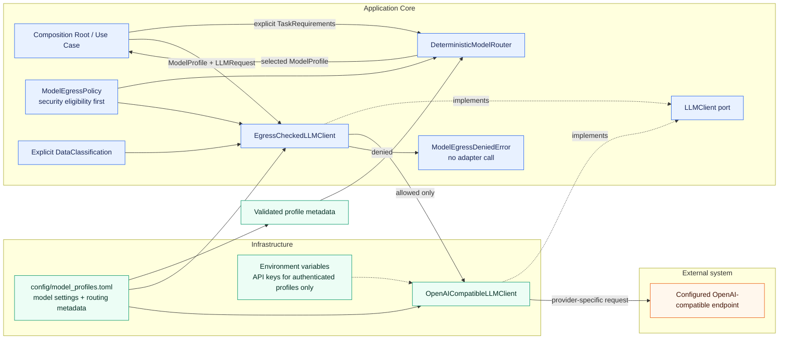

`config/model_profiles.toml` assigns every profile explicit, validated capabilities,
quality and relative cost classes, and an Execution Zone independent from its provider.
`local_fast` and `local_quality` use `LOCAL`; `public_fast` uses
`PUBLIC_CLOUD`. A caller creates `TaskRequirements`; the router applies the existing
egress policy before capability, minimum-quality, and cost/quality ordering. Callers
also supply the request classification to the controlled client for the independent
final check. The current policy allows all four classifications locally and allows
`PUBLIC`, `INTERNAL`, and `CONFIDENTIAL` data in `PUBLIC_CLOUD` only when the
selected profile permits that classification. `RESTRICTED` data remains local.
Missing or unknown classifications, zones, or routing metadata fail closed without an
adapter call.

The implemented tool-calling flow is:

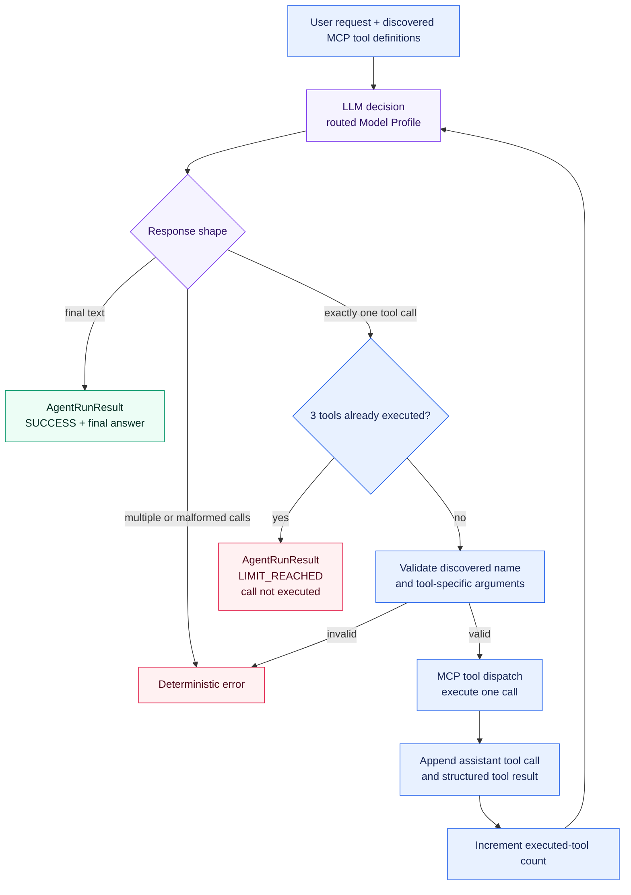

The LLM chooses one discovered tool or answers directly. Deterministic Python code
validates one selected call per response, validates the discovered tool schema,
dispatches through the opened MCP session, serializes each structured result, and keeps
the complete current-run message context. The authorized Factory and Knowledge tools
remain available at every decision step.

`MAX_TOOL_CALLS = 4` counts successfully executed tools rather than LLM requests. After
the fourth observation, exactly one final LLM decision is allowed. Final text returns
`SUCCESS`; another requested call returns `LIMIT_REACHED`, is not executed, and causes
no further LLM request. Unknown tools and invalid arguments remain deterministic
failures. If a provider returns multiple calls in one response, only the first is
admitted to the checkpointed sequential dispatch; every other call is discarded.

The LangGraph MCP path preserves that behavior in an explicit graph:

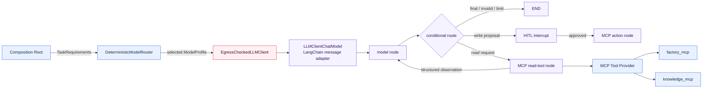

`TroubleshootingGraphState` holds LangChain messages, the executed-tool count,
normalized executed calls, run status, final answer, a pending action, approval result,
and minimal bound run context. A custom tool node adapts discovered MCP contracts to
LangChain `StructuredTool` contracts. This keeps argument validation and sequential
one-call dispatch explicit instead of adopting a framework default that could change
ADR-004 behavior. The Graph does not select a model: the Composition Root injects an
already routed profile and a client whose final ADR-009 egress check remains active.

For the resumable write path, the graph is compiled with LangGraph's official
`AsyncPostgresSaver` and invoked
with `configurable.thread_id`. The approval node emits a JSON-serializable
`action_approval` interrupt and resumes through `Command(resume="approve" | "reject")`
using the same thread ID. `create_maintenance_ticket` is prepared before the interrupt,
executes through Factory MCP only after approval, and uses its tool-call ID as a
server-derived idempotency key. Nodes before an
interrupt remain side-effect-free because LangGraph restarts the node from its beginning
on resume. The checkpoint schema is framework-owned; application lifecycle records stay
in `agent_runtime.agent_runs`. Both preserve their distinct responsibilities under
[ADR-011](../decisions/ADR-011-agent-persistence-and-human-in-the-loop.md).

## Distributed MCP Observability

ADR-016 now completes the implemented observability path across the existing Streamable
HTTP MCP boundary. The API MCP client injects standard W3C `traceparent` and `tracestate`
per HTTP request after removing caller-supplied trace and baggage headers; the public MCP
ASGI boundary extracts trace context only before dispatch. The stable resources are
`industrial-ai-agent`, `factory-mcp`, and `knowledge-mcp`, and trace headers never
participate in ADR-015 identity, clearance, or permission resolution.
Factory owns `factory.tool`; Knowledge owns `knowledge.search` and the bounded
`retrieval.search`, `retrieval.embedding`, `retrieval.lexical`, `retrieval.semantic`,
`retrieval.fusion`, and `retrieval.rerank` stage spans. Prompts, tool arguments/results, document content,
and security headers are excluded from these spans, logs, and metric labels.

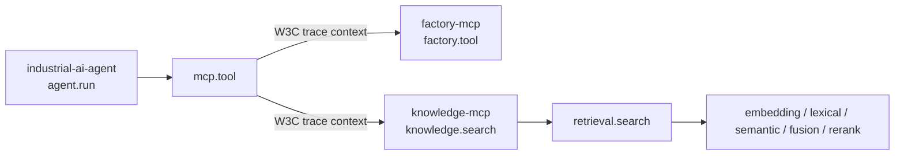

## Tool Selection Evaluation Baseline

The repository-local eval measures only the first decision exposed by the LangGraph MCP
path. Each versioned JSONL case starts with a
fresh message context. The runner uses a configurable semantic Model Profile and passes
the provider-independent `LLMResponse` to deterministic exact-match scoring.

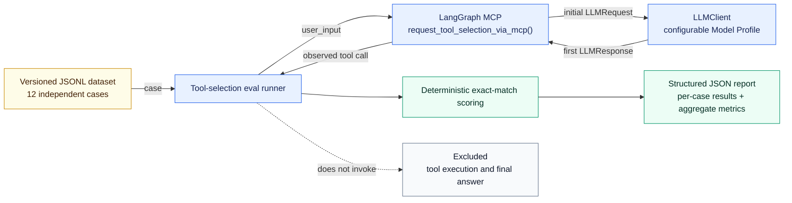

Tool Selection Accuracy requires exactly one call with the expected name. Argument
Accuracy additionally requires exact argument equality and therefore gives no argument
credit to a wrong tool. The baseline does not evaluate tool results, final-answer
quality, latency, cost, or LLM-as-a-Judge quality.

## Trajectory Evaluation Baseline

The complementary trajectory eval executes the complete agent for every independent
versioned case. `AgentRunResult` exposes normalized executed calls without provider
types or call IDs. Deterministic scoring compares this actual trajectory and the final
run status with structured ground truth. The natural-language final answer is recorded
but excluded from scoring.

Task Success requires both exact trajectory equality and the expected termination
status. Exact Trajectory Accuracy measures full-sequence equality, Tool Call Accuracy
scores exact positional call slots while penalizing missing and additional calls, and
Termination Accuracy measures status equality. Per-case expected and actual call counts
make over-calling and under-calling visible.

## Quality Strategy

[ADR-005](../decisions/ADR-005-testing-and-evaluation-strategy.md) separates quality
mechanisms by the kind of claim they support. Deterministic guarantees belong in
automated tests. Model-dependent judgment is measured with versioned datasets,
structured ground truth, and explicit metrics. Smoke tests verify basic live
integration, while traces and operational metrics serve observability rather than
replacing tests or evals.

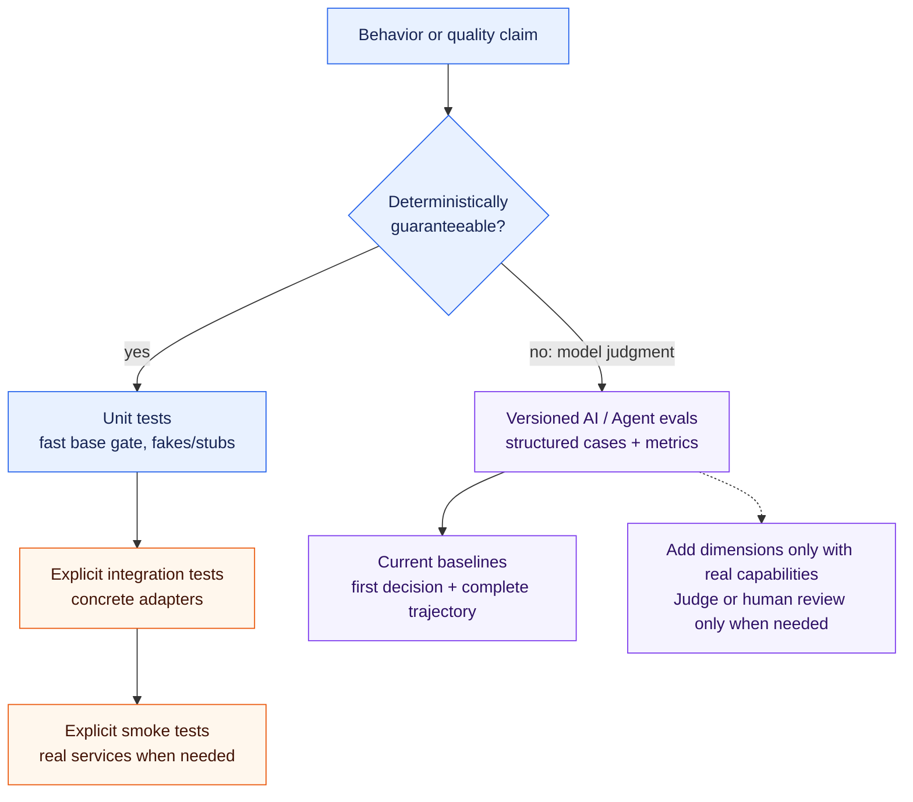

The current repository implements deterministic unit coverage, explicitly documented
local Ollama smoke paths, the focused first-decision tool-selection eval, the complete
bounded-trajectory eval, and metadata-only Langfuse LLM/agent observability. It does not
implement an external eval framework, LLM-as-a-Judge, or new CI/CD infrastructure.
Generated eval reports remain unversioned by default.

## Package Responsibilities

### `domain`

Contains industrial domain models and rules.

The current slices define `ProductId`, the shared `StationId`, `ProductionStep`,
`ProductionStepStatus`, `ProductHistory`, `MachineState`, `MachineStatus`, and
`KnowledgeRetrievalResult`. The inner ports are `ProductHistoryRepository`,
`MachineStatusRepository`, `FactoryDiscoveryRepository`, `KnowledgeRetriever`, and `EmbeddingClient`. The HITL demonstration additionally
defines `MaintenanceTicketRequestId` and `MaintenanceTicket` plus the
`MaintenanceTicketRepository` inner port.

Must remain independent from:

* LLM SDKs
* MCP
* databases
* HTTP frameworks
* vendor-specific infrastructure

### `tools`

Contains agent-facing capabilities.

Tools should expose meaningful domain operations rather than low-level implementation details.

The current capabilities are
`FactoryDiscoveryCapability.list_stations()`,
`FactoryDiscoveryCapability.get_station_overview(station_id)`,
`FactoryDiscoveryCapability.list_products()`, and
`FactoryDiscoveryCapability.get_product_overview(product_id)`. Its PostgreSQL adapter
constructs only RLS-visible projections and never returns hidden counts. The existing
`ProductHistoryCapability.get_product_history(product_id)` and
`MachineStatusCapability.get_machine_status(station_id)`. They return Pydantic
`ProductHistoryResult` and `MachineStatusResult` models, including structured not-found
results. The isolated
`DocumentationSearchCapability.search_documentation(query, top_k=3)` returns structured
`DocumentationSearchResult` data. LangGraph receives it only through discovered and
authorized `knowledge_mcp` tools, never through direct retriever injection.
`MaintenanceTicketCapability.create_maintenance_ticket(...)` is exposed only through
the fixed Factory MCP action contract. Its deterministic approval boundary executes it
only after explicit approval.

### `agent`

Contains provider-independent LLM contracts and agent orchestration logic.

The current implementation defines `LLMClient`, semantic `ModelProfile` selection,
small request and response models, `LangGraphTroubleshootingAgent`, and project-owned
run-result contracts. It also provides explicit
`TaskRequirements`, validated routing metadata, and `DeterministicModelRouter`. The
router reuses `ModelEgressPolicy`, filters by required capabilities and minimum quality,
and then applies a stable cost/quality ordering. The agent preserves the bounded
sequential loop over discovered MCP tools. `AgentRunResult` distinguishes `SUCCESS`
from `LIMIT_REACHED` and reports both the executed-tool count and the normalized executed
trajectory. The agent does not construct the router, import the OpenAI SDK, or name a
concrete provider or model. Its optional HITL composition persists an already selected
profile and explicit run classification in checkpointed graph state; resume rejects a
mismatched profile or classification rather than rerouting.

Possible later responsibilities include:

* context compression

### `infrastructure`

Contains technical integrations and external implementations.

The current implementations are `InMemoryProductHistoryRepository` and
`InMemoryMachineStatusRepository`, which provide small deterministic test data sets,
`InMemoryBm25KnowledgeRetriever`, which searches a prebuilt local token index,
`InMemorySemanticKnowledgeRetriever`, which maps LangChain
`InMemoryVectorStore` matches back to original chunk provenance through `EmbeddingClient`,
`HybridKnowledgeRetriever`, which rank-fuses the existing BM25 and semantic retrievers,
`RerankedKnowledgeRetriever`, which applies a bounded local cross-encoder stage, and
`OllamaEmbeddingClient`, which confines the baseline embedding model to local Ollama,
and
`OpenAICompatibleLLMClient`, which translates the provider-independent LLM contract to
an OpenAI-compatible Chat Completions API. `LLMClientChatModel` is the narrow
Infrastructure adapter between LangChain messages/tools and the existing `LLMClient`;
it does not construct providers or duplicate profile and security configuration.
`ObservedLLMClient` captures only provider-reported token usage and allowlisted LLM
metadata into the existing OTel trace and its strictly filtered Langfuse processor.
`InMemoryMaintenanceTicketRepository` is a deterministic test fake for the Factory-MCP
maintenance-ticket capability; it is not an external ticketing integration.

Normal model settings and secret values are separate. Configuration explicitly marks a
profile as unauthenticated or API-key authenticated. An authenticated profile stores
only the name of the required environment variable; its credential value remains in
the environment. The initial local Ollama profile is unauthenticated and requires no
user-configured API key. The adapter encapsulates the non-secret technical placeholder
required by the OpenAI SDK.

Examples may later include:

* additional LLM provider adapters when concrete requirements justify them
* repositories
* databases
* MCP clients
* observability
* external APIs

### `evals`

Contains separate versioned datasets and focused runners for first-decision tool
selection, complete bounded trajectories, and isolated retrieval quality. Agent eval
runners explicitly select `manual` or `langgraph` while keeping datasets and scoring
unchanged. Parsing, per-case scoring, and aggregation are deterministic and covered by unit tests without a
live LLM. Generated JSON reports belong under the Git-ignored `evals/results/`
directory unless deliberately curated.

## Evolution

The architecture should evolve only when required by implemented capabilities.

### Task-Level Model Routing and Model Egress

Task-level routing and final data-egress enforcement are implemented as separate inner
responsibilities. Explicit `TaskRequirements` carry task role, required capabilities,
minimum quality, cost preference, and data classification. The router first applies the
ADR-009 policy as a security eligibility filter, then capability and quality filters,
and only then its deterministic cost/quality preference and profile-ID tie-breaker. The
independent `EgressCheckedLLMClient` repeats the ADR-009 check immediately before the
provider adapter. Application-state classification propagation remains planned.

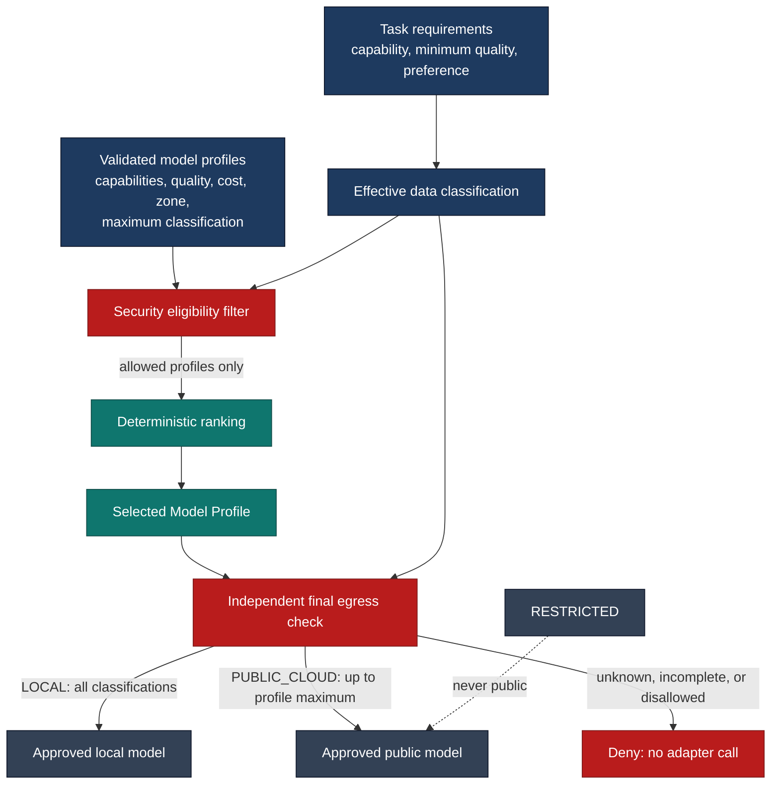

`MINIMIZE_COST` orders by lower relative cost and then the smallest sufficient quality;
`BALANCED` orders by lower cost and then higher quality; `PREFER_QUALITY` orders by
higher quality and then lower cost. Every tie ends with the lexical profile ID, so input
order cannot affect selection. No fallback or adaptive selection is implemented. If no
allowed and suitable profile is available, the router raises `NoEligibleModelError`.
Cost and quality preferences cannot override the security filter. See
[ADR-008](../decisions/ADR-008-task-level-model-routing.md) and
[ADR-009](../decisions/ADR-009-data-classification-and-model-egress-policy.md).

### Retrieval Evolution

The lexical baselines and the first semantic baseline are now also compared with a
fixed rank-fusion hybrid baseline and a bounded local cross-encoder reranking stage. The retrieval
core remains independent from the Knowledge MCP transport boundary as specified by
[ADR-006](../decisions/ADR-006-knowledge-retrieval-and-rag-architecture.md). Embeddings
remain a separate model role from `LLMClient`; the focused `EmbeddingClient` port is in
the Core, while provider adapters and model configuration remain in Infrastructure.

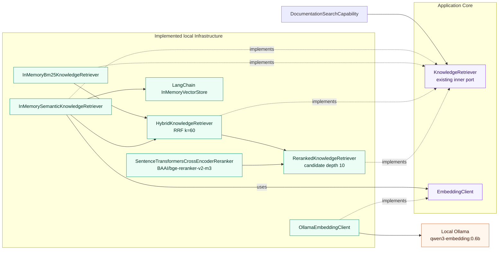

The first model and in-memory index are implementation baselines, not durable provider
or vector-store commitments. RRF is a fixed comparison baseline rather than a general
fusion technology decision. The first reranker and its model are baseline configuration,
not a permanent provider or model decision. Dimension, persistent storage, additional
reranking, and embedding routing remain open. See
[ADR-007](../decisions/ADR-007-embedding-model-abstraction.md).

### Broader Target Direction

Possible later stages include:

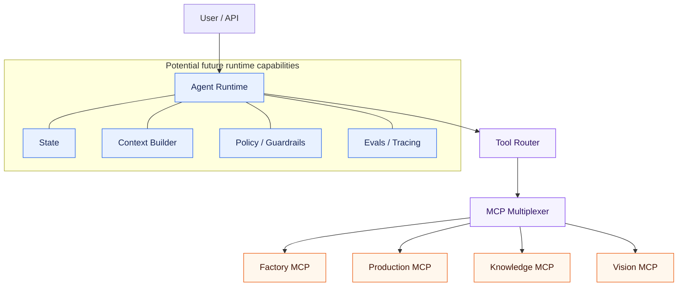

This is a target direction, not the current implementation.

Model profiles such as `vision`, `planning`, or `evaluation` can be added through
configuration when their capabilities are implemented. A non-OpenAI-compatible
provider will require another infrastructure adapter behind the same `LLMClient` port;
provider choice remains an outcome of semantic profile metadata and deterministic task
routing rather than provider-specific agent logic. See
[ADR-002](../decisions/ADR-002-provider-and-model-independent-llm-architecture.md) for
the decision and its tradeoffs.

## Persistent HITL Run

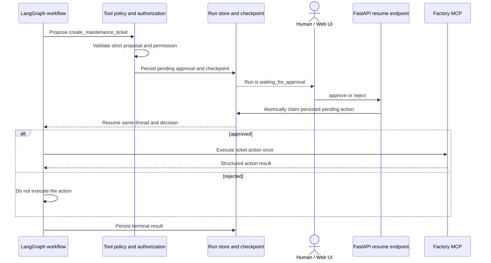

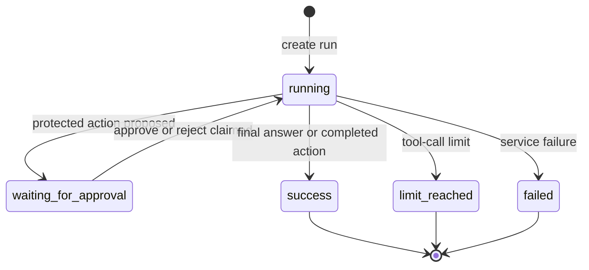

The public run record persists lifecycle and approval data; official LangGraph
checkpoints remain framework-managed. The process does not keep a Python thread blocked
while waiting. Factory MCP owns the cohesive maintenance action and its request-ID unique
constraint; the action node is reached only after an approved resume.
