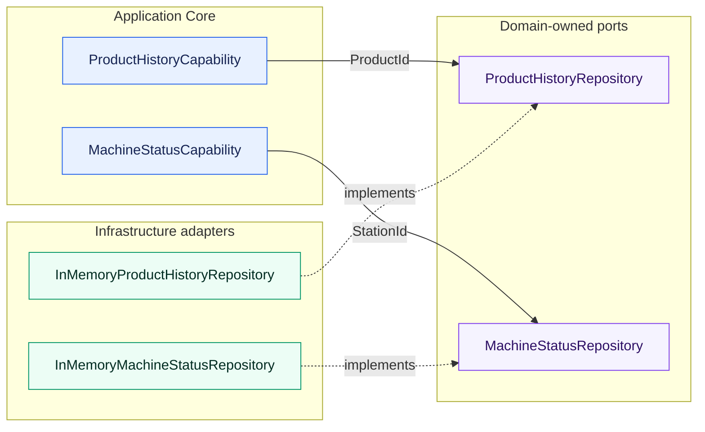
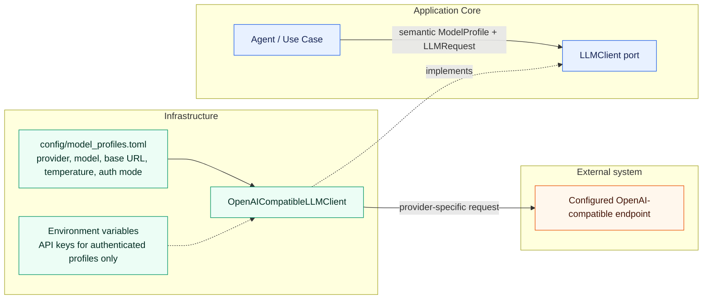
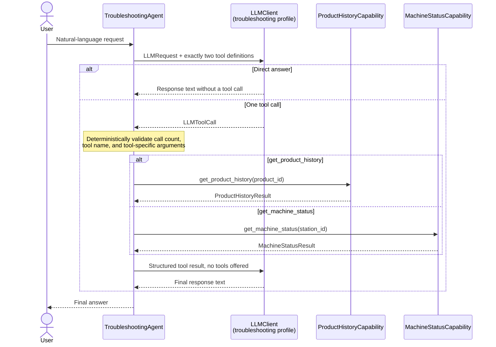
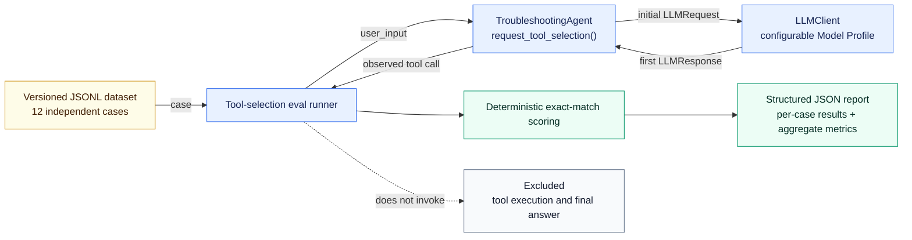
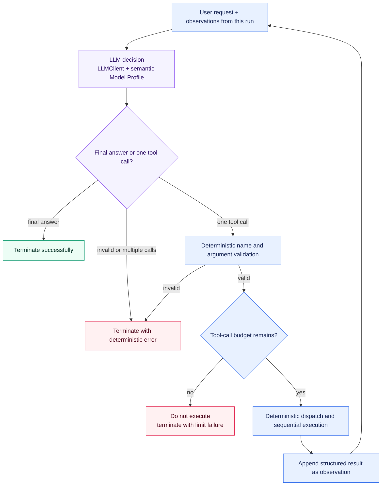
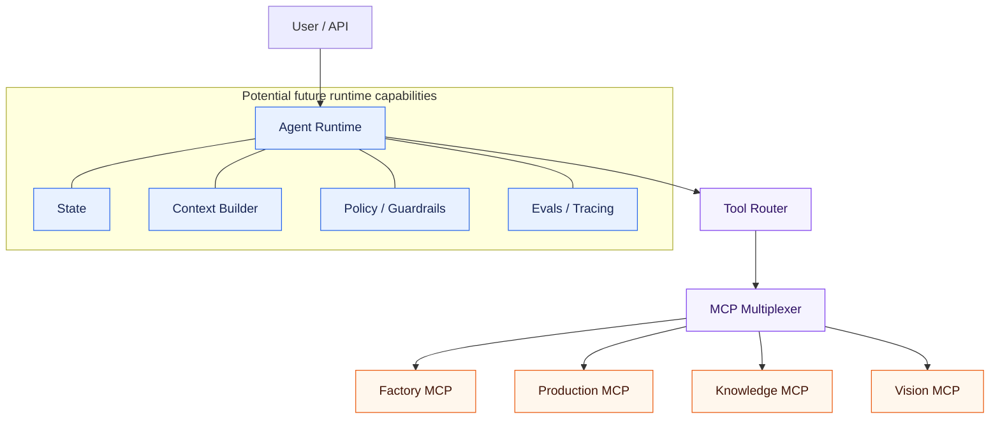

# Architecture Overview

## Current Architecture

The project currently implements product-history retrieval, current machine-status
retrieval, a provider-independent LLM integration boundary, and one bounded
two-tool-selection slice. A small deterministic baseline evaluates the first LLM tool
decision. There is no general agent, ReAct loop, or evaluation framework.

The implemented request flow is:

Each capability converts its string identifier into the appropriate Domain Value
Object, loads through a domain-owned repository abstraction, and returns a structured
result. The deterministic demo data includes product `P4711` and stations `S04` and
`S12`.

Distributed services and AI frameworks are deliberately not part of this slice.

The implemented LLM boundary is:

`config/model_profiles.toml` currently maps `troubleshooting` to Ollama,
`qwen3.5:9b`, `http://localhost:11434/v1`, and temperature `0`. This is the first local
configuration, not a commitment to that provider or model. The profile mapping can be
changed without changing agent or use-case code.

The implemented tool-calling flow is:

The LLM chooses whether to request `get_product_history`, request
`get_machine_status`, or answer directly, and it formulates the final answer.
Deterministic Python code validates the selected name against those two known tools,
validates the tool-specific `product_id` or `station_id`, rejects more than one tool
call, uses a fixed dispatch to the corresponding capability, and serializes its
structured result. After one tool call, no tools are offered to the final LLM request;
a further returned tool call is rejected rather than starting a loop.

## Tool Selection Evaluation Baseline

The repository-local eval measures only the first decision exposed by
`TroubleshootingAgent.request_tool_selection()`. Each versioned JSONL case starts with a
fresh message context. The runner uses a configurable semantic Model Profile and passes
the provider-independent `LLMResponse` to deterministic exact-match scoring.

Tool Selection Accuracy requires exactly one call with the expected name. Argument
Accuracy additionally requires exact argument equality and therefore gives no argument
credit to a wrong tool. The baseline does not evaluate tool results, final-answer
quality, latency, cost, or LLM-as-a-Judge quality.

## Quality Strategy

[ADR-005](../decisions/ADR-005-testing-and-evaluation-strategy.md) separates quality
mechanisms by the kind of claim they support. Deterministic guarantees belong in
automated tests. Model-dependent judgment is measured with versioned datasets,
structured ground truth, and explicit metrics. Smoke tests verify basic live
integration, while traces and operational metrics serve observability rather than
replacing tests or evals.

The current repository implements deterministic unit coverage, explicitly documented
local Ollama smoke paths, and the focused first-decision tool-selection eval. It does
not implement an external eval framework, LLM-as-a-Judge, an observability platform, or
new CI/CD infrastructure. Generated eval reports remain unversioned by default.

## Package Responsibilities

### `domain`

Contains industrial domain models and rules.

The current slices define `ProductId`, the shared `StationId`, `ProductionStep`,
`ProductionStepStatus`, `ProductHistory`, `MachineState`, and `MachineStatus`. The
domain-owned ports are `ProductHistoryRepository` and `MachineStatusRepository`.

Must remain independent from:

* LLM SDKs
* MCP
* databases
* HTTP frameworks
* vendor-specific infrastructure

### `tools`

Contains agent-facing capabilities.

Tools should expose meaningful domain operations rather than low-level implementation details.

The current capabilities are
`ProductHistoryCapability.get_product_history(product_id)` and
`MachineStatusCapability.get_machine_status(station_id)`. They return Pydantic
`ProductHistoryResult` and `MachineStatusResult` models, including structured not-found
results.

### `agent`

Contains provider-independent LLM contracts and, later, agent orchestration logic.

The current implementation defines `LLMClient`, semantic `ModelProfile` selection,
small request and response models, and `TroubleshootingAgent`. The agent contains the
bounded orchestration and fixed two-tool dispatch. It does not import the OpenAI SDK or
name a concrete provider or model. ADR-004 accepts a bounded sequential tool loop as the
next orchestration stage, but that loop is not implemented yet.

Later responsibilities may include:

* tool selection
* agent loop
* state
* context construction
* routing
* execution limits

### `infrastructure`

Contains technical integrations and external implementations.

The current implementations are `InMemoryProductHistoryRepository` and
`InMemoryMachineStatusRepository`, which provide small deterministic demo data sets,
and `OpenAICompatibleLLMClient`, which translates the provider-independent LLM contract
to an OpenAI-compatible Chat Completions API.

Normal model settings and secret values are separate. Configuration explicitly marks a
profile as unauthenticated or API-key authenticated. An authenticated profile stores
only the name of the required environment variable; its credential value remains in
the environment. The initial local Ollama profile is unauthenticated and requires no
user-configured API key. The adapter encapsulates the non-secret technical placeholder
required by the OpenAI SDK.

Examples may later include:

* additional LLM provider adapters when concrete requirements justify them
* repositories
* databases
* MCP clients
* observability
* external APIs

### `evals`

Contains the versioned tool-selection dataset and a focused manual runner. Parsing,
per-case scoring, and aggregation are deterministic and covered by unit tests without a
live LLM. Generated JSON reports belong under the Git-ignored `evals/results/`
directory unless deliberately curated.

## Evolution

The architecture should evolve only when required by implemented capabilities.

### Accepted Next Step: Bounded Tool Loop

[ADR-004](../decisions/ADR-004-agent-orchestration-strategy.md) accepts an explicit,
bounded, sequential single-agent tool loop as the next orchestration strategy. This is
an accepted direction, not the current implementation: production behavior still
permits at most one tool call per run.

The model decides whether more information is needed. Python code continues to own
validation, dispatch, execution, the finite positive tool-call limit, and every
termination condition. Calls are sequential, with at most one call per iteration. The
first version has no parallel execution, Planner/Executor, multi-agent system,
LangGraph, or MCP prerequisite. The existing first-decision eval baseline remains a
regression comparison point.

Possible later stages include:

This is a target direction, not the current implementation.

Model profiles such as `vision`, `planning`, or `evaluation` can be added through
configuration when their capabilities are implemented. A non-OpenAI-compatible
provider will require another infrastructure adapter behind the same `LLMClient` port;
no speculative multi-provider router exists today. See
[ADR-002](../decisions/ADR-002-provider-and-model-independent-llm-architecture.md) for
the decision and its tradeoffs.
