# Architecture Overview

## Current Architecture

The project currently implements product-history retrieval, current machine-status
retrieval, a provider-independent LLM integration boundary, and two parallel bounded
single-agent paths over the same two read-only tools: the handwritten
`TroubleshootingAgent` reference and `LangGraphTroubleshootingAgent`. The graph path can
also receive an explicitly injected demonstration action capability that pauses for human
approval. Focused deterministic baselines evaluate
the first LLM tool decision and complete bounded trajectories for either path. Local
lexical, semantic, hybrid, and reranked knowledge-retrieval strategies are implemented behind one
inner port but are not yet integrated into the agent. A deterministic, deny-by-default model-egress decorator
checks explicit request classification against each Model Profile's validated Execution
Zone before invoking the provider adapter.
LangGraph and LangChain Core are now used narrowly for the parallel orchestration path.
An explicitly injected `InMemorySaver` supports local/test checkpoint and HITL
demonstrations; it is not durable persistence. There is no dynamic tool registry,
production persistence backend, LangSmith integration, or general evaluation framework.
A local read-only `factory_mcp` server now exposes the existing product-history and
machine-status capabilities through the official MCP SDK v2. An official stdio client
discovers and calls those tools; MCP is not yet connected to LangGraph or an agent.

The implemented request flow is:

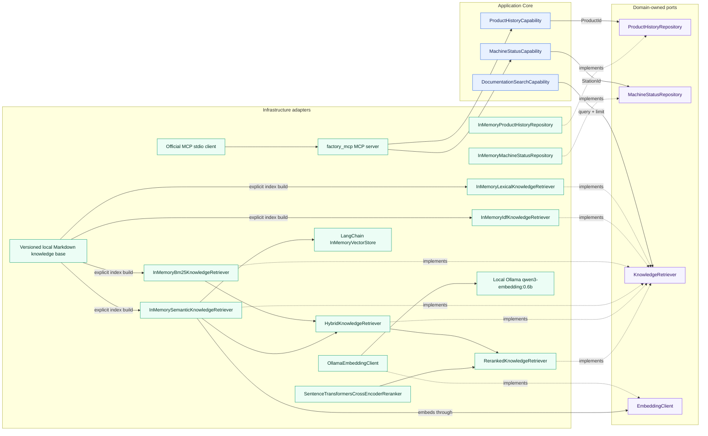

Each capability converts its string identifier into the appropriate Domain Value
Object, loads through a domain-owned repository abstraction, and returns a structured
result. The deterministic demo data includes product `P4711` and stations `S04` and
`S12`.

`DocumentationSearchCapability` receives `KnowledgeRetriever` through dependency
injection and returns structured passages. Lexical, semantic, and hybrid adapters load the local
Markdown knowledge base once during explicit construction; request-time searches use
their prepared in-memory indexes. The semantic adapter receives the separate inner
`EmbeddingClient` port, builds document vectors in LangChain's `InMemoryVectorStore`,
and embeds only the query at runtime through local Ollama.

`factory_mcp` is an Infrastructure transport adapter, not another source of factory
semantics. Its two handlers delegate to injected capabilities and return MCP structured
content. The local stdio transport is used for the manual smoke because it needs no
listener or deployment configuration. No remote deployment, authentication, write MCP
tool, Knowledge MCP, multi-server router, or LangGraph MCP integration exists yet.

## Knowledge Retrieval Baseline

The versioned knowledge base contains seven concise Markdown documents. The explicit
ingestion step normalizes each file and creates one chunk per Markdown heading section,
currently 25 chunks. Unchanged document names and heading order produce stable IDs such
as `error_codes::chunk-002`.

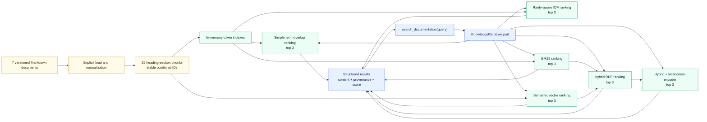

The tokenizer case-folds alphanumeric and hyphenated terms so exact industrial
identifiers remain intact. The simple adapter scores the fraction of distinct query
terms found in each chunk. The second adapter weights matching terms with a smoothed
inverse chunk frequency before normalizing by total query weight. BM25 adds saturated
term frequency and chunk-length normalization. The semantic adapter builds local vectors
through `EmbeddingClient` and LangChain's `InMemoryVectorStore`. The hybrid adapter
composes BM25 and semantic rankings with equal-weight Reciprocal Rank Fusion using fixed
rank constant `60`; it never adds their incomparable raw scores. All lexical strategies
omit zero-score chunks and resolve ties by `chunk_id`; hybrid resolves equal fused scores
the same way. Source path, document ID, chunk ID, section metadata, and score remain
attached to every result.

The focused retrieval eval is separate from the agent evals. Its 28 frozen v2 cases
measure Hit@1, Hit@3, and Mean Recall@3 using structured relevant-chunk ground truth.
The same unchanged dataset compares all six strategies. Agent query formulation and
final-answer grounding are outside this slice.

The implemented LLM boundary includes deterministic task-level profile selection and a
separate final egress check:

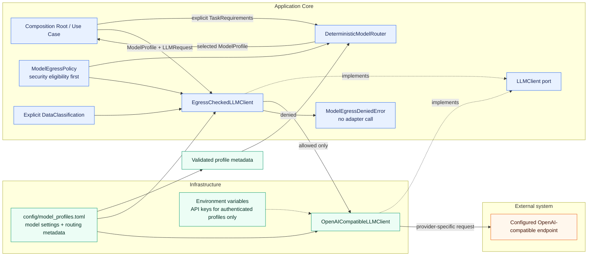

`config/model_profiles.toml` assigns every profile explicit, validated capabilities,
quality and relative cost classes, and an Execution Zone independent from its provider.
`troubleshooting`, `local_fast`, and `local_quality` use `LOCAL`; `public_fast` uses
`PUBLIC_CLOUD`. A caller creates `TaskRequirements`; the router applies the existing
egress policy before capability, minimum-quality, and cost/quality ordering. Callers
also supply the request classification to the controlled client for the independent
final check. The current policy allows all four classifications locally and allows only
`PUBLIC` data in `PUBLIC_CLOUD`. Missing or unknown classifications, zones, or routing
metadata fail closed without an adapter call.

The implemented tool-calling flow is:

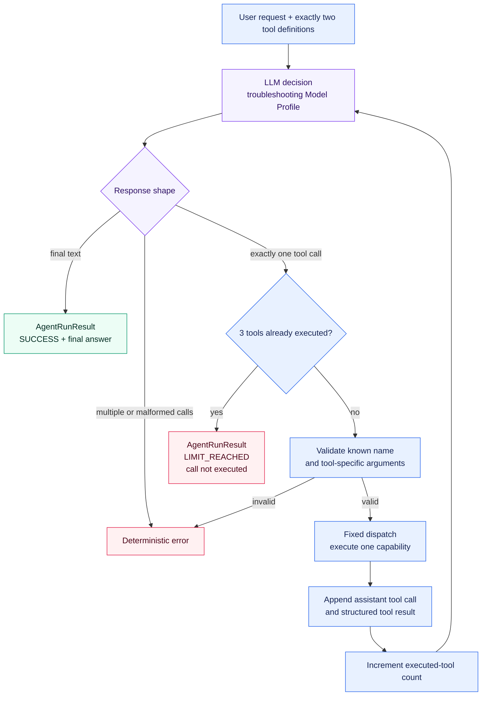

The LLM chooses whether to request `get_product_history`, request
`get_machine_status`, or answer directly, and it formulates the final answer.
Deterministic Python code validates one selected call per response, validates the
tool-specific `product_id` or `station_id`, uses a fixed dispatch, serializes each
structured result, and keeps the complete current-run message context. Both tools remain
available at every decision step.

`MAX_TOOL_CALLS = 3` counts successfully executed tools rather than LLM requests. After
the third observation, exactly one final LLM decision is allowed. Final text returns
`SUCCESS`; another requested call returns `LIMIT_REACHED`, is not executed, and causes
no further LLM request. Unknown tools, invalid arguments, and multiple calls in one
response remain deterministic failures.

The parallel LangGraph path preserves that behavior while moving orchestration mechanics
into an explicit graph:

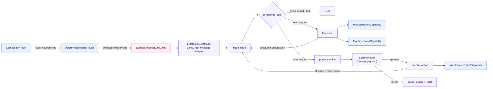

`TroubleshootingGraphState` holds LangChain messages, the executed-tool count,
normalized executed calls, run status, final answer, a pending action, approval result,
and minimal bound run context. A custom tool node wraps the existing capabilities with
LangChain `StructuredTool` contracts. This keeps argument validation and sequential
one-call dispatch explicit instead of adopting a framework default that could change
ADR-004 behavior. The Graph does not select a model: the Composition Root injects an
already routed profile and a client whose final ADR-009 egress check remains active.

For a resumable run, the graph is compiled with a native `InMemorySaver` and invoked
with `configurable.thread_id`. The approval node emits a JSON-serializable
`action_approval` interrupt and resumes through `Command(resume="approve" | "reject")`
using the same thread ID. Read tools never interrupt. `create_maintenance_ticket` is an
in-memory demonstration action: it is prepared before the interrupt, executes only after
approval, and uses its tool-call ID as an in-memory idempotency key. Nodes before an
interrupt remain side-effect-free because LangGraph restarts the node from its beginning
on resume. `InMemorySaver` loses state at process end; durable storage is deferred by
[ADR-011](../decisions/ADR-011-agent-persistence-and-human-in-the-loop.md).

## Tool Selection Evaluation Baseline

The repository-local eval measures only the first decision exposed by either
troubleshooting path. Each versioned JSONL case starts with a
fresh message context. The runner uses a configurable semantic Model Profile and passes
the provider-independent `LLMResponse` to deterministic exact-match scoring.

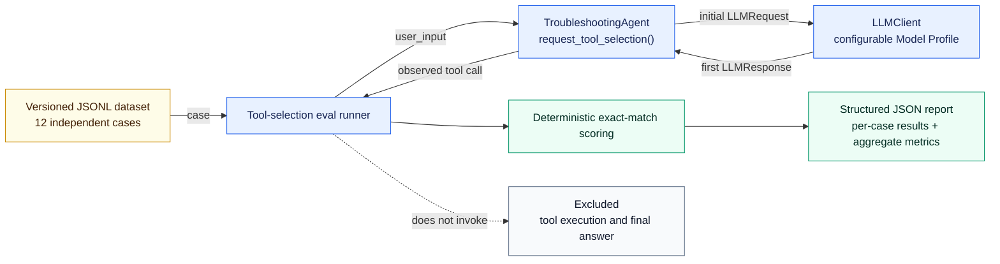

Tool Selection Accuracy requires exactly one call with the expected name. Argument
Accuracy additionally requires exact argument equality and therefore gives no argument
credit to a wrong tool. The baseline does not evaluate tool results, final-answer
quality, latency, cost, or LLM-as-a-Judge quality.

## Trajectory Evaluation Baseline

The complementary trajectory eval executes the complete agent for every independent
versioned case. `AgentRunResult` exposes normalized executed calls without provider
types or call IDs. Deterministic scoring compares this actual trajectory and the final
run status with structured ground truth. The natural-language final answer is recorded
but excluded from scoring.

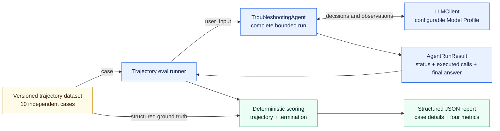

Task Success requires both exact trajectory equality and the expected termination
status. Exact Trajectory Accuracy measures full-sequence equality, Tool Call Accuracy
scores exact positional call slots while penalizing missing and additional calls, and
Termination Accuracy measures status equality. Per-case expected and actual call counts
make over-calling and under-calling visible.

## Quality Strategy

[ADR-005](../decisions/ADR-005-testing-and-evaluation-strategy.md) separates quality
mechanisms by the kind of claim they support. Deterministic guarantees belong in
automated tests. Model-dependent judgment is measured with versioned datasets,
structured ground truth, and explicit metrics. Smoke tests verify basic live
integration, while traces and operational metrics serve observability rather than
replacing tests or evals.

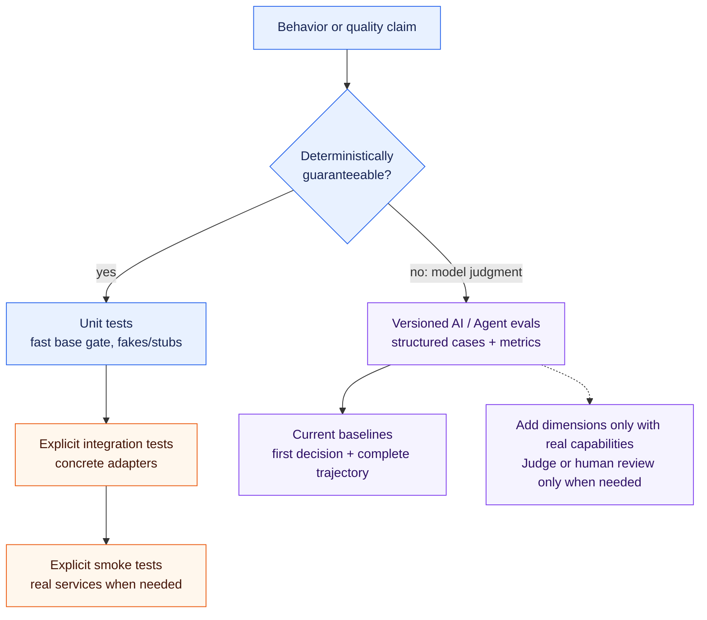

The current repository implements deterministic unit coverage, explicitly documented
local Ollama smoke paths, the focused first-decision tool-selection eval, and the
complete bounded-trajectory eval. It does not implement an external eval framework,
LLM-as-a-Judge, an observability platform, or new CI/CD infrastructure. Generated eval
reports remain unversioned by default.

## Package Responsibilities

### `domain`

Contains industrial domain models and rules.

The current slices define `ProductId`, the shared `StationId`, `ProductionStep`,
`ProductionStepStatus`, `ProductHistory`, `MachineState`, `MachineStatus`, and
`KnowledgeRetrievalResult`. The inner ports are `ProductHistoryRepository`,
`MachineStatusRepository`, `KnowledgeRetriever`, and `EmbeddingClient`. The HITL demonstration additionally
defines `MaintenanceTicketRequestId` and `MaintenanceTicket` plus the
`MaintenanceTicketRepository` inner port.

Must remain independent from:

* LLM SDKs
* MCP
* databases
* HTTP frameworks
* vendor-specific infrastructure

### `tools`

Contains agent-facing capabilities.

Tools should expose meaningful domain operations rather than low-level implementation details.

The current capabilities are
`ProductHistoryCapability.get_product_history(product_id)` and
`MachineStatusCapability.get_machine_status(station_id)`. They return Pydantic
`ProductHistoryResult` and `MachineStatusResult` models, including structured not-found
results. The isolated
`DocumentationSearchCapability.search_documentation(query)` returns structured
`DocumentationSearchResult` data and is not yet offered as an agent tool.
`MaintenanceTicketCapability.create_maintenance_ticket(...)` is an optional
LangGraph-only demonstration action. Its deterministic approval boundary executes it
only after explicit approval; it is not exposed by the handwritten reference path.

### `agent`

Contains provider-independent LLM contracts and agent orchestration logic.

The current implementation defines `LLMClient`, semantic `ModelProfile` selection,
small request and response models, the handwritten `TroubleshootingAgent`, and the
parallel `LangGraphTroubleshootingAgent`. It also provides explicit
`TaskRequirements`, validated routing metadata, and `DeterministicModelRouter`. The
router reuses `ModelEgressPolicy`, filters by required capabilities and minimum quality,
and then applies a stable cost/quality ordering. Both agent paths preserve the bounded
sequential loop and fixed two-tool dispatch. `AgentRunResult` distinguishes `SUCCESS`
from `LIMIT_REACHED` and reports both the executed-tool count and the normalized executed
trajectory. The agent does not construct the router, import the OpenAI SDK, or name a
concrete provider or model. Its optional HITL composition persists an already selected
profile and explicit run classification in checkpointed graph state; resume rejects a
mismatched profile or classification rather than rerouting.

Possible later responsibilities include:

* durable production agent persistence
* context compression
* Application-state classification propagation
* policy and guardrail integration

### `infrastructure`

Contains technical integrations and external implementations.

The current implementations are `InMemoryProductHistoryRepository` and
`InMemoryMachineStatusRepository`, which provide small deterministic demo data sets,
`InMemoryLexicalKnowledgeRetriever`, `InMemoryIdfKnowledgeRetriever`, and
`InMemoryBm25KnowledgeRetriever`, which search prebuilt local token indexes with
different scoring formulas, `InMemorySemanticKnowledgeRetriever`, which maps LangChain
`InMemoryVectorStore` matches back to original chunk provenance through `EmbeddingClient`,
`HybridKnowledgeRetriever`, which rank-fuses the existing BM25 and semantic retrievers,
`RerankedKnowledgeRetriever`, which applies a bounded local cross-encoder stage, and
`OllamaEmbeddingClient`, which confines the baseline embedding model to local Ollama,
and
`OpenAICompatibleLLMClient`, which translates the provider-independent LLM contract to
an OpenAI-compatible Chat Completions API. `LLMClientChatModel` is the narrow
Infrastructure adapter between LangChain messages/tools and the existing `LLMClient`;
it does not construct providers or duplicate profile and security configuration.
`InMemoryMaintenanceTicketRepository` is a local, idempotent demonstration adapter for
the approved action only; it is not an external ticketing integration.

Normal model settings and secret values are separate. Configuration explicitly marks a
profile as unauthenticated or API-key authenticated. An authenticated profile stores
only the name of the required environment variable; its credential value remains in
the environment. The initial local Ollama profile is unauthenticated and requires no
user-configured API key. The adapter encapsulates the non-secret technical placeholder
required by the OpenAI SDK.

Examples may later include:

* additional LLM provider adapters when concrete requirements justify them
* repositories
* databases
* MCP clients
* observability
* external APIs

### `evals`

Contains separate versioned datasets and focused runners for first-decision tool
selection, complete bounded trajectories, and isolated retrieval quality. Agent eval
runners explicitly select `manual` or `langgraph` while keeping datasets and scoring
unchanged. Parsing, per-case scoring, and aggregation are deterministic and covered by unit tests without a
live LLM. Generated JSON reports belong under the Git-ignored `evals/results/`
directory unless deliberately curated.

## Evolution

The architecture should evolve only when required by implemented capabilities.

### Task-Level Model Routing and Model Egress

Task-level routing and final data-egress enforcement are implemented as separate inner
responsibilities. Explicit `TaskRequirements` carry task role, required capabilities,
minimum quality, cost preference, and data classification. The router first applies the
ADR-009 policy as a security eligibility filter, then capability and quality filters,
and only then its deterministic cost/quality preference and profile-ID tie-breaker. The
independent `EgressCheckedLLMClient` repeats the ADR-009 check immediately before the
provider adapter. Application-state classification propagation remains planned.

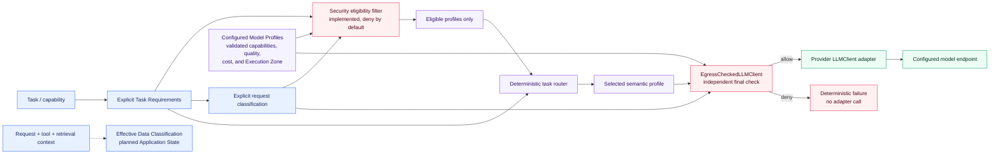

`MINIMIZE_COST` orders by lower relative cost and then the smallest sufficient quality;
`BALANCED` orders by lower cost and then higher quality; `PREFER_QUALITY` orders by
higher quality and then lower cost. Every tie ends with the lexical profile ID, so input
order cannot affect selection. No fallback or adaptive selection is implemented. If no
allowed and suitable profile is available, the router raises `NoEligibleModelError`.
Cost and quality preferences cannot override the security filter. See
[ADR-008](../decisions/ADR-008-task-level-model-routing.md) and
[ADR-009](../decisions/ADR-009-data-classification-and-model-egress-policy.md).

### Retrieval Evolution

The lexical baselines and the first semantic baseline are now also compared with a
fixed rank-fusion hybrid baseline and a bounded local cross-encoder reranking stage. The retrieval
core remains independent from a later Knowledge MCP transport boundary as specified by
[ADR-006](../decisions/ADR-006-knowledge-retrieval-and-rag-architecture.md). Embeddings
remain a separate model role from `LLMClient`; the focused `EmbeddingClient` port is in
the Core, while provider adapters and model configuration remain in Infrastructure.

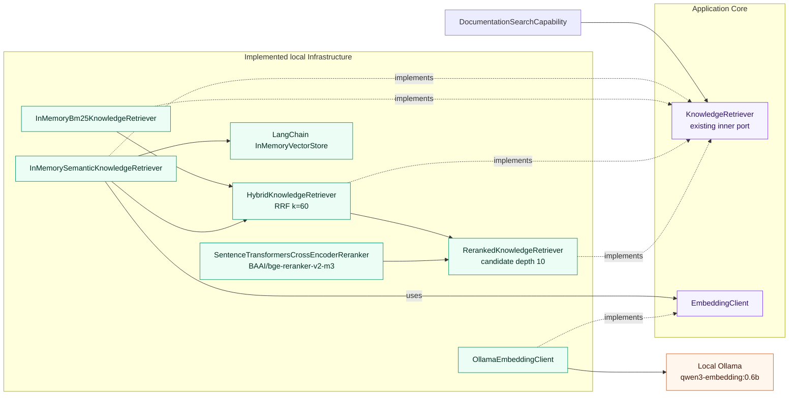

The first model and in-memory index are implementation baselines, not durable provider
or vector-store commitments. RRF is a fixed comparison baseline rather than a general
fusion technology decision. The first reranker and its model are baseline configuration,
not a permanent provider or model decision. Dimension, persistent storage, additional
reranking, and embedding routing remain open. See
[ADR-007](../decisions/ADR-007-embedding-model-abstraction.md).

### Broader Target Direction

Possible later stages include:

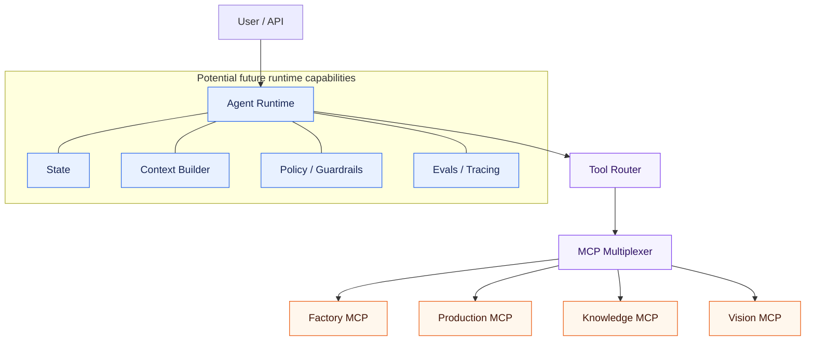

This is a target direction, not the current implementation.

Model profiles such as `vision`, `planning`, or `evaluation` can be added through
configuration when their capabilities are implemented. A non-OpenAI-compatible
provider will require another infrastructure adapter behind the same `LLMClient` port;
provider choice remains an outcome of semantic profile metadata and deterministic task
routing rather than provider-specific agent logic. See
[ADR-002](../decisions/ADR-002-provider-and-model-independent-llm-architecture.md) for
the decision and its tradeoffs.
