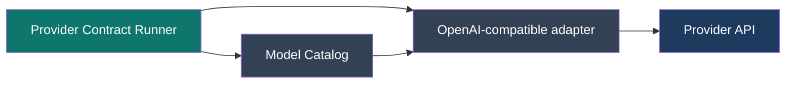

# Provider Contract Matrix

## Purpose

The Provider Contract Matrix verifies the technical boundary between one explicitly
selected catalog model and this repository's OpenAI-compatible LLM adapter. It is an
ephemeral diagnostics and smoke-test facility, not runtime routing state and not a
production fallback mechanism.

It deliberately excludes Factory data, S04, MCP, Knowledge retrieval, persisted model
assignments, `MANUAL`/`AUTO` selection, LangGraph, and agent reasoning. Every request
uses a small PUBLIC synthetic fixture only.



There is intentionally no LangGraph, MCP, Factory domain, assignment repository, or
automatic reselection in this flow.

## What Is Verified

For each explicit catalog model, the runner uses the production adapter and request
format to attempt plain text, synthetic tool calling, strict JSON-schema structured
output, and a separate tool-call then structured-output sequence. The structured
fixture exercises a required scalar, nullable field, default, enum, nested object, and
list of nested objects. It uses the same `LLMResponseFormat`/`LLMJsonSchema` path,
provider-specific normalization, diagnostics, and Pydantic validation as production.

The output separates capability verification (`VERIFIED`, `UNSUPPORTED`,
`NOT_VERIFIED`) from current live state (`AVAILABLE`, `RATE_LIMITED`, `UNAVAILABLE`,
`AUTH_ERROR`, `REQUEST_REJECTED`, `NOT_CONFIGURED`). A rate limit, timeout, outage, or
intermittent invalid-provider request never proves a capability unsupported.

Groq's catalogued `tool_calling + structured_output` same-request restriction is
checked deterministically before a provider call. The valid workflow remains a tool
call followed by a separate structured-output call. Other same-request combinations
remain `NOT_VERIFIED` unless evidence is deliberately added.

## Running It

Load local configuration from `.env`, then invoke an explicit model or the full
catalog:

```powershell
.venv\Scripts\python.exe scripts\run_provider_contract_matrix.py --model-id local_fast
.venv\Scripts\python.exe scripts\run_provider_contract_matrix.py --output evals\results\provider-contract.json
```

The optional JSON result is generated diagnostics and belongs under ignored
`evals/results/`; it contains model/catalog metadata, statuses, normalized error code,
failure origin, HTTP status/request ID when supplied, schema hash, payload byte count,
and timings. It never contains prompts, responses, request bodies, provider error text,
or secrets.

For a repeated local structured-output compatibility check, run:

```powershell
.venv\Scripts\python.exe scripts\diagnose_local_structured_output.py --model-id local_fast --model-id local_quality --repetitions 5 --output evals\results\phase5b-local-qwen-schema-ladder.json
```

The diagnostic exercises a flat required object, nullable and defaulted fields, a nested
object, a list of nested objects, and the representative final-response contract. It
records only request schema hashes, HTTP status, latency, JSON/Pydantic outcomes, and
content-free validation paths. It uses `reasoning_effort="none"` for Qwen structured
calls, matching the documented OpenAI-compatible local production request shape.

## Phase-5B Local Evidence

On 2026-09-20, Ollama 0.33.2 passed five out of five repetitions of every schema-ladder
stage, including the representative final-response contract, for both `local_fast`
(`qwen3.5:4b`) and `local_quality` (`qwen3.5:9b`). The standard contract runner also
verified text, tool calling, structured output, and the separate tool-call then
structured-output sequence for both models. This is compatibility evidence for the
current local runtime and request shape, not a cross-version guarantee.

External providers are protected by a fixed order: plain text first, then tools,
structured output, and multi-step. The runner stops further requests for a model after
rate limits, unavailable/connection failures, or authentication errors. It performs no
retry beyond the adapter's intentional configuration.

## Catalog Evidence Rules

The runner does not mutate the catalog. A later, reviewed catalog update may mark a
capability supported only after a successful production-path contract test, or mark a
feature/combination unsupported after a deterministic feature-specific rejection.
Transient limits, timeouts, outages, or generic request failures cannot downgrade a
catalog capability. It never changes quality/cost class, execution zone,
classification policy, egress policy, routing, or fallback behavior.

## Interpreting Failures

| Deterministic acceptance | Provider contract | Real model quality | Interpretation |
| --- | --- | --- | --- |
| FAIL | any | any | Suspect application/code regression. |
| PASS | FAIL | not assessed | Provider, adapter, or quota problem. |
| PASS | PASS | FAIL | Model, prompt, or agent-quality problem. |
| PASS | PASS | PASS | End-to-end healthy. |

Real-model quality grading and response-language reliability are intentionally a later
phase.
