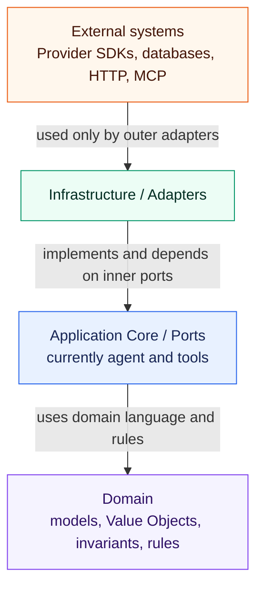
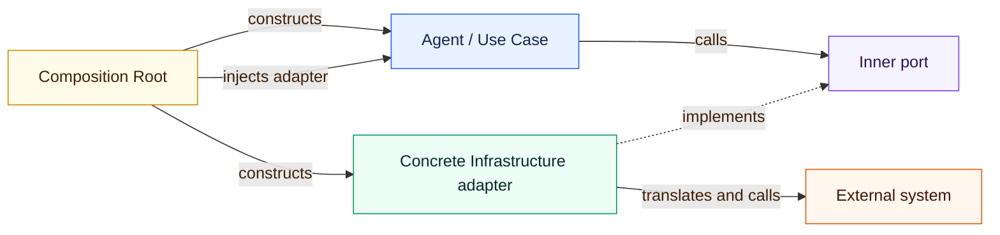

# ADR-003: Hexagonal Architecture

## Status

Accepted

## Context

The project will integrate LLM providers, production systems, technical documentation,
databases, MCP servers, and other external technologies over time. These integrations
change at different rates and must not determine the industrial domain model or the
structure of application behavior.

The current codebase is intentionally small. Its physical packages are `domain`,
`tools`, `agent`, and `infrastructure`; a separate `application` package does not yet
exist. The architecture therefore needs enforceable dependency rules without requiring
ceremonial layers and interfaces before the codebase has enough complexity to benefit
from them.

## Decision

The system follows Hexagonal Architecture, also known as Ports and Adapters. Domain
logic and application behavior form the inner core. External technologies are located
outside that core and connect through explicit ports and adapters.

Dependencies generally point inward:

The diagram describes compile-time dependency direction, not runtime call direction.
At runtime, an inner use case can invoke an outer adapter through a port supplied by
dependency injection. Domain and Application Core must never depend on
`infrastructure`.

### Domain

The Domain contains business models, Value Objects, invariants, and domain rules. It
may define a port when that port is expressed entirely in domain language, as with
`ProductHistoryRepository`.

The Domain must not depend on:

* LLM or other provider SDKs
* MCP implementations
* databases or persistence frameworks
* HTTP or web frameworks
* transport schemas
* other infrastructure technologies

Domain models represent industrial concepts and rules. They must not be shaped by the
schema of an external API, wire protocol, or database record.

### Application Core

The Application Core contains use cases and orchestrates business workflows. It uses
Domain models and defines the ports needed to obtain external capabilities. Application
code works against those abstractions rather than concrete Infrastructure classes.

At the current project size, application responsibilities may remain in focused
`tools` and `agent` modules. An explicit `application` layer or `application/ports`
package will be introduced only when multiple use cases and ports make the separation
materially clearer. Logical dependency boundaries are mandatory now; additional
physical directories are not.

### Ports

Ports belong to the inner side of the architectural boundary because the Core owns the
capabilities it requires. Current examples are `LLMClient` and
`ProductHistoryRepository`, and `MachineStatusRepository`. Future examples may include
ports for MES, maintenance, documentation, image analysis, or other external services.

Port signatures use internal models and language. They must not expose concrete
provider SDK types, transport DTOs, database records, HTTP request objects, or similar
outer-layer details.

### Infrastructure and Adapters

`infrastructure` contains concrete implementations of ports and integration-specific
configuration. Current examples are `OpenAICompatibleLLMClient`,
`InMemoryProductHistoryRepository`, and `InMemoryMachineStatusRepository`. Future
examples can include SQL, MES, MCP, or cloud adapters.

Infrastructure may depend on the Domain and Application Core in order to implement
their ports and construct their models. The reverse dependency is forbidden. An
adapter owns translation between external representations and internal models.

Provider-, transport-, and persistence-specific DTOs remain in Infrastructure. Data
entering the system is translated at the adapter boundary; internal models are
translated to external representations when leaving it. External schemas do not leak
into the Domain.

### Agent and Tools

Agent orchestration must not know concrete Infrastructure implementations. Agent-facing
tools and capabilities access external systems through inner ports or use cases and
receive those dependencies explicitly.

LLM provider details, model identifiers, endpoints, credentials, and provider SDK
types must not leak into agent logic. This rule is specialized by ADR-002.

### Dependency Injection and Composition Root

Concrete adapters are selected and wired at a Composition Root, such as a process
entry point, API bootstrap, CLI bootstrap, or explicit test setup. Domain, Application,
`agent`, and `tools` modules do not secretly instantiate concrete Infrastructure
dependencies or locate them through global service locators.

Infrastructure adapters may encapsulate creation and lifecycle of the external SDK
clients they own. Tests can inject controlled client factories or adapter fakes where
needed.

### Evolution

Hexagonal Architecture is enforced through dependency direction and boundary
ownership, not by maximizing the number of packages or interfaces. Do not create
layers, ports, adapters, factories, or directories only to make the repository look
formally hexagonal.

The physical structure grows with real complexity. In particular,
`application/ports` is deferred until several use cases or ports make it useful. A port
is introduced when the Core needs to abstract an external capability or when multiple
implementations/testing seams justify it, not for every function or class.

### Testing

Core logic must be testable without real external systems. Ports must be replaceable by
fakes or stubs in unit tests. Unit tests do not require live LLMs, databases, MES
systems, MCP servers, or cloud services.

Integration tests verify concrete adapters separately and must be explicitly
identifiable. Manual smoke tests may verify a configured local or remote integration,
but they are not part of deterministic unit tests.

### Relationship to Earlier Decisions

ADR-001 established the initial package areas and the principle of incremental
architecture. This ADR adds the binding dependency rules for those areas.

ADR-002 is a concrete application of this overarching decision: `LLMClient` is an
inner port with provider-independent models, while `OpenAICompatibleLLMClient` is an
Infrastructure adapter. Provider configuration, SDK objects, and response translation
remain outside the Core. Semantic Model Profiles prevent provider and model details
from leaking into agent and use-case code.

## Alternatives

### Organize only by technical layer without dependency inversion

Rejected because naming folders `domain`, `service`, and `infrastructure` does not
prevent inner code from importing concrete databases, SDKs, or HTTP clients. The
dependency rules are the architectural decision.

### Integrate external systems directly in use cases

Rejected because use cases would become coupled to provider lifecycles, schemas, and
test environments. Replacing an integration would require changes to business
orchestration.

### Create a complete `application/ports/adapters` hierarchy immediately

Rejected for the current stage because it would add mostly empty structure and
indirection. The logical boundaries already fit the small codebase and can be made more
physically explicit when the number of use cases and ports justifies it.

### Let external schemas define Domain models

Rejected because provider and transport changes would destabilize industrial concepts
and invariants. Adapters must absorb that change through explicit mapping.

## Consequences

Positive:

* business rules and application behavior remain independent of integration technology
* external providers and persistence mechanisms can be replaced behind stable ports
* core tests remain deterministic and fast
* external schema changes are contained at adapter boundaries
* the architecture can grow incrementally without giving up enforceable boundaries

Negative:

* adapter boundaries require explicit translation code
* dependency direction must be reviewed whenever imports or object construction change
* some abstractions are owned by the Core even when their first implementation exists
  in Infrastructure
* package structure may evolve later as application complexity increases
