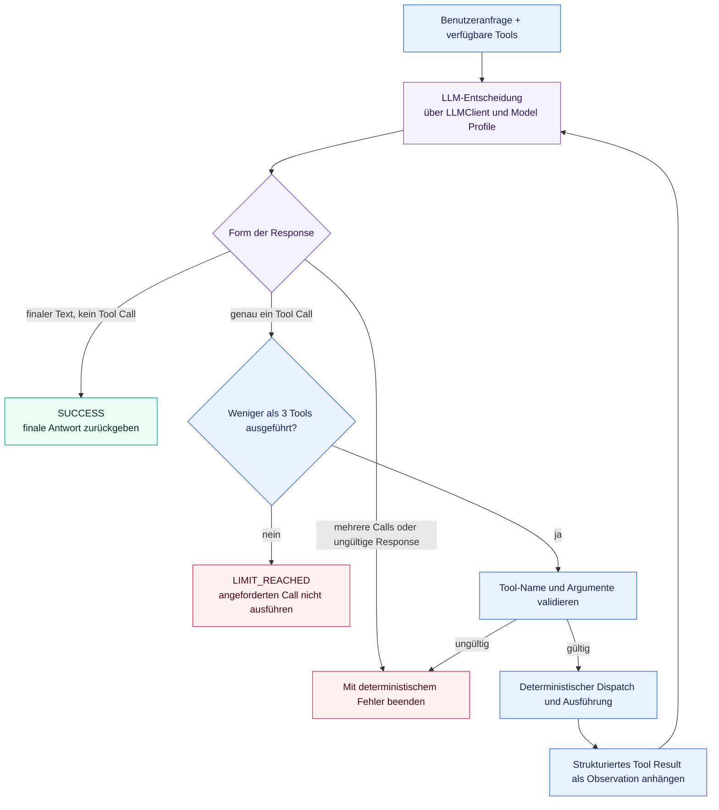

# ADR-004: Strategie für die Agent-Orchestrierung

## Status

Angenommen

## Kontext

Bevor diese Entscheidung implementiert wurde, konnte `TroubleshootingAgent` das LLM nach
einem Tool Call fragen, diesen Call ausführen und eine finale Antwort anfordern. Das
genügte für isolierte Fragen zur Produktionshistorie oder zum Maschinenstatus.
Realistisches Troubleshooting benötigt jedoch häufig mehrere voneinander abhängige
Observations. Beispielsweise kann bei einem Produktfehler zunächst die
Produktionshistorie und danach der aktuelle Zustand der dort fehlgeschlagenen Station
benötigt werden. Die zweite Entscheidung hängt von den Informationen des ersten Tools
ab.

Das Projekt benötigt vor der Implementierung dieses Verhaltens eine
Orchestrierungsstrategie. Sie muss den Lernwert sichtbarer Agent-Mechanik,
deterministische Sicherheitsgarantien, Provider-Unabhängigkeit und schnelle Unit Tests
erhalten, ohne vorschnell Planner, mehrere Agenten, Orchestrierungs-Frameworks oder MCP
als Voraussetzung einzuführen.

## Entscheidung

Der `TroubleshootingAgent` verwendet einen expliziten, begrenzten und sequenziellen
Single-Agent Tool Loop, der in Python implementiert ist.

In jeder Iteration erhält das LLM die Benutzeranfrage sowie die zuvor im selben Run
gesammelten Tool Calls und strukturierten Tool Results. Anhand dieses Kontexts wählt es
eines von zwei Ergebnissen:

1. eine finale Antwort zurückgeben und den Run beenden oder
2. genau einen nächsten Tool Call anfordern.

Das Modell trifft die kontextabhängige Entscheidung. Deterministischer Python-Code ist
für alle Garantien verantwortlich: Validierung von Tool-Namen und Argumenten, Dispatch,
Ausführung, Zählen der Tool Calls, Abbruchprüfungen und Fehlerbehandlung. Das Modell kann
weder ein unbekanntes Tool autorisieren noch Validierung umgehen, das Limit erhöhen
oder die Terminierungsregeln kontrollieren.

### Begrenzung und Terminierung des Loops

Die erste Implementierung definiert `MAX_TOOL_CALLS = 3` an einer klar sichtbaren Stelle
im deterministischen Application Core. Das Limit zählt akzeptierte und erfolgreich
ausgeführte Tools, nicht LLM Requests. Ein Run darf daher null bis drei Tool Calls
ausführen. Einen unbegrenzten Modus gibt es nicht.

Der Run endet sofort, wenn das Modell finalen Text ohne Tool Call zurückgibt. Nach jedem
erfolgreich ausgeführten Tool, einschließlich des dritten, darf das Modell anhand der
neuen Observation genau eine nächste Entscheidung treffen. Die Entscheidung nach dem
dritten Tool ist der letzte zulässige LLM Request des Runs. Enthält sie finalen Text ohne
Tool Call, endet der Run mit `SUCCESS`. Fordert sie einen weiteren Tool Call an, endet
der Run mit `LIMIT_REACHED`; dieser vierte Call wird weder für den Dispatch validiert
noch ausgeführt und es erfolgt kein weiterer LLM Request. Der Agent lässt das Modell das
Limit nicht überschreiben und synthetisiert keine unbegründete Teilantwort.

Eine Response mit mehreren Tool Calls wird abgelehnt; parallele Tool-Ausführung wird in
der ersten Version nicht unterstützt. Eine Response ohne verwendbaren finalen Text und
ohne gültigen Tool Call gilt als ungültig und beendet den Run mit einem deterministischen
Fehler. Unbekannte Tool-Namen und ungültige Argumente werden bei vorhandenem
Ausführungsbudget vor dem Dispatch abgelehnt. Sie erreichen niemals eine Capability
oder ein externes System.

Das öffentliche Agent-Run-Ergebnis bleibt bewusst klein. Es unterscheidet `SUCCESS`, das
die finale Modellantwort enthält, von `LIMIT_REACHED`, das als strukturierter Status
erkennbar ist und nicht wie eine normale finale Antwort erscheinen darf. Zusätzlich
wird die Anzahl ausgeführter Tools angegeben. Andere bestehende deterministische
Validierungsfehler verwenden weiterhin fokussierte Exceptions; es wird keine allgemeine
Agent-Fehlerhierarchie eingeführt. Authorization und spätere Safety Policies bleiben
deterministische Prüfungen außerhalb der LLM-Entscheidung.

### Observations und Context

Jeder akzeptierte Call und sein strukturiertes Ergebnis werden mit den
provider-unabhängigen Message- und Tool-Call-Modellen an den nächsten LLM Request
angehängt. Tool-Call-Identifier erhalten die Zuordnung zwischen Request und Result. Die
Observations bilden Context für den aktuellen Run; sie werden nicht allein deshalb zu
persistiertem Application State, weil sie in LLM Messages vorkommen.

Die Interaktion ähnelt dem mit ReAct verbundenen Action/Observation-Zyklus. ReAct dient
nur als nützliches konzeptionelles Muster. Diese Entscheidung verlangt weder ein
textuelles `Thought`-Format noch die Erfassung verborgener Chain-of-Thought oder eine
framework-spezifische ReAct-Implementierung.

### Umfang und Dependencies

Die erste Implementierung bleibt bei einem einzelnen Agenten mit sequenziellen Tool
Calls. Sie führt Folgendes nicht ein:

* parallele Tool-Ausführung
* einen getrennten Planner und Executor
* ein Multi-Agent-System
* LangGraph oder ein anderes Agent-Framework
* MCP als Voraussetzung für die Orchestrierung
* neue Runtime Dependencies allein für den Loop

Der Agent hängt weiterhin vom provider-unabhängigen `LLMClient`-Port ab und wählt
Modelle über semantische Model Profiles. Provider-Namen, Modell-Identifier, Endpoints,
Credentials und SDK-Typen bleiben gemäß ADR-002 außerhalb des Orchestrierungscodes.
Konkrete Tools und Infrastructure Adapter werden weiterhin gemäß ADR-003 injiziert.

### Evaluation

Die bestehende versionierte Tool-Selection-Baseline bleibt unverändert als
Vergleichspunkt für die erste LLM-Entscheidung erhalten. Die Einführung des Loops darf
diese Baseline weder stillschweigend ersetzen noch ungültig machen. Spätere Evals dürfen
mehrstufige Datasets ergänzen und unterschiedliche Orchestrierungsstrategien anhand
deterministischer Metriken wie Task Success, Tool-Sequenz, Argument Accuracy,
Limit-Einhaltung und unnötigen Calls vergleichen. Dieses ADR ermöglicht solche
Vergleiche, definiert oder implementiert aber kein allgemeines Eval-Framework.
Gemäß ADR-005 werden deterministische Loop-Garantien mit Unit Tests und Fake-LLM-
Responses geprüft, während reale Modellurteile Gegenstand versionierter Evaluationen
bleiben.

## Alternativen

### 1. Den bisherigen Single-Tool-Call-Ablauf beibehalten

Als zukünftige Troubleshooting-Strategie verworfen, weil damit keine zweite Observation
gesammelt werden kann, deren Bedarf oder Argumente vom ersten Ergebnis abhängen. Direkte
Antworten und Runs mit einem einzelnen Call bleiben gültige Pfade innerhalb des
begrenzten Loops.

### 2. Expliziter begrenzter Single-Agent Tool Loop

Angenommen. Dies ist das kleinste Design, das abhängige Troubleshooting-Schritte
unterstützt und gleichzeitig Modellentscheidung, deterministische Garantien,
Context-Aufbau und Terminierung sichtbar und testbar hält. Es passt zum aktuellen Lern-
und Projektstand und fügt weder Framework- noch Distributed-System-Komplexität hinzu.

### 3. Planner/Executor-Architektur

Aufgeschoben. Die Trennung von Planung und Ausführung kann bei langen oder stark
strukturierten Workflows helfen. Die aktuelle Domain mit zwei Tools rechtfertigt jedoch
weder eine weitere Modellrolle und ein Plan-Schema noch Synchronisationsregeln und
zusätzliche Fehlermöglichkeiten.

### 4. Multi-Agent-System

Für die erste Version aufgeschoben und verworfen. Spezialisierte zusammenarbeitende
Agenten können später helfen, wenn tatsächlich unabhängige Domains getrennten Context
oder eigene Policies benötigen. Derzeit würden sie Coordination-, Routing-, State-,
Observability- und Eval-Komplexität ohne Nachweis besserer Ergebnisse hinzufügen.

### 5. Agent-Framework wie LangGraph

Aufgeschoben. Ein Graph-Framework kann nützlich werden, wenn Branching, Persistence,
Resumability, Human Approval oder komplexe Recovery implementiert werden. Eine jetzige
Einführung würde die zu erlernende Loop-Mechanik verbergen und eine Runtime Dependency
hinzufügen, bevor ihr Nutzen belegt ist.

## Konsequenzen

Positiv:

* abhängige Observations können mehrstufiges Troubleshooting unterstützen
* LLM-Entscheidungen bleiben flexibel, während Sicherheit und Limits deterministisch
  bleiben
* wichtige Orchestrierungsmechanik bleibt explizit und durch Unit Tests prüfbar
* die Strategie bleibt unabhängig von LLM-Providern, Modellen, MCP und Frameworks
* direkte Runs, Single-Call- und Multi-Call-Runs verwenden denselben begrenzten Ablauf
* der bestehende Eval der ersten Entscheidung bleibt für Regressionen nutzbar

Negativ:

* das Projekt besitzt expliziten Loop- und Message-History-Code
* jeder weitere Tool Call erhöht Latenz und Modellnutzung
* begrenzte Runs können vor einer finalen Antwort mit einem Limitfehler enden
* sequenzielle Ausführung nutzt keine sichere Parallelität
* komplexere Recovery oder Resumability können später ein Framework oder ein
  umfangreicheres State Model rechtfertigen

## Beziehung zu bestehenden Entscheidungen

ADR-001 etablierte inkrementelle Entwicklung, explizite Python-Mechanik und die Regel,
dass Frameworks ihren Nutzen belegen müssen. Diese Entscheidung wendet jene Prinzipien
auf die Agent-Orchestrierung an.

ADR-002 bleibt unverändert: Jeder LLM-Schritt verwendet `LLMClient` und ein semantisches
Model Profile; Provider- und Modelldetails bleiben auf Konfiguration und Infrastructure
begrenzt.

ADR-003 bleibt unverändert: Der Loop gehört zum Application Core, arbeitet über innere
Ports und Capabilities und erhält konkrete Adapter per Dependency Injection. Die
Dependency-Richtung ändert sich nicht.

ADR-005 trennt deterministische Tests von modellabhängigen Evaluationen. Validierung,
Dispatch, Zähler, Context-Aufbau, Result Status und Terminierungsregeln des Loops sind
deterministische Testziele; das bestehende Dataset für die erste Entscheidung misst
weiterhin LLM-Tool-Auswahl und Argumentextraktion.
