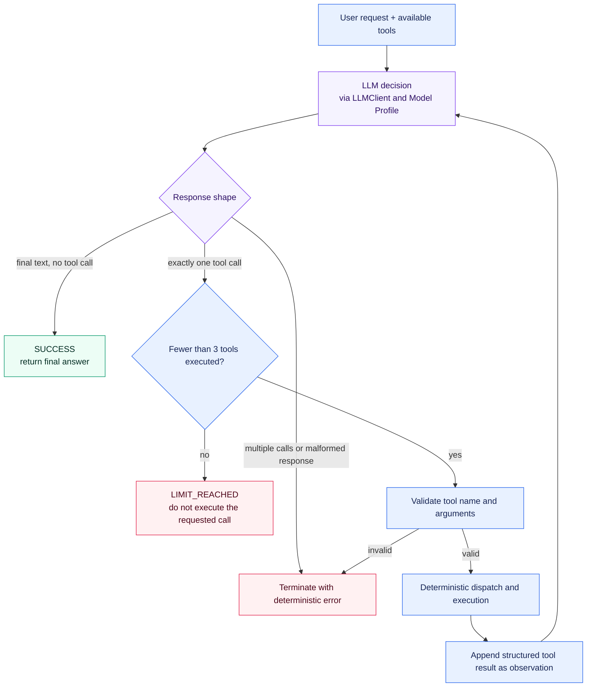

# ADR-004: Agent Orchestration Strategy

## Status

Accepted

## Context

Before this decision was implemented, `TroubleshootingAgent` could ask the LLM for one
tool call, execute that call, and request a final answer. That was sufficient for
isolated product-history or machine-status questions, but realistic troubleshooting
often requires several dependent observations. For example, a product failure may first
require its production history and then the current state of the station at which it
failed. The second choice depends on information returned by the first tool.

The project needs an orchestration strategy before implementing that behavior. It must
preserve the learning value of visible agent mechanics, deterministic safety guarantees,
provider independence, and fast unit testing without prematurely introducing planners,
multiple agents, orchestration frameworks, or MCP as a prerequisite.

## Decision

The `TroubleshootingAgent` uses an explicit, bounded, sequential single-agent tool loop
implemented in Python.

In every iteration, the LLM receives the user request plus the tool calls and structured
tool results collected earlier in the same run. Based on that context, it chooses one of
two outcomes:

1. return a final answer and terminate the run, or
2. request exactly one next tool call.

The model makes the contextual judgment. Deterministic Python code owns all guarantees:
tool-name validation, argument validation, dispatch, execution, tool-call counting,
termination checks, and error handling. The model cannot authorize an unknown tool,
bypass validation, increase the limit, or control termination policy.

### Loop Bound and Termination

The first implementation defines `MAX_TOOL_CALLS = 3` at a clearly visible location in
the deterministic Application Core. The limit counts accepted and successfully
executed tools, not LLM requests. A run may therefore execute zero through three tool
calls. There is no unlimited mode.

The run terminates immediately when the model returns final text without a tool call.
After every successfully executed tool, including the third, the model may make one
next decision using the new observation. The decision following the third tool is the
last permitted LLM request in the run. If it contains final text without a tool call,
the run terminates with `SUCCESS`. If it requests another tool call, the run terminates
with `LIMIT_REACHED`; that fourth call is neither validated for dispatch nor executed,
and no subsequent LLM request is made. The agent does not ask the model to override the
limit and does not synthesize an ungrounded partial answer.

A response containing multiple tool calls is rejected; parallel tool execution is not
supported in the first version. A response with neither usable final text nor a valid
tool call is treated as malformed and terminates with a deterministic error. Unknown
tool names and invalid arguments are rejected before dispatch whenever execution budget
is available. They never reach a capability or external system.

The public agent-run result is intentionally small. It distinguishes `SUCCESS`, which
contains the final model answer, from `LIMIT_REACHED`, which is a structured status and
must not look like a normal final answer. It also reports the number of tools executed.
Other existing deterministic validation failures continue to use focused exceptions;
no general agent-error hierarchy is introduced. Authorization and future safety
policies remain deterministic checks outside LLM judgment.

### Observations and Context

Each accepted call and its structured result are appended to the next LLM request using
the provider-independent message and tool-call models. Tool-call identifiers preserve
the association between a request and its result. These observations are context for
the current run; they do not become persistent application state merely because they
appear in LLM messages.

The interaction resembles the action/observation cycle associated with ReAct. ReAct is
used only as a useful conceptual pattern. This decision does not require a textual
`Thought` format, collection of hidden chain-of-thought, or a framework-specific ReAct
implementation.

### Scope and Dependencies

The first implementation remains a single agent with sequential tool calls. It does not
introduce:

* parallel tool execution
* a separate planner and executor
* a multi-agent system
* LangGraph or another agent framework
* MCP as an orchestration prerequisite
* new runtime dependencies solely for the loop

The agent continues to depend on the provider-independent `LLMClient` port and selects
models through semantic Model Profiles. Provider names, model identifiers, endpoints,
credentials, and SDK types remain outside orchestration code in accordance with
ADR-002. Concrete tools and Infrastructure adapters continue to be injected in
accordance with ADR-003.

### Evaluation

The existing versioned tool-selection baseline remains unchanged as the comparison
point for the first LLM decision. Introducing the loop must not silently replace or
invalidate that baseline. Later evaluations may add multi-step datasets and compare
different orchestration strategies using deterministic metrics such as task success,
tool sequence, argument accuracy, limit compliance, and unnecessary calls. This ADR
enables those comparisons but does not define or implement a general evaluation
framework. In accordance with ADR-005, deterministic loop guarantees are covered by
unit tests using fake LLM responses, while real model judgment remains the subject of
versioned evaluations.

## Alternatives

### 1. Keep the current single-tool-call flow

Rejected as the future troubleshooting strategy because it cannot gather a second
observation whose need or arguments depend on the first result. Direct answers and
single-call runs remain valid execution paths inside the bounded loop.

### 2. Explicit bounded single-agent tool loop

Accepted. It is the smallest design that supports dependent troubleshooting steps while
keeping model judgment, deterministic guarantees, context construction, and termination
visible and testable. It matches the project's current learning stage and adds no
framework or distributed-system complexity.

### 3. Planner/Executor architecture

Deferred. Separating planning from execution can help with long or highly structured
workflows, but the current two-tool domain does not justify another model role, plan
schema, synchronization rules, or additional failure modes.

### 4. Multi-agent system

Deferred and rejected for the first version. Specialized collaborating agents may
eventually help when genuinely independent domains require separate context or policies.
At the current stage they would add coordination, routing, state, observability, and
evaluation complexity without evidence of better outcomes.

### 5. Agent framework such as LangGraph

Deferred. A graph framework may become useful when branching, persistence, resumability,
human approval, or complex recovery is implemented. Introducing one now would hide the
loop mechanics the project is intended to learn and would add a runtime dependency
before its value is demonstrated.

## Consequences

Positive:

* dependent observations can support multi-step troubleshooting
* LLM judgment remains flexible while safety and limits remain deterministic
* important orchestration mechanics stay explicit and unit-testable
* the strategy remains independent of LLM providers, models, MCP, and frameworks
* direct, single-call, and multi-call runs share one bounded control flow
* the existing first-decision eval remains usable for regression comparison

Negative:

* the project owns explicit loop and message-history code
* every additional tool call increases latency and model usage
* bounded runs can terminate with a limit error before producing a final answer
* sequential execution does not exploit safe parallelism
* more complex recovery or resumability may later justify a framework or richer state
  model

## Relationship to Existing Decisions

ADR-001 established incremental development, explicit Python mechanics, and the rule
that frameworks must earn their place. This decision applies those principles to agent
orchestration.

ADR-002 remains unchanged: every LLM step uses `LLMClient` and a semantic Model Profile,
with provider and model details confined to configuration and Infrastructure.

ADR-003 remains unchanged: the loop belongs to the Application Core, works through
inner ports and capabilities, and receives concrete adapters through dependency
injection. No dependency direction is changed.

ADR-005 separates deterministic tests from model-dependent evaluations. The loop's
validation, dispatch, counter, context construction, result status, and termination
rules are deterministic test targets; the existing first-decision dataset continues to
measure LLM tool selection and argument extraction.
