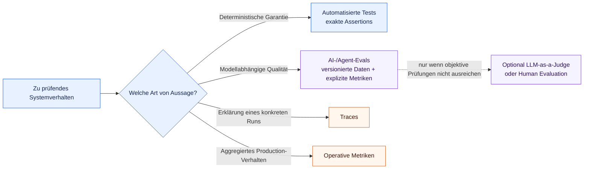

# ADR-005: Test- und Evaluationsstrategie

## Status

Akzeptiert

## Kontext

Das Projekt verbindet konventionelles Softwareverhalten mit Verhalten, das von
LLM-Urteilen abhängt. Diese beiden Kategorien besitzen unterschiedliche
Qualitätseigenschaften. Domain-Invarianten, Validierung, Dispatch, Limits, Mappings und
Scoring können deterministisch garantiert werden. Tool-Auswahl, Argumentextraktion aus
natürlicher Sprache und spätere diagnostische Urteile können dagegen zwischen Modellen,
Prompts und Context variieren, selbst wenn die Modellparameter konstant bleiben.

Ein einziger Qualitätsmechanismus für beide Kategorien würde irreführende Garantien
erzeugen. Normale Tests können die Qualität offener Modellurteile nicht beweisen,
während probabilistische LLM-Evaluation keine exakten Assertions für deterministischen
Code ersetzen kann. Das Repository zeigt die Trennung bereits: Das versionierte
Tool-Selection-Dataset misst die erste Modellentscheidung, während deterministische
Unit Tests den Dataset-Parser, das Exact-Match-Scoring, die Aggregation und die
Agent-Schutzmechanismen abdecken.

Das Projekt benötigt eine verbindliche Quality Strategy, die diese Trennung bei der
Weiterentwicklung von Agent-Orchestrierung, Retrieval, externen Integrationen und
Modellwahl bewahrt. Sie soll aussagekräftige Evidenz ermöglichen, ohne vorzeitig eine
Evaluationsplattform, einen Observability Stack oder eine CI/CD-Implementierung
festzulegen.

## Entscheidung

Für Verhalten, das das System deterministisch garantieren kann, werden deterministische
automatisierte Tests verwendet. Für Verhalten, das inhärent von Modellurteilen abhängt,
werden Evaluationen mit versionierten Datasets und expliziten Metriken verwendet. Tests
und Evaluationen sind unterschiedliche Qualitätsmechanismen und dürfen nicht vermischt
werden.

Normale Softwaretests dürfen nicht durch LLM-basierte Evaluation ersetzt werden.
LLM-as-a-Judge darf nicht verwendet werden, wenn eine objektive deterministische Prüfung
die Eigenschaft direkter und zuverlässiger bewerten kann.

### Unit Tests

Unit Tests prüfen deterministisches Verhalten, insbesondere:

* Domain-Invarianten und Value Objects
* Validierung und Tool-Argumentvalidierung
* Tool-Dispatch
* Limits und Abbruchbedingungen
* Mappings zwischen internen und externen Repräsentationen
* deterministisches Eval-Parsing, Scoring und Aggregation
* Konfigurationslogik
* Fehlerbehandlung
* port-basierte Core-Logik mit Fakes oder Stubs

Unit Tests dürfen keine echten LLM-, Netzwerk-, Datenbank- oder MCP-Aufrufe benötigen.
Modellabhängige Responses werden durch kontrollierte Fakes oder Stubs repräsentiert,
wenn Core-Verhalten geprüft wird. Diese Tests bilden das schnelle, reproduzierbare
Basis-Quality-Gate.

### Integration Tests

Integration Tests prüfen konkrete Adapter und externe Integrationen getrennt vom Core.
Beispiele sind:

* der OpenAI-compatible Adapter gegen lokales Ollama
* spätere Datenbankadapter
* spätere MCP-Clients und -Server
* spätere Retrieval-Komponenten

Integration Tests müssen klar erkennbar und explizit auswählbar sein. Tests, die einen
laufenden externen Service benötigen, dürfen nicht unbeabsichtigt zur Voraussetzung
jedes normalen Unit-Test-Laufs werden. Adapterverhalten, das ohne Live-Service geprüft
werden kann, soll weiterhin durch deterministische Tests an der kleinsten sinnvollen
Grenze getestet werden.

### Smoke Tests

Manuelle oder explizit gestartete Smoke Tests dürfen echte lokale oder externe Services
aufrufen. Sie verifizieren, dass eine grundlegende End-to-End-Integration funktionsfähig
ist; sie ersetzen weder reproduzierbare Unit Tests noch strukturierte Evaluationen.

Das aktuelle Beispiel verwendet lokales Ollama, das konfigurierte Model Profile
`troubleshooting` und den realen Tool-Calling-Pfad. Sein Zweck ist die Prüfung von
Konnektivität und grundlegendem Pfad, nicht eine statistisch aussagekräftige
Qualitätsaussage.

### AI- und Agent-Evaluationen

Versionierte Evaluations-Datasets messen Verhalten, das von Modellurteilen abhängt. Die
aktuell implementierten Metriken sind:

* Tool Selection Accuracy
* Tool Argument Accuracy

Mögliche spätere Metriken sind:

* task success
* trajectory quality
* unnecessary tool calls
* grounding
* unsupported claims
* retrieval recall und precision
* root-cause correctness
* safety violations
* latency
* token usage
* cost

Diese Metriken werden erst eingeführt, wenn die entsprechende Capability existiert und
die Metrik eine explizite Interpretation besitzt. Diese ADR impliziert nicht, dass alle
aufgeführten Metriken jetzt implementiert werden müssen.

Ein Eval-Run darf ein echtes LLM aufrufen und ist daher selbst kein deterministischer
Softwaretest. Deterministische Teile seines Harness wie Laden, Validierung, Scoring und
Aggregation bleiben durch Unit Tests abgedeckt.

### Evaluations-Datasets und Ground Truth

Evaluations-Datasets:

* werden im Repository versioniert
* verwenden stabile `case_id`-Werte
* drücken erwartetes Verhalten möglichst strukturiert aus
* repräsentieren realistische und relevante Aufgaben
* enthalten mehr als einfache Happy-Path-Prompts
* wachsen, wenn Production-Fehler oder Regressionen fehlende Fälle aufzeigen

Generierte Evaluations-Reports sind standardmäßig lokale Artefakte und müssen nicht
automatisch versioniert werden. Ein Report darf nur dann committed werden, wenn er
bewusst für einen definierten Vergleichs- oder Audit-Zweck kuratiert wurde.

Strukturierte Ground Truth wie `expected_tool`, `expected_arguments`,
`expected_root_cause` und `required_evidence` ist einem exakten Stringvergleich
natürlichsprachiger Antworten vorzuziehen. Exakte Strings sind nur dann angemessen,
wenn die Formulierung selbst der deterministische Vertrag ist.

### Mehrdimensionale Evaluation

Agentenqualität darf nicht auf einen einzelnen Boolean reduziert werden, wenn
unterschiedliche Dimensionen relevant sind. Tool Selection, Argumente, Task Success,
Grounding, Effizienz und Safety sollen, wo relevant, getrennt bewertet werden. Eine
fachlich korrekte Schlussfolgerung mit unbelegten Behauptungen ist beispielsweise nicht
vollständig korrekt: Task Success kann bestehen, während Grounding fehlschlägt.

Metriken müssen ihren Nenner, ihre Matching-Regel und ihre Fehlersemantik explizit
machen. Aggregierte Scores sollen strukturierte Einzelergebnisse behalten, damit
Regressionen diagnostiziert und nicht durch einen einzelnen Summenwert verborgen
werden.

### Regressionsstrategie

Relevante bestehende Evaluationen sollen vor wesentlichen Änderungen an folgenden
Bereichen erneut ausgeführt und mit ihrer Baseline verglichen werden:

* Prompts oder Instructions
* Modelle oder Model-Profile-Zuordnungen
* Tool-Schemas
* Agent-Orchestrierung
* Retrieval oder Reranking
* Context Building

Welche Teilmenge relevant ist, hängt davon ab, welches Verhalten die Änderung
beeinflussen kann. Verbesserungen dürfen nicht ausschließlich aufgrund subjektiver
Chat-Eindrücke akzeptiert werden. Deterministische Tests bleiben parallel verpflichtend;
ein besserer Eval-Score kann eine verletzte Garantie nicht entschuldigen.

Die bestehende Baseline für die erste Tool-Selection-Entscheidung bleibt der
Regressionspunkt für Tool Selection Accuracy und Tool Argument Accuracy. ADR-004 kann
später mehrstufige Orchestrierungs-Evaluationen ergänzen, ohne diese Baseline zu
ersetzen.

### Modellvergleich

Die Model-Profile-Architektur aus ADR-002 ermöglicht, dieselben Evaluationsfälle gegen
unterschiedliche konfigurierte Modelle auszuführen, ohne Modellnamen in Agent- oder
Use-Case-Code zu platzieren. Vergleiche können später Accuracy, Latenz, Token-Nutzung,
Kosten und Zuverlässigkeit berücksichtigen.

Diese ADR legt keine dauerhafte Modellrangliste fest. Ein Vergleich muss das konkrete
Modell und die relevante Konfiguration des Runs dokumentieren, obwohl der
Anwendungscode das semantische Profil auswählt.

### LLM-as-a-Judge und Human Evaluation

LLM-as-a-Judge ist nur für eine relevante Qualitätsdimension erlaubt, die sich nicht
zuverlässig mit einer objektiven deterministischen Regel bewerten lässt. Judge-basierte
Ergebnisse sind probabilistisch. Judge-Modell, Prompt oder Rubrik, Bewertungsskala und
relevante Parameter müssen identifizierbar sein; das Judge-Verhalten soll, soweit
praktikabel, gegen menschliche Bewertungen kalibriert werden.

Judge-Evaluation darf nicht für Eigenschaften wie exakte Tool-Namen, strukturierte
Argumente, Schema-Validität, Einhaltung von Limits oder numerische Berechnungen
verwendet werden, wenn direkter Code diese prüfen kann. Durch diese Entscheidung wird
kein LLM-Judge implementiert.

Human Evaluation kann für sicherheitskritische, fachlich komplexe oder anderweitig
schwer automatisierbare Fälle erforderlich sein. Menschliche Bewertungen können später
das Referenzset für die Kalibrierung automatischer Judges bilden. Rubrik und
Reviewer-Context müssen explizit genug sein, damit diese Bewertungen interpretierbar
sind.

### Reproduzierbarkeit

Eval-Läufe sollen, soweit praktisch möglich, Folgendes dokumentieren:

* Dataset-Identität oder -Version
* semantisches Model Profile
* konkretes Modell
* relevante Modellparameter
* Prompt- oder Instructions-Version
* Code-Version oder Commit
* im Run verwendete Tool-Schemas

Wo relevant, können auch Provider- oder Endpoint-Klasse und Informationen zu
wiederholten Runs erfasst werden; Secrets dürfen jedoch nie in Reports erscheinen. Für
Modellinferenz wird keine vollständige Bit-für-Bit-Reproduzierbarkeit angenommen. Ziel
ist eine ausreichende Provenienz zur Interpretation und zum Vergleich von Runs. Jetzt
wird keine Experiment-Tracking-Plattform eingeführt.

### CI/CD

Die Architektur muss ermöglichen, deterministische Tests und später ausreichend stabile
Evaluationen in CI auszuführen. Deterministische Tests bleiben das schnelle Basis-Gate.
Live-Aufrufe von Cloud-LLMs sind keine Voraussetzung für jeden normalen Build. Teure,
langsame, Credential-abhängige oder extern gehostete Evaluationen können als getrennte,
explizite Jobs mit eigener Policy ausgeführt werden.

Diese Entscheidung führt keine CI/CD-Infrastruktur ein und wählt keine aus.

### Testbarkeit als Architektur-Constraint

Im Einklang mit ADR-003 bleiben Core-Komponenten durch Ports und explizite Dependency
Injection ohne echte externe Systeme testbar. Unit Tests ersetzen Ports durch Fakes
oder Stubs. Konkrete Infrastructure Adapter werden getrennt an Integrationsgrenzen
getestet. Testbarkeit folgt damit aus der Dependency Direction und ist kein nachträglich
über versteckte globale Ersetzungen implementierter Zusatz.

### Beziehung zu Observability

Testing, Evaluation und Observability beantworten unterschiedliche Fragen:

* Tests verifizieren erwartetes deterministisches Verhalten
* Evaluationen messen AI- und Agentenqualität anhand definierter Fälle und Metriken
* Traces erklären, was in einem konkreten Run passiert ist
* operative Metriken aggregieren Production-Verhalten über die Zeit

Evaluationsergebnisse können Trace-Daten als Evidenz verwenden, aber Traces allein
bestimmen keine Qualität und Evaluationen ersetzen keine Production Observability.
Observability wird durch diese ADR nicht vollständig spezifiziert und kann eine eigene
Architekturentscheidung erhalten, sobald der Bedarf konkret wird.

### Scope und Nicht-Entscheidungen

Diese Entscheidung wählt Folgendes weder aus noch führt sie es ein:

* ein externes Eval-Framework
* LangSmith
* Phoenix
* MLflow
* DeepEval
* eine LLM-as-a-Judge-Implementierung
* eine Observability-Plattform
* konkrete CI/CD-Infrastruktur

Solche Entscheidungen werden verschoben, bis eine implementierte Capability einen
nachgewiesenen Bedarf erzeugt.

## Alternativen

### 1. Nur konventionelle Unit und Integration Tests verwenden

Als vollständige Strategie verworfen. Diese Tests sind für Garantien unverzichtbar,
können jedoch nicht angemessen messen, ob ein LLM über repräsentative
natürlichsprachige Inputs das richtige Tool auswählt oder ein hilfreiches fachliches
Urteil fällt.

### 2. Nur manuelle Chat-Tests verwenden

Verworfen. Manuelle Exploration ist für Discovery und Smoke Testing nützlich, besitzt
aber kein versioniertes Case Set, keine expliziten Metriken, keine Reproduzierbarkeit
und keinen zuverlässigen Regressionsvergleich.

### 3. LLM-as-a-Judge für nahezu alles verwenden

Verworfen. Dies würde objektive Eigenschaften probabilistisch machen, Modellkosten und
Fehlerarten hinzufügen und exakte Garantien für Validierung, Dispatch, Limits und
strukturierte Outputs schwächen.

### 4. Deterministische Tests und strukturierte AI-Evaluationen trennen

Akzeptiert. Jede Qualitätsaussage wird dem dafür geeigneten Mechanismus zugewiesen:
exakte, reproduzierbare Assertions für deterministischen Code und repräsentative
Datasets mit expliziten Metriken für Modellurteile. Dies hält außerdem wichtige
Mechaniken sichtbar und erlaubt inkrementelles Wachstum, ohne gemessene Qualität mit
garantiertem Verhalten zu verwechseln.

### 5. Sofort ein externes Eval-Framework einführen

Verschoben. Das aktuelle fokussierte Dataset, der Runner und die Metriken rechtfertigen
weder Plattformkomplexität noch eine neue Dependency. Ein Framework kann neu bewertet
werden, wenn Experiment Tracking, größere Suites, verteilte Ausführung, reichhaltigere
Traces oder Team-Workflows eine konkrete Anforderung erzeugen.

## Konsequenzen

Positiv:

* deterministische Garantien bleiben schnell, exakt und reproduzierbar
* modellabhängiges Verhalten erhält explizite, versionierte Regressionsevidenz
* Fehler können über getrennte Qualitätsdimensionen lokalisiert werden
* Modell- und Orchestrierungsänderungen können verglichen werden, ohne Agent-Code an
  einen konkreten Provider zu koppeln
* die Quality Strategy kann inkrementell wachsen, ohne sich auf eine Plattform
  festzulegen

Negativ:

* das Projekt muss sowohl Tests als auch Evaluations-Datasets pflegen
* modellbasierte Eval-Runs können weiterhin variieren und wiederholte Messungen erfordern
* repräsentative Ground Truth und Human Review erfordern fortlaufenden fachlichen Aufwand
* Live-Integrationen, Modellvergleiche und spätere Judge-Evaluationen können Kosten und
  operative Komplexität hinzufügen
* Teams müssen klar benennen, ob ein berichtetes Ergebnis eine Garantie, ein Eval-Score,
  eine Smoke-Test-Beobachtung oder Production Telemetry ist

## Beziehung zu bestehenden Entscheidungen

ADR-001 etablierte pytest, Ruff, explizite Mechaniken und inkrementelle Architektur.
ADR-005 erweitert diese Grundlage um eine querschnittliche Quality Strategy und fügt
weder ein neues Framework noch eine Runtime Dependency hinzu.

ADR-002 bleibt unverändert. Semantische Model Profiles ermöglichen vergleichende
Modell-Evaluationen, während Metadaten zum konkreten Modell und zu Parametern die
Provenienz eines Runs bereitstellen.

ADR-003 bleibt unverändert. Ports und Dependency Injection halten Core-Logik mit Fakes
und Stubs testbar; konkrete Infrastructure Adapter werden getrennt geprüft.

ADR-004 definiert deterministische Orchestrierungs-Schutzmechanismen, die mit Tests
geprüft werden, während modellabhängige Orchestrierungsentscheidungen mit strukturierten
Evaluationen gemessen werden.
