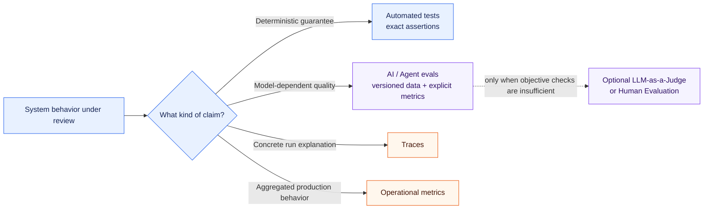

# ADR-005: Testing and Evaluation Strategy

## Status

Accepted

## Context

The project combines conventional software behavior with behavior that depends on LLM
judgment. These two categories have different quality properties. Domain invariants,
validation, dispatch, limits, mappings, and scoring can be guaranteed deterministically.
Tool selection, argument extraction from natural language, and later diagnostic
judgments can vary with models, prompts, and context even when model parameters are
held constant.

Using one quality mechanism for both categories would create misleading guarantees.
Ordinary tests cannot prove the quality of open-ended model judgment, while
probabilistic LLM evaluation cannot replace exact assertions for deterministic code.
The repository already demonstrates the distinction: the versioned tool-selection
dataset measures the first model decision, while deterministic unit tests cover the
dataset parser, exact-match scoring, aggregation, and agent safeguards.

The project needs a binding quality strategy that preserves this separation as agent
orchestration, retrieval, external integrations, and model choices evolve. It should
support useful evidence without prematurely selecting an evaluation platform,
observability stack, or CI/CD implementation.

## Decision

Use deterministic automated tests for behavior the system can guarantee
deterministically. Use evaluations with versioned datasets and explicit metrics for
behavior that inherently depends on model judgment. Tests and evaluations are distinct
quality mechanisms and must not be conflated.

Normal software tests must not be replaced with LLM-based evaluation. LLM-as-a-Judge
must not be used when an objective deterministic check can assess the property more
directly and reliably.

### Unit Tests

Unit tests verify deterministic behavior, including:

* Domain invariants and Value Objects
* validation and tool-argument validation
* tool dispatch
* limits and termination conditions
* mappings between internal and external representations
* deterministic eval parsing, scoring, and aggregation
* configuration logic
* error handling
* port-based Core logic using fakes or stubs

Unit tests must not require real LLM, network, database, or MCP calls. Model-dependent
responses are represented by controlled fakes or stubs when exercising Core behavior.
These tests are the fast, reproducible base quality gate.

### Integration Tests

Integration tests verify concrete adapters and external integrations separately from
the Core. Examples include:

* the OpenAI-compatible adapter against local Ollama
* future database adapters
* future MCP clients and servers
* future retrieval components

Integration tests must be clearly identifiable and explicitly selected. Tests that
require a running external service must not become an accidental dependency of every
normal unit-test run. Adapter behavior that can be checked without a live service
should still use deterministic tests at the narrowest useful boundary.

### Smoke Tests

Manual or explicitly started smoke tests may call real local or external services. They
verify that a basic end-to-end integration is operational; they do not replace
reproducible unit tests or structured evaluations.

The current example uses local Ollama, the configured `troubleshooting` Model Profile,
and the real tool-calling path. Its purpose is connectivity and basic path validation,
not a statistically meaningful quality claim.

### AI and Agent Evaluations

Versioned evaluation datasets measure behavior that depends on model judgment. The
currently implemented metrics are:

* Tool Selection Accuracy
* Tool Argument Accuracy

Possible later metrics include:

* task success
* trajectory quality
* unnecessary tool calls
* grounding
* unsupported claims
* retrieval recall and precision
* root-cause correctness
* safety violations
* latency
* token usage
* cost

These metrics are introduced only when the corresponding capability exists and the
metric has an explicit interpretation. This ADR does not imply that all listed metrics
must be implemented now.

An eval run may call a real LLM and is therefore not itself a deterministic software
test. Deterministic parts of its harness, such as loading, validation, scoring, and
aggregation, remain covered by unit tests.

### Evaluation Datasets and Ground Truth

Evaluation datasets:

* are versioned in the repository
* use stable `case_id` values
* express expected behavior in structured form whenever possible
* represent realistic and relevant tasks
* include more than simple happy-path prompts
* grow when production failures or regressions reveal missing cases

Generated evaluation reports are local artifacts by default and do not need to be
versioned automatically. A report may be committed only when deliberately curated for
a defined comparison or audit purpose.

Prefer structured ground truth such as `expected_tool`, `expected_arguments`,
`expected_root_cause`, and `required_evidence` over exact string matching of natural
language answers. Exact strings are appropriate only when wording itself is the
deterministic contract.

### Multi-Dimensional Evaluation

Agent quality must not be reduced to one Boolean when distinct dimensions matter.
Selection, arguments, task success, grounding, efficiency, and safety should be scored
separately where relevant. A factually correct conclusion with unsupported claims, for
example, is not fully correct: task success may pass while grounding fails.

Metrics must make their denominator, matching rule, and failure semantics explicit.
Aggregate scores should retain structured per-case results so regressions can be
diagnosed rather than hidden by one summary value.

### Regression Strategy

Relevant existing evaluations should be rerun and compared with their baseline before
material changes to:

* prompts or instructions
* models or Model Profile mappings
* tool schemas
* agent orchestration
* retrieval or reranking
* context building

The relevant subset depends on which behavior the change can affect. Improvements must
not be accepted solely from subjective chat impressions. Deterministic tests remain
mandatory in parallel; a better eval score cannot excuse a broken guarantee.

The existing first-decision tool-selection baseline remains the regression point for
Tool Selection Accuracy and Tool Argument Accuracy. ADR-004 may later add multi-step
orchestration evaluations without replacing that baseline.

### Model Comparison

ADR-002's Model Profile architecture enables the same evaluation cases to run against
different configured models without placing model names in agent or use-case code.
Comparisons may later consider accuracy, latency, token usage, cost, and reliability.

This ADR establishes no permanent model ranking. A comparison must record the concrete
model and relevant configuration used for the run even though application code selects
the semantic profile.

### LLM-as-a-Judge and Human Evaluation

LLM-as-a-Judge is permitted only for a relevant quality dimension that cannot be
assessed reliably with an objective deterministic rule. Judge-based results are
probabilistic. The judge model, prompt or rubric, rating scale, and relevant parameters
must be identifiable, and judge behavior should be calibrated against human ratings
where practical.

Judge evaluation must not be used for properties such as exact tool names, structured
arguments, schema validity, limit compliance, or numeric calculations when direct code
can check them. No LLM judge is implemented by this decision.

Human evaluation may be required for safety-critical, domain-complex, or otherwise hard
to automate cases. Human ratings may later provide the reference set for calibrating
automated judges. The rubric and reviewer context must be explicit enough to make those
ratings interpretable.

### Reproducibility

Evaluation runs should record, as far as practical:

* dataset identity or version
* semantic Model Profile
* concrete model
* relevant model parameters
* prompt or instruction version
* code version or commit
* tool schemas used by the run

Where relevant, provider or endpoint class and repeated-run information may also be
captured, but secrets must never appear in reports. Full bit-for-bit reproducibility is
not assumed for model inference; the goal is enough provenance to interpret and compare
runs. No experiment-tracking platform is introduced now.

### CI/CD

The architecture must allow deterministic tests and, later, sufficiently stable
evaluations to run in CI. Deterministic tests remain the fast base gate. Live cloud LLM
calls are not required for every normal build. Expensive, slow, credentialed, or
externally hosted evaluations can run as separate explicit jobs with their own policy.

This decision does not introduce or select CI/CD infrastructure.

### Testability as an Architecture Constraint

In accordance with ADR-003, Core components remain testable through ports and explicit
dependency injection without real external systems. Unit tests substitute fakes or
stubs for ports. Concrete Infrastructure adapters are tested separately at integration
boundaries. Testability is therefore a consequence of dependency direction, not an
afterthought implemented with hidden global replacements.

### Relationship to Observability

Testing, evaluation, and observability answer different questions:

* tests verify expected deterministic behavior
* evaluations measure AI and agent quality over defined cases and metrics
* traces explain what happened in a concrete run
* operational metrics aggregate production behavior over time

Evaluation results can use trace data as evidence, but traces alone do not determine
quality and evaluations do not replace production observability. Observability is not
fully specified by this ADR and may receive a separate architecture decision when the
need becomes concrete.

### Scope and Non-Decisions

This decision does not select or introduce:

* an external evaluation framework
* LangSmith
* Phoenix
* MLflow
* DeepEval
* an LLM-as-a-Judge implementation
* an observability platform
* concrete CI/CD infrastructure

Such choices are deferred until an implemented capability creates a demonstrated need.

## Alternatives

### 1. Use only conventional unit and integration tests

Rejected as the complete strategy. These tests are essential for guarantees, but they
cannot adequately measure whether an LLM chooses the right tool or makes a useful
domain judgment across representative natural-language inputs.

### 2. Use only manual chat tests

Rejected. Manual exploration is useful for discovery and smoke testing, but it lacks a
versioned case set, explicit metrics, reproducibility, and reliable regression
comparison.

### 3. Use LLM-as-a-Judge for almost everything

Rejected. It would make objective properties probabilistic, add model cost and failure
modes, and weaken exact guarantees for validation, dispatch, limits, and structured
outputs.

### 4. Separate deterministic tests and structured AI evaluations

Accepted. It assigns each quality claim to the mechanism suited to it: exact,
reproducible assertions for deterministic code and representative datasets with
explicit metrics for model judgment. It also preserves visible mechanics and supports
incremental growth without confusing measured quality with guaranteed behavior.

### 5. Introduce an external evaluation framework immediately

Deferred. The current focused dataset, runner, and metrics do not justify platform
complexity or a new dependency. A framework may be reconsidered when experiment
tracking, larger suites, distributed execution, richer traces, or team workflows create
a concrete requirement.

## Consequences

Positive:

* deterministic guarantees stay fast, exact, and reproducible
* model-dependent behavior receives explicit, versioned regression evidence
* failures can be localized across separate quality dimensions
* model and orchestration changes can be compared without coupling agent code to a
  concrete provider
* the quality strategy can grow incrementally without committing to a platform

Negative:

* the project must maintain both tests and evaluation datasets
* model-based eval runs can still vary and may require repeated measurements
* representative ground truth and human review require ongoing domain effort
* live integrations, model comparisons, and later judge evaluations can add cost and
  operational complexity
* teams must state clearly whether a reported result is a guarantee, an eval score, a
  smoke-test observation, or production telemetry

## Relationship to Existing Decisions

ADR-001 established pytest, Ruff, explicit mechanics, and incremental architecture.
ADR-005 extends that foundation with a cross-cutting quality strategy and adds no new
framework or runtime dependency.

ADR-002 remains unchanged. Semantic Model Profiles make comparative model evaluations
possible, while concrete model and parameter metadata provide run provenance.

ADR-003 remains unchanged. Ports and dependency injection keep Core logic testable with
fakes and stubs, and concrete Infrastructure adapters are verified separately.

ADR-004 defines deterministic orchestration safeguards that are verified with tests,
while model-dependent orchestration choices are measured with structured evaluations.
