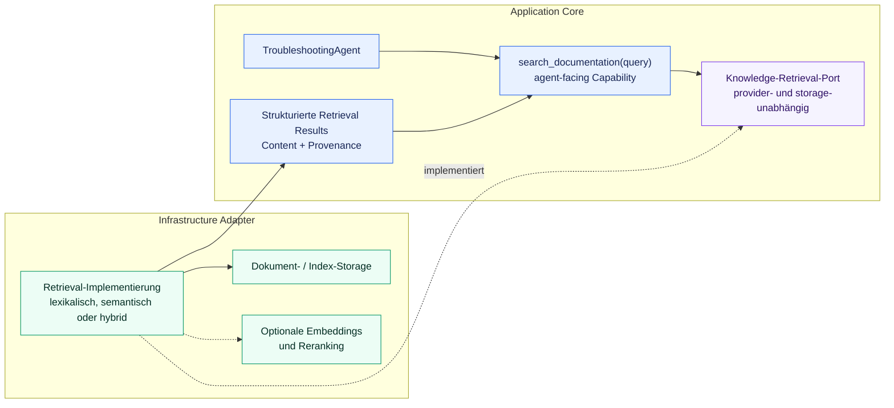

# ADR-006: Knowledge-Retrieval- und RAG-Architektur

## Status

Akzeptiert

## Kontext

`TroubleshootingAgent` bezieht derzeit strukturierte operative Evidenz über
`get_product_history(product_id)` und `get_machine_status(station_id)`. Eine zukünftige
Capability `search_documentation(query)` muss technische Dokumentation ergänzen, ohne
die Agent-Orchestrierung an Dokumentformate, Indizes, Vector Databases, Embedding
Provider, Retrieval-Algorithmen, Reranker oder RAG-Frameworks zu koppeln.

Knowledge Retrieval besitzt einen anderen Lebenszyklus als Agent Reasoning. Dokumente
werden außerhalb eines einzelnen Agent Requests beschafft, normalisiert, aufgeteilt und
indexiert. Zur Laufzeit ruft eine Query relevante Passagen ab, deren Herkunft bis in den
Agent Context erhalten bleiben muss. Eine Vermischung dieser Verantwortlichkeiten mit
dem Agenten würde die nach innen gerichtete Dependency-Richtung aus ADR-003 verletzen,
separate Retrieval-Evaluation erschweren und Infrastructure-Entscheidungen zu
Orchestrierungszwängen machen.

Technische Dokumentation enthält außerdem exakte Identifier wie Fehlercodes,
Stationsnamen, Komponenten-IDs und Teilenummern. Eine dauerhafte Festlegung
ausschließlich auf semantische Vector Search wäre daher verfrüht. Das Projekt benötigt
eine stabile Grenze, hinter der Retrieval-Qualität und Technologieentscheidungen
evidenzbasiert weiterentwickelt werden können, während die erste Implementierung klein
bleibt.

## Entscheidung

Knowledge Retrieval ist eine eigenständige Capability hinter einer inneren, provider-
und storage-unabhängigen Port-Grenze. Der Agent kennt ausschließlich die semantische
Capability `search_documentation(query)` und strukturierte interne Retrieval Results.
Konkreter Dokumentzugriff, Parsing, Indexing, Storage, Embedding, Retrieval und
Reranking bleiben außerhalb des Agenten und werden gemäß ADR-003 hinter inneren Ports
implementiert.

Der genaue Port-Name und die Request-/Result-DTOs werden mit dem ersten Retrieval-Slice
eingeführt. Diese ADR legt Ownership und Dependency-Richtung fest, nicht vorab
unnötige Interfaces oder physische Packages.

### Trennung der Verantwortlichkeiten

Das Knowledge-Subsystem trennt konzeptionell:

Dies sind Verantwortungsgrenzen und keine Vorgabe, dass jede Stufe sofort zu einer
Klasse, einem Service, einem Interface oder einer deploybaren Komponente werden muss.
Der erste Slice darf kein generisches Pipeline-Framework allein zur Abbildung des
Diagramms erzeugen.

Document Ingestion und Index Building sind konzeptionell vom Runtime Retrieval
getrennt. Ein Agent Request darf nicht erfordern, Dokumente erneut zu parsen, zu chunken
oder einzubetten. Eine kleine lokale Baseline darf beide Verantwortlichkeiten technisch
einfach implementieren, muss sie aber unterscheidbar halten, damit später ein
persistenter oder extern erstellter Index den initialen Mechanismus ersetzen kann.

### Agent-Grenze

`TroubleshootingAgent` entscheidet, ob Dokumentationsevidenz benötigt wird, und
formuliert die an `search_documentation` übergebene Query. Das Retrieval-Subsystem
entscheidet, welche Passagen für diese Query relevant sind. Der Agent implementiert
kein Ranking, und das Retrieval-Subsystem entscheidet nicht über die
Troubleshooting-Trajectory.

Agent, Domain und anderer Application-Core-Code dürfen nicht direkt abhängen von:

* Vector Databases oder Index-Clients
* Embedding- oder Reranking-SDKs
* konkreten Embedding- oder Reranking-Modell-Identifiern
* BM25- oder anderen Retrieval-Library-Typen
* Dateisystemlayouts oder Details von Dokumentparsern
* externen Search- oder RAG-Frameworks

Die Capability erhält ihren inneren Port über explizite Dependency Injection. Konkrete
Adapter werden an einer Composition Root ausgewählt und weder im Agenten noch in der
Capability oder Domain erzeugt.

### Strukturierte Results, Grounding und Provenance

`search_documentation` wird strukturierte interne Results statt eines einzigen opaken
Prompt-Strings zurückgeben. Ein Result muss mindestens Folgendes abbilden können:

* Passage Content oder Text
* einen Source Identifier
* einen Document Identifier
* einen Chunk Identifier
* Relevanzinformationen oder einen Score, sofern sinnvoll
* zur Interpretation der Passage erforderliche Metadata

Das genaue DTO und die verpflichtenden Felder gehören in den ersten
Implementierungs-Slice. Provider-, Transport-, Storage- und Parser-spezifische DTOs
bleiben außerhalb des Core und werden an Adaptergrenzen übersetzt.

Die Provenance einer Passage muss durch das Retrieval bis in die Agent Observation
erhalten bleiben. Dadurch können spätere Antworten, Traces und Evals Behauptungen mit
den verwendeten Dokumentpassagen als Evidenz verbinden. Diese ADR wählt weder eine
Citation UI noch eine Citation-Syntax oder eine Grounding-Policy für finale Antworten.

### Retrieval-Strategie und initiale Baseline

Die Architektur unterstützt lexical oder Keyword Retrieval, BM25-artiges Retrieval,
semantic oder Embedding Retrieval, Hybrid Retrieval und optionales Reranking. Sie ist
nicht ausschließlich auf Vector Search festgelegt. Eine konkrete Strategie wird anhand
realer Anforderungen und Retrieval-Evals ausgewählt und weiterentwickelt.

Die beabsichtigte erste Implementierung ist die kleinste messbare Baseline:

1. eine kleine lokale Sammlung repräsentativer technischer Dokumente,
2. deterministisches lexical oder Keyword-basiertes Retrieval,
3. strukturierte Results mit Provenance und
4. ein versioniertes Retrieval-Eval-Dataset.

Embeddings oder Hybrid Retrieval werden erst eingeführt, wenn Baseline und Evals eine
konkrete Qualitätslücke zeigen, die sie adressieren können. Diese Reihenfolge ist eine
Entwicklungsstrategie und keine dauerhafte Produktionsfestlegung auf lexical Retrieval.

### Embeddings und andere Modellrollen

Zukünftige Embedding-Modelle müssen austauschbar sein. Agent- und Domain-Code dürfen
keine konkreten Embedding Provider oder Modellnamen enthalten. Sobald tatsächlich eine
Embedding-basierte Implementierung eingeführt wird, sollte die innere Seite einen
fokussierten, provider-unabhängigen Embedding-Port definieren und Infrastructure ihn
implementieren. Bevor eine Retrieval-Implementierung ihn benötigt, wird kein
Embedding-Port im Produktionscode ergänzt.

Das Chat-/Reasoning-LLM aus ADR-002, Embedding-Modelle und mögliche Reranking-Modelle
sind unterschiedliche Modellrollen. Die Architektur setzt nicht voraus, dass sie
Provider, Protokoll, Endpoint, Modell, Lebenszyklus oder Credentials teilen. Es wird
keine generische `AIModelProvider`-Abstraktion eingeführt, um diese unterschiedlichen
Rollen vorzeitig zu vereinheitlichen.

### Storage, Chunking und Reranking

Index- und Document Storage sind Infrastructure-Verantwortlichkeiten. Mögliche spätere
Adapter umfassen In-Memory- oder lokale Indizes, PostgreSQL mit pgvector, Qdrant und
andere spezialisierte Stores. Dies sind Beispiele und keine ausgewählten Standards;
diese ADR wählt keine Vector Database aus.

Chunking gehört zu Knowledge Ingestion und Retrieval, nicht zur Agent-Orchestrierung.
Die Architektur muss unterschiedliche dokumentbezogene Strategien ermöglichen, aber
diese ADR wählt weder eine universelle Chunking-Abstraktion noch einen Algorithmus oder
eine Chunk-Größe. Chunking-Parameter müssen später für Retrieval-Evaluation verfügbar
sein, sobald sie relevant werden.

Reranking ist optional und darf zwischen initialem Retrieval und finalen strukturierten
Results eingefügt werden. Reranker-Port, Provider und Modell bleiben aufgeschoben, bis
eine implementierte Retrieval-Baseline ihren Bedarf belegt.

### Retrieval-Evaluation

ADR-005 gilt für Retrieval. Dataset Parsing, Schema-Validierung, Scoring, Mapping und
anderes objektiv prüfbares Verhalten verwenden deterministische Tests. Modell- oder
strategieabhängige Retrieval-Qualität verwendet versionierte Datasets mit stabilen
Case-IDs und strukturierter Relevanz-Ground-Truth.

Mögliche spätere Metriken sind Recall@k, Precision@k, Hit Rate, MRR, ob relevante
Source oder Chunk gefunden wurden, und unnötig zurückgegebene Chunks. Keine Metrik wird
verbindlich, bevor das erste Dataset und der Retrieval-Vertrag Nenner und Bedeutung
konkret machen.

Retrieval-Evals müssen unabhängig von vollständigen Agent-Trajectory-Evals ausführbar
sein. Diese Trennung ermöglicht, Fehler zu lokalisieren zwischen:

* der Agent hat die falsche Query formuliert oder ausgewählt,
* Retrieval hat die falsche Passage gerankt oder zurückgegeben und
* das LLM hat eine relevante Passage falsch interpretiert.

### Konfiguration und Secrets

Retrieval-Strategien, Storage Adapter und Embedding- oder Reranking-Modelle werden erst
dann über Konfiguration austauschbar, wenn mehrere reale Implementierungen dies
sinnvoll machen. Es wird keine generische Plugin Registry oder spekulative
Provider-Routing-Konfiguration eingeführt.

Normale Konfiguration und Secrets bleiben getrennt. Credentials für zukünftige Managed
Indexes, Embedding Provider, Search APIs oder Document Stores müssen aus Environment
Variables oder einem anderen freigegebenen Secret-Mechanismus stammen und dürfen weder
in normaler Konfiguration noch im Source Code committed werden.

### Hexagonal Architecture und MCP

Diese Entscheidung spezialisiert ADR-003. Innere Schichten besitzen die semantische
Capability, benötigte Ports und interne Retrieval-Modelle. Infrastructure implementiert
Dokumentzugriff, Index Storage, Embedding Provider, externe Retrieval Services und
andere technische Details. Infrastructure darf vom Core abhängen; der Core darf nicht
von Infrastructure abhängen.

Knowledge Retrieval darf später als Knowledge MCP Service exponiert werden. MCP wäre
eine Transport- oder Service-Grenze um die Capability und keine Voraussetzung für den
Retrieval Core. Diese Entscheidung führt keinen MCP-Code ein und wählt keine zukünftige
MCP-Service-Topologie.

### Umfang und Nicht-Entscheidungen

Diese ADR wählt oder implementiert nicht:

* eine konkrete Vector Database oder Index-Technologie
* ein konkretes Embedding-Modell, einen Provider oder eine Dimension
* eine konkrete Chunk-Größe oder einen Chunking-Algorithmus
* einen konkreten Reranker oder ein Reranking-Modell
* LangChain, LlamaIndex oder ein anderes RAG-Framework beziehungsweise eine Plattform
* einen Knowledge Graph oder GraphRAG
* eine MCP-Service-Aufteilung oder Deployment-Topologie
* Cloud Storage
* dauerhafte Einschränkungen auf bestimmte Dokumentformate
* eine Citation UI oder Citation-Syntax
* Produktionscode, Runtime Dependencies, Dokumente oder Eval-Datasets

Diese Entscheidungen bleiben aufgeschoben, bis implementierte Anforderungen und Evals
ausreichend Evidenz liefern.

## Alternativen

### 1. Dokumentation direkt in den Agent Prompt laden

Als Architektur verworfen. Dieser Ansatz skaliert nicht mit dem Dokumentvolumen,
koppelt Context Building an Document Storage und Parsing, verschwendet Context für
irrelevante Inhalte und schwächt die Provenance einzelner Passagen. Kleine Fixtures
dürfen weiterhin in Tests auftreten, Prompt Loading ist jedoch nicht die
Retrieval-Grenze.

### 2. Retrieval direkt in der Agent-Orchestrierung implementieren

Verworfen. Dies würde Trajectory-Entscheidungen mit Parsing, Ranking, Storage und
Provider-Belangen vermischen, die Dependency-Grenzen aus ADR-003 verletzen und
fokussierte Retrieval-Tests und -Evals verhindern.

### 3. Sofort eine Vector Database und Embeddings standardisieren

Für die erste Implementierung verworfen und als möglicher späterer Adapter
aufgeschoben. Der Ansatz würde das Projekt vor einem gemessenen Bedarf festlegen,
während exakte industrielle Identifier starkes lexical Retrieval benötigen können.
Embeddings und Vector Storage müssen ihre Komplexität durch vergleichende
Retrieval-Ergebnisse rechtfertigen.

### 4. Eigenständige Knowledge-Retrieval-Capability hinter Ports und Adapters

Akzeptiert. Der Agent erhält eine einzelne semantische Capability, strukturierte
Provenance bleibt erhalten, Technologien bleiben austauschbar, separate
Retrieval-Evaluation wird möglich und die bestehende Hexagonal Architecture wird
eingehalten.

Diese Option bedeutet nicht, jetzt eine generische Retrieval-Plattform zu bauen. Der
erste Slice kann einen fokussierten Port, eine kleine Capability, einen einfachen
lokalen Adapter und expliziten Code verwenden. Weitere Pipeline-Stufen, Ports,
Provider, Konfiguration und Services werden nur eingeführt, wenn ein implementierter
Bedarf sie rechtfertigt.

### 5. Sofort ein externes RAG-Framework einsetzen

Aufgeschoben. Ein Framework kann später helfen, wenn mehrere Loader, Stores,
Retrieval-Strategien, Observability-Integrationen oder Production Operations einen
konkreten Bedarf erzeugen. Heute würde es eine Runtime Dependency ergänzen und die
Mechanik verbergen, bevor die Baseline verstanden und gemessen ist.

## Konsequenzen

Positiv:

* der Agent bleibt unabhängig von Retrieval Providern, Storage und Frameworks
* Retrieval kann sich hinter einer stabilen Grenze von lexical zu semantic oder hybrid
  Strategien entwickeln
* strukturierte Provenance ermöglicht Grounding, Traceability und gezielte Evaluation
* Ingestion, Runtime Retrieval und Agent-Orchestrierung können unabhängig getestet und
  weiterentwickelt werden
* exakte industrielle Identifier werden nicht allein Vector Similarity untergeordnet
* der erste Slice kann klein und deterministisch bleiben

Negativ:

* das Projekt besitzt explizite interne Retrieval-Modelle und Adapter-Mappings
* Document Lifecycle und Index Freshness erfordern getrennte operative Betrachtung
* Retrieval-Qualität benötigt repräsentative Dokumente und gepflegte
  Relevance-Ground-Truth
* spätere Embedding-, Storage- oder Reranking-Integrationen können zusätzliche
  fokussierte Ports und Konfiguration erfordern

## Beziehung zu bestehenden Entscheidungen

ADR-001 bleibt unverändert. Diese Entscheidung folgt inkrementeller Entwicklung,
expliziter Mechanik und der Regel, dass Frameworks und Dependencies ihren Platz
verdienen müssen.

ADR-002 bleibt unverändert. Der provider-unabhängige `LLMClient` deckt weiterhin
Chat-/Reasoning-Aufrufe ab. Embedding und Reranking sind getrennte zukünftige
Modellrollen und rechtfertigen keine generische gemeinsame Provider-Abstraktion.

ADR-003 ist die übergeordnete Architektur. Knowledge-Retrieval-Ports und interne Modelle
gehören auf die innere Seite; konkrete Parser, Indizes, Stores, Modell-Provider, externe
Services und Protocol DTOs gehören in Infrastructure.

ADR-004 bleibt unverändert. Das LLM darf entscheiden, wann `search_documentation`
benötigt wird, während der begrenzte deterministische Loop weiterhin Validierung,
Dispatch, Ausführung, Limits und Terminierung kontrolliert. Retrieval wird nicht Teil
der Agent-Orchestrierung.

ADR-005 bleibt unverändert und regelt Retrieval-Tests und -Evaluation. Deterministische
Eigenschaften verwenden Tests, Retrieval-Qualität verwendet versionierte Datasets und
explizite Metriken, und Retrieval-Evaluation bleibt von End-to-End-Agent-Evaluation
trennbar.
