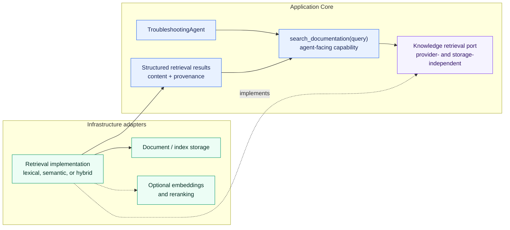

# ADR-006: Knowledge Retrieval and RAG Architecture

## Status

Accepted

## Context

`TroubleshootingAgent` currently obtains structured operational evidence through
`get_product_history(product_id)` and `get_machine_status(station_id)`. A future
`search_documentation(query)` capability must add technical documentation without
coupling agent orchestration to document formats, indexes, vector databases, embedding
providers, retrieval algorithms, rerankers, or RAG frameworks.

Knowledge retrieval has a different lifecycle from agent reasoning. Documents are
acquired, normalized, split, and indexed outside an individual agent request. At
runtime, a query retrieves relevant passages whose provenance must survive into the
agent context. Mixing those responsibilities into the agent would violate the inward
dependency direction from ADR-003, make retrieval difficult to evaluate independently,
and turn infrastructure choices into orchestration constraints.

Technical documentation also contains exact identifiers such as error codes, station
names, component IDs, and part numbers. A permanent commitment to semantic vector
search alone would therefore be premature. The project needs a stable boundary that
allows retrieval quality and technology choices to evolve from evidence while keeping
the first implementation small.

## Decision

Knowledge retrieval is a separate capability behind an inner, provider- and
storage-independent port boundary. The agent will know only the semantic
`search_documentation(query)` capability and structured internal retrieval results.
Concrete document access, parsing, indexing, storage, embedding, retrieval, and
reranking technologies remain outside the agent and are implemented behind inner
ports in accordance with ADR-003.

The exact port name and request/result DTOs will be introduced with the first retrieval
slice. This ADR fixes ownership and dependency direction, not unnecessary interfaces or
physical packages in advance.

### Separation of Responsibilities

The knowledge subsystem conceptually separates:

These are responsibility boundaries, not a requirement that every stage immediately
become a class, service, interface, or deployable component. The first slice must not
create a generic pipeline framework merely to mirror the diagram.

Document ingestion and index building are conceptually separate from runtime
retrieval. An agent request must not require documents to be reparsed, rechunked, or
re-embedded. A small local baseline may implement both responsibilities simply, but it
must keep them distinguishable so a persistent or externally built index can replace
the initial mechanism later.

### Agent Boundary

`TroubleshootingAgent` decides whether documentation evidence is needed and formulates
the query passed to `search_documentation`. The retrieval subsystem decides which
passages are relevant to that query. The agent does not implement ranking and the
retrieval subsystem does not decide the troubleshooting trajectory.

The agent, Domain, and other Application Core code must not depend directly on:

* vector databases or index clients
* embedding or reranking SDKs
* concrete embedding or reranking model identifiers
* BM25 or other retrieval-library types
* filesystem layouts or document-parser details
* external search or RAG frameworks

The capability receives its inner port through explicit dependency injection. Concrete
adapters are selected at a Composition Root; they are not constructed inside the
agent, capability, or Domain.

### Structured Results, Grounding, and Provenance

`search_documentation` will return structured internal results rather than one opaque
prompt string. A result must be able to represent at least:

* passage content or text
* a source identifier
* a document identifier
* a chunk identifier
* relevance information or a score when meaningful
* metadata needed to interpret the passage

The exact DTO and which fields are mandatory belong to the first implementation slice.
Provider-, transport-, storage-, and parser-specific DTOs remain outside the Core and
are translated at adapter boundaries.

Passage provenance must be preserved through retrieval and into the agent observation.
This enables later answers, traces, and evaluations to associate claims with the
document passages used as evidence. This ADR does not select a citation UI, a citation
syntax, or a final-answer grounding policy.

### Retrieval Strategy and Initial Baseline

The architecture supports lexical or keyword retrieval, BM25-like retrieval, semantic
or embedding retrieval, hybrid retrieval, and optional reranking. It is not committed
to vector search alone. A concrete strategy is selected and evolved using actual
requirements and retrieval evaluations.

The intended first implementation is the smallest measurable baseline:

1. a small local collection of representative technical documents,
2. deterministic lexical or keyword-based retrieval,
3. structured results with provenance, and
4. a versioned retrieval-evaluation dataset.

Embeddings or hybrid retrieval are introduced only when the baseline and evaluations
show a concrete quality gap they can address. This sequence is a development strategy,
not a permanent production commitment to lexical retrieval.

### Embeddings and Other Model Roles

Future embedding models must be replaceable. Agent and Domain code must not contain
concrete embedding provider or model names. When an embedding-based implementation is
actually introduced, the inner side should define a focused, provider-independent
embedding port and Infrastructure should implement it. No embedding port is added to
production code before a retrieval implementation needs it.

The chat/reasoning LLM from ADR-002, embedding models, and possible reranking models are
distinct model roles. The architecture does not assume that they share a provider,
protocol, endpoint, model, lifecycle, or credentials. No generic `AIModelProvider`
abstraction is introduced to unify these unlike roles prematurely.

### Storage, Chunking, and Reranking

Index and document storage are Infrastructure concerns. Possible later adapters include
in-memory or local indexes, PostgreSQL with pgvector, Qdrant, and other specialized
stores. These are examples, not selected standards, and no vector database is chosen by
this ADR.

Chunking belongs to knowledge ingestion and retrieval, not agent orchestration. The
architecture must permit different document-aware strategies, but this ADR chooses no
universal chunking abstraction, algorithm, or chunk size. Chunking parameters must be
available for later retrieval evaluation when they become relevant.

Reranking is optional and may be inserted between initial retrieval and final structured
results. A reranker port, provider, and model are deferred until an implemented
retrieval baseline demonstrates the need.

### Retrieval Evaluation

ADR-005 applies to retrieval. Dataset parsing, schema validation, scoring, mapping, and
other objectively checkable behavior use deterministic tests. Model- or
strategy-dependent retrieval quality uses versioned datasets with stable case IDs and
structured relevance ground truth.

Possible later metrics include Recall@k, Precision@k, Hit Rate, MRR, whether the
relevant source or chunk was found, and unnecessary returned chunks. No metric is made
mandatory until the first dataset and retrieval contract make its denominator and
meaning concrete.

Retrieval evaluations must be runnable independently from complete agent trajectory
evaluations. This separation allows failures to be localized among:

* the agent formulated or selected the wrong query,
* retrieval ranked or returned the wrong passage, and
* the LLM interpreted a relevant passage incorrectly.

### Configuration and Secrets

Retrieval strategies, storage adapters, and embedding or reranking models become
configuration-selectable only when multiple real implementations make that useful. No
generic plugin registry or speculative provider-routing configuration is introduced.

Ordinary configuration and secrets remain separate. Credentials for future managed
indexes, embedding providers, search APIs, or document stores must come from environment
variables or another approved secret mechanism and must not be committed in normal
configuration or source code.

### Hexagonal Architecture and MCP

This decision specializes ADR-003. Inner layers own the semantic capability, required
ports, and internal retrieval models. Infrastructure implements document access, index
storage, embedding providers, external retrieval services, and other technical details.
Infrastructure may depend on the Core; the Core must not depend on Infrastructure.

Knowledge retrieval may later be exposed as a Knowledge MCP service. MCP would be a
transport or service boundary around the capability, not a prerequisite for the
retrieval core. This decision introduces no MCP code and does not choose a future MCP
service topology.

### Scope and Non-Decisions

This ADR does not select or introduce:

* a concrete vector database or index technology
* a concrete embedding model, provider, or dimension
* a concrete chunk size or chunking algorithm
* a concrete reranker or reranking model
* LangChain, LlamaIndex, or another RAG framework or platform
* a Knowledge Graph or GraphRAG
* an MCP service split or deployment topology
* cloud storage
* permanent restrictions to particular document formats
* a citation UI or citation syntax
* production code, runtime dependencies, documents, or eval datasets

These choices are deferred until implemented requirements and evaluations provide
enough evidence.

## Alternatives

### 1. Load documentation directly into the agent prompt

Rejected as the architecture. It does not scale with document volume, couples context
construction to document storage and parsing, wastes context on irrelevant content,
and weakens passage-level provenance. Small fixtures may still appear in tests, but
prompt loading is not the retrieval boundary.

### 2. Implement retrieval directly in agent orchestration

Rejected. It would mix trajectory decisions with parsing, ranking, storage, and
provider concerns; violate ADR-003 dependency boundaries; and prevent focused retrieval
testing and evaluation.

### 3. Standardize immediately on a vector database and embeddings

Rejected for the first implementation and deferred as a possible later adapter. It
would commit the project before a measured need exists, while exact industrial
identifiers may require strong lexical retrieval. Embeddings and vector storage must
earn their complexity through comparative retrieval results.

### 4. Separate knowledge-retrieval capability behind ports and adapters

Accepted. It gives the agent one semantic capability, preserves structured provenance,
keeps technology choices replaceable, supports independent retrieval evaluations, and
follows the existing Hexagonal Architecture.

This option does not imply building a generic retrieval platform now. The first slice
can use one focused port, one small capability, one simple local adapter, and explicit
code. Additional pipeline stages, ports, providers, configuration, and services are
introduced only when an implemented need justifies them.

### 5. Adopt an external RAG framework immediately

Deferred. A framework may later help when multiple loaders, stores, retrieval
strategies, observability integrations, or production operations create a concrete
need. Today it would add a runtime dependency and hide mechanics before the baseline is
understood and measured.

## Consequences

Positive:

* the agent remains independent of retrieval providers, storage, and frameworks
* retrieval can evolve from lexical to semantic or hybrid strategies behind a stable
  boundary
* structured provenance enables grounding, traceability, and targeted evaluation
* ingestion, runtime retrieval, and agent orchestration can be tested and evolved
  independently
* exact industrial identifiers are not subordinated to vector similarity alone
* the first slice can remain small and deterministic

Negative:

* the project owns explicit internal retrieval models and adapter mappings
* document lifecycle and index freshness require separate operational consideration
* retrieval quality requires representative documents and maintained relevance ground
  truth
* later embedding, storage, or reranking integrations may require additional focused
  ports and configuration

## Relationship to Existing Decisions

ADR-001 remains unchanged. This decision follows incremental development, explicit
mechanics, and the rule that frameworks and dependencies must earn their place.

ADR-002 remains unchanged. The provider-independent `LLMClient` continues to cover
chat/reasoning calls. Embedding and reranking are separate future model roles and do not
justify a generic shared provider abstraction.

ADR-003 is the governing architecture. Knowledge-retrieval ports and internal models
belong to the inner side; concrete parsers, indexes, stores, model providers, external
services, and protocol DTOs belong to Infrastructure.

ADR-004 remains unchanged. The LLM may decide when `search_documentation` is needed,
while the bounded deterministic loop continues to own validation, dispatch, execution,
limits, and termination. Retrieval does not become agent orchestration.

ADR-005 remains unchanged and governs retrieval testing and evaluation. Deterministic
properties use tests, retrieval quality uses versioned datasets and explicit metrics,
and retrieval evaluation remains separable from end-to-end agent evaluation.
