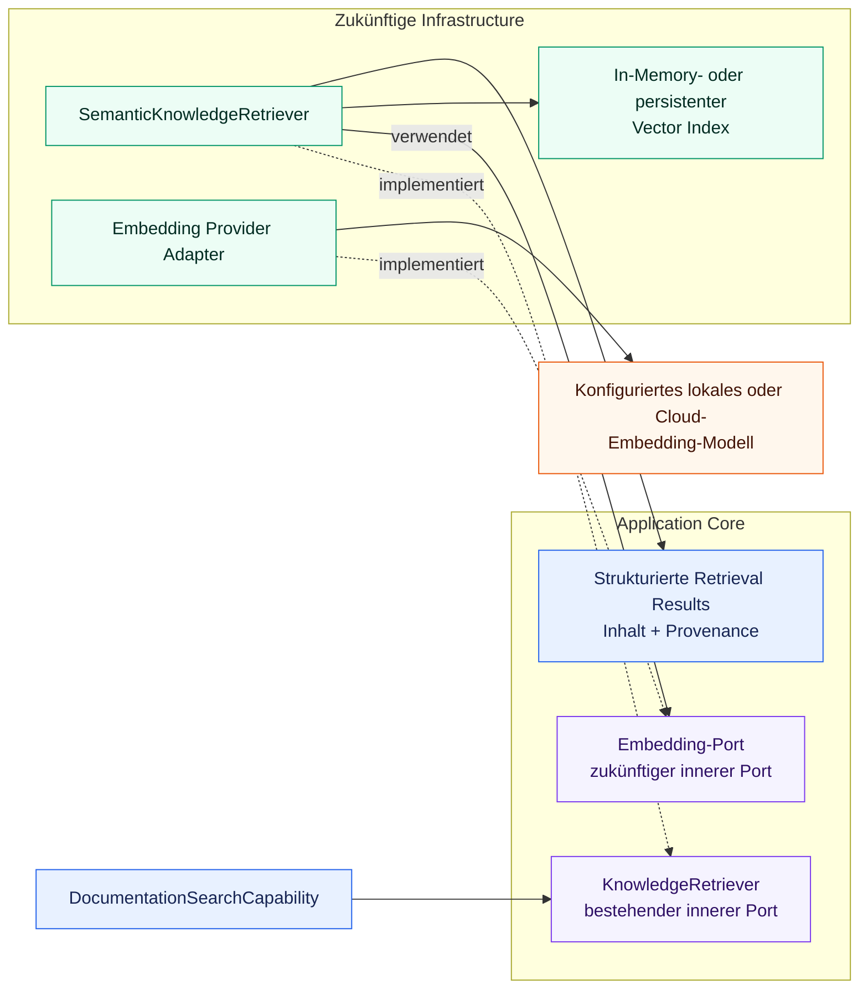

# ADR-007: Abstraktion für Embedding-Modelle

## Status

Akzeptiert

## Kontext

Das Knowledge-Retrieval-Subsystem vergleicht derzeit deterministische lexical
Strategien hinter dem provider- und storage-unabhängigen `KnowledgeRetriever`-Port. Der
nächste evidenzbasierte Vergleich kann Semantic Retrieval ergänzen. Diese
Implementierung benötigt eine Modell-Capability, die Text auf numerische
Vektorrepräsentationen abbildet, ohne einen konkreten Provider, ein Modell, einen
Endpoint oder ein SDK gegenüber dem Retrieval Core offenzulegen.

ADR-002 definiert `LLMClient` für Chat, Reasoning, Tool Calling und generierte
Antworten. Embedding-Modelle besitzen eine andere Operation, Request- und
Response-Struktur, Batch-Anforderung, einen anderen Lifecycle und andere
Evaluationsbelange. Embeddings als weitere `LLMClient`-Operation zu behandeln, würde
die Semantik dieses Ports schwächen und unabhängige Modellrollen koppeln. Ein
generischer Client für jede Art von AI-Modell hätte dasselbe Problem in größerem
Umfang.

ADR-006 legt bereits fest, dass Embedding-Modelle eine zukünftige, austauschbare
Modellrolle sind, dass bei tatsächlichem Bedarf einer Embedding-basierten
Implementierung ein fokussierter innerer Port eingeführt wird und dass Ingestion und
Index Building vom Query-Runtime-Retrieval getrennt sind. Diese ADR präzisiert die
Embedding-spezifische Grenze ausreichend für die erste Implementierung, ohne Modell
oder Infrastruktur vorzeitig auszuwählen.

## Entscheidung

### Eigenständige Modellrolle

Embedding-Modelle sind eine von Chat- und Reasoning-LLMs getrennte Modellrolle.

`LLMClient` bleibt verantwortlich für:

* Chat-Interaktionen
* Reasoning-Antworten
* Tool Calling
* generierte Textantworten

Die zukünftige Embedding-Capability ist ausschließlich dafür verantwortlich, Text in
eine numerische Vektorrepräsentation für Retrieval oder einen anderen explizit
implementierten Embedding-Anwendungsfall umzuwandeln.

Die Embedding-Capability darf nicht zu `LLMClient` hinzugefügt werden. Das Projekt führt
auch keine gemeinsame `AIModelClient`- oder ähnliche generische Abstraktion für
unterschiedliche Modellrollen ein. Getrennte Ports erhalten kohärente Verträge und
lassen die Rollen unabhängig hinsichtlich Provider, Protokoll, Lifecycle, Credentials
und Betriebsverhalten variieren.

### Fokussierter innerer Embedding-Port

Wenn die erste Semantic-Retrieval-Implementierung Embeddings tatsächlich benötigt,
besitzt der Core einen kleinen provider-unabhängigen Embedding-Port. Konzeptionell muss
der Port Folgendes unterstützen:

* einen einzelnen Text einbetten
* mehrere Texte effizient als Batch einbetten

Der genaue Port-Name, die Methodensignaturen, Input-Bedingungen, der interne Vektortyp,
das Fehlermodell und Batch-Limits bleiben bis zu dieser Implementierung offen. Der Port
muss interne Typen verwenden und darf keine Request-, Response- oder Exception-Typen
eines Provider-SDKs offenlegen.

Diese ADR legt die zukünftige Grenze fest, fügt den Port aber nicht zum Produktionscode
hinzu. Dieser Zeitpunkt folgt ADR-003 und ADR-006: Abstraktionen werden eingeführt, wenn
eine implementierte Core-Capability sie benötigt, nicht spekulativ.

### Provider-Unabhängigkeit und Konfiguration

Konkrete Embedding Adapter gehören in `infrastructure`. Spätere Adapter könnten Ollama,
OpenAI, eine andere lokale Runtime oder einen anderen Cloud-Provider anbinden. Dies sind
Beispiele und keine ausgewählten Standards.

Embedding-Provider, Modellname, Endpoint und provider-spezifische Betriebsparameter
gehören in Konfiguration und Infrastructure, nicht in Domain, Agent-Code, Tools oder
provider-unabhängige Retrieval-Verträge. Der Ansatz semantischer Model Profiles aus
ADR-002 ist ein nützliches konzeptionelles Vorbild für die Trennung von Task-Intention
und Modellauswahl. Embedding-Konfiguration muss aber weder denselben Konfigurationstyp
noch `LLMClient` wiederverwenden. Wiederverwendung ist nur bei tatsächlich gemeinsamer
Semantik angemessen.

### Semantic-Retrieval-Grenze

Ein zukünftiger `SemanticKnowledgeRetriever` darf:

* Dokument-Chunks während des Index Builds über den Embedding-Port einbetten
* eine Query zur Runtime über denselben kompatiblen Embedding Space einbetten
* Similarity deterministisch berechnen
* passende Chunks ranken
* strukturierte Ergebnisse mit Inhalt, Score und Provenance über den bestehenden
  `KnowledgeRetriever`-Port liefern

Agent und `DocumentationSearchCapability` hängen weiterhin ausschließlich von
`KnowledgeRetriever` ab. Sie wissen nicht, ob ein konkreter Retriever lexical Scoring,
Embeddings oder einen anderen Infrastructure-Mechanismus verwendet.

Die geplante Dependency-Grenze lautet:



Jedes Embedding-spezifische Element in diesem Diagramm ist geplant und derzeit nicht
implementiert.

### Vektorrepräsentation und Similarity

Der Core definiert keine feste Embedding-Dimension als Architekturvorgabe. Die
Vektordimension ist eine Eigenschaft des konfigurierten Embedding-Modells und muss an
der Adapter- oder Indexgrenze validiert werden, an der Kompatibilität relevant ist.
Agent- und Domain-Code dürfen sie nicht hart codieren.

Diese ADR wählt keine projektweite Similarity-Metrik aus. Cosine Similarity ist eine
naheliegende erste Baseline, bleibt aber eine Implementierungsentscheidung des ersten
Semantic Retrievers und muss dort dokumentiert und getestet werden. Eine spätere
evidenzbasierte Änderung darf keine Änderung am agent-facing Retrieval-Vertrag
erfordern.

### Index, Storage und Lifecycle

Diese Entscheidung wählt keinen Vector Store aus. Ein In-Memory-Vector-Index reicht für
die erste kleine Knowledge Base aus, sofern er die Anforderungen der Implementierung
erfüllt. Persistente Vector Stores bleiben Infrastructure-Belange und werden erst
eingeführt, wenn Corpus-Größe, Startup-Kosten, Aktualität, Deployment oder betriebliche
Anforderungen sie rechtfertigen.

Die Lifecycle-Trennung aus ADR-006 bleibt verbindlich:

* Ingestion und Index Building erzeugen Dokument-Embeddings
* Runtime Retrieval bettet die Query ein und durchsucht den vorbereiteten Index

Dokument-Chunks dürfen nicht bei jeder Query erneut eingebettet werden. Die erste
Implementierung darf den Dokument-Index beim expliziten Aufbau des Adapters oder
Service erzeugen, solange das Query-Retrieval ihn wiederverwendet. Dokument- und
Query-Vektoren müssen aus einem kompatiblen Embedding Space stammen; ein Wechsel des
Modells oder einer anderen kompatibilitätsrelevanten Konfiguration erfordert einen
entsprechenden Index Rebuild oder eine Kompatibilitätsprüfung.

### Evaluationsbaseline

ADR-005 regelt die Semantic-Retrieval-Evaluation. Der erste Semantic Retriever muss
gegen das eingefrorene Dataset `knowledge_retrieval_v2.jsonl` und denselben
eingefrorenen Knowledge Corpus gemessen werden, die für Simple, IDF und BM25 verwendet
werden. Der dokumentierte SHA-256 des Datasets lautet:

```text
E535816185D90DA816C5FD2033865094BD430E3752AE19632647E82309A46EA6
```

Der Vergleich muss mindestens Simple, IDF, BM25 und Semantic Embedding Retrieval
umfassen. Dataset-Fälle, Ground Truth, Chunking und Corpus dürfen nicht als Reaktion auf
Semantic-Retrieval-Ergebnisse geändert werden. Deterministische Tests decken, soweit
anwendbar, Port-Verhalten, Mapping, Vektorvalidierung, Similarity-Berechnung, Indexing
und Eval Scoring ab; Retrieval-Qualität wird mit dem versionierten Dataset gemessen.

### Local-first und Security

Die erste Implementierung soll ein geeignetes lokal gehostetes Embedding-Modell
bevorzugen, sofern eines verfügbar ist. Dies ist eine Entwicklungspräferenz für
Datenschutz, Reproduzierbarkeit und kostengünstige Iteration, keine dauerhafte
Provider-Festlegung.

Lokale nicht authentifizierte Provider dürfen keine künstlichen, vom Benutzer
bereitzustellenden Secrets verlangen. Secrets für Cloud-Provider verbleiben
ausschließlich in Environment Variables oder einem anderen genehmigten Secret-
Mechanismus gemäß den bestehenden Security-Regeln. Sie dürfen nicht in Source Code,
normaler Konfiguration, Domain, Agent-Code oder Retrieval Results erscheinen.

### Hexagonal Architecture

Der Embedding-Port gehört auf die innere Seite, weil der Core die benötigte Capability
besitzt. Konkrete Provider Adapter und provider-spezifische Konfiguration gehören in
`infrastructure`. Ein Semantic Retriever darf vom inneren Embedding-Port abhängen,
während er den bestehenden `KnowledgeRetriever`-Port implementiert. Agent, Domain und
Tools dürfen nicht von einem konkreten Embedding Adapter, SDK, Provider, Modell oder
Vector Store abhängen.

Konkrete Adapter werden in einer Composition Root ausgewählt, explizit verdrahtet und
per Dependency Injection bereitgestellt. Provider DTOs und Fehler werden an der
Adaptergrenze übersetzt.

### Beziehung zu bestehenden Entscheidungen

ADR-002 bleibt unverändert und regelt weiterhin Chat- und Reasoning-LLMs über
`LLMClient` und semantische Model Profiles. ADR-007 ergänzt eine separate
Embedding-Modellrolle; sie ersetzt ADR-002 nicht und verschmilzt die beiden Ports
nicht.

ADR-003 bleibt das maßgebliche Dependency-Modell. Der zukünftige Embedding-Port wird
von der inneren Seite besessen, während konkrete Embedding-Integrationen in
Infrastructure verbleiben.

ADR-005 regelt deterministische Tests und die eingefrorene vergleichende
Retrieval-Evaluation.

ADR-006 bleibt unverändert. Sie besitzt die allgemeineren Knowledge-Retrieval- und
RAG-Grenzen; ADR-007 spezialisiert ihre bereits akzeptierte Regel, dass Embeddings einen
fokussierten provider-unabhängigen Port verwenden, der erst mit der ersten realen
Semantic-Implementierung eingeführt wird.

### Scope und Nicht-Entscheidungen

Diese ADR wählt Folgendes weder aus noch führt sie es ein:

* ein konkretes Embedding-Modell
* eine feste Embedding-Dimension
* einen konkreten Cloud-Provider
* eine Vector Database
* ein Persistenzformat
* Quantisierung
* GPU- oder CPU-Deployment
* eine Similarity-Metrik als projektweiten Standard
* einen Hybrid-Fusion-Algorithmus
* einen Reranker
* MCP-Exposure
* eine Implementierung des Embedding-Ports oder eines Adapters
* Semantic-Retrieval-, Vector-Index- oder Evaluationscode

Diese Entscheidungen bleiben offen, bis Implementierungsevidenz und betriebliche
Anforderungen sie notwendig machen.

## Alternativen

### 1. Ein Provider-SDK direkt aus dem Semantic Retriever aufrufen

Abgelehnt. Provider-Request-Typen, Modellnamen, Credentials, Fehler und Lifecycle wären
an das Retrieval Ranking gekoppelt. Ein Provider-Wechsel oder das Testen des Retrievers
ohne Live-Modell würde unnötig tiefgreifend.

### 2. `LLMClient` um Embeddings erweitern

Abgelehnt. Chat-Generierung und Embedding haben unterschiedliche Verträge,
Response-Strukturen, Batch-Verhalten, Lifecycles und Fehlersemantiken. Embeddings würden
`LLMClient` weniger kohärent machen und Capabilities implizieren, die Chat Adapter
möglicherweise nicht bereitstellen.

### 3. Einen generischen `AIModelClient` für jede Modellrolle einführen

Abgelehnt. Eine API mit dem kleinsten gemeinsamen Nenner würde bedeutende Unterschiede
zwischen Chat-, Embedding- und möglichen Reranking-Modellen verdecken, während eine
breite Union-artige API jedem Consumer irrelevante Operationen und Konfiguration
offenlegen würde. Kein implementierter Bedarf rechtfertigt diese Abstraktion.

### 4. Bei Bedarf von Semantic Retrieval einen kleinen eigenen Embedding-Port einführen

Akzeptiert. Er stellt genau die benötigten Single-Text- und Batch-Capabilities bereit,
erhält Provider-Unabhängigkeit und deterministische Tests, folgt Hexagonal Architecture
und vermeidet die Kopplung unabhängiger Modellrollen. Das Aufschieben der genauen
Signatur bis zur Implementierung verhindert spekulatives API-Design.

### 5. Sofort eine externe Embedding- oder RAG-Plattform einsetzen

Für die erste Implementierung abgelehnt. Eine Plattform würde Dependencies, Lifecycle
und Abstraktionen ergänzen, bevor die kleine lokale Baseline einen Bedarf dafür zeigt,
und könnte die Mechanismen verdecken, die dieses Lernprojekt evaluieren soll. Sie kann
neu betrachtet werden, wenn Skalierung oder betriebliche Anforderungen Evidenz liefern.

## Konsequenzen

Positiv:

* Chat- und Embedding-Verträge bleiben kohärent und unabhängig austauschbar
* Semantic Retrieval bleibt von Provider-SDKs und Modell-Identifiern unabhängig
* Single-Text- und Batch-Embedding können explizit repräsentiert werden
* lokale und Cloud Adapter können verglichen werden, ohne Retrieval-Consumer zu ändern
* der bestehende `KnowledgeRetriever` hält den Agenten unabhängig von Ranking-Technik
* Index-Lifecycle und eingefrorene Evaluationsregeln bleiben explizit

Negativ:

* das Projekt besitzt bei Implementierung von Semantic Retrieval einen weiteren kleinen
  Port und eine weitere Adaptergrenze
* Embedding-Konfiguration kann von LLM Model Profiles getrennt sein
* Adapterimplementierungen müssen provider-spezifisches Batching, Fehler und
  Vektorantworten übersetzen
* ein Wechsel des Embedding-Modells kann Index Rebuilds und Kompatibilitätsprüfungen
  erfordern
* Provider-Portabilität ist auf die bewusst vom fokussierten Port angebotene Semantik
  begrenzt
