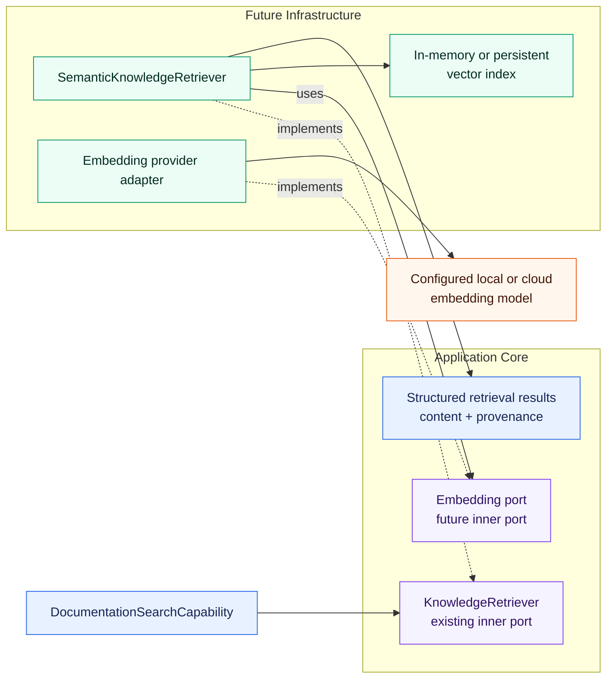

# ADR-007: Embedding Model Abstraction

## Status

Accepted

## Context

The knowledge-retrieval subsystem currently compares deterministic lexical strategies
behind the provider- and storage-independent `KnowledgeRetriever` port. The next
evidence-driven comparison may add semantic retrieval. That implementation will need a
model capability that maps text to numeric vector representations without exposing a
concrete provider, model, endpoint, or SDK to the retrieval core.

ADR-002 defines `LLMClient` for chat, reasoning, tool calling, and generated responses.
Embedding models have a different operation, request shape, response shape, batching
requirement, lifecycle, and evaluation concern. Treating embeddings as another
`LLMClient` operation would weaken that port's semantics and couple unrelated model
roles. A generic client for every kind of AI model would have the same problem at a
larger scale.

ADR-006 already establishes that embedding models are a future, replaceable model role,
that a focused inner port should be introduced when an embedding-based implementation
needs it, and that ingestion and index building are separate from query-time retrieval.
This ADR makes the embedding-specific boundary precise enough to guide that first
implementation without choosing its model or infrastructure prematurely.

## Decision

### Separate Model Role

Embedding models are a model role separate from chat and reasoning LLMs.

`LLMClient` remains responsible for:

* chat interactions
* reasoning responses
* tool calling
* generated text responses

The future embedding capability is responsible only for transforming text into a
numeric vector representation suitable for retrieval or another explicitly implemented
embedding use case.

The embedding capability must not be added to `LLMClient`, and the project will not
introduce a shared `AIModelClient` or similar generic abstraction for unlike model
roles. Separate ports preserve cohesive contracts and allow the roles to vary
independently in provider, protocol, lifecycle, credentials, and operational behavior.

### Focused Inner Embedding Port

When the first semantic-retrieval implementation actually requires embeddings, the
Core will own a small provider-independent embedding port. Conceptually, the port must
support:

* embedding one text value
* embedding multiple text values efficiently as a batch

The exact port name, method signatures, input constraints, internal vector type, error
model, and batching limits are deferred until that implementation makes them concrete.
The port must use internal types and must not expose provider SDK request, response, or
exception types.

This ADR establishes the future boundary but does not add the port to production code.
That timing follows ADR-003 and ADR-006: abstractions are introduced when an implemented
Core capability needs them, not speculatively.

### Provider Independence and Configuration

Concrete embedding adapters belong to `infrastructure`. Possible later adapters could
target Ollama, OpenAI, another local runtime, or another cloud provider. These are
examples, not selected standards.

The embedding provider, model name, endpoint, and provider-specific operational
settings belong in configuration and Infrastructure, not in Domain, agent code, tools,
or provider-independent retrieval contracts. ADR-002's semantic Model Profile approach
is a useful conceptual precedent for separating task intent from model selection, but
embedding configuration does not have to reuse the same configuration type or
`LLMClient`. Reuse is appropriate only where the semantics are genuinely shared.

### Semantic Retrieval Boundary

A future `SemanticKnowledgeRetriever` may:

* embed document chunks through the embedding port while building its index
* embed a query through the same compatible embedding space at runtime
* calculate similarity deterministically
* rank matching chunks
* return structured results with content, score, and provenance through the existing
  `KnowledgeRetriever` port

The agent and `DocumentationSearchCapability` continue to depend only on
`KnowledgeRetriever`. They do not know whether a concrete retriever uses lexical
scoring, embeddings, or another Infrastructure mechanism.

The planned dependency boundary is:



Every embedding-specific element in this diagram is planned, not currently
implemented.

### Vector Representation and Similarity

The Core does not define a fixed embedding dimension as an architectural constraint.
Vector dimension is a property of the configured embedding model and must be validated
at the adapter or index boundary where compatibility matters. Agent and Domain code
must not hard-code it.

This ADR does not select a project-wide similarity metric. Cosine similarity is a
reasonable first baseline, but it remains an implementation decision of the first
semantic retriever and must be documented and tested there. A later evidence-based
change must not require changes to the agent-facing retrieval contract.

### Index, Storage, and Lifecycle

This decision selects no vector store. An in-memory vector index is sufficient for the
first small knowledge base if it meets the implementation's requirements. Persistent
vector stores remain Infrastructure concerns and will be introduced only when corpus
size, startup cost, freshness, deployment, or operational requirements justify them.

ADR-006's lifecycle separation remains binding:

* ingestion and index building create document embeddings
* runtime retrieval embeds the query and searches the prepared index

Document chunks must not be embedded again for every query. The first implementation
may build the document index during explicit adapter or service construction, as long
as query-time retrieval reuses it. Document and query vectors must come from a
compatible embedding space; changing the model or other compatibility-relevant
configuration requires a corresponding index rebuild or compatibility check.

### Evaluation Baseline

ADR-005 governs semantic-retrieval evaluation. The first semantic retriever must be
measured against the frozen `knowledge_retrieval_v2.jsonl` dataset and the same frozen
knowledge corpus used for Simple, IDF, and BM25. The documented dataset SHA-256 is:

```text
E535816185D90DA816C5FD2033865094BD430E3752AE19632647E82309A46EA6
```

The comparison must include at least Simple, IDF, BM25, and Semantic Embedding
Retrieval. Dataset cases, ground truth, chunking, and corpus must not be changed in
response to semantic-retrieval results. Deterministic tests cover port behavior,
mapping, vector validation, similarity calculation, indexing, and eval scoring where
applicable; retrieval quality is measured by the versioned dataset.

### Local-First and Security

The first implementation should prefer a suitable locally hosted embedding model when
one is available. This is a development preference for privacy, reproducibility, and
low-cost iteration, not a lasting provider commitment.

Local unauthenticated providers must not require artificial user-supplied secrets.
Secrets for cloud providers remain exclusively in environment variables or another
approved secret mechanism under the existing security rules. They must not appear in
source code, ordinary configuration, Domain, agent code, or retrieval results.

### Hexagonal Architecture

The embedding port belongs on the inner side because the Core owns the capability it
needs. Concrete provider adapters and provider-specific configuration belong to
`infrastructure`. A semantic retriever may depend on the inner embedding port while
implementing the existing `KnowledgeRetriever` port. Agent, Domain, and tools must not
depend on a concrete embedding adapter, SDK, provider, model, or vector store.

Concrete adapters are selected and wired at a Composition Root through explicit
dependency injection. Provider DTOs and errors are translated at the adapter boundary.

### Relationship to Existing Decisions

ADR-002 remains unchanged and continues to govern chat and reasoning LLMs through
`LLMClient` and semantic Model Profiles. ADR-007 adds a separate embedding model role;
it neither replaces ADR-002 nor merges the two ports.

ADR-003 remains the governing dependency model. The future embedding port is owned by
the inner side, while concrete embedding integrations remain in Infrastructure.

ADR-005 governs deterministic tests and the frozen comparative retrieval evaluation.

ADR-006 remains unchanged. It owns the broader knowledge-retrieval and RAG boundaries;
ADR-007 specializes its already accepted rule that embeddings use a focused,
provider-independent port introduced only with the first real semantic implementation.

### Scope and Non-Decisions

This ADR does not select or introduce:

* a concrete embedding model
* a fixed embedding dimension
* a concrete cloud provider
* a vector database
* a persistence format
* quantization
* GPU or CPU deployment
* a similarity metric as a project-wide standard
* a hybrid-fusion algorithm
* a reranker
* MCP exposure
* an embedding port or adapter implementation
* semantic-retrieval, vector-index, or evaluation code

These decisions remain deferred until implementation evidence and operational
requirements make them necessary.

## Alternatives

### 1. Call a provider SDK directly from the semantic retriever

Rejected. Provider request types, model names, credentials, errors, and lifecycle would
be coupled to retrieval ranking. Replacing the provider or testing the retriever without
a live model would become unnecessarily invasive.

### 2. Extend `LLMClient` to support embeddings

Rejected. Chat generation and embedding have different contracts, response shapes,
batching behavior, lifecycle, and failure semantics. Adding embeddings would make
`LLMClient` less cohesive and imply capabilities that chat adapters may not provide.

### 3. Introduce one generic `AIModelClient` for every model role

Rejected. A lowest-common-denominator API would erase meaningful differences among
chat, embedding, and possible reranking models, while a broad union-style API would
expose irrelevant operations and configuration to each consumer. No implemented need
justifies that abstraction.

### 4. Introduce a small dedicated embedding port when semantic retrieval needs it

Accepted. It gives the retrieval implementation the precise single-text and batch
capabilities it needs, preserves provider independence and deterministic tests, follows
Hexagonal Architecture, and avoids coupling unrelated model roles. Deferring the exact
signature until implementation prevents speculative API design.

### 5. Adopt an external embedding or RAG platform immediately

Rejected for the first implementation. A platform would add dependencies, lifecycle,
and abstractions before the small local baseline demonstrates a need for them, and it
could obscure the mechanics this learning project intends to evaluate. It may be
reconsidered when scale or operational requirements provide evidence.

## Consequences

Positive:

* chat and embedding contracts remain cohesive and independently replaceable
* semantic retrieval remains independent of provider SDKs and model identifiers
* single-text and batch embedding can be represented explicitly
* local and cloud adapters can be compared without changing retrieval consumers
* the existing `KnowledgeRetriever` keeps the agent independent of ranking technology
* index lifecycle and frozen evaluation rules remain explicit

Negative:

* the project will own another small port and adapter boundary when semantic retrieval
  is implemented
* configuration for embeddings may be separate from LLM Model Profiles
* adapter implementations must translate provider-specific batching, errors, and
  vector responses
* changing an embedding model may require index rebuilding and compatibility checks
* provider portability is limited to the semantics deliberately exposed by the focused
  port
