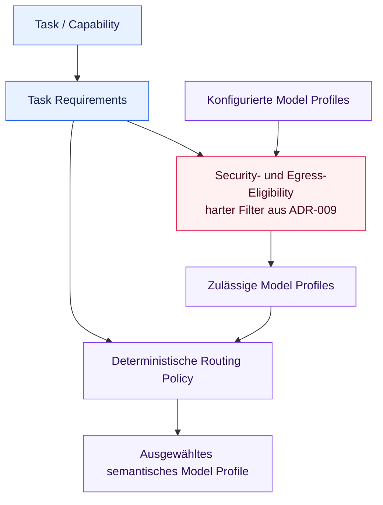

# ADR-008: Task-Level Model Routing

## Status

Akzeptiert

## Kontext

ADR-002 trennt Agent- und Use-Case-Intention durch semantische Model Profiles von
konkreten Providern und Modellen. Die aktuelle Implementierung besitzt ein einziges
`troubleshooting`-Profil, das explizit für den gesamten Agent Run ausgewählt wird. Wenn
das Projekt tatsächlich unterschiedliche Tasks ergänzt, kann eine einzelne globale
oder Agent-weite Auswahl nicht ausdrücken, dass einfache Extraktion, komplexes
Troubleshooting, Vision-Analyse und Evaluation unterschiedliche Modellfähigkeiten und
betriebliche Trade-offs benötigen können.

Konkrete Modellnamen müssen in der Konfiguration verbleiben. Gleichzeitig darf die
Modellauswahl nicht zu einem unbeschränkten LLM-Urteil oder adaptiven
Optimierungssystem werden, bevor repräsentative Messungen und mehrere reale
Wahlmöglichkeiten existieren. Der erste Routing-Mechanismus muss explizit,
deterministisch, testbar und klein sein.

Die Eignung eines Modells ist nicht gleichbedeutend mit der Erlaubnis, Daten an dieses
Modell zu senden. Datenklassifikation und Egress sind Security-Entscheidungen unter
ADR-009. Routing darf nur unter Profiles optimieren, die diese Security Boundary bereits
passiert haben.

## Entscheidung

### Auswahl auf Task-Ebene

Chat- und Reasoning-Modelle werden auf Task- oder Capability-Ebene aus semantischen Task
Requirements und konfigurierten Model Profiles ausgewählt. Agent- und Use-Case-Code
drückt aus, was ein Task benötigt; er darf keine konkreten Provider-Namen, Modellnamen,
Endpoints oder SDK-Typen enthalten.

Der initiale Router wendet eine explizite deterministische Policy an. Er verwendet
weder ein LLM noch Machine Learning, historische Reward-Optimierung oder
selbstverändernde Regeln zur Modellauswahl.

Diese ADR definiert die zukünftige Auswahlgrenze. Sie führt weder Router noch Task-
Requirements-Typ, neue Model Profiles, Konfigurationsfelder oder Runtime Dependency
ein. Die kleinsten konkreten Strukturen werden erst festgelegt, wenn die erste
Implementierung mehrere sinnvolle Profiles zur Auswahl hat.

### Task Requirements

Ein Task darf konzeptionell Anforderungen und Präferenzen ausdrücken wie:

* Task-Typ oder semantische Task-Rolle
* erforderliche Modellfähigkeiten
* minimale Qualitätsklasse
* Kostenpräferenz oder Kostenklasse
* Latenzpräferenz
* Execution Constraints
* Datenklassifikation und erlaubte Execution Zone

Nicht jedes Feld muss in der ersten Implementierung existieren. Erforderliche
Eigenschaften wirken als harte Constraints; Präferenzen dürfen ansonsten zulässige
Profiles ordnen. Der spätere minimale Typ muss diese Unterscheidung explizit machen und
provider-unabhängige Begriffe verwenden.

Task Requirements werden deterministisch von der aufrufenden Capability oder dem Use
Case bereitgestellt. Die erste Implementierung fragt kein LLM danach, seine eigene
Qualitätsklasse, Security-Klassifikation oder Routing Constraints abzuleiten.

### Eigenschaften von Model Profiles

Konfigurierte Model Profiles dürfen konzeptionell Folgendes beschreiben:

* semantische Profile ID
* Provider
* konkretes Modell
* Endpoint
* unterstützte Capabilities
* Execution Zone
* Kostenklasse
* Qualitätsklasse

Konkrete Provider-, Modell- und Endpoint-Werte verbleiben in Konfiguration und
Infrastructure. Agent- und Use-Case-Code arbeitet mit semantischen Anforderungen und
Profile IDs. Die Profile-Konfiguration darf nur um Eigenschaften wachsen, die eine
implementierte Routing-Regel benötigt; diese Entscheidung erzeugt keine generische
Provider Registry oder Plugin-Plattform.

Provider-Identität und Execution Zone sind getrennte Eigenschaften. ADR-009 definiert
deren Security-Bedeutung und Validierung.

### Routing-Reihenfolge

Die Auswahl folgt dieser konzeptionellen Reihenfolge:

Security Eligibility ist ein harter Filter und kein gewichteter Routing-Faktor. Kosten,
Latenz, Qualität, Verfügbarkeit oder Fallback-Regeln dürfen niemals ein von ADR-009
abgelehntes Profile wieder einführen. Der Router erhält oder erzeugt ausschließlich die
weiterhin zulässigen Profiles.

Die genaue Tie-Breaking- und Sortier-Policy bleibt bis zur Implementierung offen und
muss deterministisch und dokumentiert sein. Eine sinnvolle erste Policy darf harte
Requirements filtern und anschließend das günstigste Profile wählen, das minimale
Qualitäts- und Capability-Anforderungen erfüllt, mit einem stabil konfigurierten
Tie-Break. Diese ADR legt keine solche Reihenfolge fest.

### Kosten- und Qualitätsstrategie

Die Grenze muss explizite Policies ermöglichen wie:

* einfache Tasks bevorzugen ein kleineres oder günstigeres zulässiges Modell
* komplexe Tasks erfordern eine stärkere Qualitätsklasse
* Vision Tasks erfordern ein Vision-fähiges Modell
* Evaluation Tasks erfordern ein passendes Evaluation- oder Judge Profile
* sensitive Tasks verwenden ausschließlich von ADR-009 erlaubte Execution Zones

Qualitäts- und Kostenklassen sind semantische Konfigurationswerte und keine Aussage,
dass ein Provider universell besser oder günstiger ist. Ihre konkrete Skala und
Schwellenwerte werden mit den ersten gemessenen Use Cases festgelegt. Ein LLM
klassifiziert in der initialen Implementierung nicht automatisch die Task-Komplexität.

### Fallback und Fehler

Fallback darf später ein anderes Profile nur aus derselben Security-zulässigen Menge
oder aus einer neu geprüften Menge auswählen, die weiterhin die aktuelle ADR-009-Policy
erfüllt. Alle harten Task Requirements und Execution-Zone-Einschränkungen müssen
erhalten bleiben.

Ist kein zulässiges Profile verfügbar, schlägt die Operation deterministisch fehl. Ein
sensitiver Task darf niemals auf ein öffentliches Modell zurückfallen, nur weil ein
lokales Modell nicht verfügbar, günstiger, langsamer oder fehlerhaft ist. Ein
Verfügbarkeitsfehler darf Security nicht abschwächen.

Automatische Eskalation, Retry Graphs und Fallback Chains werden durch diese
Entscheidung nicht eingeführt.

### Evaluation

ADR-005 gilt. Deterministisches Routing-Verhalten einschließlich Requirement Matching,
Security-Filterung, Tie-Breaking, Fallback-Grenzen und No-Match-Fehler muss durch exakte
Tests ohne Live-Modellaufrufe abgedeckt werden.

Die Qualität gerouteter Modellentscheidungen darf später pro Task mit expliziten
Metriken evaluiert werden, beispielsweise:

* Task Success
* Tool Accuracy
* Trajectory Quality
* Latenz
* Kosten
* Zuverlässigkeit

Evaluationsergebnisse informieren bewusste Konfigurations- und Policy-Änderungen. Diese
ADR erlaubt keine automatische Modellauswahl, kein Online Learning und keine
Policy-Mutation aus diesen Metriken.

### Hexagonal Architecture

Task Requirements und deterministische Routing Policy gehören auf die innere
Application- oder Policy-Seite, weil sie ausdrücken, was der Use Case benötigt.
Provider-Konfiguration, SDK Clients und konkrete Adapter verbleiben in Infrastructure.
Die Composition Root lädt und validiert Konfiguration und verdrahtet den ausgewählten
Adapter, ohne konkrete Modelldetails an Agent oder Use Case durchzureichen.

Die genaue Port- oder Service-Struktur bleibt offen. Die erste Implementierung darf
kein generisches Routing Framework nur zur Abbildung dieses konzeptionellen Flows
erzeugen.

### Beziehung zu bestehenden Entscheidungen

ADR-002 bleibt gültig. Agent- und Use-Case-Code wählt weiterhin anhand semantischer
Intention und verwendet `LLMClient`; ADR-008 erweitert die Auswahl von einem expliziten
Profile pro Agent Run auf deterministisches Task-Level Routing zwischen mehreren
geeigneten Profiles. Sie erzeugt keine generische Multi-Provider Registry.

ADR-003 regelt die Dependency-Richtung. Routing Policy und Requirements sind innere
Belange; Provider Adapter und Laden der Konfiguration verbleiben Infrastructure-
Belange.

ADR-004 bleibt gültig. Der begrenzte Single-Agent Tool Loop bleibt unverändert, und
Model Routing wird weder Planning noch Multi-Agent-Orchestrierung oder eine vom LLM
kontrollierte Garantie.

ADR-005 regelt deterministische Routing Tests und spätere Modellqualitäts-Evaluationen.

ADR-007 bleibt gültig. Embedding-Modelle verwenden einen separaten zukünftigen Port und
werden nicht über `LLMClient` geroutet. Task-Level-Regeln dürfen später die Auswahl
innerhalb anderer Modellrollen inspirieren, aber diese ADR erzeugt weder einen
gemeinsamen `AIModelClient` noch eine Cross-Role-Routing-Abstraktion.

ADR-009 regelt Datenklassifikation, Execution-Zone-Eligibility, abschließende Egress-
Prüfungen und Fail-Closed-Verhalten. Ihre Security-Entscheidung geht dem ADR-008-Routing
voraus und beschränkt es.

### Scope und Nicht-Entscheidungen

Diese ADR wählt Folgendes weder aus noch führt sie es ein:

* einen ML- oder LLM-basierten Router
* automatische Qualitäts- oder Komplexitätsklassifikation durch ein LLM
* automatische Eskalation
* Bandit- oder Reinforcement-Learning-Routing
* dynamische Kostenoptimierung
* providerübergreifendes Load Balancing
* automatische Benchmark-basierte Auswahl
* Multi-Agent-Routing
* eine generische Plugin- oder Provider-Plattform
* neue Model Profiles oder Profile-Felder
* Produktionscode oder Runtime Dependencies

Diese Entscheidungen bleiben offen, bis gemessene Anforderungen sie rechtfertigen.

## Alternativen

### 1. Ein globales Modell für den gesamten Agenten verwenden

Als langfristige Auswahlstrategie abgelehnt. Dies ist einfach und bleibt für die
aktuelle Implementierung ausreichend, kann aber keine Task-spezifischen Capabilities
oder Kosten-Qualitäts-Trade-offs ausdrücken, sobald mehrere reale Tasks und Profiles
existieren.

### 2. Konkrete Modelle direkt im Agent-Code auswählen

Abgelehnt. Provider- und Modellnamen würden in Application-Verhalten gelangen, ADR-002
widersprechen, Austausch und Tests erschweren und Routing Policy mit Orchestrierung
vermischen.

### 3. Task-Level Model Profiles mit einem deterministischen Router verwenden

Akzeptiert. Semantische Requirements halten Use Cases provider-unabhängig,
deterministische Regeln bleiben prüfbar und testbar, und Security Eligibility kann die
Kandidatenmenge beschränken, bevor Kosten- und Qualitätspräferenzen betrachtet werden.

### 4. Das LLM entscheiden lassen, welches Modell den Task übernimmt

Abgelehnt. Dem aktuellen Modell kann die Durchsetzung von Capability-, Kosten-,
Verfügbarkeits- oder Security-Constraints nicht anvertraut werden. Seine Verwendung für
Routing erzeugt zudem eine rekursive Dependency und nicht deterministisches
Fehlerverhalten.

### 5. Sofort einen adaptiven oder lernenden Router einführen

Für die aktuelle Phase abgelehnt. Dem Projekt fehlen Traffic, Reward-Signal, Profile-
Vielfalt und betriebliche Kontrollen, die Bandit-, Reinforcement-Learning- oder
selbstoptimierende Routing-Komplexität rechtfertigen würden.

## Konsequenzen

Positiv:

* die Modellwahl kann Task-spezifische Capability-, Qualitäts-, Kosten- und
  Latenzanforderungen berücksichtigen
* Agent- und Use-Case-Code bleibt frei von konkreten Provider- und Modell-Identifiern
* Routing-Entscheidungen können reproduziert, erklärt und getestet werden
* Security Eligibility bleibt gegenüber Optimierung und Fallback maßgeblich
* Modellqualitätsvergleiche können sich ohne Änderung des `LLMClient`-Vertrags
  weiterentwickeln

Negativ:

* zukünftige Implementierungen müssen semantische Requirement- und Profile-Metadaten
  definieren und pflegen
* deterministische Routing-Regeln benötigen explizite Prioritäten und stabiles
  Tie-Breaking
* Konfigurationsfehler können dazu führen, dass kein Profile zulässig ist, und müssen
  eindeutig fehlschlagen
* Kosten- und Qualitätsklassen benötigen Evidenz und Governance, um aussagekräftig zu
  bleiben
* mehrere Profiles erhöhen Evaluations- und Betriebsaufwand
