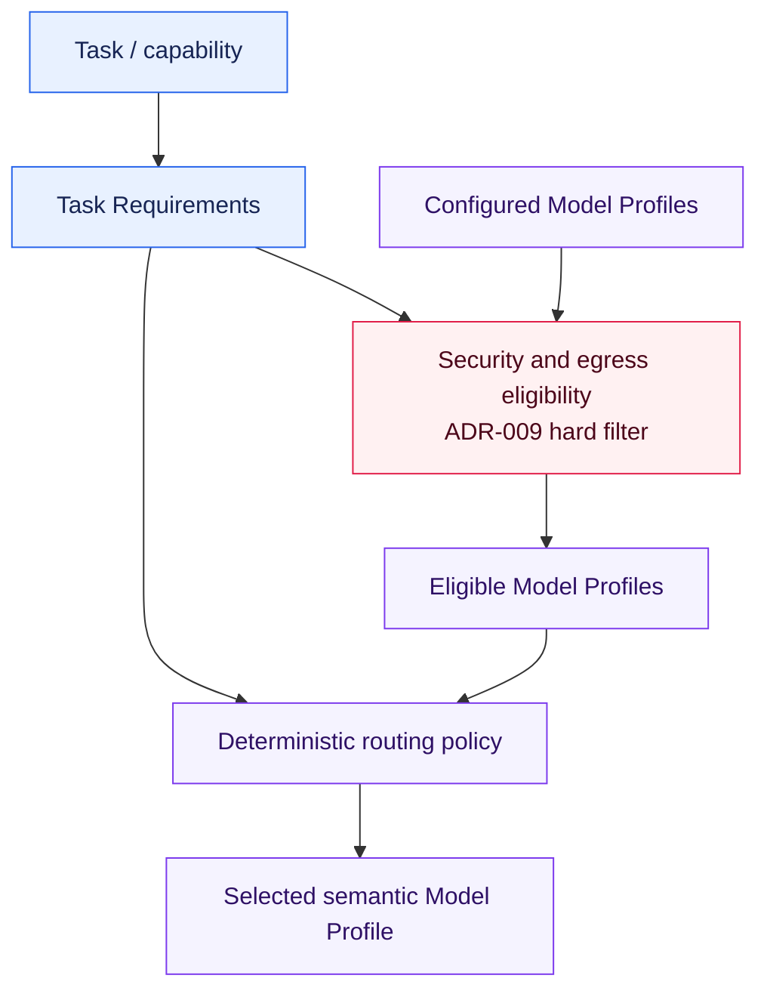

# ADR-008: Task-Level Model Routing

## Status

Accepted

## Context

ADR-002 separates agent and use-case intent from concrete providers and models through
semantic Model Profiles. The current implementation has one `troubleshooting` profile,
selected explicitly for the complete agent run. As the project adds genuinely different
tasks, a single global or per-agent choice cannot express that simple extraction,
complex troubleshooting, vision analysis, and evaluation may need different model
capabilities and operational trade-offs.

Concrete model names must remain configuration. At the same time, model selection must
not become an unconstrained LLM judgment or an adaptive optimization system before the
project has representative measurements and multiple real choices. The first routing
mechanism needs to be explicit, deterministic, testable, and small.

Model suitability is not the same as permission to send data to that model. Data
classification and egress are security decisions governed by ADR-009. Routing may
optimize only among profiles that have already passed that security boundary.

## Decision

### Task-Level Selection

Chat and reasoning models are selected at task or capability level from semantic Task
Requirements and configured Model Profiles. Agent and use-case code expresses what a
task needs; it must not contain concrete provider names, model names, endpoints, or SDK
types.

The initial router will apply an explicit deterministic policy. It will not use an LLM,
machine learning, historical reward optimization, or self-modifying rules to select a
model.

This ADR defines the future selection boundary. It introduces no router, Task
Requirements type, new Model Profiles, configuration fields, or runtime dependency.
The smallest concrete structures will be defined only when the first implementation
has multiple meaningful profiles to choose from.

### Task Requirements

A task may conceptually express requirements and preferences such as:

* task type or semantic task role
* required model capabilities
* minimum quality class
* cost preference or cost class
* latency preference
* execution constraints
* data classification and allowed execution zone

Not every field must exist in the first implementation. Required properties act as
hard constraints; preferences may order otherwise eligible profiles. The eventual
minimal type must make that distinction explicit and use provider-independent terms.

Task Requirements are supplied deterministically by the invoking capability or use
case. The first implementation will not ask an LLM to infer its own quality class,
security classification, or routing constraints.

### Model Profile Properties

Configured Model Profiles may conceptually describe:

* semantic profile ID
* provider
* concrete model
* endpoint
* supported capabilities
* execution zone
* cost class
* quality class

Concrete provider, model, and endpoint values remain configuration and Infrastructure
concerns. Agent and use-case code reasons in semantic requirements and profile IDs.
Profile configuration may grow only with properties needed by an implemented routing
rule; this decision does not create a generic provider registry or plugin platform.

Provider identity and execution zone are separate properties. ADR-009 defines their
security meaning and validation.

### Routing Order

Selection follows this conceptual order:

Security eligibility is a hard filter, not a weighted routing factor. Cost, latency,
quality, availability, or fallback rules must never reintroduce a profile rejected by
ADR-009. The router receives or produces only the profiles that remain eligible.

The exact tie-breaking and ordering policy is deferred to implementation and must be
deterministic and documented. A reasonable first policy may filter hard requirements,
then select the lowest-cost profile that satisfies the minimum quality and capability
requirements, with a stable configured tie-break. No such ordering is fixed by this
ADR.

### Cost and Quality Strategy

The boundary must allow explicit policies such as:

* simple tasks prefer a smaller or lower-cost eligible model
* complex tasks require a stronger quality class
* vision tasks require a vision-capable model
* evaluation tasks require an appropriate evaluation or judge profile
* sensitive tasks use only execution zones allowed by ADR-009

Quality and cost classes are semantic configuration values, not claims that one
provider is universally better or cheaper. Their concrete scale and thresholds will be
defined with the first measured use cases. An LLM will not automatically classify task
complexity in the initial implementation.

### Fallback and Failure

Fallback may later select another profile only from the same security-eligible set, or
from a newly evaluated set that still passes the current ADR-009 policy. It must preserve
all hard Task Requirements and execution-zone restrictions.

If no eligible profile is available, the operation fails deterministically. A sensitive
task must never fall back to a public model merely because a local model is unavailable,
cheaper, slower, or unhealthy. Availability failure cannot weaken security.

Automatic escalation, retry graphs, and fallback chains are not introduced by this
decision.

### Evaluation

ADR-005 applies. Routing behavior that is deterministic, including requirement
matching, security filtering, tie-breaking, fallback boundaries, and no-match failure,
must be covered by exact tests without live model calls.

The quality of routed model choices may later be evaluated per task using explicit
metrics such as:

* task success
* tool accuracy
* trajectory quality
* latency
* cost
* reliability

Evaluation results inform deliberate configuration and policy changes. This ADR does
not authorize automatic model selection, online learning, or policy mutation from
those metrics.

### Hexagonal Architecture

Task Requirements and the deterministic routing policy belong to the inner Application
or policy side because they express what the use case requires. Provider configuration,
SDK clients, and concrete adapters remain in Infrastructure. The Composition Root loads
and validates configuration and wires the selected adapter without leaking concrete
model details into the agent or use case.

The exact port or service shape is deferred. The first implementation must not create a
generic routing framework merely to mirror this conceptual flow.

### Relationship to Existing Decisions

ADR-002 remains valid. Agent and use-case code continues to select by semantic intent
and use `LLMClient`; ADR-008 extends selection from one explicit profile per agent run to
deterministic task-level routing among multiple suitable profiles. It does not create a
generic multi-provider registry.

ADR-003 governs dependency direction. Routing policy and requirements are inner
concerns; provider adapters and configuration loading remain Infrastructure concerns.

ADR-004 remains valid. The bounded single-agent tool loop is unchanged, and model
routing does not become planning, multi-agent orchestration, or an LLM-controlled
guarantee.

ADR-005 governs deterministic routing tests and later model-quality evaluations.

ADR-007 remains valid. Embedding models use a separate future port and are not routed
through `LLMClient`. Task-level rules may inspire selection within other model roles
later, but this ADR does not create a shared `AIModelClient` or cross-role routing
abstraction.

ADR-009 governs data classification, execution-zone eligibility, final egress checks,
and fail-closed behavior. Its security decision precedes and constrains ADR-008 routing.

### Scope and Non-Decisions

This ADR does not select or introduce:

* an ML- or LLM-based router
* automatic quality or complexity classification by an LLM
* automatic escalation
* bandit or reinforcement-learning routing
* dynamic cost optimization
* cross-provider load balancing
* automatic benchmark-driven selection
* multi-agent routing
* a generic plugin or provider platform
* new Model Profiles or profile fields
* production code or runtime dependencies

These choices remain deferred until measured requirements justify them.

## Alternatives

### 1. Use one global model for the complete agent

Rejected as the long-term selection strategy. It is simple and remains sufficient for
the current implementation, but it cannot express task-specific capabilities or
cost-quality trade-offs once multiple real tasks and profiles exist.

### 2. Select concrete models directly in agent code

Rejected. Provider and model names would leak into application behavior, contradict
ADR-002, complicate replacement and testing, and mix routing policy with orchestration.

### 3. Use task-level Model Profiles with a deterministic router

Accepted. Semantic requirements keep use cases provider-independent, deterministic
rules remain inspectable and testable, and security eligibility can constrain the
candidate set before cost and quality preferences are considered.

### 4. Let the LLM choose which model should handle the task

Rejected. The current model cannot be trusted to enforce capability, cost, availability,
or security constraints, and using it for routing creates a recursive dependency and
non-deterministic failure behavior.

### 5. Introduce an adaptive or learning router immediately

Rejected for the current stage. The project lacks the traffic, reward signal, profile
diversity, and operational controls needed to justify bandit, reinforcement-learning,
or self-optimizing routing complexity.

## Consequences

Positive:

* model choice can reflect task-specific capability, quality, cost, and latency needs
* agent and use-case code remains free of concrete provider and model identifiers
* routing decisions can be reproduced, explained, and tested
* security eligibility remains authoritative over optimization and fallback
* model-quality comparisons can evolve without changing the `LLMClient` contract

Negative:

* future implementations must define and maintain semantic requirement and profile
  metadata
* deterministic routing rules need explicit priority and stable tie-breaking
* configuration errors can leave no eligible model and must fail clearly
* cost and quality classes require evidence and governance to remain meaningful
* multiple profiles increase evaluation and operational maintenance
