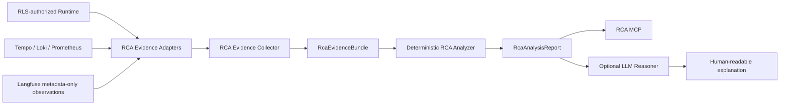

# ADR-017: Automated Root-Cause Analysis Evidence and Reasoning Boundaries

## Status

Accepted

## Context

The Industrial AI Agent has separate safe runtime facts, distributed trace/log/metric
evidence, and metadata-only LLM observations. Operators need repeatable investigations
of failures, latency, tool trajectories, retrieval stages, and model usage without
turning observability stores into unrestricted data channels or treating an LLM
interpretation as a proven cause.

## Decision

Automated root-cause analysis is an Application capability with provider-independent,
bounded contracts. It is not an Agent loop, a new write path, or a generic query proxy.



The `RcaAnalysisService` is reusable by RCA MCP/Codex and by an authenticated
FastAPI/UI adapter. It depends on Application contracts and evidence ports, never on
MCP transport. Runtime MCP and Observability MCP remain independent evidence-oriented
Infrastructure interfaces; they are not converted into RCA reasoning services.

`RcaEvidenceBundle` contains safe projections only: persisted runtime facts, trace/span
timing and failure metadata, MCP/tool trajectory metadata, retrieval-stage metadata,
correlated metadata-only logs, bounded metric context, LLM/model metadata, token and
cost measurements with provenance, approval metadata, persistence timing, and a source
availability state for every supported source. It contains no prompts, model responses,
tool arguments/results, retrieved document content, raw log lines, SQL, credentials,
URLs, arbitrary attributes, or observability query languages.

Every evidence item has a deterministic, report-local reference such as `EV-TRACE-001`.
References are unique only inside one report and are not persisted identifiers. Findings
cite those references instead of embedding backend payloads.

The meaning of a finding is explicit:

* `OBSERVED`: directly supported by bounded evidence.
* `DERIVED`: deterministically computed from observed evidence.
* `HYPOTHESIS`: plausible but not proved by deterministic evidence.
* `CONFIRMED_RUN_CAUSE`: emitted only by an explicitly registered deterministic
  cause-signature rule, or by a future explicitly modeled human confirmation.

A failed span is an observed failure location, not a confirmed root cause. An LLM can
never promote a finding to `CONFIRMED_RUN_CAUSE`, alter deterministic confidence, or
modify evidence.

The future deterministic analyzer is a pure Application boundary:

```text
RcaEvidenceBundle -> DeterministicRcaAnalyzer -> tuple[RcaFinding, ...]
```

It performs no network or backend access. Future deterministic cause signatures may
combine a persisted terminal error code, failed operation, service, and sanitized error
code. They are explicit registered rules, never generic string matching.

Slices B and C implement narrow Application evidence ports and Infrastructure adapters over
the existing RLS-filtered run store and bounded observability service. Collection first
uses the request-scoped `SecurityContext` to perform an authorized runtime lookup, then
uses only the resulting authorized run to correlate a trace. A missing or inaccessible
run fails closed before any telemetry lookup. Runtime-infrastructure failure is surfaced
as a safe service failure because authorization cannot be established. Tempo, Loki, and
Prometheus are collected independently: their unavailability, absence, or malformed
safe projection produces an explicit partial or insufficient report without stopping
unrelated collection.

Slice C adds optional Langfuse evidence only after that Runtime RLS gate and Tempo trace
correlation have succeeded: `SecurityContext -> RLS-authorized runtime lookup ->
authorized run -> trace_id -> Langfuse lookup`. A trace identifier alone never grants
Langfuse access. The Infrastructure adapter uses Langfuse's supported public
Observations API v2, filtered to the known trace, a fixed time window, one bounded page,
a two-second request timeout, and no retries. It accepts only `agent.run`/`AGENT` and
`llm.call`/`GENERATION`, then projects an explicit allowlist: correlation consistency,
safe model/provider/profile metadata, status, start/end-derived duration, provider
usage fields that exist, and narrowly classified cost fields. Input, output, raw
metadata, user/session identifiers, tags, URLs, and all other response fields are
discarded.

Token measurements are `OBSERVED` only when their individual provider-reported
input/output/total value is present. Missing values are not inferred. A Langfuse
`totalCost` is `OBSERVED/RUN` only when a separate Langfuse observation marker explicitly
states `observed_run_cost`. The current telemetry marker `configured_api_cost` is instead
represented, when present, as `CONFIGURED/MODEL_CONFIGURATION`; it is never evidence of
actual run cost. No derived cost calculation is implemented. Langfuse backend failure,
missing data, malformed data, service authorization failure, and a bounded-page
truncation remain isolated from the rest of RCA and map to explicit source status or
limitation.

Where both sources are available, the deterministic analyzer reports rather than hides
Tempo/Langfuse disagreement: trace correlation, `llm.call` versus generation count,
generation timing overlap, and model/provider values when both exist. These are
`OBSERVED` or `DERIVED` telemetry limitations, never root causes. It reports generation
count, known model/provider, provider usage, duration, and valid observed cost without
calling a run slow, costly, or inefficient. Langfuse evidence cannot produce
`HYPOTHESIS` or `CONFIRMED_RUN_CAUSE`.

Slice B's deterministic analyzer emits only `OBSERVED` and `DERIVED` findings. It emits
no hypotheses and implements no confirmed-cause signatures because no stable persisted
multi-fact signature is currently available. It reports terminal runtime failures,
failed spans, MCP discovery/tool boundaries, failed retrieval stages, repeated tool
names, incomplete telemetry, and measured timing contributions. Timing ownership
partitions atomic intervals inside the largest `agent.run` span. Each interval is owned
at most once, prioritizing retrieval over enclosing MCP time, then LLM, persistence,
approval wait, and MCP; unowned time remains unmeasured. Therefore category totals do
not inflate nested span time and may be below total run duration. Measurements do not
classify a run as slow or abnormal without a future policy or baseline.

The optional LLM reasoner receives only `RcaAnalysisReport` and produces a
human-readable explanation. It is subject to the existing classification and final
model-egress controls. It does not receive raw backend responses and does not change the
report's evidence, kinds, confidence, or confirmed-cause status.

Terms such as "slow", "unusually high token usage", "excessive latency", and
"abnormal cost" require a future versioned `RcaPerformancePolicy` or an explicit
comparison baseline. Before then, RCA may report measurements and proportions but does
not classify them as abnormal.

`run_id` and `trace_id` are correlation identifiers only. They neither encode nor affect
identity, clearance, permissions, RLS, model routing, model egress, or HITL.

## Consequences

* Slices A through C implement the contracts, evidence ports, collector, existing-source
  adapters including optional Langfuse evidence, deterministic analyzer, and analysis
  service.
* A partial RCA is a successful supported result; source absence is explicit rather than
  represented as an empty successful result.
* Future evidence adapters preserve existing privacy allowlists and ADR-015 access
  boundaries. RCA MCP remains read-only and does not accept arbitrary backend query
  languages.
* Slice E implements the optional LLM reasoner; authenticated FastAPI/UI integration,
  comparison, and performance policies remain planned.

## Alternatives Considered

### Let Codex assemble Runtime and Observability MCP responses

Rejected. It duplicates correlation and analysis logic across consumers and cannot give
the UI the same deterministic contract.

### Add RCA reasoning to Observability MCP

Rejected. Observability MCP remains a bounded telemetry evidence adapter. RCA combines
multiple evidence domains and belongs behind a reusable Application service.

### Let an LLM determine root causes directly from raw telemetry

Rejected. It weakens privacy boundaries and cannot provide deterministic proof rules.

## Relationship to Existing Decisions

ADR-003 governs inward dependencies. ADR-009 remains the final model-egress authority.
ADR-010 and ADR-011 retain the sole troubleshooting loop and HITL semantics. ADR-012
retains MCP as a transport boundary. ADR-015 retains server-derived identity, clearance,
and permissions. ADR-016 remains the telemetry privacy, availability, and bounded-query
authority. This ADR complements, and does not supersede, those decisions.

## RCA MCP Slice D

Slice D adds `rca_mcp` as an independent, authenticated, strictly read-only Streamable
HTTP service. Its sole `analyze_run(run_id, focus="overview")` tool composes
`RcaAnalysisService` directly from the RLS-scoped runtime store, bounded Tempo/Loki/
Prometheus adapters, and the metadata-only Langfuse adapter. It does not call Runtime
MCP or Observability MCP over MCP or HTTP, and contains no RCA heuristic or LLM
reasoning.

`READ_RCA` is a dedicated ADR-015 permission. The tool accepts only a canonical lowercase
UUID and the closed `overview`, `failure`, or `performance` focus enum, rejects extra
properties, and is marked `read_only_hint=true`. Identity, `SecurityContext`, clearance,
and permissions remain server-resolved. Runtime RLS runs before telemetry correlation;
knowledge of a run or trace identifier therefore confers no access.

Focus is a post-analysis projection over one unchanged deterministic report. All output
contains analysis status, source statuses, completeness, bounded findings,
provenance-aware measurements, limitations, and whether a
`CONFIRMED_RUN_CAUSE` exists. It never exposes raw evidence, backend payloads, prompts,
responses, tool data, documents, SQL, URLs, credentials, arbitrary Langfuse metadata,
or trace IDs. `failure` selects existing failure-related findings; `performance` selects
existing timing, LLM, token, and cost facts. Neither focus collects different evidence,
changes authorization, introduces thresholds, promotes finding kinds, or treats
configured cost as observed cost.

An inaccessible run is a neutral unavailable MCP error and halts before telemetry
queries. Runtime-store failure is bounded to RCA. Missing, malformed, or unavailable
non-runtime sources produce the existing partial/insufficient report whenever possible.
The service has no dependency from `agent-api`, Factory MCP, Knowledge MCP, Runtime MCP,
or Observability MCP, so its outage cannot disrupt normal troubleshooting execution.

For general requests such as "Analyze run <run-id> and explain what happened", Codex
should call `rca.analyze_run` first. Runtime and Observability MCP remain available for
targeted follow-up inspection only.

## Optional RCA Reasoner Slice E

Slice E implements the optional explanation branch shown in the decision diagram. Its
dependency direction is `RcaAnalysisReport -> RcaReasoner -> provider-independent
LLMClient`; Infrastructure composes the routed profile, final `EgressCheckedLLMClient`,
provider adapter, and metadata-only telemetry. The deterministic analyzer and report
remain authoritative. The Reasoner neither collects evidence nor modifies a finding,
confidence, limitation, source status, or confirmed-cause state.

`analyze_run` now accepts the closed `reasoning="none" | "explain"` option, defaulting to
`none`. `explain` runs only after the same `READ_RCA` authorization and Runtime RLS gate
as deterministic analysis. The server derives `TaskRequirements` and effective
classification from the authorized report. Unknown classification, no eligible route, or
final egress denial fails closed without a provider call. Callers cannot select a model,
provider, classification, execution zone, or free-text prompt.

The model receives an explicit safe projection: focus, run profile, known effective
classification, status/completeness, source statuses, deterministic finding metadata and
statements, provenance-aware measurements, limitations, and existing finding evidence
references. It excludes report/run identifiers, trace IDs, raw evidence, prompts,
responses, tool payloads, document content, logs, SQL, headers, credentials, URLs, and
unbounded metadata. For a profile explicitly configured to support structured output and
reasoning-effort control, the existing strict Pydantic response model is also sent as an
OpenAI-compatible JSON Schema response format, with local thinking disabled for the
bounded response. Provider output is strict
JSON with no additional fields. It can only
return a bounded summary, a runtime-compatible assessment, explicitly labelled
`hypothesis` entries with existing evidence references, and bounded next checks.

The result is appended in a separate `reasoning` field with status `AVAILABLE`,
`NOT_REQUESTED`, `NOT_ALLOWED`, `UNAVAILABLE`, or `MALFORMED`. Routing, provider,
timeout, parser, reference, or policy failures leave deterministic output unchanged.
Reasoning limitations always retain deterministic limitations and explicitly state when
no deterministic confirmed cause exists. A successful report cannot receive a failed
assessment, and the output validator rejects root-cause claims, unknown evidence
references, extra fields, and attempts to infer excluded payload categories. The Reasoner
does not expose chain-of-thought or provider response objects.

RCA reasoning uses an owned `rca.reasoning` span and the existing `llm.call` generation
path. Langfuse receives only operation/focus, profile/provider/model, classification,
status, and provider-reported token metadata when present. The safe projection, report
text, hypotheses text, prompts, and provider response remain outside telemetry. This
does not change configured-versus-observed cost semantics or create a new Agent run.

### Local Reasoner Timeout

The optional Reasoner has its own finite `RCA_REASONING_TIMEOUT_SECONDS` setting. It is
independent of Agent and deterministic RCA timeouts. In the local Compose profile it is
90 seconds: this bounded value covers the measured local Ollama generation range of
approximately 63 to 82 seconds, including one cold start, while preserving failure
isolation if the provider does not return.
