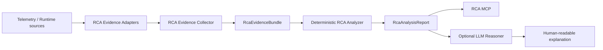

# ADR-017: Automated Root-Cause Analysis Evidence and Reasoning Boundaries

## Status

Accepted

## Context

The Industrial AI Agent has separate safe runtime facts, distributed trace/log/metric
evidence, and metadata-only LLM observations. Operators need repeatable investigations
of failures, latency, tool trajectories, retrieval stages, and model usage without
turning observability stores into unrestricted data channels or treating an LLM
interpretation as a proven cause.

## Decision

Automated root-cause analysis is an Application capability with provider-independent,
bounded contracts. It is not an Agent loop, a new write path, or a generic query proxy.



The `RcaAnalysisService` is reusable by RCA MCP/Codex and by an authenticated
FastAPI/UI adapter. It depends on Application contracts and evidence ports, never on
MCP transport. Runtime MCP and Observability MCP remain independent evidence-oriented
Infrastructure interfaces; they are not converted into RCA reasoning services.

`RcaEvidenceBundle` contains safe projections only: persisted runtime facts, trace/span
timing and failure metadata, MCP/tool trajectory metadata, retrieval-stage metadata,
correlated metadata-only logs, bounded metric context, LLM/model metadata, token and
cost measurements with provenance, approval metadata, persistence timing, and a source
availability state for every supported source. It contains no prompts, model responses,
tool arguments/results, retrieved document content, raw log lines, SQL, credentials,
URLs, arbitrary attributes, or observability query languages.

Every evidence item has a deterministic, report-local reference such as `EV-TRACE-001`.
References are unique only inside one report and are not persisted identifiers. Findings
cite those references instead of embedding backend payloads.

The meaning of a finding is explicit:

* `OBSERVED`: directly supported by bounded evidence.
* `DERIVED`: deterministically computed from observed evidence.
* `HYPOTHESIS`: plausible but not proved by deterministic evidence.
* `CONFIRMED_RUN_CAUSE`: emitted only by an explicitly registered deterministic
  cause-signature rule, or by a future explicitly modeled human confirmation.

A failed span is an observed failure location, not a confirmed root cause. An LLM can
never promote a finding to `CONFIRMED_RUN_CAUSE`, alter deterministic confidence, or
modify evidence.

The future deterministic analyzer is a pure Application boundary:

```text
RcaEvidenceBundle -> DeterministicRcaAnalyzer -> tuple[RcaFinding, ...]
```

It performs no network or backend access. Future deterministic cause signatures may
combine a persisted terminal error code, failed operation, service, and sanitized error
code. They are explicit registered rules, never generic string matching.

Slice B implements narrow Application evidence ports and Infrastructure adapters over
the existing RLS-filtered run store and bounded observability service. Collection first
uses the request-scoped `SecurityContext` to perform an authorized runtime lookup, then
uses only the resulting authorized run to correlate a trace. A missing or inaccessible
run fails closed before any telemetry lookup. Runtime-infrastructure failure is surfaced
as a safe service failure because authorization cannot be established. Tempo, Loki, and
Prometheus are collected independently: their unavailability, absence, or malformed
safe projection produces an explicit partial or insufficient report without stopping
unrelated collection. Langfuse is `NOT_APPLICABLE` until its bounded RCA adapter exists.

Slice B's deterministic analyzer emits only `OBSERVED` and `DERIVED` findings. It emits
no hypotheses and implements no confirmed-cause signatures because no stable persisted
multi-fact signature is currently available. It reports terminal runtime failures,
failed spans, MCP discovery/tool boundaries, failed retrieval stages, repeated tool
names, incomplete telemetry, and measured timing contributions. Timing ownership
partitions atomic intervals inside the largest `agent.run` span. Each interval is owned
at most once, prioritizing retrieval over enclosing MCP time, then LLM, persistence,
approval wait, and MCP; unowned time remains unmeasured. Therefore category totals do
not inflate nested span time and may be below total run duration. Measurements do not
classify a run as slow or abnormal without a future policy or baseline.

An optional future LLM reasoner receives only `RcaAnalysisReport` and produces a
human-readable explanation. It is subject to the existing classification and final
model-egress controls. It does not receive raw backend responses and does not change the
report's evidence, kinds, confidence, or confirmed-cause status.

Terms such as "slow", "unusually high token usage", "excessive latency", and
"abnormal cost" require a future versioned `RcaPerformancePolicy` or an explicit
comparison baseline. Before then, RCA may report measurements and proportions but does
not classify them as abnormal.

`run_id` and `trace_id` are correlation identifiers only. They neither encode nor affect
identity, clearance, permissions, RLS, model routing, model egress, or HITL.

## Consequences

* Slices A and B implement the contracts, evidence ports, collector, existing-source
  adapters, deterministic analyzer, and analysis service.
* A partial RCA is a successful supported result; source absence is explicit rather than
  represented as an empty successful result.
* Future evidence adapters preserve existing privacy allowlists and ADR-015 access
  boundaries. A future RCA MCP remains read-only and must not accept arbitrary backend
  query languages.
* Langfuse RCA access, RCA MCP, an optional LLM reasoner, authenticated FastAPI/UI
  integration, comparison, and performance policies remain planned.

## Alternatives Considered

### Let Codex assemble Runtime and Observability MCP responses

Rejected. It duplicates correlation and analysis logic across consumers and cannot give
the UI the same deterministic contract.

### Add RCA reasoning to Observability MCP

Rejected. Observability MCP remains a bounded telemetry evidence adapter. RCA combines
multiple evidence domains and belongs behind a reusable Application service.

### Let an LLM determine root causes directly from raw telemetry

Rejected. It weakens privacy boundaries and cannot provide deterministic proof rules.

## Relationship to Existing Decisions

ADR-003 governs inward dependencies. ADR-009 remains the final model-egress authority.
ADR-010 and ADR-011 retain the sole troubleshooting loop and HITL semantics. ADR-012
retains MCP as a transport boundary. ADR-015 retains server-derived identity, clearance,
and permissions. ADR-016 remains the telemetry privacy, availability, and bounded-query
authority. This ADR complements, and does not supersede, those decisions.
