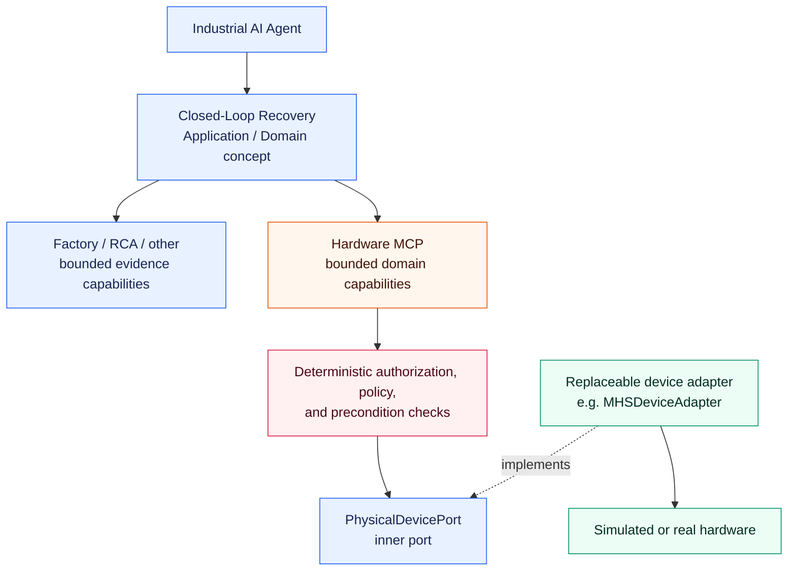

# ADR-018: Physical Device Integration and Closed-Loop Recovery

## Status

Accepted

## Implementation Status

The decision originally established the boundary before implementation. The first
bounded slice is now implemented: `PhysicalDevicePort`, the simulated S04
`POSITION-ENC-02` adapter, Hardware MCP, persisted approval claims, and
`ClosedLoopRecoveryService`. It supports only reference calibration and independently
verifies a fresh post-action observation. `SUCCEEDED` requires both an executed action
and passed verification; a healthy device produces deterministic `NOT_REQUIRED` without
an action, while blocked or failed paths remain non-success outcomes. MHS, real hardware,
and Vision recovery remain unimplemented; no MHS conformance is claimed.

## Context

At the time of this decision, the Industrial AI Agent investigated production and machine data through
bounded MCP capabilities. Its only write capability is an approval-gated local
maintenance-ticket demonstration. It has no hardware MCP server, device adapter,
physical-device port, MHS integration, camera integration, or physical recovery
implementation.

Future industrial scenarios need an explicit boundary before physical actions are
introduced. The first planned demonstrator is a reference calibration for the
positioning axis / position-reference sensor `POSITION-ENC-02` at station `S04`.
A later vision-inspection scenario may inspect and adjust camera capabilities. Both
must preserve the existing Hexagonal Architecture, bounded sequential LangGraph loop,
MCP client authorization, deterministic HITL policy, data classification, and
observability controls.

Model Hardware Standard (MHS) is an evolving research-preview technology. It can inform
a future adapter, but it is not a stable Core dependency and the project cannot claim
MHS conformance without later verification against a public specification and API.

## Decision

### Physical-Device Boundary

Closed-Loop Recovery is an explicit Application / Domain concept. Future recovery
orchestration obtains diagnosis and evidence from existing bounded capabilities, and
uses a separately bounded Hardware MCP capability area for physical-device inspection
and actions. This is a runtime-flow view, not a compile-time dependency diagram:



`PhysicalDevicePort` is an inner port owned by the Core when an implemented use case
requires it. Its future contracts use internal, industrial language such as
`DeviceCapability`, `DeviceState`, `DeviceOperation`, and `DeviceOperationResult`.
Those conceptual names do not create code types in this decision. Port signatures must
not expose MHS SDK objects, vendor DTOs, transport schemas, register addresses, or
device-method names. A concrete adapter, potentially `MHSDeviceAdapter`, belongs in
Infrastructure, translates those external representations, and is composed explicitly.
MHS concepts may inform the internal abstraction, but may not enter its Core contract.

Hardware MCP is an Infrastructure transport adapter over bounded application
capabilities. It is not a raw device proxy and does not own Domain logic, precondition
rules, or device-adapter construction. The Agent receives no unrestricted hardware
access. In particular, it must not receive generic tools such as `write_register`,
`set_device_property`, or `invoke_device_method`. Future tool contracts instead
expose bounded domain capabilities, for example position-reference status, preparation,
execution, and verification of reference calibration. Final tool names remain a
use-case-level decision.

### First Hardware MCP Capability Shape

The first reference-calibration use case uses a bounded split capability shape rather
than a raw-command sequence or an automatic catch-all recovery tool:

* `get_position_reference_status` provides a bounded read-only observation;
* `prepare_reference_calibration` produces the bounded recovery proposal and approval
  presentation, but performs no physical action; and
* `execute_reference_calibration` is a controlled action that, after trusted approval,
  delegates to `ClosedLoopRecoveryService` and returns its structured
  `RecoveryResult`.

The execution capability owns deterministic precondition evaluation, physical
execution, a fresh post-action state read, and verification. It must not expose separate
Agent-facing raw calibration, re-read, or verification tools. The Agent can judge
whether to inspect or propose the bounded recovery, but it must not orchestrate those
deterministic recovery internals. Conversely, the preparation and approval boundary
remain explicit; `execute_reference_calibration` is not an automatic
`recover_everything` capability.

For a controlled action, the LangGraph flow creates a strict pending action from the
proposal and interrupts before the Hardware MCP invocation. A human decision is claimed
and persisted by the server-owned run/graph state, then the post-approval execution
node invokes the capability. The `RecoveryAuthorizationPort` receives an
authorization decision derived from that trusted, action-bound state and the
server-derived security context. Approval is never an MCP argument, a model-provided
boolean, or model text.

### Closed-Loop Recovery Lifecycle and Contracts

A recovery follows this governing lifecycle:

```text
Diagnose -> Propose -> Validate deterministic preconditions -> Authorize
-> Human approval where required -> Act -> Observe -> Verify
-> RecoverySucceeded / RecoveryFailed
```

`RecoveryProposal` conceptually contains the target, problem, evidence, proposed
action, deterministic action risk class, deterministic preconditions, approval
requirement, expected effect, and verification plan. `RecoveryResult` conceptually
contains the action execution result, pre-action observation/reference, post-action
observation/reference, verification status, verification evidence, and final recovery
status. Persistence and serialization details are intentionally deferred.

An action command that completes successfully is not a successful recovery. Recovery
may be reported as successful only after an independent post-action observation and
deterministic verification against the stated acceptance criteria. An action failure,
blocked action, unavailable observation, or failed verification leads to a non-success
recovery status. The LLM may propose an action and explain results, but it cannot
choose the risk class, satisfy a precondition, authorize an action, or turn an action
result into recovery success.

### Deterministic Action Classes and Preconditions

The initial bounded action classes are `READ_ONLY`, `LOW_RISK_ACTION`, and
`CONTROLLED_ACTION`. Classification is deterministic and defined by the relevant
domain capability, never selected by the LLM.

* `READ_ONLY` covers state inspection, image capture, and encoder/reference inspection.
* `LOW_RISK_ACTION` covers bounded camera exposure or gain adjustments. Future policy
  may require HITL for this class.
* `CONTROLLED_ACTION` covers reference calibration and machine or axis recovery. It is
  expected to require deterministic precondition validation, authorization, and HITL
  approval.

Every physical action is guarded outside the LLM by deterministic state checks. For the
first planned reference-calibration scenario, the conceptual preconditions are
`station_mode == STOPPED`, `axis_motion_state == IDLE`, `product_present == false`, and
`connection_state == CONNECTED`. These are scenario-specific examples rather than
universal rules. User wording, model output, or approval cannot override a failed
machine-state precondition. Authorization or policy may still block an action whose
preconditions pass.

### Initial and Future Use Cases

The first planned demonstrator targets station `S04` and device `POSITION-ENC-02`, a
positioning axis / position-reference sensor. Its initial failure state is: connected
device, stopped station, idle axis, no product present, invalid reference, and measured
deviation outside tolerance. The proposed controlled action is reference calibration.
Recovery verification requires both a valid reference and a resulting position deviation
within configured tolerance.

The negative case is mandatory: calibration can execute successfully while verification
fails. In that case `action_executed = true` and `recovery_status = FAILED`. The Agent
must never report recovery success solely because the calibration command completed.

The same lifecycle supports a future Vision Inspection Recovery without introducing a
generic workflow engine: production or inspection failure, Vision MCP analysis, bounded
camera state/capability inspection through Hardware MCP, bounded camera-adjustment
proposal, authorization and optional HITL, action, new image capture, Vision MCP
re-analysis, and deterministic verification. Possible bounded camera operations include
reading state, capture, exposure adjustment, gain adjustment, and supported focus
adjustment. Insufficient image quality must not be reported as a product defect without
sufficient evidence, and a pre-adjustment result cannot prove recovery after an action.

### Existing Architecture Constraints

This decision does not add a recovery workflow engine, modify LangGraph, or change
current HITL behavior. ADR-004 and ADR-010 keep `LangGraphTroubleshootingAgent` as the
sole bounded sequential troubleshooting loop. ADR-011 remains the authority for the
existing approval interruption and its rule that non-idempotent work occurs only after
an approved resume.

The current maximum of four executed tool calls is a material design constraint. A
future physical recovery must stay within that bounded loop using carefully designed
domain capabilities and observations, or a proposed limit or orchestration change must
be assessed and decided separately. This ADR does not assume that the current limit is
automatically sufficient and does not authorize an increase.

ADR-004 defines this limit as four successfully executed Agent tools per persisted
troubleshooting run, including its approved resume, rather than model requests or
internal application and adapter calls. The bounded split form therefore uses up to
three Agent tools for a simple reference recovery (status, preparation, controlled
execution); the `PhysicalDevicePort` calls made inside `ClosedLoopRecoveryService` do
not consume additional Agent-tool budget. A Hardware MCP handler must not turn those
internal steps into nested Agent-visible MCP tool calls.

Future hardware HTTP MCP access must use the server-derived identity, clearance, and
permission model of ADR-015. MCP discovery, MCP permission, application authorization,
action-class policy, precondition validation, HITL, and device acceptance are distinct
controls; none replaces another.

### Security, Safety, and Observability

LLM reasoning does not enforce machine safety. Physical-action authorization remains a
deterministic application boundary, current `SecurityContext`, clearance, RLS, and
authorization patterns remain authoritative, and hardware tools remain bounded
capabilities. Industrial functional safety stays outside this system: MHS, MCP, HITL,
and the LLM do not replace PLC safety logic, robot safety, machine interlocks, or
certified functional-safety systems.

Future physical recovery emits bounded, data-minimized observability for concepts such
as proposed recovery, action class, authorization outcome, HITL approval outcome,
physical action outcome, verification outcome, and final recovery outcome. Exact metric
names are deferred. Payloads, arbitrary device state, images, raw device responses,
and credentials must not be exported merely for observability. ADR-016's allowlists,
bounded-cardinality rules, classification handling, and availability isolation remain
binding.

### Testing and Golden Regression Expectations

When recovery is implemented, deterministic unit and Golden regression coverage must
include at least:

* successful recovery: diagnosis path, required state inspection, no action before
  authorization, post-action re-read, and verification before success;
* blocked recovery: a failed precondition prevents action and cannot be overridden by a
  user or LLM;
* verification failure: action executes, verification fails, and final recovery status
  remains failed;
* security: unauthorized actions are blocked without protected hardware or state
  metadata leakage; and
* future vision recovery: insufficient image quality is not reported as a product defect
  without sufficient evidence, and a newly captured post-adjustment image is evaluated
  independently rather than reusing pre-adjustment evidence as recovery proof.

These cases supplement the existing deterministic and Golden architecture; they do not
replace low-level port, authorization, RLS, or device-adapter tests.

## Alternatives Considered

### A. Let the Agent call a raw device or MHS API directly

Rejected. It leaks volatile device and MHS details into Agent contracts, permits an
unbounded command surface, bypasses the intended port boundary, and makes deterministic
authorization, preconditions, testing, and adapter replacement much harder to enforce.

### B. Hardware MCP wraps the physical-device port behind bounded capabilities

Accepted. Hardware MCP retains MCP's discoverable transport boundary while the Core owns
the physical-device port and deterministic recovery behavior. It protects the Agent
from raw commands and lets infrastructure adapters evolve independently.

### C. Implement recovery as ad-hoc tool logic

Rejected. Repeating proposal, evidence, action, observation, verification, and status
logic in individual tools would blur responsibility and risks equating command success
with recovery success.

### D. Define an explicit reusable Closed-Loop Recovery concept

Accepted. It captures the reusable lifecycle and contracts needed by both reference
calibration and later vision recovery without creating a generic workflow engine or
premature code abstractions.

## Consequences

* No production code, service, dependency, MHS integration, simulated hardware, Vision
  MCP integration, or HITL behavior changes are introduced by this decision.
* A future implementation creates a focused inner physical-device port only when the
  first concrete use case needs it, then adds an Infrastructure adapter and Hardware
  MCP composition through explicit dependency injection.
* MHS remains an optional, replaceable adapter concern below `PhysicalDevicePort`; no
  MHS conformance is claimed.
* Recovery status is an independently verified business outcome, not a device-command
  transport outcome.
* Future action support must preserve ADR-003, ADR-004, ADR-009, ADR-011, ADR-012,
  ADR-015, ADR-016, and ADR-017 rather than bypassing them.
