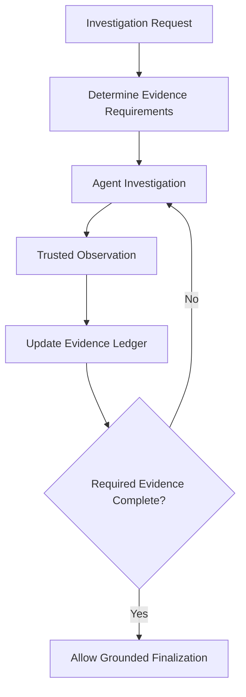
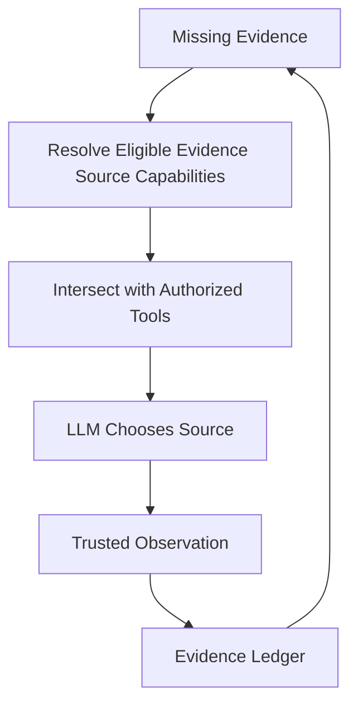
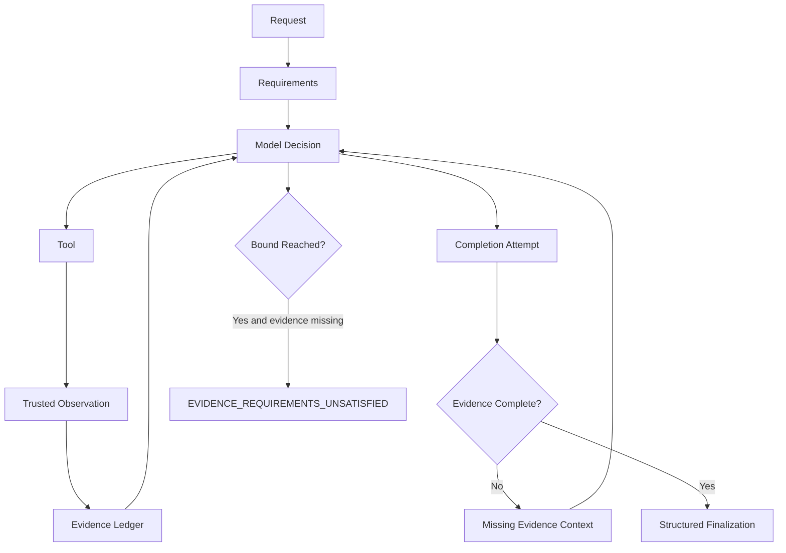

# ADR-020: Deterministic Investigation Evidence Requirements

## Status

Accepted

## Context

Real-model quality evaluation showed that a technically healthy model can attempt a station troubleshooting answer without current-state or fault-document evidence. A grounded root-cause analysis needs facts to exist before it can be accepted, while the LLM should retain judgment over investigation strategy and ordering.

This concern is distinct from Runtime/Observability evidence in ADR-017 and the physical-device recovery lifecycle in ADR-018.

## Decision

The Application defines deterministic Evidence Requirements for trusted investigation types. Requirements name domain observations, never concrete tool names. For example, `CURRENT_MACHINE_STATE` may currently be obtained through a machine-status capability, but an equivalent future trusted observation can satisfy it without changing the completion contract.

Only typed observations created from authorized application or tool results can satisfy a requirement. Model prose, user text, prompts, and generated references have no authority to mark evidence complete. The immutable `EvidenceLedger` retains safe source correlations and identifiers needed to prove satisfaction; it does not duplicate machine or document payloads.

The ledger starts with the trusted effective `DataClassification` of the run and combines it monotonically with trusted observation classifications. It cannot lower the run's classification. Evidence contracts are proportional: station discovery has no RCA requirements, station status requires current machine state, and station troubleshooting requires current machine state, an active fault observed from that state, and documentation explicitly relevant to that fault.

Physical recovery remains governed by ADR-018's independent preconditions, authorization, human approval, execution, observation, and verification invariants. It does not use this RCA-completeness contract.

The intended orchestration flow is:

Phase 5C.2a implemented requirements, typed observations, adapters, and the ledger. Phase 5C.2b integrates its serializer-safe projection into the existing checkpointable LangGraph state. Before structured finalization, the graph reconstructs the ledger and blocks a draft while required evidence is missing. It appends compact, response-language-aware system runtime context describing the missing observations and retaining their canonical IDs, then returns to the existing model-decision node. This does not prescribe a tool name or tool order.

Phase 5C.2c adds declarative Evidence Source Capabilities. An Evidence Requirement, an Evidence Source Capability, and a Tool are distinct: a requirement is a required domain fact, a source capability describes which requirements it can produce and which evidence prerequisites it needs, and a tool is one currently admitted implementation of a source. The application registers `get_machine_status` as the present provider of `machine_state_observation`, and `search_documentation` as the present provider of `fault_documentation_retrieval`. Future admitted tools can register the same source capability without changing the ledger or requirement IDs.

While mandatory evidence is incomplete, the graph resolves source capabilities that can produce missing requirements whose prerequisites are already satisfied, then intersects their registered tools with the model's existing authorized/admitted tools. The model receives only this eligible set and chooses one tool itself. Source metadata never grants admission. For canonical RCA, `fault_documentation_retrieval` requires `ACTIVE_FAULT`, so it is unavailable until trusted machine-state evidence establishes the fault. A tool invocation does not satisfy a requirement by itself; the existing trusted-result adapters and ledger remain the sole satisfaction authority. Once the ledger is complete, normal authorized tool visibility resumes.

`CURRENT_MACHINE_STATE -> machine_state_observation -> get_machine_status today`; other admitted sources may provide the same capability later.

The existing bounded tool limit remains authoritative. A model that exhausts the tool budget with incomplete evidence, or repeatedly attempts unsupported finalization without acquiring evidence, terminates as `EVIDENCE_REQUIREMENTS_UNSATISFIED` with `failure_origin=ORCHESTRATION`; it is neither a success nor a provider, capability, or MCP failure. If evidence is missing but no authorized, prerequisite-ready source exists, the graph instead terminates as `EVIDENCE_SOURCE_UNAVAILABLE` with `error_code=evidence_source_unavailable` and the same stable failure origin. The terminal user-facing message is sanitized and response-language aware. Recovery remains exempt through its separate ADR-018 lifecycle.

## Consequences

* Evidence completeness is deterministic and auditable without prescribing a tool sequence or provider/model behavior.
* Tool-result adapters are outside the core ledger; the core consumes observation semantics rather than checking tool names.
* Documentation relevance is based on trusted document metadata or references associated with the active fault. Retrieval of an arbitrary document, query text, or document body mention alone is insufficient.
* Future equivalent Factory or Knowledge capabilities can satisfy existing requirements through new adapters.
* No model selection, egress, routing, retry, fallback, or security-policy changes are introduced.

## Alternatives Considered

### Require an exact tool sequence

Rejected. It would bind a domain guarantee to today's MCP capability names and prevent valid equivalent evidence sources.

### Ask the model to use tools more strongly in its prompt

Rejected. Prompting can guide investigation judgment but cannot guarantee evidence exists before a grounded answer is accepted.

### Let model prose declare evidence complete

Rejected. Generated text is untrusted and cannot establish current machine state or documentation provenance.

### Merge recovery and RCA evidence contracts

Rejected. Physical recovery has safety-critical action and verification invariants that remain separate from read-only troubleshooting completeness.

## Relationship to Existing Decisions

ADR-003 governs core dependency direction. ADR-004 and ADR-010 remain authoritative for the bounded sequential troubleshooting loop; any completion-loop integration must preserve their limits. ADR-009 retains DataClassification and final egress authority. ADR-017 remains the separate architecture for runtime/observability RCA evidence, and ADR-018 remains the physical recovery authority.
