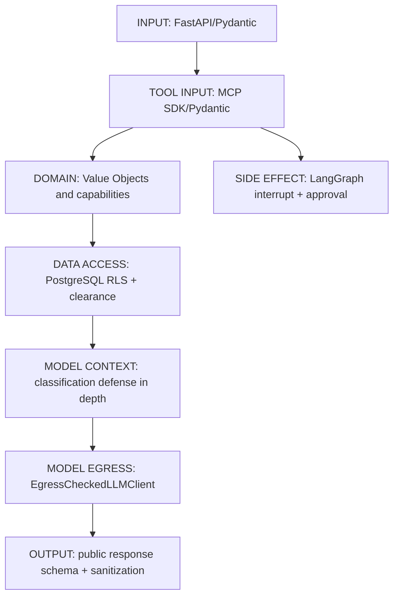

# Guardrails and Boundary Validation

## Purpose

This slice hardens the existing FastAPI to LangGraph to MCP path without adding a
planner, agent, database, retrieval subsystem, or service boundary. A guardrail lives
at the boundary that owns the guarantee.

## Framework and Project Responsibilities

| Rule | Mechanism | Owner |
| --- | --- | --- |
| Unknown HTTP fields and enum values | FastAPI and Pydantic v2 `extra="forbid"` | Framework |
| MCP required fields, types, bounds, and extras | MCP SDK generated Pydantic argument models, configured strict | Framework configured at adapter boundary |
| Domain identifier validity | `ProductId` and `StationId` Value Objects | Project domain rule |
| Tool availability and read/write behavior | fixed `ToolPolicy` allowlist | Project authorization policy |
| Four executed calls maximum | LangGraph node routing plus `MAX_TOOL_CALLS` | Project orchestration policy required by ADR-004 |
| Approval and idempotency | LangGraph `interrupt()` plus server-injected tool-call ID | Framework plus project side-effect policy |
| Classified record visibility | PostgreSQL RLS and transaction-local clearance | Database |
| No over-clearance model context | classified result check before `ToolMessage`, then egress check | Defense in depth policy |
| Provider egress | `EgressCheckedLLMClient` | Project policy required by ADR-009 |
| Public response shape | FastAPI response model | Framework |
| Diagnostic leakage | public projection sanitizer | Project transport policy |

The MCP SDK has no public hook in version 2.1 for configuring the decorator-generated
argument model. The adapter therefore changes only that SDK Pydantic model's config and
republished JSON Schema. It does not implement a separate JSON-schema validator.

## Structured Output

Tool calls are already the structured model-decision contract: a name, call ID, and
schema-bound arguments. The graph admits one call and validates it before dispatch. No
second JSON planner is introduced.

The current OpenAI-compatible local profile does not provide a demonstrated,
provider-independent reliable JSON-schema final-answer mode. The final answer therefore
remains text. Its existing internal `AgentRunResult` records deterministic status and
executed calls; the public API projects only a user-facing answer and normalized calls.
Adding manual JSON parsing would create a fragile, duplicate decision channel.

## Injection Boundary

Retrieved text can be useful evidence but has no authority. It reaches the model only as
a `ToolMessage` after a fixed system message and never becomes a system or developer
message. It cannot modify tool allowlists, operation metadata, classifications, model
profiles, providers, approval, limits, or RLS. The confidential synthetic service
comment `doc-1f0a9e2d8c4b7a61` demonstrates this with an instruction-like sentence: it
can be retrieved, but a ticket can only remain a proposal until an explicit resume with
`approve`.
