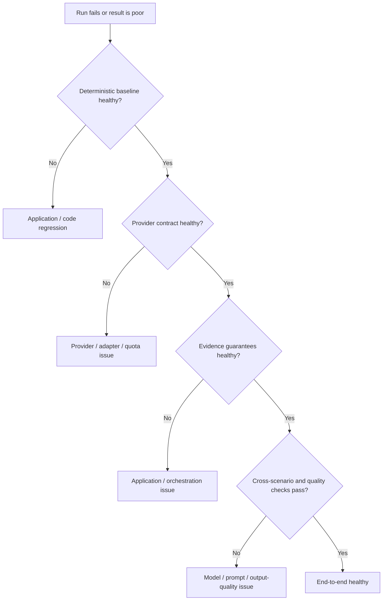

# Real-Model Quality Evaluation

The completed reliability stack separates five layers. They answer different questions and
must not be collapsed into a single score.

1. Deterministic full-stack acceptance verifies application correctness using the
   scripted canonical S04 path.
2. The Provider Contract Matrix verifies technical adapter/provider compatibility.
3. Evidence Guard and Evidence Source Capabilities provide deterministic investigation
   guarantees before finalization.
4. Cross-scenario real-model reliability measures behavior across the established public,
   internal, documentation, and S04 scenarios.
5. Quality and Language Closure evaluates user-facing output: requested language,
   deterministic grounding/reference facts, causal discipline, output cleanliness, and
   localized terminal and report projections.



`evals.real_model_quality` evaluates sanitized run projections only. A known technical
failure origin (`MODEL_SELECTION`, provider, MCP, persistence, capability validation,
or security policy) is classified as `TECHNICAL_FAILURE`; every quality dimension is
then `NOT_EVALUATED`. It can never become a language, grounding, or usefulness failure.

The initial canonical scenario is German S04 troubleshooting: the agent must observe
S04's `FAULTED` / `QUALITY-09` state and retrieve documentation whose trusted catalog
metadata declares `QUALITY-09` in `fault_ids`. Reference relevance is therefore a
trusted provenance check, not a hard-coded document ID, query match, or document-body
match. Document IDs remain safe correlation information where available. The evaluator
checks required and irrelevant tools, structured identifiers and references, response
language, obvious output-template/tool-protocol artifacts, and minimum
causal-discipline violations. It does not use an LLM judge. A natural-language dimension
without a stable deterministic rule is reported as `NOT_EVALUATED`.

`next_steps` is a bounded optional structured field. A non-empty list is evaluated for
safe user-executable prompts when present, but an empty list is valid when no meaningful
follow-up is warranted. It is reported as `NOT_EVALUATED`, not as a useful step without
content.

The final language closure follows the persisted `response_language` from API request to
run state, model iterations, finalization, public error projection, investigation history,
and PDF report. Public terminal/error messages are deterministic translations; the model
is not retried or post-processed to repair language. A technically healthy run without a
final answer has language `NOT_EVALUATED`, not a language failure.

Run the local Qwen 3.5 9B baseline after Ollama and the local MCP dependencies are
available:

```powershell
.venv\Scripts\python.exe -m evals.run_real_model_quality --model-id local_quality --runs 10
```

Reports are generated beneath ignored `evals/results/`. They do not participate in
AUTO selection, model fallback, data classification, or egress policy. The response
language detector returns `GERMAN`, `ENGLISH`, `CHINESE`, `MIXED`, or `UNKNOWN` and
ignores industrial identifiers such as `S04` and `QUALITY-09`.
