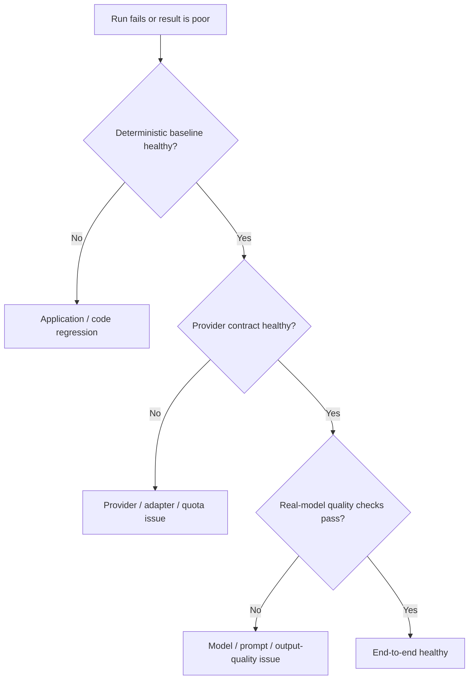

# Real-Model Quality Evaluation

The project separates three reliability layers. They answer different questions and
must not be collapsed into a single score.

1. Deterministic full-stack acceptance verifies application correctness using the
   scripted canonical S04 path.
2. The Provider Contract Matrix verifies technical adapter/provider compatibility.
3. Real-model quality evaluations measure actual model tool use and user-facing output
   against deterministic scenario facts.



`evals.real_model_quality` evaluates sanitized run projections only. A known technical
failure origin (`MODEL_SELECTION`, provider, MCP, persistence, capability validation,
or security policy) is classified as `TECHNICAL_FAILURE`; every quality dimension is
then `NOT_EVALUATED`. It can never become a language, grounding, or usefulness failure.

The initial canonical scenario is German S04 troubleshooting: the agent must observe
S04's `FAULTED` / `QUALITY-09` state and retrieve `DOC-QUALITY-09`. The evaluator checks
required and irrelevant tools, structured identifiers and references, response language,
obvious output-template/tool-protocol artifacts, and minimum causal-discipline
violations. It does not use an LLM judge. A natural-language dimension without a stable
deterministic rule is reported as `NOT_EVALUATED`.

Run the local Qwen 3.5 9B baseline after Ollama and the local MCP dependencies are
available:

```powershell
.venv\Scripts\python.exe -m evals.run_real_model_quality --model-id local_quality --runs 10
```

Reports are generated beneath ignored `evals/results/`. They do not participate in
AUTO selection, model fallback, data classification, or egress policy. The response
language detector returns `GERMAN`, `ENGLISH`, `CHINESE`, `MIXED`, or `UNKNOWN` and
ignores industrial identifiers such as `S04` and `QUALITY-09`.
